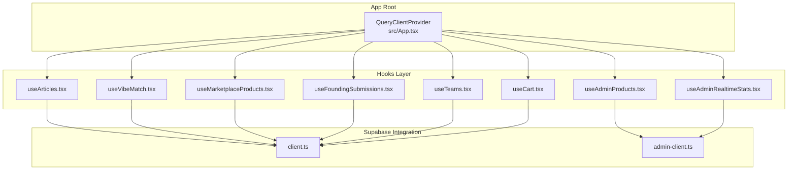
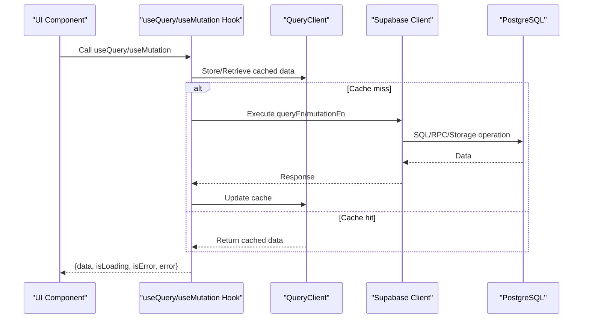
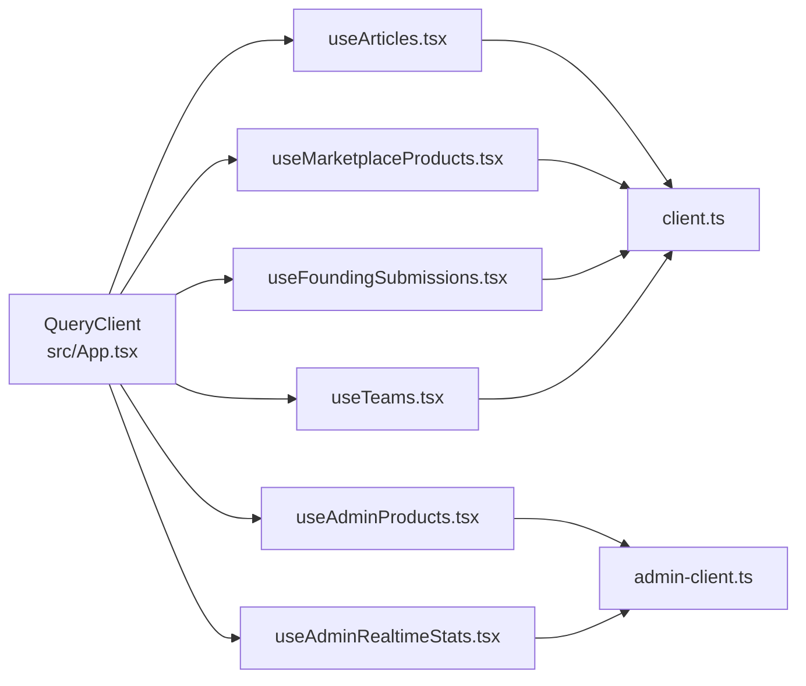

# TanStack Query Integration

<cite>
**Referenced Files in This Document**
- [App.tsx](file://src/App.tsx)
- [useArticles.tsx](file://src/hooks/useArticles.tsx)
- [useVibeMatch.tsx](file://src/hooks/useVibeMatch.tsx)
- [useMarketplaceProducts.tsx](file://src/hooks/useMarketplaceProducts.tsx)
- [useAdminProducts.tsx](file://src/hooks/useAdminProducts.tsx)
- [useAdminRealtimeStats.tsx](file://src/hooks/useAdminRealtimeStats.tsx)
- [useFoundingSubmissions.tsx](file://src/hooks/useFoundingSubmissions.tsx)
- [useTeams.tsx](file://src/hooks/useTeams.tsx)
- [useCart.tsx](file://src/hooks/useCart.tsx)
- [admin-client.ts](file://src/integrations/supabase/admin-client.ts)
- [client.ts](file://src/integrations/supabase/client.ts)
</cite>

## Table of Contents
1. [Introduction](#introduction)
2. [Project Structure](#project-structure)
3. [Core Components](#core-components)
4. [Architecture Overview](#architecture-overview)
5. [Detailed Component Analysis](#detailed-component-analysis)
6. [Dependency Analysis](#dependency-analysis)
7. [Performance Considerations](#performance-considerations)
8. [Troubleshooting Guide](#troubleshooting-guide)
9. [Conclusion](#conclusion)

## Introduction
This document explains how TanStack Query is integrated into the Adorzia platform. It covers the global query client setup, caching strategies, data synchronization patterns, and practical usage of useQuery, useMutation, and useInfiniteQuery across the application. It also documents query invalidation, background refetching, optimistic updates, error handling, performance optimization, query deduplication, and memory management strategies.

## Project Structure
TanStack Query is initialized at the application root via a QueryClientProvider. Hooks throughout the codebase encapsulate data fetching and mutations, leveraging Supabase for backend operations. Real-time synchronization is achieved through Supabase Postgres changes and periodic refetch intervals.

**Diagram sources**
- [App.tsx](file://src/App.tsx#L88-L114)
- [useArticles.tsx](file://src/hooks/useArticles.tsx#L63-L76)
- [useVibeMatch.tsx](file://src/hooks/useVibeMatch.tsx#L28-L37)
- [useMarketplaceProducts.tsx](file://src/hooks/useMarketplaceProducts.tsx#L84-L125)
- [useAdminProducts.tsx](file://src/hooks/useAdminProducts.tsx#L18-L52)
- [useAdminRealtimeStats.tsx](file://src/hooks/useAdminRealtimeStats.tsx#L28-L49)
- [useFoundingSubmissions.tsx](file://src/hooks/useFoundingSubmissions.tsx#L62-L74)
- [useTeams.tsx](file://src/hooks/useTeams.tsx#L56-L64)
- [useCart.tsx](file://src/hooks/useCart.tsx#L57-L97)
- [client.ts](file://src/integrations/supabase/client.ts)
- [admin-client.ts](file://src/integrations/supabase/admin-client.ts)

**Section sources**
- [App.tsx](file://src/App.tsx#L88-L114)

## Core Components
- Global QueryClient: Created at the app root and provided to the React tree.
- Hook-based Queries: Centralized data fetching using useQuery with explicit query keys.
- Mutations: Controlled via useMutation with optimistic updates and cache invalidation.
- Real-time Sync: Periodic refetch and Supabase Postgres changes for near real-time updates.
- Infinite Queries: Not used in the current codebase; useInfiniteQuery patterns are not present.

**Section sources**
- [App.tsx](file://src/App.tsx#L88-L114)
- [useArticles.tsx](file://src/hooks/useArticles.tsx#L63-L76)
- [useAdminProducts.tsx](file://src/hooks/useAdminProducts.tsx#L87-L117)
- [useAdminRealtimeStats.tsx](file://src/hooks/useAdminRealtimeStats.tsx#L28-L49)

## Architecture Overview
The platform follows a layered architecture:
- UI components consume hooks that define queries and mutations.
- Hooks use Supabase clients to perform network operations.
- TanStack Query manages caching, invalidation, and background refetching.
- Real-time updates are handled via Supabase channels and refetch intervals.

**Diagram sources**
- [useArticles.tsx](file://src/hooks/useArticles.tsx#L63-L76)
- [useAdminProducts.tsx](file://src/hooks/useAdminProducts.tsx#L87-L117)
- [useAdminRealtimeStats.tsx](file://src/hooks/useAdminRealtimeStats.tsx#L28-L49)
- [client.ts](file://src/integrations/supabase/client.ts)
- [admin-client.ts](file://src/integrations/supabase/admin-client.ts)

## Detailed Component Analysis

### Query Client Setup
- A single QueryClient is instantiated at the app root and wrapped around the entire routing tree.
- This ensures consistent caching and refetching behavior across the application.

**Section sources**
- [App.tsx](file://src/App.tsx#L88-L114)

### useQuery Patterns
Common patterns observed:
- Explicit query keys to segment caches per resource and parameters.
- Enabled conditions to prevent unnecessary queries until dependencies are ready.
- Error propagation to UI via error states.
- Background refetching via refetchInterval for real-time dashboards.

Examples:
- Single article retrieval with slug-based query key and enabled guard.
- Published articles with optional limit and ordering.
- Marketplace product listings via Supabase Edge Functions with URL-encoded filters.
- Admin product listing with multiple filter predicates.
- Real-time stats with periodic refetch and Supabase Postgres changes.

**Section sources**
- [useArticles.tsx](file://src/hooks/useArticles.tsx#L63-L76)
- [useArticles.tsx](file://src/hooks/useArticles.tsx#L78-L97)
- [useMarketplaceProducts.tsx](file://src/hooks/useMarketplaceProducts.tsx#L84-L125)
- [useMarketplaceProducts.tsx](file://src/hooks/useMarketplaceProducts.tsx#L128-L156)
- [useAdminProducts.tsx](file://src/hooks/useAdminProducts.tsx#L18-L52)
- [useAdminRealtimeStats.tsx](file://src/hooks/useAdminRealtimeStats.tsx#L28-L49)
- [useAdminRealtimeStats.tsx](file://src/hooks/useAdminRealtimeStats.tsx#L52-L111)

### useMutation Patterns
Patterns observed:
- Optimistic UI updates followed by cache invalidation.
- Centralized error handling with toast notifications.
- Admin mutations leverage the admin Supabase client for elevated permissions.

Examples:
- Create/update/delete/reject/approve products with targeted invalidation of related queries.
- Create/update founding submissions with conditional toast messages depending on draft vs. submitted state.
- Admin product approval sets status and timestamps, then invalidates caches.

**Section sources**
- [useAdminProducts.tsx](file://src/hooks/useAdminProducts.tsx#L87-L117)
- [useAdminProducts.tsx](file://src/hooks/useAdminProducts.tsx#L119-L144)
- [useAdminProducts.tsx](file://src/hooks/useAdminProducts.tsx#L146-L168)
- [useAdminProducts.tsx](file://src/hooks/useAdminProducts.tsx#L170-L202)
- [useFoundingSubmissions.tsx](file://src/hooks/useFoundingSubmissions.tsx#L76-L120)
- [useFoundingSubmissions.tsx](file://src/hooks/useFoundingSubmissions.tsx#L122-L168)

### useInfiniteQuery Patterns
- Not used in the current codebase. No infinite scrolling or paginated lists rely on useInfiniteQuery.

[No sources needed since this section summarizes absence of a pattern]

### Data Synchronization Patterns
- Real-time dashboards: Periodic refetch via refetchInterval combined with Supabase Postgres changes to keep data fresh.
- Admin realtime stats: Subscriptions to multiple tables to react to inserts and changes, triggering refetches.
- Teams module: Real-time subscriptions to invitations and team members with targeted refetches.

**Section sources**
- [useAdminRealtimeStats.tsx](file://src/hooks/useAdminRealtimeStats.tsx#L48-L49)
- [useAdminRealtimeStats.tsx](file://src/hooks/useAdminRealtimeStats.tsx#L114-L184)
- [useTeams.tsx](file://src/hooks/useTeams.tsx#L512-L556)

### Query Invalidation and Cache Management
- Targeted invalidation using query keys to refresh related lists after mutations.
- Example: After product creation/update/delete/approval/rejection, invalidate admin-products and admin-product-stats.
- Example: After article creation/update, invalidate articles list.

**Section sources**
- [useAdminProducts.tsx](file://src/hooks/useAdminProducts.tsx#L109-L110)
- [useAdminProducts.tsx](file://src/hooks/useAdminProducts.tsx#L136-L137)
- [useAdminProducts.tsx](file://src/hooks/useAdminProducts.tsx#L160-L161)
- [useArticles.tsx](file://src/hooks/useArticles.tsx#L114-L115)
- [useArticles.tsx](file://src/hooks/useArticles.tsx#L136-L137)

### Background Refetching
- Admin realtime stats use refetchInterval to poll for dashboard metrics every 30 seconds.
- This reduces latency for admin KPIs while keeping server load manageable.

**Section sources**
- [useAdminRealtimeStats.tsx](file://src/hooks/useAdminRealtimeStats.tsx#L48-L49)
- [useAdminRealtimeStats.tsx](file://src/hooks/useAdminRealtimeStats.tsx#L110-L111)

### Optimistic Updates
- Not implemented in the current codebase. Mutations update the cache after successful server responses.

[No sources needed since this section summarizes absence of a pattern]

### Error Handling
- Errors thrown inside queryFn/mutationFn propagate to UI via error states.
- Toast notifications provide user feedback for both success and failure paths.
- Supabase errors are surfaced to the UI for actionable messages.

**Section sources**
- [useArticles.tsx](file://src/hooks/useArticles.tsx#L117-L119)
- [useArticles.tsx](file://src/hooks/useArticles.tsx#L139-L141)
- [useAdminProducts.tsx](file://src/hooks/useAdminProducts.tsx#L113-L115)
- [useAdminProducts.tsx](file://src/hooks/useAdminProducts.tsx#L140-L142)
- [useAdminProducts.tsx](file://src/hooks/useAdminProducts.tsx#L164-L166)
- [useAdminProducts.tsx](file://src/hooks/useAdminProducts.tsx#L198-L200)
- [useAdminProducts.tsx](file://src/hooks/useAdminProducts.tsx#L225-L227)

### Cache Keys and Deduplication
- Query keys are structured arrays/tuples that uniquely identify requests.
- Examples: ["article", slug], ["published-articles", limit], ["marketplace-products", filters].
- TanStack Query automatically deduplicates identical requests and serves cached data when available.

**Section sources**
- [useArticles.tsx](file://src/hooks/useArticles.tsx#L64-L64)
- [useArticles.tsx](file://src/hooks/useArticles.tsx#L80-L80)
- [useMarketplaceProducts.tsx](file://src/hooks/useMarketplaceProducts.tsx#L85-L85)
- [useAdminProducts.tsx](file://src/hooks/useAdminProducts.tsx#L20-L20)

### Memory Management
- Long-lived queries are scoped to feature areas; targeted invalidation prevents unbounded cache growth.
- Real-time intervals are short (30s) to balance freshness and resource usage.
- Supabase storage uploads are handled separately from TanStack Query caching.

**Section sources**
- [useAdminRealtimeStats.tsx](file://src/hooks/useAdminRealtimeStats.tsx#L48-L49)
- [useAdminRealtimeStats.tsx](file://src/hooks/useAdminRealtimeStats.tsx#L110-L111)

## Dependency Analysis
The following diagram shows how hooks depend on Supabase clients and TanStack Query:

**Diagram sources**
- [App.tsx](file://src/App.tsx#L88-L114)
- [useArticles.tsx](file://src/hooks/useArticles.tsx#L63-L76)
- [useMarketplaceProducts.tsx](file://src/hooks/useMarketplaceProducts.tsx#L84-L125)
- [useAdminProducts.tsx](file://src/hooks/useAdminProducts.tsx#L18-L52)
- [useAdminRealtimeStats.tsx](file://src/hooks/useAdminRealtimeStats.tsx#L28-L49)
- [useFoundingSubmissions.tsx](file://src/hooks/useFoundingSubmissions.tsx#L62-L74)
- [useTeams.tsx](file://src/hooks/useTeams.tsx#L56-L64)
- [client.ts](file://src/integrations/supabase/client.ts)
- [admin-client.ts](file://src/integrations/supabase/admin-client.ts)

**Section sources**
- [App.tsx](file://src/App.tsx#L88-L114)
- [useArticles.tsx](file://src/hooks/useArticles.tsx#L63-L76)
- [useMarketplaceProducts.tsx](file://src/hooks/useMarketplaceProducts.tsx#L84-L125)
- [useAdminProducts.tsx](file://src/hooks/useAdminProducts.tsx#L18-L52)
- [useAdminRealtimeStats.tsx](file://src/hooks/useAdminRealtimeStats.tsx#L28-L49)
- [useFoundingSubmissions.tsx](file://src/hooks/useFoundingSubmissions.tsx#L62-L74)
- [useTeams.tsx](file://src/hooks/useTeams.tsx#L56-L64)

## Performance Considerations
- Prefer explicit query keys to avoid cache collisions and enable precise invalidation.
- Use enabled guards to defer queries until dependencies are present.
- Limit refetchInterval frequency to balance freshness and performance.
- Use targeted invalidation instead of global cache resets to minimize work.
- For large datasets, consider pagination or limiting query result sizes.
- Avoid storing large binary blobs in query cache; use CDN URLs instead.

[No sources needed since this section provides general guidance]

## Troubleshooting Guide
Common issues and resolutions:
- Queries not firing: Verify enabled conditions and that dependencies are truthy.
- Stale data: Confirm refetchInterval is configured appropriately and invalidations occur after mutations.
- Permission errors: Ensure admin mutations use the admin Supabase client.
- Toast errors: Inspect mutation error handlers and surface actionable messages to users.

**Section sources**
- [useArticles.tsx](file://src/hooks/useArticles.tsx#L74-L74)
- [useAdminProducts.tsx](file://src/hooks/useAdminProducts.tsx#L109-L110)
- [useAdminProducts.tsx](file://src/hooks/useAdminProducts.tsx#L136-L137)
- [useAdminProducts.tsx](file://src/hooks/useAdminProducts.tsx#L160-L161)
- [useAdminRealtimeStats.tsx](file://src/hooks/useAdminRealtimeStats.tsx#L48-L49)

## Conclusion
TanStack Query is consistently applied across the Adorzia platform to centralize data fetching, mutations, and caching. The integration leverages explicit query keys, targeted invalidation, and periodic refetching to maintain accurate, responsive UIs. While optimistic updates are not currently implemented, the existing patterns provide a strong foundation for future enhancements. Real-time synchronization complements caching to deliver a modern, reliable user experience.