# Dashboard & Analytics

<cite>
**Referenced Files in This Document**
- [Dashboard.tsx](file://src/pages/Dashboard.tsx)
- [useDashboardStats.tsx](file://src/hooks/useDashboardStats.tsx)
- [useAnalyticsData.tsx](file://src/hooks/useAnalyticsData.tsx)
- [useGreeting.tsx](file://src/hooks/useGreeting.tsx)
- [StatCard.tsx](file://src/components/dashboard/StatCard.tsx)
- [RankProgress.tsx](file://src/components/dashboard/RankProgress.tsx)
- [TeamActivity.tsx](file://src/components/dashboard/TeamActivity.tsx)
- [EarningsSnapshot.tsx](file://src/components/dashboard/EarningsSnapshot.tsx)
- [WelcomeModal.tsx](file://src/components/WelcomeModal.tsx)
- [useActiveStyleboxes.tsx](file://src/hooks/useActiveStyleboxes.tsx)
- [client.ts](file://src/integrations/supabase/client.ts)
- [ranks.ts](file://src/lib/ranks.ts)
- [20260127230305_create_portfolio_tables.sql](file://supabase/migrations/20260127230305_create_portfolio_tables.sql)
- [20260130050000_designer_stylebox_system.sql](file://supabase/migrations/20260130050000_designer_stylebox_system.sql)
</cite>

## Table of Contents
1. [Introduction](#introduction)
2. [Project Structure](#project-structure)
3. [Core Components](#core-components)
4. [Architecture Overview](#architecture-overview)
5. [Detailed Component Analysis](#detailed-component-analysis)
6. [Dependency Analysis](#dependency-analysis)
7. [Performance Considerations](#performance-considerations)
8. [Troubleshooting Guide](#troubleshooting-guide)
9. [Conclusion](#conclusion)
10. [Appendices](#appendices)

## Introduction
This document explains the designer dashboard and analytics system, focusing on the dashboard layout, statistics cards, rank progress visualization, team activity feed, and earnings snapshot components. It also covers data fetching mechanisms using custom hooks, real-time updates, and integration with Supabase for analytics data. Practical examples demonstrate dashboard customization, widget configuration, and performance metrics display. Additional coverage includes the greeting system, welcome modal functionality, and user engagement tracking features.

## Project Structure
The dashboard page composes reusable UI widgets and analytics hooks, orchestrating data fetching and rendering. Supabase is used for real-time analytics and historical data retrieval, while ranking utilities power the rank progress visualization.

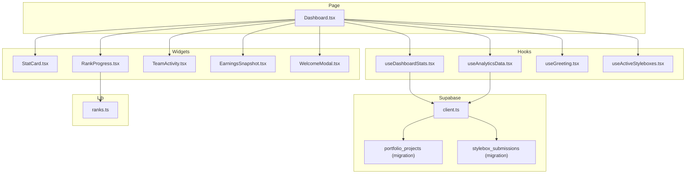

**Diagram sources**
- [Dashboard.tsx](file://src/pages/Dashboard.tsx#L29-L440)
- [StatCard.tsx](file://src/components/dashboard/StatCard.tsx#L1-L73)
- [RankProgress.tsx](file://src/components/dashboard/RankProgress.tsx#L1-L204)
- [TeamActivity.tsx](file://src/components/dashboard/TeamActivity.tsx#L1-L97)
- [EarningsSnapshot.tsx](file://src/components/dashboard/EarningsSnapshot.tsx#L1-L83)
- [WelcomeModal.tsx](file://src/components/WelcomeModal.tsx#L1-L112)
- [useDashboardStats.tsx](file://src/hooks/useDashboardStats.tsx#L1-L147)
- [useAnalyticsData.tsx](file://src/hooks/useAnalyticsData.tsx#L1-L182)
- [useGreeting.tsx](file://src/hooks/useGreeting.tsx#L1-L99)
- [useActiveStyleboxes.tsx](file://src/hooks/useActiveStyleboxes.tsx#L1-L115)
- [client.ts](file://src/integrations/supabase/client.ts#L1-L17)
- [20260127230305_create_portfolio_tables.sql](file://supabase/migrations/20260127230305_create_portfolio_tables.sql#L1-L86)
- [20260130050000_designer_stylebox_system.sql](file://supabase/migrations/20260130050000_designer_stylebox_system.sql#L1-L569)
- [ranks.ts](file://src/lib/ranks.ts#L1-L246)

**Section sources**
- [Dashboard.tsx](file://src/pages/Dashboard.tsx#L29-L440)
- [client.ts](file://src/integrations/supabase/client.ts#L1-L17)

## Core Components
- Dashboard page orchestrates greeting, statistics, active styleboxes, recent activity, rank progress, team activity, and earnings snapshot.
- StatCard renders KPIs with optional trends and icons.
- RankProgress displays rank tier, commission, progress to next rank, and badges.
- TeamActivity shows team name, active project, member avatars, and unread messages.
- EarningsSnapshot highlights monthly earnings, total earnings, pending payouts, and products sold.
- WelcomeModal guides first-time users through onboarding steps.
- useDashboardStats aggregates counts and monetary metrics from Supabase and subscribes to real-time updates.
- useAnalyticsData fetches consolidated analytics via RPC and builds revenue charts, top products, and recent transactions.
- useGreeting generates contextual greetings and seasonal messages.
- useActiveStyleboxes loads active submissions with computed progress and deadlines.

**Section sources**
- [Dashboard.tsx](file://src/pages/Dashboard.tsx#L133-L422)
- [StatCard.tsx](file://src/components/dashboard/StatCard.tsx#L17-L73)
- [RankProgress.tsx](file://src/components/dashboard/RankProgress.tsx#L71-L204)
- [TeamActivity.tsx](file://src/components/dashboard/TeamActivity.tsx#L20-L97)
- [EarningsSnapshot.tsx](file://src/components/dashboard/EarningsSnapshot.tsx#L13-L83)
- [WelcomeModal.tsx](file://src/components/WelcomeModal.tsx#L20-L112)
- [useDashboardStats.tsx](file://src/hooks/useDashboardStats.tsx#L16-L147)
- [useAnalyticsData.tsx](file://src/hooks/useAnalyticsData.tsx#L41-L182)
- [useGreeting.tsx](file://src/hooks/useGreeting.tsx#L9-L99)
- [useActiveStyleboxes.tsx](file://src/hooks/useActiveStyleboxes.tsx#L30-L115)

## Architecture Overview
The dashboard integrates React components with Supabase for data and real-time updates. Hooks encapsulate data fetching and normalization, while shared libraries provide ranking calculations and formatting.

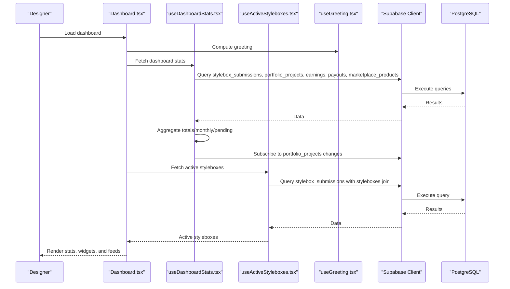

**Diagram sources**
- [Dashboard.tsx](file://src/pages/Dashboard.tsx#L29-L94)
- [useDashboardStats.tsx](file://src/hooks/useDashboardStats.tsx#L30-L143)
- [useActiveStyleboxes.tsx](file://src/hooks/useActiveStyleboxes.tsx#L42-L111)
- [client.ts](file://src/integrations/supabase/client.ts#L11-L17)

## Detailed Component Analysis

### Dashboard Layout and Greeting System
- Header section displays a contextual greeting and a CTA to explore styleboxes.
- On first login, a welcome modal is shown and dismissed after marking the first login complete.
- Recent activity is fetched from stylebox_submissions and rendered as a compact list with status badges.

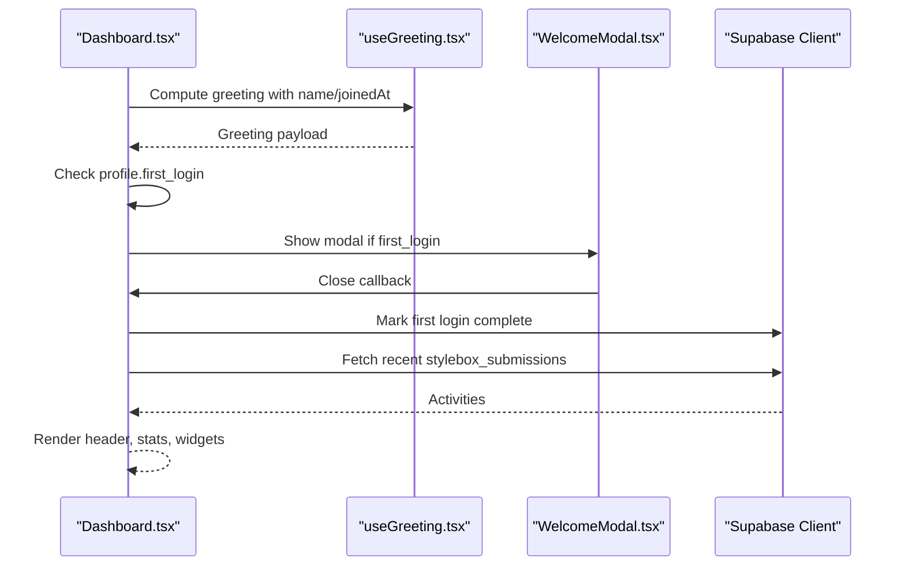

**Diagram sources**
- [Dashboard.tsx](file://src/pages/Dashboard.tsx#L40-L93)
- [useGreeting.tsx](file://src/hooks/useGreeting.tsx#L9-L99)
- [WelcomeModal.tsx](file://src/components/WelcomeModal.tsx#L20-L112)

**Section sources**
- [Dashboard.tsx](file://src/pages/Dashboard.tsx#L141-L178)
- [Dashboard.tsx](file://src/pages/Dashboard.tsx#L46-L56)
- [Dashboard.tsx](file://src/pages/Dashboard.tsx#L58-L93)
- [useGreeting.tsx](file://src/hooks/useGreeting.tsx#L9-L99)
- [WelcomeModal.tsx](file://src/components/WelcomeModal.tsx#L20-L112)

### Statistics Cards
- Four StatCard components present active styleboxes, completed projects, portfolio items, and earnings.
- Each card supports an optional trend indicator and displays a descriptive subtitle.

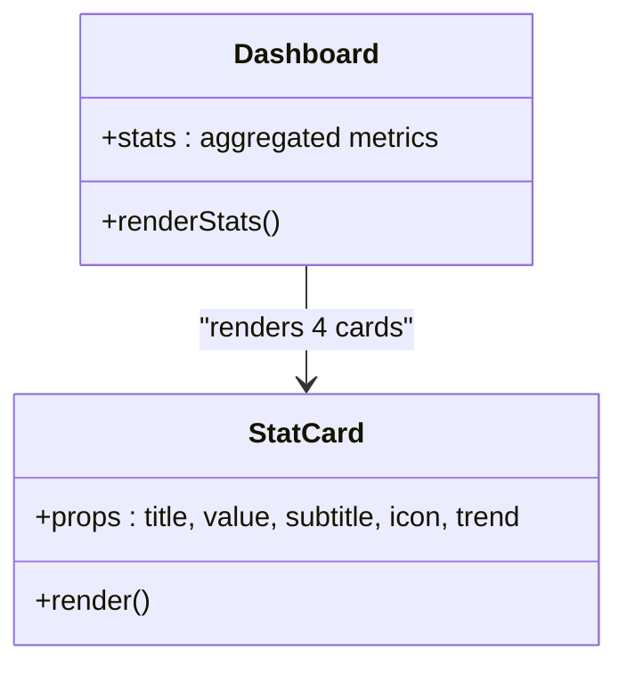

**Diagram sources**
- [StatCard.tsx](file://src/components/dashboard/StatCard.tsx#L17-L73)
- [Dashboard.tsx](file://src/pages/Dashboard.tsx#L196-L227)

**Section sources**
- [Dashboard.tsx](file://src/pages/Dashboard.tsx#L187-L230)
- [StatCard.tsx](file://src/components/dashboard/StatCard.tsx#L17-L73)

### Rank Progress Visualization
- Uses ranking definitions to compute commission, progress percentage, and next rank threshold.
- Displays rank icon, name, description, commission, progress bar, and badges.

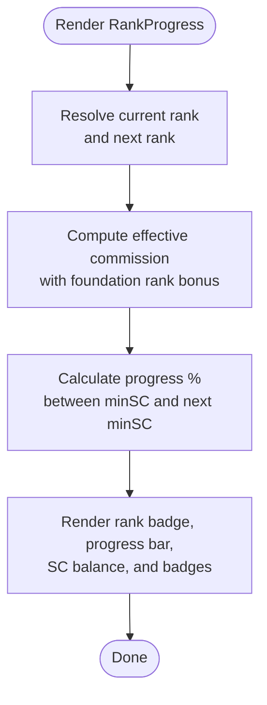

**Diagram sources**
- [RankProgress.tsx](file://src/components/dashboard/RankProgress.tsx#L71-L204)
- [ranks.ts](file://src/lib/ranks.ts#L207-L221)

**Section sources**
- [RankProgress.tsx](file://src/components/dashboard/RankProgress.tsx#L71-L204)
- [ranks.ts](file://src/lib/ranks.ts#L60-L177)

### Team Activity Feed
- Shows team name, current project, member avatars, and unread messages.
- Provides a call-to-action to open the team space.

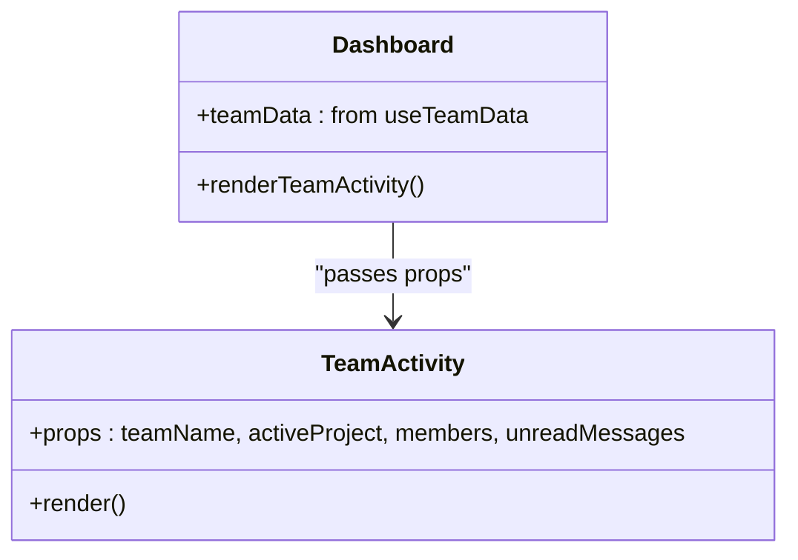

**Diagram sources**
- [TeamActivity.tsx](file://src/components/dashboard/TeamActivity.tsx#L20-L97)
- [Dashboard.tsx](file://src/pages/Dashboard.tsx#L391-L408)

**Section sources**
- [TeamActivity.tsx](file://src/components/dashboard/TeamActivity.tsx#L20-L97)
- [Dashboard.tsx](file://src/pages/Dashboard.tsx#L391-L408)

### Earnings Snapshot
- Highlights monthly earnings with trend, total earnings, pending payouts, and products sold.
- Includes a CTA to view full analytics.

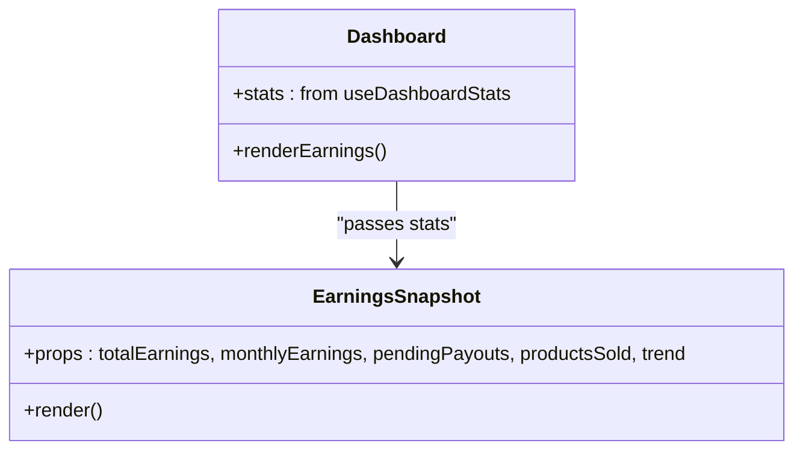

**Diagram sources**
- [EarningsSnapshot.tsx](file://src/components/dashboard/EarningsSnapshot.tsx#L13-L83)
- [Dashboard.tsx](file://src/pages/Dashboard.tsx#L410-L417)

**Section sources**
- [EarningsSnapshot.tsx](file://src/components/dashboard/EarningsSnapshot.tsx#L13-L83)
- [Dashboard.tsx](file://src/pages/Dashboard.tsx#L410-L417)

### Data Fetching Mechanisms and Real-Time Updates
- useDashboardStats aggregates:
  - Active and completed styleboxes from stylebox_submissions.
  - Portfolio items via portfolio_projects count.
  - Earnings from earnings table and monthly aggregation.
  - Pending payouts from payouts table.
  - Products sold via marketplace_products and product_sales joins.
  - Love count from designer_follows.
  - Subscribes to postgres_changes on portfolio_projects to refresh counts in real time.
- useAnalyticsData consolidates metrics via RPC get_designer_stats, builds revenue by month, top products, and recent transactions.

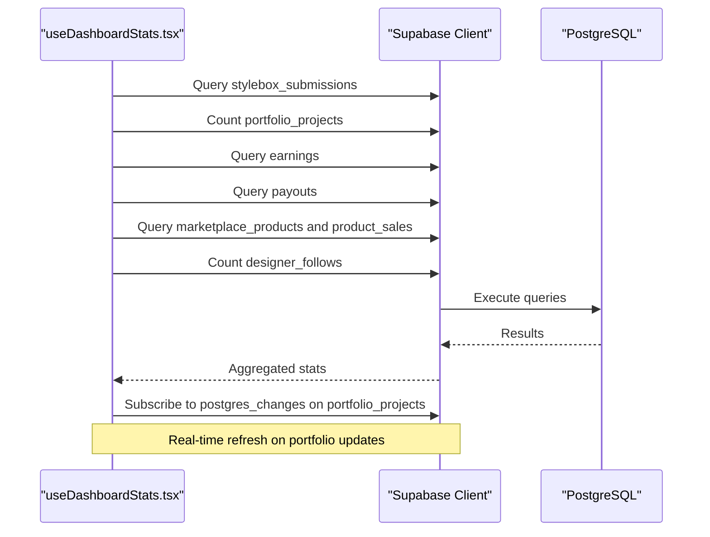

**Diagram sources**
- [useDashboardStats.tsx](file://src/hooks/useDashboardStats.tsx#L30-L143)
- [client.ts](file://src/integrations/supabase/client.ts#L11-L17)

**Section sources**
- [useDashboardStats.tsx](file://src/hooks/useDashboardStats.tsx#L16-L147)
- [useAnalyticsData.tsx](file://src/hooks/useAnalyticsData.tsx#L41-L182)

### Active Styleboxes Widget
- Loads submissions with status "submitted" and enriches with stylebox metadata.
- Computes progress and due dates for display.

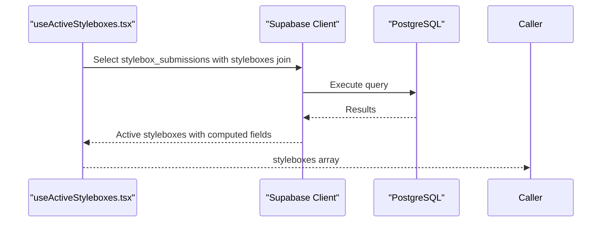

**Diagram sources**
- [useActiveStyleboxes.tsx](file://src/hooks/useActiveStyleboxes.tsx#L42-L111)
- [Dashboard.tsx](file://src/pages/Dashboard.tsx#L293-L331)

**Section sources**
- [useActiveStyleboxes.tsx](file://src/hooks/useActiveStyleboxes.tsx#L30-L115)
- [Dashboard.tsx](file://src/pages/Dashboard.tsx#L293-L331)

### Database Schema Context
- Portfolio tables support project and asset management with RLS and indexes.
- Stylebox submission system defines enums, tables, storage buckets, RLS policies, triggers, and helper functions.

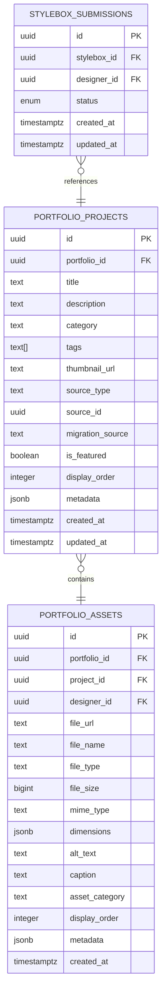

**Diagram sources**
- [20260127230305_create_portfolio_tables.sql](file://supabase/migrations/20260127230305_create_portfolio_tables.sql#L6-L49)
- [20260130050000_designer_stylebox_system.sql](file://supabase/migrations/20260130050000_designer_stylebox_system.sql#L52-L118)

**Section sources**
- [20260127230305_create_portfolio_tables.sql](file://supabase/migrations/20260127230305_create_portfolio_tables.sql#L1-L86)
- [20260130050000_designer_stylebox_system.sql](file://supabase/migrations/20260130050000_designer_stylebox_system.sql#L1-L569)

## Dependency Analysis
- Dashboard depends on:
  - useDashboardStats for aggregated metrics.
  - useActiveStyleboxes for active submissions.
  - useGreeting for contextual greeting.
  - Supabase client for queries and real-time subscriptions.
  - Ranking library for rank computations.
- Widgets depend on shared UI primitives and props passed by the dashboard.

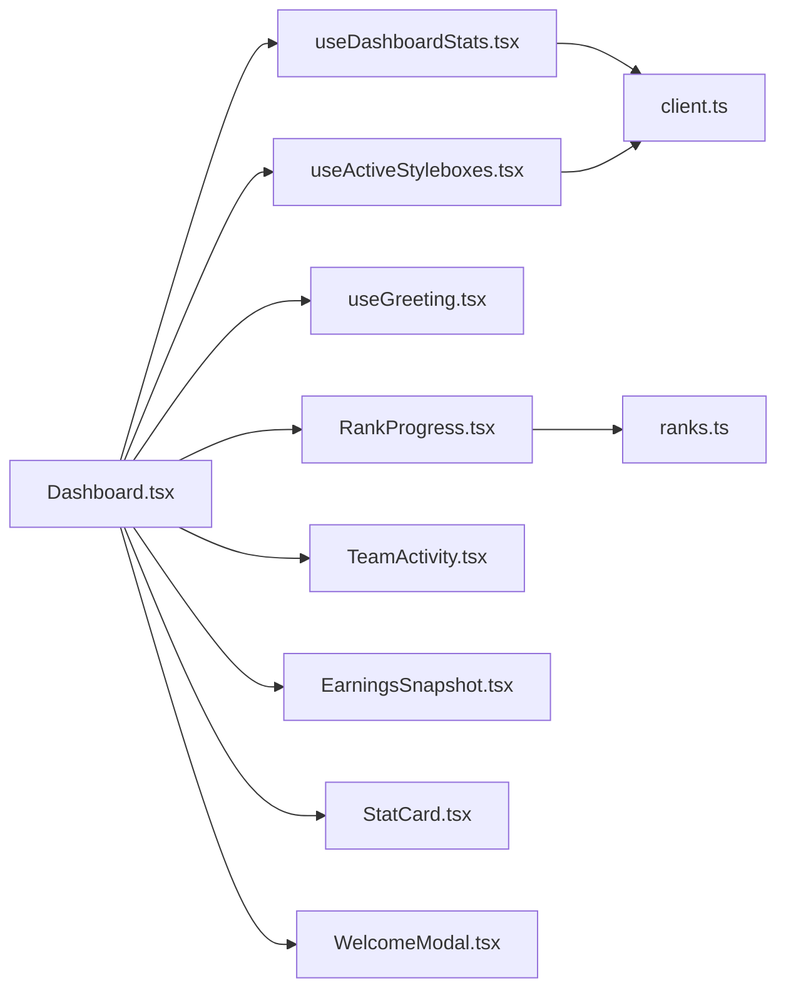

**Diagram sources**
- [Dashboard.tsx](file://src/pages/Dashboard.tsx#L29-L440)
- [useDashboardStats.tsx](file://src/hooks/useDashboardStats.tsx#L1-L147)
- [useActiveStyleboxes.tsx](file://src/hooks/useActiveStyleboxes.tsx#L1-L115)
- [useGreeting.tsx](file://src/hooks/useGreeting.tsx#L1-L99)
- [RankProgress.tsx](file://src/components/dashboard/RankProgress.tsx#L1-L204)
- [TeamActivity.tsx](file://src/components/dashboard/TeamActivity.tsx#L1-L97)
- [EarningsSnapshot.tsx](file://src/components/dashboard/EarningsSnapshot.tsx#L1-L83)
- [StatCard.tsx](file://src/components/dashboard/StatCard.tsx#L1-L73)
- [WelcomeModal.tsx](file://src/components/WelcomeModal.tsx#L1-L112)
- [client.ts](file://src/integrations/supabase/client.ts#L1-L17)
- [ranks.ts](file://src/lib/ranks.ts#L1-L246)

**Section sources**
- [Dashboard.tsx](file://src/pages/Dashboard.tsx#L29-L440)
- [client.ts](file://src/integrations/supabase/client.ts#L1-L17)
- [ranks.ts](file://src/lib/ranks.ts#L1-L246)

## Performance Considerations
- Minimize redundant queries by aggregating metrics in a single hook where possible.
- Use Supabase postgres_changes for efficient real-time updates on portfolio counts.
- Paginate or limit recent activity lists to reduce DOM size.
- Memoize computed values (e.g., greeting) to avoid unnecessary re-renders.
- Defer heavy computations until data is available to avoid blocking UI.

## Troubleshooting Guide
- If stats do not update, verify Supabase connection and environment variables for VITE_SUPABASE_URL and VITE_SUPABASE_PUBLISHABLE_KEY.
- If real-time updates fail, confirm the postgres_changes subscription is active and the channel name matches.
- If RPC analytics fail, check the get_designer_stats function exists and user has appropriate permissions.
- If active styleboxes are missing, ensure stylebox_submissions status filter aligns with intended visibility.

**Section sources**
- [client.ts](file://src/integrations/supabase/client.ts#L5-L17)
- [useDashboardStats.tsx](file://src/hooks/useDashboardStats.tsx#L125-L143)
- [useAnalyticsData.tsx](file://src/hooks/useAnalyticsData.tsx#L67-L71)

## Conclusion
The designer dashboard integrates modular widgets with robust data hooks and Supabase-driven analytics. It provides actionable insights through statistics, rank progression, team activity, and earnings snapshots, while supporting real-time updates and contextual user experiences via greetings and onboarding.

## Appendices
- Practical customization tips:
  - Adjust StatCard trend thresholds and icons per metric.
  - Extend EarningsSnapshot with additional KPIs (e.g., conversion rate).
  - Add filters to TeamActivity (e.g., unread messages by project).
  - Configure WelcomeModal steps for different user segments.
- Performance metrics display:
  - Use useAnalyticsData revenueData to render monthly earnings charts.
  - Surface top products and recent transactions for revenue attribution.