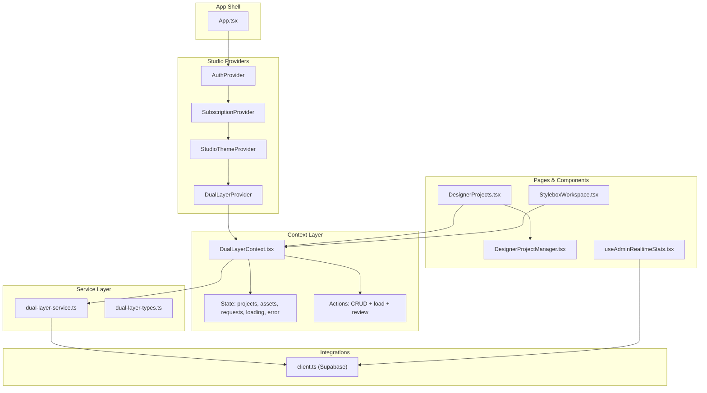
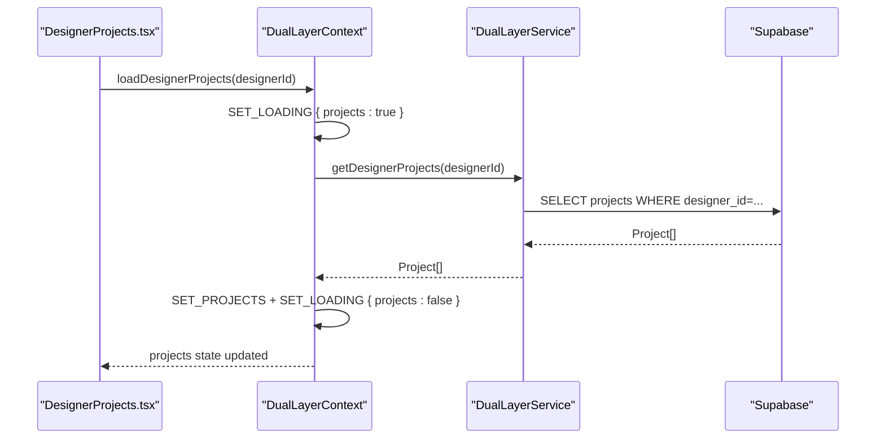
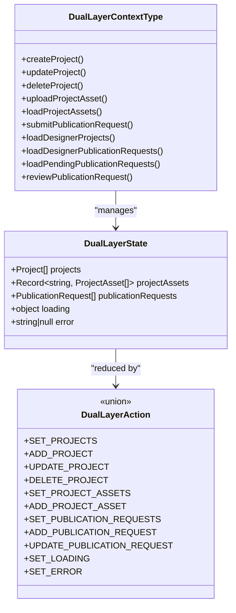
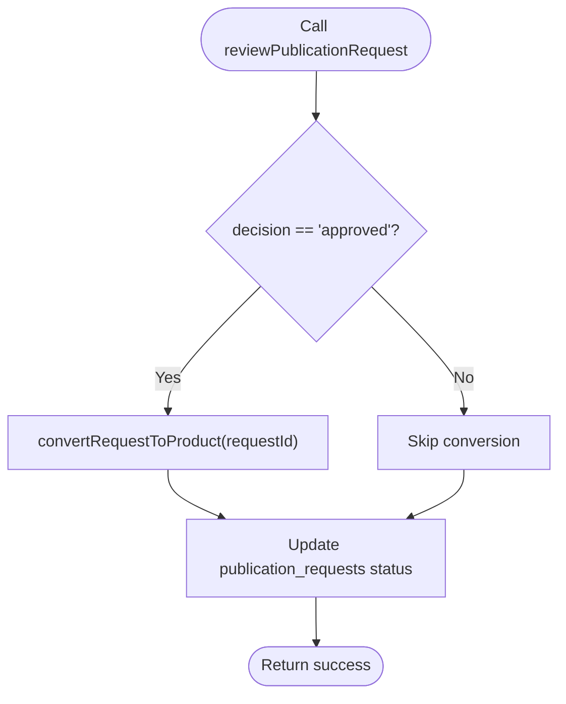
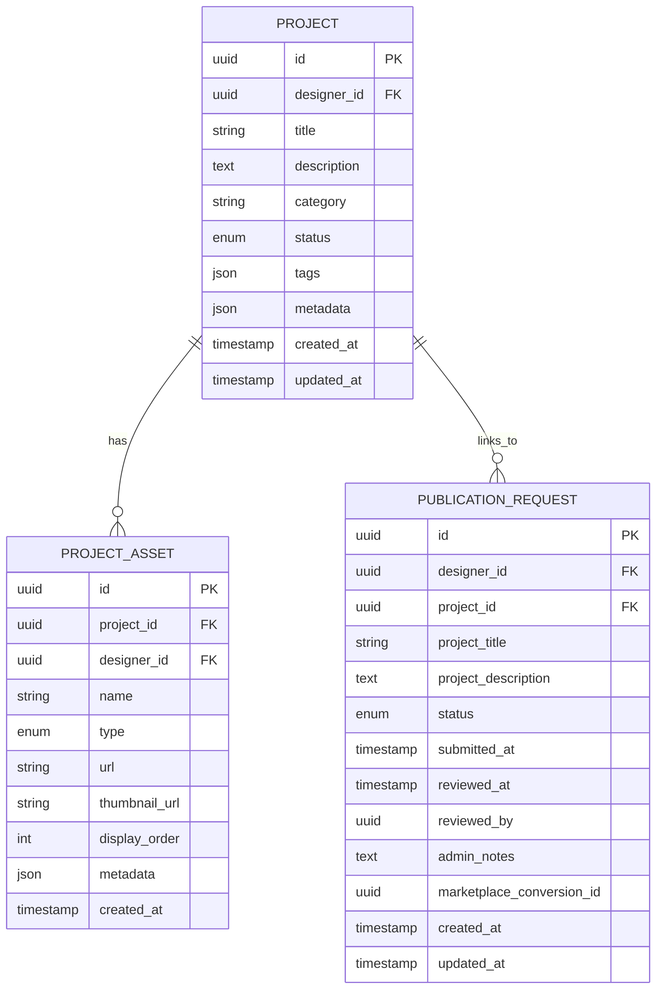
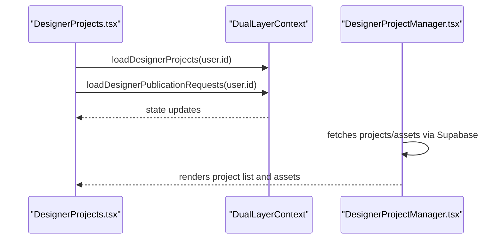
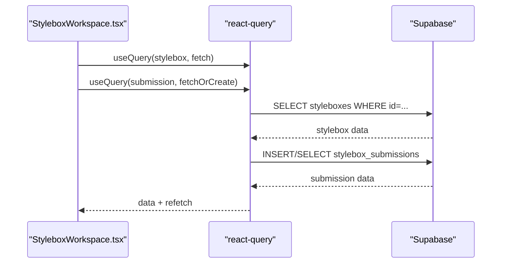
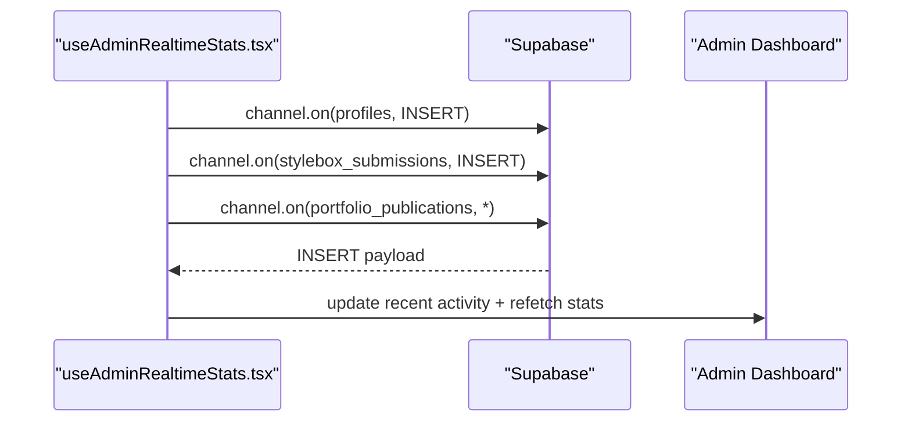
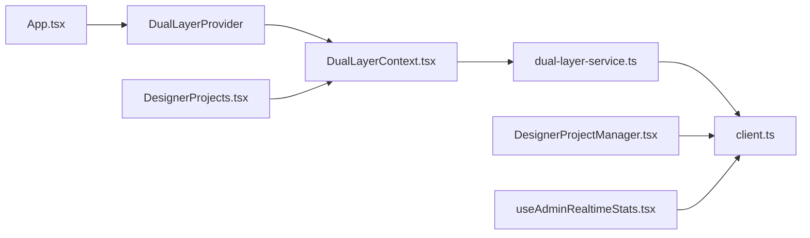

# Dual Layer Context System

<cite>
**Referenced Files in This Document**
- [DualLayerContext.tsx](file://src/contexts/DualLayerContext.tsx)
- [dual-layer-service.ts](file://src/lib/dual-layer-service.ts)
- [dual-layer-types.ts](file://src/lib/dual-layer-types.ts)
- [DesignerProjectManager.tsx](file://src/components/projects/DesignerProjectManager.tsx)
- [DesignerProjects.tsx](file://src/pages/DesignerProjects.tsx)
- [StyleboxWorkspace.tsx](file://src/pages/StyleboxWorkspace.tsx)
- [App.tsx](file://src/App.tsx)
- [client.ts](file://src/integrations/supabase/client.ts)
- [useAdminRealtimeStats.tsx](file://src/hooks/useAdminRealtimeStats.tsx)
</cite>

## Table of Contents
1. [Introduction](#introduction)
2. [Project Structure](#project-structure)
3. [Core Components](#core-components)
4. [Architecture Overview](#architecture-overview)
5. [Detailed Component Analysis](#detailed-component-analysis)
6. [Dependency Analysis](#dependency-analysis)
7. [Performance Considerations](#performance-considerations)
8. [Troubleshooting Guide](#troubleshooting-guide)
9. [Conclusion](#conclusion)

## Introduction
This document explains the dual-layer context system that powers designer project management and studio workspace functionality. It describes the context provider pattern, state management for designer projects, the separation between designer and admin layers, the service layer for project operations, type definitions for dual-layer data structures, and integration patterns with the studio workspace. It also covers real-time updates, project lifecycle management, and data synchronization between layers, with practical usage examples and architectural benefits.

## Project Structure
The dual-layer system is organized around a central context provider that encapsulates state and actions for designer projects and publication requests, backed by a service layer that interacts with Supabase. Studio workspace pages integrate with this context to provide designer-centric workflows, while admin dashboards consume real-time stats and publication requests.

**Diagram sources**
- [App.tsx](file://src/App.tsx#L110-L123)
- [DualLayerContext.tsx](file://src/contexts/DualLayerContext.tsx#L135-L295)
- [dual-layer-service.ts](file://src/lib/dual-layer-service.ts#L4-L340)
- [dual-layer-types.ts](file://src/lib/dual-layer-types.ts#L1-L44)
- [client.ts](file://src/integrations/supabase/client.ts#L1-L17)
- [DesignerProjects.tsx](file://src/pages/DesignerProjects.tsx#L1-L46)
- [DesignerProjectManager.tsx](file://src/components/projects/DesignerProjectManager.tsx#L1-L364)
- [StyleboxWorkspace.tsx](file://src/pages/StyleboxWorkspace.tsx#L1-L412)
- [useAdminRealtimeStats.tsx](file://src/hooks/useAdminRealtimeStats.tsx#L1-L209)

**Section sources**
- [App.tsx](file://src/App.tsx#L110-L123)
- [DualLayerContext.tsx](file://src/contexts/DualLayerContext.tsx#L135-L295)

## Core Components
- DualLayerProvider: Central context provider implementing the context pattern with useReducer for state and actions.
- DualLayerService: Service layer encapsulating all designer and admin operations against Supabase.
- Type definitions: Strongly typed Project, ProjectAsset, and PublicationRequest models.
- DesignerProjectManager: A component demonstrating dual-layer data usage alongside direct Supabase queries.
- DesignerProjects page: Integrates the context to load designer projects and publication requests.
- StyleboxWorkspace: Studio workspace page consuming Supabase queries and local state, complementing the dual-layer context.

**Section sources**
- [DualLayerContext.tsx](file://src/contexts/DualLayerContext.tsx#L5-L15)
- [dual-layer-service.ts](file://src/lib/dual-layer-service.ts#L4-L340)
- [dual-layer-types.ts](file://src/lib/dual-layer-types.ts#L1-L44)
- [DesignerProjectManager.tsx](file://src/components/projects/DesignerProjectManager.tsx#L1-L364)
- [DesignerProjects.tsx](file://src/pages/DesignerProjects.tsx#L1-L46)
- [StyleboxWorkspace.tsx](file://src/pages/StyleboxWorkspace.tsx#L1-L412)

## Architecture Overview
The dual-layer architecture separates concerns between designer operations and admin operations while sharing a unified context for state management. The context exposes actions for creating, updating, deleting projects, uploading assets, submitting publication requests, and reviewing them. The service layer enforces ownership checks and performs database operations via Supabase.

**Diagram sources**
- [DesignerProjects.tsx](file://src/pages/DesignerProjects.tsx#L8-L16)
- [DualLayerContext.tsx](file://src/contexts/DualLayerContext.tsx#L138-L149)
- [dual-layer-service.ts](file://src/lib/dual-layer-service.ts#L85-L99)

**Section sources**
- [DualLayerContext.tsx](file://src/contexts/DualLayerContext.tsx#L135-L295)
- [dual-layer-service.ts](file://src/lib/dual-layer-service.ts#L4-L340)

## Detailed Component Analysis

### DualLayerContext: Context Provider Pattern and State Management
- State shape: projects array, projectAssets indexed by project_id, publicationRequests array, loading booleans, and error string.
- Reducer actions: setters for lists, adding/updating/deleting items, per-project asset loading toggles, and error handling.
- Actions exposed: createProject, updateProject, deleteProject, uploadProjectAsset, loadProjectAssets, submitPublicationRequest, loadDesignerProjects, loadDesignerPublicationRequests, loadPendingPublicationRequests, reviewPublicationRequest.
- Ownership enforcement: updateProject and deleteProject verify the requesting designer owns the resource before mutating.

**Diagram sources**
- [DualLayerContext.tsx](file://src/contexts/DualLayerContext.tsx#L5-L28)

**Section sources**
- [DualLayerContext.tsx](file://src/contexts/DualLayerContext.tsx#L5-L118)
- [DualLayerContext.tsx](file://src/contexts/DualLayerContext.tsx#L120-L131)

### DualLayerService: Service Layer for Project Operations
- Designer operations: createProject, updateProject (with ownership verification), deleteProject (with ownership verification), getDesignerProjects.
- Asset operations: uploadProjectAsset (verifies project’s designer), getProjectAssets.
- Publication request operations: submitPublicationRequest (verifies project ownership), getDesignerPublicationRequests (flattens project data), getPendingPublicationRequests, reviewPublicationRequest (updates status and optionally converts to marketplace product).
- Admin conversion: convertRequestToProduct links a publication request to a marketplace product and updates linkage.

**Diagram sources**
- [dual-layer-service.ts](file://src/lib/dual-layer-service.ts#L228-L257)
- [dual-layer-service.ts](file://src/lib/dual-layer-service.ts#L259-L310)

**Section sources**
- [dual-layer-service.ts](file://src/lib/dual-layer-service.ts#L4-L340)

### Type Definitions: Dual-Layer Data Structures
- Project: identifier, designer association, title, description, category, status enum, tags, metadata, timestamps.
- ProjectAsset: asset metadata, type enum, URLs, display order, designer and project linkage, timestamps.
- PublicationRequest: request linkage to project and designer, status enum, timestamps, admin review fields, optional marketplace conversion id.

**Diagram sources**
- [dual-layer-types.ts](file://src/lib/dual-layer-types.ts#L3-L43)

**Section sources**
- [dual-layer-types.ts](file://src/lib/dual-layer-types.ts#L1-L44)

### Designer Project Management Integration
- DesignerProjects page loads designer projects and publication requests via the dual-layer context on mount.
- DesignerProjectManager demonstrates a hybrid approach: it uses the context for state and actions, but also performs direct Supabase queries for comparison and fallback scenarios.

**Diagram sources**
- [DesignerProjects.tsx](file://src/pages/DesignerProjects.tsx#L8-L16)
- [DesignerProjectManager.tsx](file://src/components/projects/DesignerProjectManager.tsx#L25-L81)

**Section sources**
- [DesignerProjects.tsx](file://src/pages/DesignerProjects.tsx#L1-L46)
- [DesignerProjectManager.tsx](file://src/components/projects/DesignerProjectManager.tsx#L1-L364)

### Studio Workspace Integration
- StyleboxWorkspace integrates with Supabase for StyleBox and submission data, using react-query for caching and refetching. While distinct from the dual-layer context, it complements designer project workflows by providing a creative workspace environment.

**Diagram sources**
- [StyleboxWorkspace.tsx](file://src/pages/StyleboxWorkspace.tsx#L57-L117)
- [client.ts](file://src/integrations/supabase/client.ts#L1-L17)

**Section sources**
- [StyleboxWorkspace.tsx](file://src/pages/StyleboxWorkspace.tsx#L1-L412)
- [client.ts](file://src/integrations/supabase/client.ts#L1-L17)

### Real-Time Updates and Admin Integration
- AdminRealtimeStats demonstrates real-time subscriptions to Supabase for live activity feeds and periodic stats refresh, showcasing how admin dashboards can stay synchronized with backend events.

**Diagram sources**
- [useAdminRealtimeStats.tsx](file://src/hooks/useAdminRealtimeStats.tsx#L113-L184)

**Section sources**
- [useAdminRealtimeStats.tsx](file://src/hooks/useAdminRealtimeStats.tsx#L1-L209)

## Dependency Analysis
- App.tsx composes providers: AuthProvider → SubscriptionProvider → StudioThemeProvider → DualLayerProvider, ensuring the dual-layer context is available to studio routes.
- DualLayerContext depends on DualLayerService and Supabase client for persistence.
- DesignerProjectManager shows a direct Supabase dependency, useful for scenarios where context state is unavailable or needs fallback behavior.
- AdminRealtimeStats depends on Supabase realtime channels and react-query for periodic refresh.

**Diagram sources**
- [App.tsx](file://src/App.tsx#L110-L123)
- [DualLayerContext.tsx](file://src/contexts/DualLayerContext.tsx#L135-L295)
- [dual-layer-service.ts](file://src/lib/dual-layer-service.ts#L4-L3)
- [client.ts](file://src/integrations/supabase/client.ts#L1-L17)
- [DesignerProjects.tsx](file://src/pages/DesignerProjects.tsx#L1-L46)
- [DesignerProjectManager.tsx](file://src/components/projects/DesignerProjectManager.tsx#L1-L364)
- [useAdminRealtimeStats.tsx](file://src/hooks/useAdminRealtimeStats.tsx#L1-L209)

**Section sources**
- [App.tsx](file://src/App.tsx#L110-L123)
- [DualLayerContext.tsx](file://src/contexts/DualLayerContext.tsx#L135-L295)
- [dual-layer-service.ts](file://src/lib/dual-layer-service.ts#L4-L3)
- [client.ts](file://src/integrations/supabase/client.ts#L1-L17)
- [DesignerProjects.tsx](file://src/pages/DesignerProjects.tsx#L1-L46)
- [DesignerProjectManager.tsx](file://src/components/projects/DesignerProjectManager.tsx#L1-L364)
- [useAdminRealtimeStats.tsx](file://src/hooks/useAdminRealtimeStats.tsx#L1-L209)

## Performance Considerations
- Context granularity: The dual-layer context consolidates projects, assets, and requests, reducing prop drilling but potentially increasing re-renders. Consider splitting state into smaller contexts if needed.
- Loading states: Per-project asset loading toggles avoid blocking the entire asset list and improve perceived performance.
- Ownership checks: Enforcing ownership in the service layer prevents unnecessary UI updates and maintains data integrity.
- Real-time subscriptions: Admin hooks use periodic refetch intervals and reactive updates to balance freshness and performance.

## Troubleshooting Guide
- Context consumption errors: Ensure components use the dual-layer context within the provider boundary; otherwise, useDualLayer throws an error.
- Operation failures: Actions dispatch SET_ERROR with a descriptive message; inspect the error field in the context state.
- Ownership violations: updateProject and deleteProject throw unauthorized errors if the designer does not own the resource; verify the current user id and project ownership.
- Real-time updates: Confirm Supabase publication configuration and channel subscriptions are active for the relevant tables.

**Section sources**
- [DualLayerContext.tsx](file://src/contexts/DualLayerContext.tsx#L297-L303)
- [dual-layer-service.ts](file://src/lib/dual-layer-service.ts#L38-L41)
- [useAdminRealtimeStats.tsx](file://src/hooks/useAdminRealtimeStats.tsx#L113-L184)

## Conclusion
The dual-layer context system provides a clean separation between designer and admin operations while offering a unified state management layer for project lifecycle tasks. By combining a context provider with a service layer and strong type definitions, the system ensures predictable state transitions, robust ownership checks, and scalable integration with studio workspace and admin dashboards. The architecture supports real-time updates, efficient loading patterns, and maintainable cross-layer communication, making it a solid foundation for the broader application ecosystem.