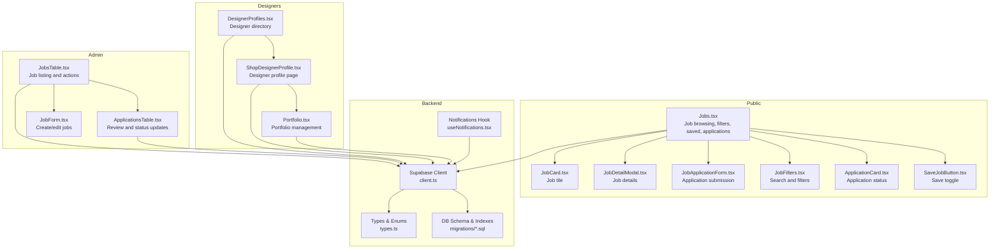
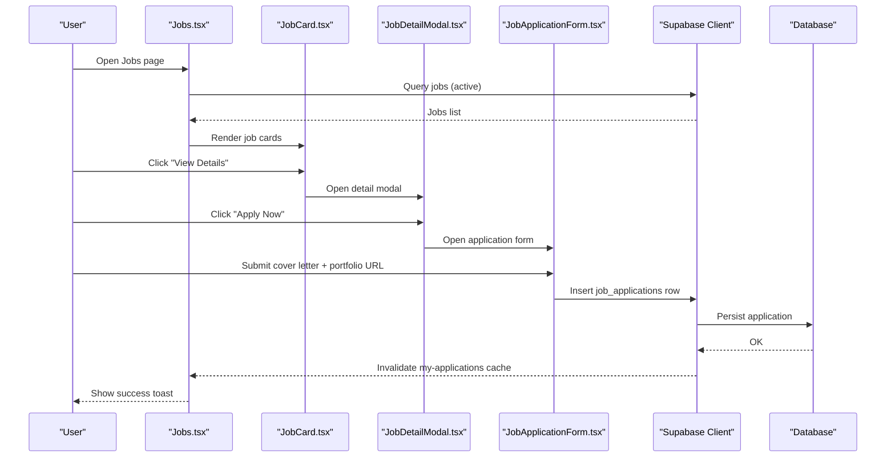
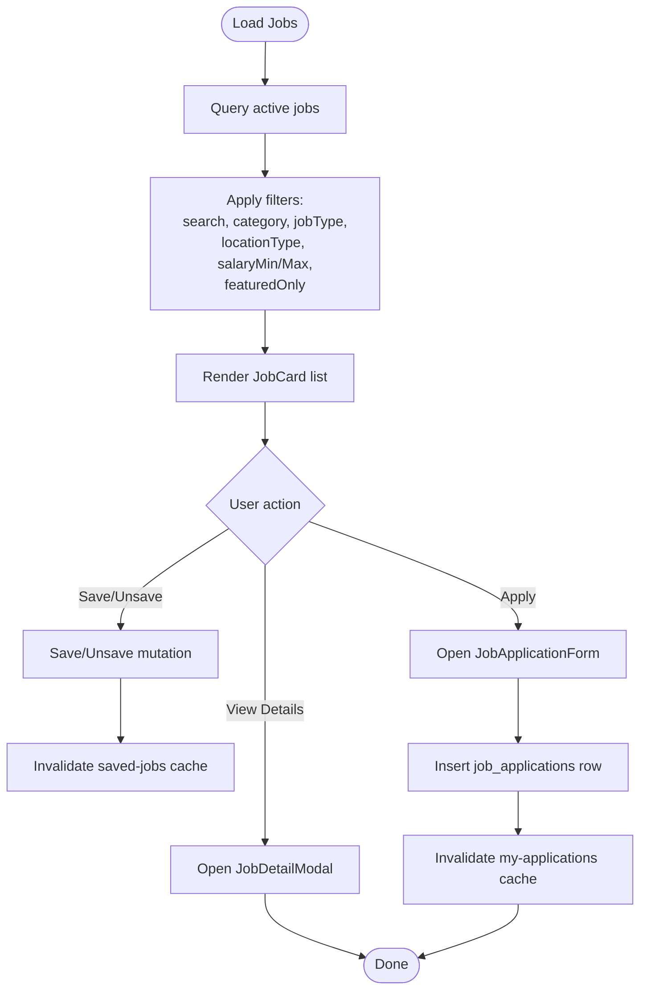
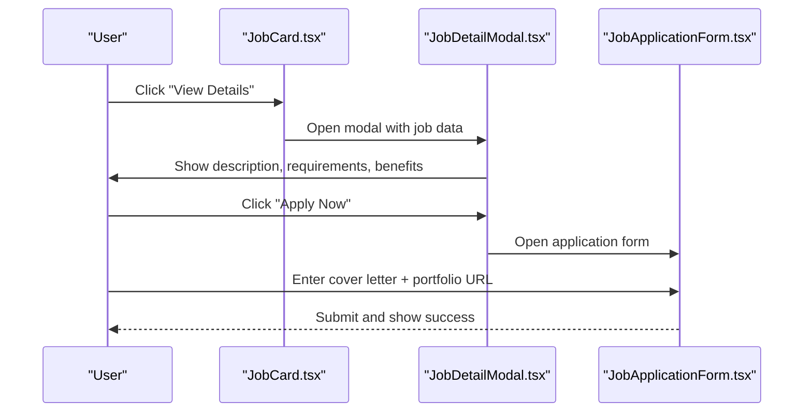
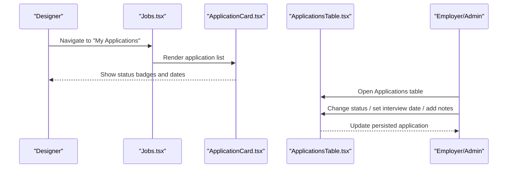
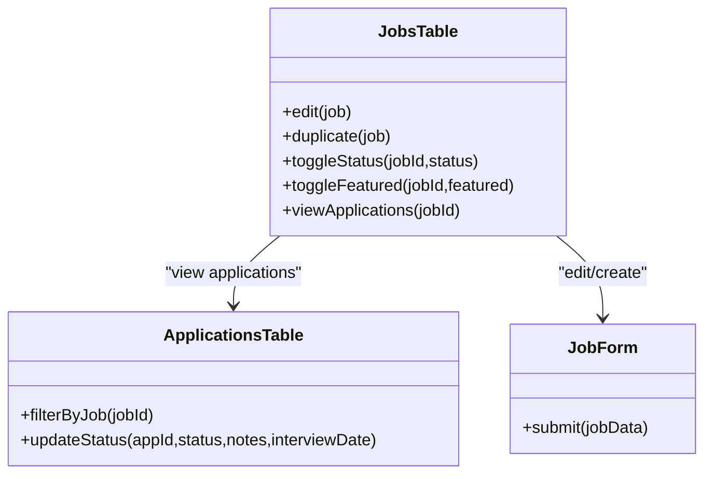
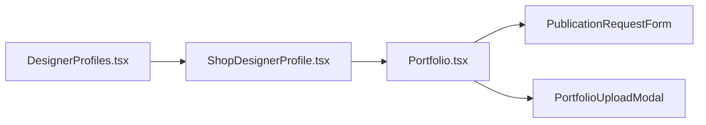

# Jobs & Opportunities

<cite>
**Referenced Files in This Document**
- [Jobs.tsx](file://src/pages/Jobs.tsx)
- [JobCard.tsx](file://src/components/jobs/JobCard.tsx)
- [JobDetailModal.tsx](file://src/components/jobs/JobDetailModal.tsx)
- [JobApplicationForm.tsx](file://src/components/jobs/JobApplicationForm.tsx)
- [JobFilters.tsx](file://src/components/jobs/JobFilters.tsx)
- [ApplicationCard.tsx](file://src/components/jobs/ApplicationCard.tsx)
- [SaveJobButton.tsx](file://src/components/jobs/SaveJobButton.tsx)
- [client.ts](file://src/integrations/supabase/client.ts)
- [types.ts](file://src/integrations/supabase/types.ts)
- [20251225045301_9b034f19-b9bf-44ab-972d-c11561800283.sql](file://supabase/migrations/20251225045301_9b034f19-b9bf-44ab-972d-c11561800283.sql)
- [20260108050000_enhance_designer_profiles.sql](file://supabase/migrations/20260108050000_enhance_designer_profiles.sql)
- [JobsTable.tsx](file://src/components/admin/jobs/JobsTable.tsx)
- [ApplicationsTable.tsx](file://src/components/admin/jobs/ApplicationsTable.tsx)
- [JobForm.tsx](file://src/components/admin/jobs/JobForm.tsx)
- [DesignerProfiles.tsx](file://src/pages/public/DesignerProfiles.tsx)
- [ShopDesignerProfile.tsx](file://src/pages/shop/ShopDesignerProfile.tsx)
- [Portfolio.tsx](file://src/pages/Portfolio.tsx)
- [useNotifications.tsx](file://src/hooks/useNotifications.tsx)
</cite>

## Table of Contents
1. [Introduction](#introduction)
2. [Project Structure](#project-structure)
3. [Core Components](#core-components)
4. [Architecture Overview](#architecture-overview)
5. [Detailed Component Analysis](#detailed-component-analysis)
6. [Dependency Analysis](#dependency-analysis)
7. [Performance Considerations](#performance-considerations)
8. [Troubleshooting Guide](#troubleshooting-guide)
9. [Conclusion](#conclusion)
10. [Appendices](#appendices)

## Introduction
This document explains the jobs and opportunities platform, focusing on the job listing system, filtering, application workflow, and saved jobs. It also documents how designer profiles integrate with job matching, how applications are tracked, and how employer communication features are surfaced. Practical examples illustrate browsing jobs, applying to positions, managing applications, and setting up job alerts. Finally, it outlines the relationship between job opportunities and designer skill development, portfolio showcase for employers, and career progression tracking.

## Project Structure
The jobs and opportunities feature spans several frontend pages and components, backed by Supabase for data and real-time updates. Key areas:
- Public job browsing and application flow
- Designer profile and portfolio integration
- Employer/admin job management and application review
- Notifications for job-related events



**Diagram sources**
- [Jobs.tsx](file://src/pages/Jobs.tsx#L26-L227)
- [JobCard.tsx](file://src/components/jobs/JobCard.tsx#L78-L211)
- [JobDetailModal.tsx](file://src/components/jobs/JobDetailModal.tsx#L76-L298)
- [JobApplicationForm.tsx](file://src/components/jobs/JobApplicationForm.tsx#L24-L132)
- [JobFilters.tsx](file://src/components/jobs/JobFilters.tsx#L37-L214)
- [ApplicationCard.tsx](file://src/components/jobs/ApplicationCard.tsx#L52-L100)
- [SaveJobButton.tsx](file://src/components/jobs/SaveJobButton.tsx#L13-L57)
- [JobsTable.tsx](file://src/components/admin/jobs/JobsTable.tsx#L79-L216)
- [ApplicationsTable.tsx](file://src/components/admin/jobs/ApplicationsTable.tsx#L93-L378)
- [JobForm.tsx](file://src/components/admin/jobs/JobForm.tsx#L72-L476)
- [DesignerProfiles.tsx](file://src/pages/public/DesignerProfiles.tsx#L87-L235)
- [ShopDesignerProfile.tsx](file://src/pages/shop/ShopDesignerProfile.tsx#L20-L28)
- [Portfolio.tsx](file://src/pages/Portfolio.tsx#L36-L321)
- [client.ts](file://src/integrations/supabase/client.ts#L11-L17)
- [types.ts](file://src/integrations/supabase/types.ts#L482-L562)
- [20251225045301_9b034f19-b9bf-44ab-972d-c11561800283.sql](file://supabase/migrations/20251225045301_9b034f19-b9bf-44ab-972d-c11561800283.sql#L1-L31)
- [useNotifications.tsx](file://src/hooks/useNotifications.tsx#L8-L157)

**Section sources**
- [Jobs.tsx](file://src/pages/Jobs.tsx#L26-L227)
- [client.ts](file://src/integrations/supabase/client.ts#L11-L17)

## Core Components
- Job browsing and filtering: Jobs page with tabs for Browse, My Applications, and Saved; responsive filters; job cards with apply/save actions.
- Job detail and application: Modal with role details, requirements, benefits, deadlines, and contact info; application form with portfolio link and cover letter.
- Application tracking: Cards showing applied positions, status badges, and interview date.
- Saved jobs: Toggle save/unsave with optimistic UI and cache invalidation.
- Admin job management: Create/edit jobs, toggle status and featured flag, view applications, and review candidates.
- Designer profile and portfolio: Public designer directory, individual designer profile, and portfolio management for showcasing work to employers.

**Section sources**
- [Jobs.tsx](file://src/pages/Jobs.tsx#L26-L227)
- [JobCard.tsx](file://src/components/jobs/JobCard.tsx#L78-L211)
- [JobDetailModal.tsx](file://src/components/jobs/JobDetailModal.tsx#L76-L298)
- [JobApplicationForm.tsx](file://src/components/jobs/JobApplicationForm.tsx#L24-L132)
- [JobFilters.tsx](file://src/components/jobs/JobFilters.tsx#L37-L214)
- [ApplicationCard.tsx](file://src/components/jobs/ApplicationCard.tsx#L52-L100)
- [SaveJobButton.tsx](file://src/components/jobs/SaveJobButton.tsx#L13-L57)
- [JobsTable.tsx](file://src/components/admin/jobs/JobsTable.tsx#L79-L216)
- [ApplicationsTable.tsx](file://src/components/admin/jobs/ApplicationsTable.tsx#L93-L378)
- [JobForm.tsx](file://src/components/admin/jobs/JobForm.tsx#L72-L476)
- [DesignerProfiles.tsx](file://src/pages/public/DesignerProfiles.tsx#L87-L235)
- [ShopDesignerProfile.tsx](file://src/pages/shop/ShopDesignerProfile.tsx#L20-L28)
- [Portfolio.tsx](file://src/pages/Portfolio.tsx#L36-L321)

## Architecture Overview
The system integrates frontend components with Supabase for data persistence and real-time subscriptions. The Jobs page orchestrates queries for jobs, applications, and saved jobs, and exposes mutations for saving and applying. Admin components manage job lifecycle and candidate reviews. Designer profiles and portfolios are surfaced to employers through the marketplace and designer directory.



**Diagram sources**
- [Jobs.tsx](file://src/pages/Jobs.tsx#L35-L112)
- [JobCard.tsx](file://src/components/jobs/JobCard.tsx#L182-L205)
- [JobDetailModal.tsx](file://src/components/jobs/JobDetailModal.tsx#L266-L292)
- [JobApplicationForm.tsx](file://src/components/jobs/JobApplicationForm.tsx#L114-L127)
- [client.ts](file://src/integrations/supabase/client.ts#L11-L17)

## Detailed Component Analysis

### Job Listing and Filtering
- Job listing: Fetches active jobs ordered by featured and recency; renders cards with logo, title, company, location, type, salary, tags, and actions.
- Filtering: Supports category, job type, location type, salary range, and featured-only toggle; mobile-friendly sheet-based filters.
- Saved jobs: Reads saved job IDs per user and highlights saved state; supports toggling save/unsave with optimistic UI.



**Diagram sources**
- [Jobs.tsx](file://src/pages/Jobs.tsx#L115-L128)
- [JobFilters.tsx](file://src/components/jobs/JobFilters.tsx#L44-L154)
- [SaveJobButton.tsx](file://src/components/jobs/SaveJobButton.tsx#L13-L57)
- [JobApplicationForm.tsx](file://src/components/jobs/JobApplicationForm.tsx#L94-L112)

**Section sources**
- [Jobs.tsx](file://src/pages/Jobs.tsx#L35-L128)
- [JobCard.tsx](file://src/components/jobs/JobCard.tsx#L78-L211)
- [JobFilters.tsx](file://src/components/jobs/JobFilters.tsx#L37-L214)
- [SaveJobButton.tsx](file://src/components/jobs/SaveJobButton.tsx#L13-L57)

### Job Detail and Application Modal
- Detail modal displays role summary, quick facts (location, type, salary, applicants), requirements, benefits, deadline, contact, external link, and posted date.
- Action buttons: Apply (disabled if already applied) and Save/Unsave.



**Diagram sources**
- [JobCard.tsx](file://src/components/jobs/JobCard.tsx#L182-L205)
- [JobDetailModal.tsx](file://src/components/jobs/JobDetailModal.tsx#L90-L298)
- [JobApplicationForm.tsx](file://src/components/jobs/JobApplicationForm.tsx#L24-L132)

**Section sources**
- [JobDetailModal.tsx](file://src/components/jobs/JobDetailModal.tsx#L76-L298)
- [JobApplicationForm.tsx](file://src/components/jobs/JobApplicationForm.tsx#L24-L132)

### Application Tracking and Status Updates
- Application cards show company logo/title, status badge, applied date, and optional interview date.
- Admins can review applications, update status (applied, shortlisted, rejected, hired), set interview dates, and add notes.



**Diagram sources**
- [Jobs.tsx](file://src/pages/Jobs.tsx#L172-L179)
- [ApplicationCard.tsx](file://src/components/jobs/ApplicationCard.tsx#L52-L100)
- [ApplicationsTable.tsx](file://src/components/admin/jobs/ApplicationsTable.tsx#L93-L378)

**Section sources**
- [Jobs.tsx](file://src/pages/Jobs.tsx#L172-L179)
- [ApplicationCard.tsx](file://src/components/jobs/ApplicationCard.tsx#L52-L100)
- [ApplicationsTable.tsx](file://src/components/admin/jobs/ApplicationsTable.tsx#L93-L378)

### Employer Job Management and Communication
- Employers/admins can create/edit jobs, set status (draft, active, paused, closed), toggle featured, and view applications.
- Communication features: contact email and external application link in job details; admin notes and interview scheduling in application review.



**Diagram sources**
- [JobsTable.tsx](file://src/components/admin/jobs/JobsTable.tsx#L79-L216)
- [ApplicationsTable.tsx](file://src/components/admin/jobs/ApplicationsTable.tsx#L93-L378)
- [JobForm.tsx](file://src/components/admin/jobs/JobForm.tsx#L72-L476)

**Section sources**
- [JobsTable.tsx](file://src/components/admin/jobs/JobsTable.tsx#L79-L216)
- [ApplicationsTable.tsx](file://src/components/admin/jobs/ApplicationsTable.tsx#L93-L378)
- [JobForm.tsx](file://src/components/admin/jobs/JobForm.tsx#L72-L476)

### Designer Profiles, Portfolio Showcase, and Career Progression
- Designer directory showcases top designers with specialties, ratings, and product counts.
- Individual designer profile page aggregates profile data, social links, and portfolio items.
- Portfolio management allows organizing projects by source (stylebox or upload), categories, and collections; supports publishing requests and bulk actions.



**Diagram sources**
- [DesignerProfiles.tsx](file://src/pages/public/DesignerProfiles.tsx#L87-L235)
- [ShopDesignerProfile.tsx](file://src/pages/shop/ShopDesignerProfile.tsx#L20-L28)
- [Portfolio.tsx](file://src/pages/Portfolio.tsx#L36-L321)

**Section sources**
- [DesignerProfiles.tsx](file://src/pages/public/DesignerProfiles.tsx#L87-L235)
- [ShopDesignerProfile.tsx](file://src/pages/shop/ShopDesignerProfile.tsx#L20-L28)
- [Portfolio.tsx](file://src/pages/Portfolio.tsx#L36-L321)

## Dependency Analysis
- Data access: Supabase client configured with auth storage and auto-refresh; typed database schema for tables and enums.
- Database schema: Jobs table with enums for status, type, location, salary type; job applications with status enum; indexes for performance; triggers to maintain application counts.
- Designer profiles: Enhanced with brand, social links, and location; RLS policy for visibility.

```mermaid
erDiagram
JOBS {
uuid id PK
string title
string company_name
string company_logo
string location
enum location_type
enum job_type
number salary_min
number salary_max
enum salary_type
jsonb requirements
jsonb benefits
text[] tags
boolean is_featured
enum job_status status
timestamptz deadline
string external_link
string contact_email
number application_count
}
JOB_APPLICATIONS {
uuid id PK
uuid job_id FK
uuid designer_id FK
string cover_letter
string portfolio_url
enum job_application_status status
timestamptz applied_at
timestamptz interview_date
string notes
}
SAVED_JOBS {
uuid id PK
uuid job_id FK
uuid designer_id FK
}
PROFILES {
uuid user_id PK
string brand_name
string logo_url
string banner_image
string location
text[] education
text[] awards
string website_url
string instagram_handle
string twitter_handle
string linkedin_url
string facebook_url
string tiktok_handle
string youtube_channel
string dribbble_url
string behance_url
string etsy_shop_url
string shopify_store_url
}
JOBS ||--o{ JOB_APPLICATIONS : "has applications"
PROFILES ||--o{ JOB_APPLICATIONS : "applies"
```

**Diagram sources**
- [types.ts](file://src/integrations/supabase/types.ts#L482-L562)
- [20251225045301_9b034f19-b9bf-44ab-972d-c11561800283.sql](file://supabase/migrations/20251225045301_9b034f19-b9bf-44ab-972d-c11561800283.sql#L1-L31)
- [20260108050000_enhance_designer_profiles.sql](file://supabase/migrations/20260108050000_enhance_designer_profiles.sql#L4-L21)

**Section sources**
- [client.ts](file://src/integrations/supabase/client.ts#L11-L17)
- [types.ts](file://src/integrations/supabase/types.ts#L482-L562)
- [20251225045301_9b034f19-b9bf-44ab-972d-c11561800283.sql](file://supabase/migrations/20251225045301_9b034f19-b9bf-44ab-972d-c11561800283.sql#L1-L31)
- [20260108050000_enhance_designer_profiles.sql](file://supabase/migrations/20260108050000_enhance_designer_profiles.sql#L4-L21)

## Performance Considerations
- Query keys and caching: React Query keys are scoped to user ID and job status to avoid stale data and enable targeted cache invalidation after save/unsave and application submissions.
- Indexes: Database indexes on job status, category, featured flag, application status, and saved jobs designer ID improve filtering and lookup performance.
- UI responsiveness: Skeleton loaders during initial job load; disabled states on apply/save buttons while mutations are pending.
- Pagination and lists: Consider adding server-side pagination for large datasets; current implementation filters client-side.

[No sources needed since this section provides general guidance]

## Troubleshooting Guide
- Authentication gating: Many queries require a logged-in user; ensure user context is available before enabling queries.
- Toast feedback: Application submission uses toast notifications for success/error; verify network connectivity and Supabase permissions.
- Real-time notifications: The notifications hook subscribes to real-time inserts/updates; confirm subscription setup and user ID correctness.
- Database errors: Queries throw if Supabase returns an error; check console logs for underlying SQL errors.

**Section sources**
- [Jobs.tsx](file://src/pages/Jobs.tsx#L49-L63)
- [Jobs.tsx](file://src/pages/Jobs.tsx#L94-L112)
- [useNotifications.tsx](file://src/hooks/useNotifications.tsx#L46-L88)

## Conclusion
The jobs and opportunities platform provides a robust, user-centric experience for designers to discover, apply to, and track opportunities, while offering employers powerful tools to manage roles and review candidates. Designer profiles and portfolios are seamlessly integrated to showcase skills and attract employers. With Supabase-backed data and real-time updates, the system balances performance and usability across browsing, filtering, application, and administrative workflows.

[No sources needed since this section summarizes without analyzing specific files]

## Appendices

### Practical Examples

- Browsing and filtering jobs
  - Open the Jobs page, adjust filters (category, job type, location, salary range, featured), and browse results.
  - Use the “Saved” tab to view and manage saved positions.

- Applying to a position
  - From the job card or detail modal, click “Apply Now,” enter a cover letter and portfolio URL, then submit.
  - Track application status in the “My Applications” tab.

- Managing applications
  - Review statuses (applied, shortlisted, rejected, hired) and interview dates in the applications list.
  - Employers/admins can update status and schedule interviews via the Applications table.

- Setting up job alerts
  - Use the notifications hook to subscribe to real-time updates for new opportunities and application outcomes.

- Designer skill development and portfolio showcase
  - Build and organize projects in the Portfolio page, categorize by source and collections, and request publication.
  - Maintain a strong designer profile with social links and brand presence to attract employers.

[No sources needed since this section provides general guidance]