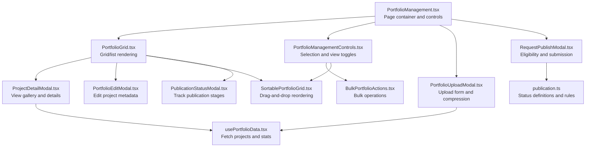
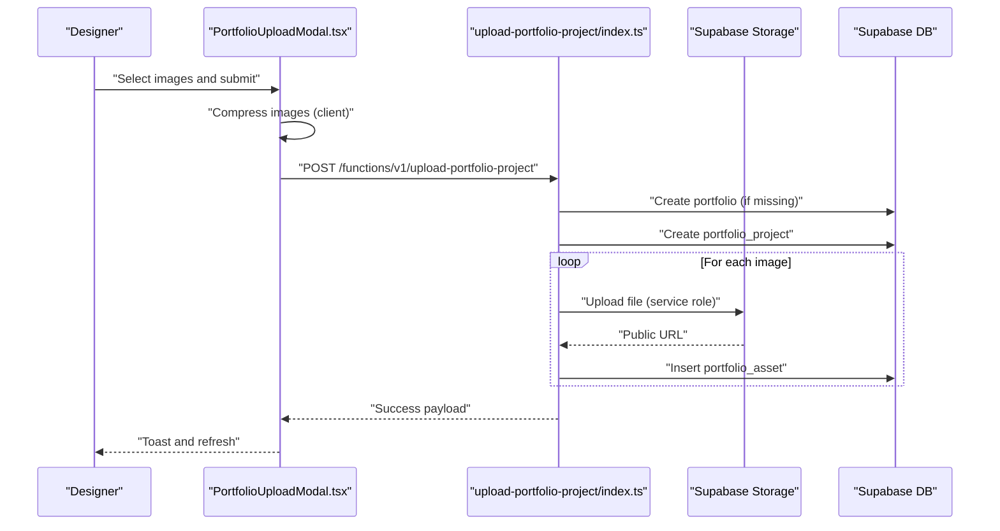
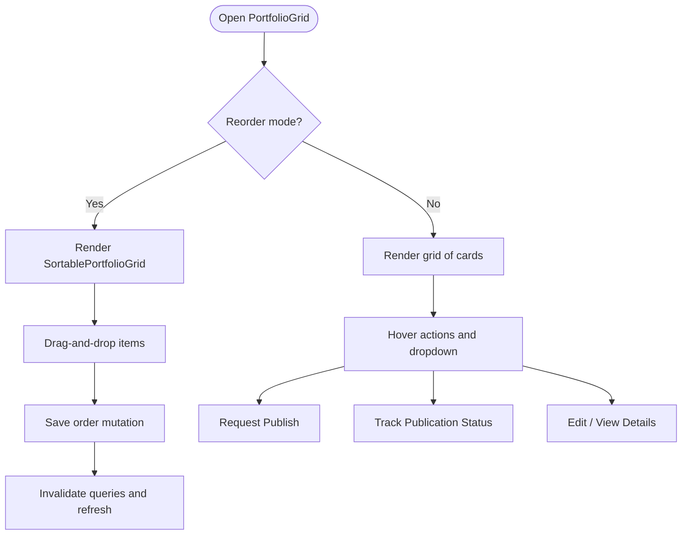
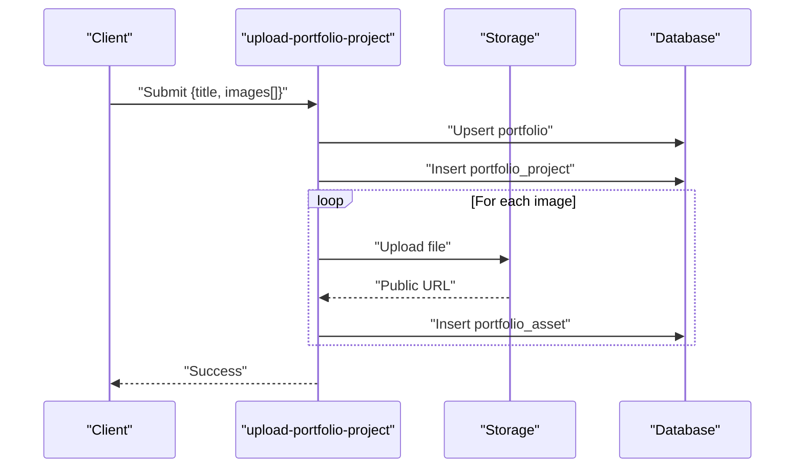
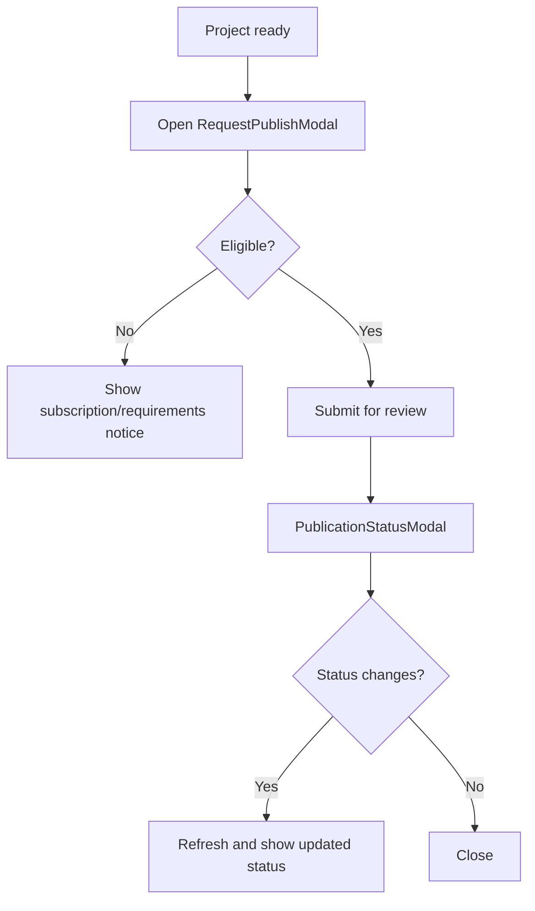
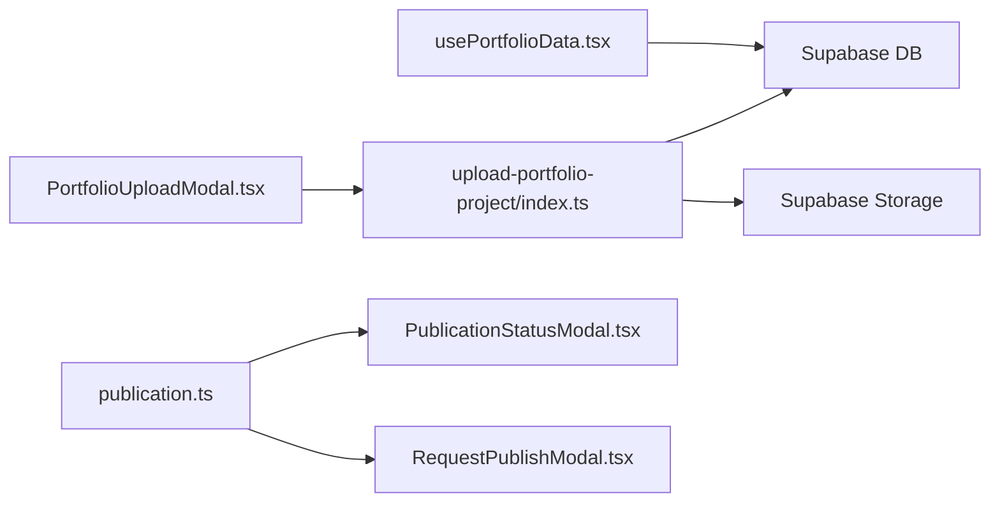

# Portfolio Management

<cite>
**Referenced Files in This Document**
- [PortfolioManagement.tsx](file://src/pages/PortfolioManagement.tsx)
- [PortfolioGrid.tsx](file://src/components/portfolio/PortfolioGrid.tsx)
- [SortablePortfolioGrid.tsx](file://src/components/portfolio/SortablePortfolioGrid.tsx)
- [PortfolioUploadModal.tsx](file://src/components/portfolio/PortfolioUploadModal.tsx)
- [PortfolioEditModal.tsx](file://src/components/portfolio/PortfolioEditModal.tsx)
- [ProjectDetailModal.tsx](file://src/components/portfolio/ProjectDetailModal.tsx)
- [BulkPortfolioActions.tsx](file://src/components/portfolio/BulkPortfolioActions.tsx)
- [PortfolioManagementControls.tsx](file://src/components/portfolio/PortfolioManagementControls.tsx)
- [RequestPublishModal.tsx](file://src/components/portfolio/RequestPublishModal.tsx)
- [PublicationStatusModal.tsx](file://src/components/portfolio/PublicationStatusModal.tsx)
- [usePortfolioData.tsx](file://src/hooks/usePortfolioData.tsx)
- [publication.ts](file://src/lib/publication.ts)
- [upload-portfolio-project/index.ts](file://supabase/functions/upload-portfolio-project/index.ts)
</cite>

## Table of Contents
1. [Introduction](#introduction)
2. [Project Structure](#project-structure)
3. [Core Components](#core-components)
4. [Architecture Overview](#architecture-overview)
5. [Detailed Component Analysis](#detailed-component-analysis)
6. [Dependency Analysis](#dependency-analysis)
7. [Performance Considerations](#performance-considerations)
8. [Troubleshooting Guide](#troubleshooting-guide)
9. [Conclusion](#conclusion)
10. [Appendices](#appendices)

## Introduction
This document explains the portfolio management system for designers, covering the grid layout, project upload, sorting, bulk actions, and the publication workflow. It also describes how projects are organized by category and visibility, and how the system integrates with Supabase storage for optimized image uploads. Practical examples illustrate uploading projects, editing metadata, and managing publication status.

## Project Structure
The portfolio management UI is centered around a page component that orchestrates the grid, modals, filters, and bulk actions. Data is fetched via a dedicated hook, while backend functions handle secure storage and project creation.

**Diagram sources**
- [PortfolioManagement.tsx](file://src/pages/PortfolioManagement.tsx#L35-L281)
- [PortfolioGrid.tsx](file://src/components/portfolio/PortfolioGrid.tsx#L76-L329)
- [SortablePortfolioGrid.tsx](file://src/components/portfolio/SortablePortfolioGrid.tsx#L23-L159)
- [PortfolioUploadModal.tsx](file://src/components/portfolio/PortfolioUploadModal.tsx#L56-L521)
- [PortfolioEditModal.tsx](file://src/components/portfolio/PortfolioEditModal.tsx#L51-L251)
- [ProjectDetailModal.tsx](file://src/components/portfolio/ProjectDetailModal.tsx#L47-L461)
- [BulkPortfolioActions.tsx](file://src/components/portfolio/BulkPortfolioActions.tsx#L29-L177)
- [PortfolioManagementControls.tsx](file://src/components/portfolio/PortfolioManagementControls.tsx#L39-L179)
- [RequestPublishModal.tsx](file://src/components/portfolio/RequestPublishModal.tsx#L79-L291)
- [PublicationStatusModal.tsx](file://src/components/portfolio/PublicationStatusModal.tsx#L99-L245)
- [usePortfolioData.tsx](file://src/hooks/usePortfolioData.tsx#L31-L117)
- [publication.ts](file://src/lib/publication.ts#L4-L282)

**Section sources**
- [PortfolioManagement.tsx](file://src/pages/PortfolioManagement.tsx#L35-L281)
- [usePortfolioData.tsx](file://src/hooks/usePortfolioData.tsx#L31-L117)

## Core Components
- PortfolioManagement page: Hosts quick stats, filters, tabbed views (All, From Styleboxes, Uploaded, Collections), and modals for upload and publication requests.
- PortfolioGrid: Renders project cards with status badges, source indicators, and action menus; supports reorder mode and publication status tracking.
- SortablePortfolioGrid: Implements drag-and-drop reordering with optimistic updates and rollback on failure.
- PortfolioUploadModal: Handles multi-image selection, client-side compression, progress tracking, and server upload via a secure function.
- PortfolioEditModal and ProjectDetailModal: Edit metadata and view gallery details.
- BulkPortfolioActions and PortfolioManagementControls: Selection, bulk operations, and view toggles.
- Publication workflow: Eligibility checks, submission modal, and status tracking modal.

**Section sources**
- [PortfolioGrid.tsx](file://src/components/portfolio/PortfolioGrid.tsx#L76-L329)
- [SortablePortfolioGrid.tsx](file://src/components/portfolio/SortablePortfolioGrid.tsx#L23-L159)
- [PortfolioUploadModal.tsx](file://src/components/portfolio/PortfolioUploadModal.tsx#L56-L521)
- [PortfolioEditModal.tsx](file://src/components/portfolio/PortfolioEditModal.tsx#L51-L251)
- [ProjectDetailModal.tsx](file://src/components/portfolio/ProjectDetailModal.tsx#L47-L461)
- [BulkPortfolioActions.tsx](file://src/components/portfolio/BulkPortfolioActions.tsx#L29-L177)
- [PortfolioManagementControls.tsx](file://src/components/portfolio/PortfolioManagementControls.tsx#L39-L179)
- [RequestPublishModal.tsx](file://src/components/portfolio/RequestPublishModal.tsx#L79-L291)
- [PublicationStatusModal.tsx](file://src/components/portfolio/PublicationStatusModal.tsx#L99-L245)

## Architecture Overview
The frontend communicates with Supabase for data and storage, and invokes a serverless function for secure uploads. The function decodes base64 images, uploads them to Supabase Storage, and persists records to the database.

**Diagram sources**
- [PortfolioUploadModal.tsx](file://src/components/portfolio/PortfolioUploadModal.tsx#L75-L151)
- [upload-portfolio-project/index.ts](file://supabase/functions/upload-portfolio-project/index.ts#L21-L299)

**Section sources**
- [PortfolioUploadModal.tsx](file://src/components/portfolio/PortfolioUploadModal.tsx#L75-L151)
- [upload-portfolio-project/index.ts](file://supabase/functions/upload-portfolio-project/index.ts#L21-L299)

## Detailed Component Analysis

### Portfolio Grid Layout and Sorting
- Grid/List rendering: Cards show thumbnail, title, category, status, source, image count, and featured indicator. Hover overlays expose quick actions and a dropdown menu for advanced actions.
- Reorder mode: When enabled, cards become draggable; on save, a mutation updates display_order for all items.
- Publication status tracking: When a project has an active publication status, a “Track” button appears to open the status modal.

**Diagram sources**
- [PortfolioGrid.tsx](file://src/components/portfolio/PortfolioGrid.tsx#L76-L329)
- [SortablePortfolioGrid.tsx](file://src/components/portfolio/SortablePortfolioGrid.tsx#L23-L159)

**Section sources**
- [PortfolioGrid.tsx](file://src/components/portfolio/PortfolioGrid.tsx#L76-L329)
- [SortablePortfolioGrid.tsx](file://src/components/portfolio/SortablePortfolioGrid.tsx#L23-L159)

### Project Upload Functionality
- Multi-image upload with drag-and-drop and file input.
- Client-side compression with progress feedback; images are converted to base64 for transport.
- Backend function validates authorization, creates portfolio/project, uploads to Supabase Storage (service role bypass), sets the first image as thumbnail, and records assets.
- Rollback on failure: deletes uploaded files and related records.

**Diagram sources**
- [PortfolioUploadModal.tsx](file://src/components/portfolio/PortfolioUploadModal.tsx#L75-L151)
- [upload-portfolio-project/index.ts](file://supabase/functions/upload-portfolio-project/index.ts#L108-L273)

**Section sources**
- [PortfolioUploadModal.tsx](file://src/components/portfolio/PortfolioUploadModal.tsx#L56-L521)
- [upload-portfolio-project/index.ts](file://supabase/functions/upload-portfolio-project/index.ts#L21-L299)

### Portfolio Editing Modal
- Edits title, description, category, tags, and thumbnail URL.
- Real-time preview of thumbnail and tag management with add/remove.
- Saves via mutation and refreshes queries.

**Section sources**
- [PortfolioEditModal.tsx](file://src/components/portfolio/PortfolioEditModal.tsx#L51-L251)

### Project Detail Modal
- Displays asset gallery with navigation and thumbnails.
- Toggles featured status and supports share/delete actions.
- Edit mode allows saving updated metadata.

**Section sources**
- [ProjectDetailModal.tsx](file://src/components/portfolio/ProjectDetailModal.tsx#L47-L461)

### Bulk Actions
- Supports feature/unfeature, archive, and delete across selected projects.
- Uses a single mutation per action with optimistic UX and error handling.

**Section sources**
- [BulkPortfolioActions.tsx](file://src/components/portfolio/BulkPortfolioActions.tsx#L29-L177)

### Portfolio Management Controls
- Selection controls: Select all, clear, and bulk actions dropdown.
- View toggles: Grid/list.
- Reorder toggle: Enters/exits drag-and-drop mode.
- Additional actions: Filter, export, duplicate, archive, batch edit, preview.

**Section sources**
- [PortfolioManagementControls.tsx](file://src/components/portfolio/PortfolioManagementControls.tsx#L39-L179)

### Publication Workflow
- Eligibility: Requires Pro or Elite tier and 100% completeness of required fields.
- Submission: Opens a modal with completeness checklist, revenue share preview, and notes field.
- Tracking: Shows current status, reviewer notes (when applicable), stage progress, and a journey timeline.

**Diagram sources**
- [RequestPublishModal.tsx](file://src/components/portfolio/RequestPublishModal.tsx#L79-L291)
- [PublicationStatusModal.tsx](file://src/components/portfolio/PublicationStatusModal.tsx#L99-L245)
- [publication.ts](file://src/lib/publication.ts#L4-L282)

**Section sources**
- [RequestPublishModal.tsx](file://src/components/portfolio/RequestPublishModal.tsx#L79-L291)
- [PublicationStatusModal.tsx](file://src/components/portfolio/PublicationStatusModal.tsx#L99-L245)
- [publication.ts](file://src/lib/publication.ts#L4-L282)

## Dependency Analysis
- Frontend data: usePortfolioData fetches projects and computes stats, including published/pipeline counts and collection counts derived from unique categories.
- Backend storage: Supabase Storage bucket receives uploaded files; function uses service role to bypass row-level security for uploads.
- Publication library: Centralized status definitions, transitions, and eligibility rules.

**Diagram sources**
- [usePortfolioData.tsx](file://src/hooks/usePortfolioData.tsx#L31-L117)
- [PortfolioUploadModal.tsx](file://src/components/portfolio/PortfolioUploadModal.tsx#L75-L151)
- [upload-portfolio-project/index.ts](file://supabase/functions/upload-portfolio-project/index.ts#L21-L299)
- [publication.ts](file://src/lib/publication.ts#L4-L282)

**Section sources**
- [usePortfolioData.tsx](file://src/hooks/usePortfolioData.tsx#L31-L117)
- [upload-portfolio-project/index.ts](file://supabase/functions/upload-portfolio-project/index.ts#L21-L299)
- [publication.ts](file://src/lib/publication.ts#L4-L282)

## Performance Considerations
- Client-side compression reduces upload sizes and improves throughput; progress feedback enhances UX.
- Optimistic updates in reordering and bulk actions improve responsiveness; rollbacks occur on failures.
- Queries are invalidated after mutations to keep the UI synchronized without excessive polling.

## Troubleshooting Guide
- Upload fails: Verify authentication, file types, and sizes; check compression progress and server response.
- Reorder not saved: Confirm mutation succeeded; errors revert to original order and show a toast.
- Publication not eligible: Ensure Pro/Elite tier and required fields completeness.
- Status not updating: Refresh the page or reopen the status modal; ensure queries are invalidated.

**Section sources**
- [PortfolioUploadModal.tsx](file://src/components/portfolio/PortfolioUploadModal.tsx#L146-L151)
- [SortablePortfolioGrid.tsx](file://src/components/portfolio/SortablePortfolioGrid.tsx#L52-L57)
- [RequestPublishModal.tsx](file://src/components/portfolio/RequestPublishModal.tsx#L95-L110)

## Conclusion
The portfolio management system provides a comprehensive toolkit for designers to organize, edit, and publish their projects. The grid-based UI, robust upload pipeline with compression, and structured publication workflow integrate seamlessly with Supabase for data and storage. Bulk actions and sorting streamline management, while modals offer focused editing and status tracking.

## Appendices

### Practical Examples
- Uploading a project:
  - Open the upload modal, select images, optionally add tags and description, then submit. The function creates a project and assets, sets the first image as thumbnail, and returns success.
- Organizing portfolios:
  - Use the reorder mode to drag-and-drop projects; save the order to persist display_order.
- Editing metadata:
  - Open the edit modal to change title, description, category, tags, and thumbnail URL; save to update the project.
- Managing publication status:
  - Use the request publish modal to submit for review; track progress in the status modal; address revision notes if requested.

**Section sources**
- [PortfolioUploadModal.tsx](file://src/components/portfolio/PortfolioUploadModal.tsx#L75-L151)
- [SortablePortfolioGrid.tsx](file://src/components/portfolio/SortablePortfolioGrid.tsx#L28-L57)
- [PortfolioEditModal.tsx](file://src/components/portfolio/PortfolioEditModal.tsx#L76-L104)
- [RequestPublishModal.tsx](file://src/components/portfolio/RequestPublishModal.tsx#L95-L110)
- [PublicationStatusModal.tsx](file://src/components/portfolio/PublicationStatusModal.tsx#L104-L106)