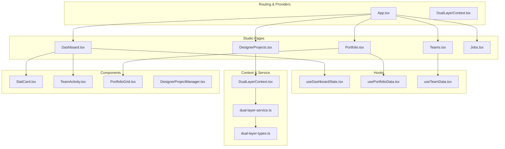
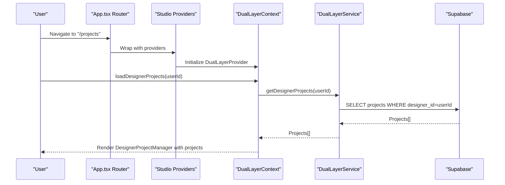
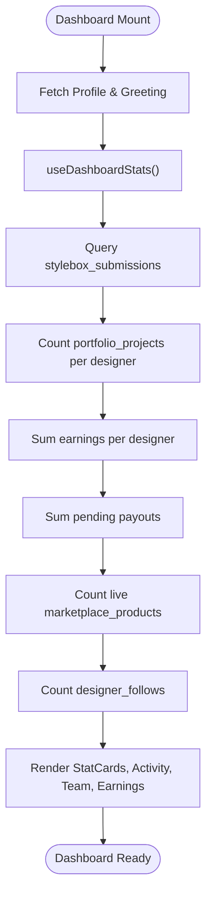
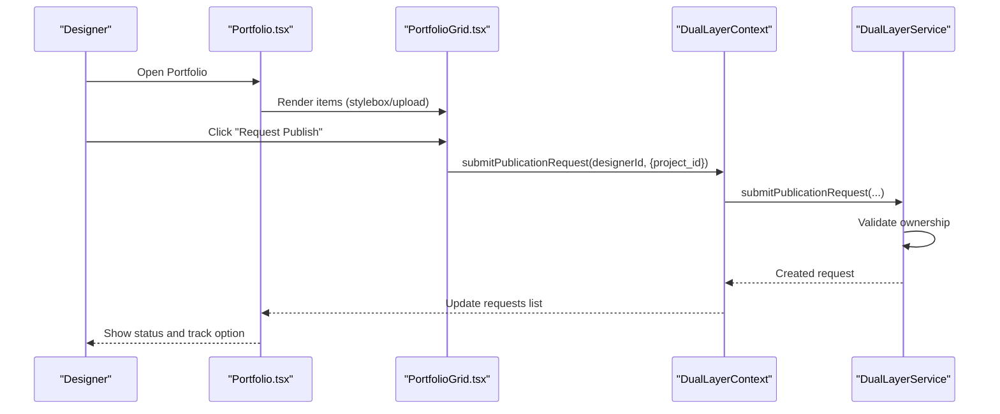
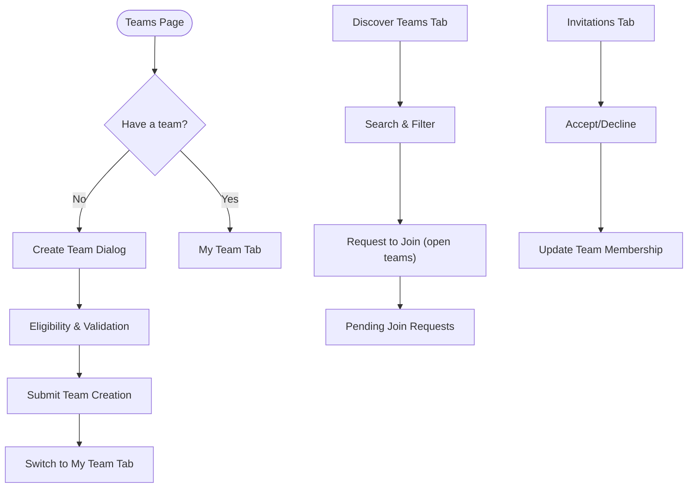
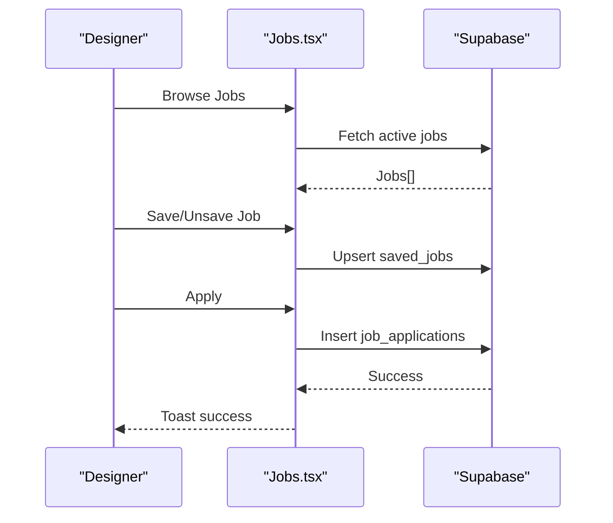
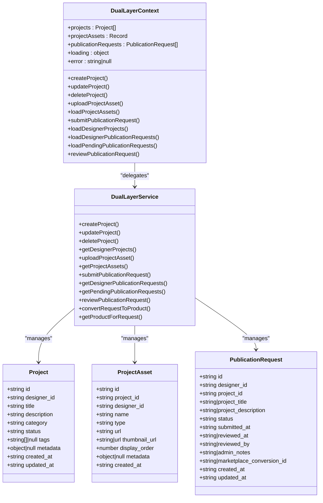
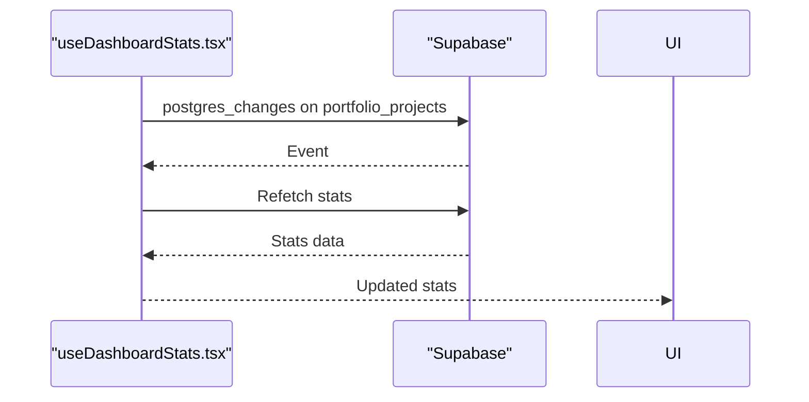
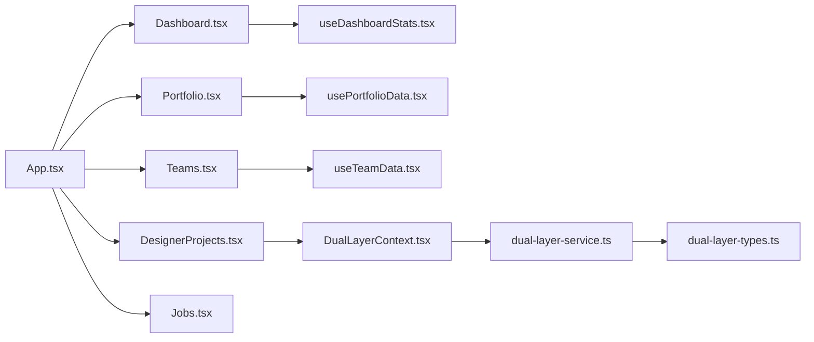

# Studio Workspace

<cite>
**Referenced Files in This Document**
- [App.tsx](file://src/App.tsx)
- [Dashboard.tsx](file://src/pages/Dashboard.tsx)
- [Portfolio.tsx](file://src/pages/Portfolio.tsx)
- [DesignerProjects.tsx](file://src/pages/DesignerProjects.tsx)
- [Teams.tsx](file://src/pages/Teams.tsx)
- [Jobs.tsx](file://src/pages/Jobs.tsx)
- [DualLayerContext.tsx](file://src/contexts/DualLayerContext.tsx)
- [dual-layer-service.ts](file://src/lib/dual-layer-service.ts)
- [dual-layer-types.ts](file://src/lib/dual-layer-types.ts)
- [useDashboardStats.tsx](file://src/hooks/useDashboardStats.tsx)
- [usePortfolioData.tsx](file://src/hooks/usePortfolioData.tsx)
- [useTeamData.tsx](file://src/hooks/useTeamData.tsx)
- [DesignerProjectManager.tsx](file://src/components/projects/DesignerProjectManager.tsx)
- [PortfolioGrid.tsx](file://src/components/portfolio/PortfolioGrid.tsx)
- [StatCard.tsx](file://src/components/dashboard/StatCard.tsx)
- [TeamActivity.tsx](file://src/components/dashboard/TeamActivity.tsx)
</cite>

## Table of Contents
1. [Introduction](#introduction)
2. [Project Structure](#project-structure)
3. [Core Components](#core-components)
4. [Architecture Overview](#architecture-overview)
5. [Detailed Component Analysis](#detailed-component-analysis)
6. [Dependency Analysis](#dependency-analysis)
7. [Performance Considerations](#performance-considerations)
8. [Troubleshooting Guide](#troubleshooting-guide)
9. [Conclusion](#conclusion)

## Introduction
This document explains the designer studio workspace functionality: the dashboard and analytics system, portfolio management for showcasing design work, team collaboration features for multi-user projects, and the job opportunities platform. It also documents the dual-layer context system that orchestrates designer projects, the real-time analytics capabilities, and the integration between studio tools and marketplace functionality. Practical examples illustrate how to create designs, manage portfolios, and collaborate in teams, along with dashboard analytics usage.

## Project Structure
The studio workspace spans routing, providers, pages, hooks, contexts, and components:
- Routing and Providers: App-level routing wraps studio pages with authentication, subscription, theme, and dual-layer providers.
- Pages: Dashboard, Portfolio, Designer Projects, Teams, Jobs, and Analytics.
- Hooks: Real-time statistics, portfolio data, team data.
- Context: DualLayerContext manages projects, assets, and publication requests.
- Services: DualLayerService encapsulates Supabase operations for projects and publication requests.
- Components: Dashboard widgets, portfolio grids, team discovery, and job listings.

**Diagram sources**
- [App.tsx](file://src/App.tsx#L155-L420)
- [Dashboard.tsx](file://src/pages/Dashboard.tsx#L29-L440)
- [Portfolio.tsx](file://src/pages/Portfolio.tsx#L36-L322)
- [DesignerProjects.tsx](file://src/pages/DesignerProjects.tsx#L6-L46)
- [Teams.tsx](file://src/pages/Teams.tsx#L41-L633)
- [Jobs.tsx](file://src/pages/Jobs.tsx#L26-L228)
- [DualLayerContext.tsx](file://src/contexts/DualLayerContext.tsx#L135-L303)
- [dual-layer-service.ts](file://src/lib/dual-layer-service.ts#L4-L340)
- [dual-layer-types.ts](file://src/lib/dual-layer-types.ts#L1-L44)
- [useDashboardStats.tsx](file://src/hooks/useDashboardStats.tsx#L16-L147)
- [usePortfolioData.tsx](file://src/hooks/usePortfolioData.tsx#L31-L117)
- [useTeamData.tsx](file://src/hooks/useTeamData.tsx#L24-L129)
- [StatCard.tsx](file://src/components/dashboard/StatCard.tsx#L17-L73)
- [TeamActivity.tsx](file://src/components/dashboard/TeamActivity.tsx#L20-L97)
- [PortfolioGrid.tsx](file://src/components/portfolio/PortfolioGrid.tsx#L76-L330)
- [DesignerProjectManager.tsx](file://src/components/projects/DesignerProjectManager.tsx#L9-L364)

**Section sources**
- [App.tsx](file://src/App.tsx#L155-L420)

## Core Components
- Dashboard: Presents statistics, active styleboxes, recent activity, rank progress, team activity, and earnings snapshot.
- Portfolio: Manages design projects, supports upload, categorization, collections, and publication requests.
- Designer Projects: Centralizes project lifecycle and publication requests via the dual-layer context.
- Teams: Enables team creation, discovery, invitations, join requests, and team challenges.
- Jobs: Provides job browsing, filtering, saving, and application submission.
- Dual-Layer Context: State and service orchestration for projects, assets, and publication requests.
- Hooks: Real-time dashboard stats, portfolio metrics, and team data.

**Section sources**
- [Dashboard.tsx](file://src/pages/Dashboard.tsx#L29-L440)
- [Portfolio.tsx](file://src/pages/Portfolio.tsx#L36-L322)
- [DesignerProjects.tsx](file://src/pages/DesignerProjects.tsx#L6-L46)
- [Teams.tsx](file://src/pages/Teams.tsx#L41-L633)
- [Jobs.tsx](file://src/pages/Jobs.tsx#L26-L228)
- [DualLayerContext.tsx](file://src/contexts/DualLayerContext.tsx#L135-L303)
- [useDashboardStats.tsx](file://src/hooks/useDashboardStats.tsx#L16-L147)
- [usePortfolioData.tsx](file://src/hooks/usePortfolioData.tsx#L31-L117)
- [useTeamData.tsx](file://src/hooks/useTeamData.tsx#L24-L129)

## Architecture Overview
The studio workspace follows a layered architecture:
- Routing and Providers: App.tsx configures routes and composes providers for auth, subscription, theme, and dual-layer context.
- Pages: Each page composes reusable components and hooks.
- Context and Service: DualLayerContext exposes CRUD operations and state updates; DualLayerService performs Supabase queries and transformations.
- Real-time Analytics: Dashboard statistics subscribe to portfolio changes for near real-time updates.

**Diagram sources**
- [App.tsx](file://src/App.tsx#L223-L300)
- [DesignerProjects.tsx](file://src/pages/DesignerProjects.tsx#L6-L46)
- [DualLayerContext.tsx](file://src/contexts/DualLayerContext.tsx#L135-L303)
- [dual-layer-service.ts](file://src/lib/dual-layer-service.ts#L85-L99)

## Detailed Component Analysis

### Dashboard and Analytics System
The dashboard aggregates key metrics and presents them in an accessible layout:
- Statistics cards: Active styleboxes, completed this year, portfolio items, love count, earnings snapshot.
- Active styleboxes: Grid of stylebox cards with progress and status.
- Recent activity: List of recent stylebox submissions with status badges.
- Team activity: Team overview, current project, and member avatars.
- Earnings snapshot: Monthly and total earnings, pending payouts, products sold.

**Diagram sources**
- [Dashboard.tsx](file://src/pages/Dashboard.tsx#L58-L94)
- [useDashboardStats.tsx](file://src/hooks/useDashboardStats.tsx#L30-L143)

Practical example: Viewing monthly earnings and portfolio items
- Navigate to the dashboard.
- Observe the “Earnings” and “Portfolio Items” cards.
- Toggle tabs to see recent activity and team highlights.

**Section sources**
- [Dashboard.tsx](file://src/pages/Dashboard.tsx#L29-L440)
- [StatCard.tsx](file://src/components/dashboard/StatCard.tsx#L17-L73)
- [TeamActivity.tsx](file://src/components/dashboard/TeamActivity.tsx#L20-L97)
- [useDashboardStats.tsx](file://src/hooks/useDashboardStats.tsx#L16-L147)

### Portfolio Management
Portfolio management enables designers to:
- Upload projects and organize them by category and status.
- Create collections from categories.
- Request publication to marketplace.
- Track publication status and manage featured items.

**Diagram sources**
- [Portfolio.tsx](file://src/pages/Portfolio.tsx#L36-L322)
- [PortfolioGrid.tsx](file://src/components/portfolio/PortfolioGrid.tsx#L76-L330)
- [DualLayerContext.tsx](file://src/contexts/DualLayerContext.tsx#L229-L241)
- [dual-layer-service.ts](file://src/lib/dual-layer-service.ts#L147-L181)

Practical example: Creating a portfolio collection
- Go to the “Collections” tab in Portfolio.
- Add projects to a category; the system counts unique categories as collections.
- Use the “Create Collection” card to define a new grouping.

**Section sources**
- [Portfolio.tsx](file://src/pages/Portfolio.tsx#L36-L322)
- [PortfolioGrid.tsx](file://src/components/portfolio/PortfolioGrid.tsx#L76-L330)
- [usePortfolioData.tsx](file://src/hooks/usePortfolioData.tsx#L31-L117)

### Team Collaboration Features
Teams allows designers to:
- Create teams with category, max members, and open/closed settings.
- Discover and request to join public teams.
- Manage invitations and join requests (team leads).
- Participate in team challenges with specialized roles.

**Diagram sources**
- [Teams.tsx](file://src/pages/Teams.tsx#L41-L633)

Practical example: Starting a team challenge
- Go to “Team Challenges” tab.
- Review the Sovereign Atelier challenge details and eligibility.
- Start the challenge and assign roles to team members.

**Section sources**
- [Teams.tsx](file://src/pages/Teams.tsx#L41-L633)
- [useTeamData.tsx](file://src/hooks/useTeamData.tsx#L24-L129)

### Job Opportunities Platform
The Jobs page provides:
- Browse jobs with filters (category, job type, location, salary).
- Save jobs and track applications.
- Apply with cover letter and portfolio URL.

**Diagram sources**
- [Jobs.tsx](file://src/pages/Jobs.tsx#L26-L228)

Practical example: Applying to a job
- Filter jobs by category and location.
- Save interesting positions.
- Submit an application with a cover letter and portfolio link.

**Section sources**
- [Jobs.tsx](file://src/pages/Jobs.tsx#L26-L228)

### Dual-Layer Context System
The dual-layer context manages:
- Projects: Create, update, delete, list.
- Assets: Upload and list per project.
- Publication Requests: Submit, list, review, and convert to marketplace products.

**Diagram sources**
- [DualLayerContext.tsx](file://src/contexts/DualLayerContext.tsx#L120-L295)
- [dual-layer-service.ts](file://src/lib/dual-layer-service.ts#L4-L340)
- [dual-layer-types.ts](file://src/lib/dual-layer-types.ts#L3-L44)

Practical example: Managing a project lifecycle
- Create a project via Designer Projects page.
- Upload assets to the project.
- Submit a publication request.
- Monitor status and, upon approval, convert to a marketplace product.

**Section sources**
- [DesignerProjects.tsx](file://src/pages/DesignerProjects.tsx#L6-L46)
- [DesignerProjectManager.tsx](file://src/components/projects/DesignerProjectManager.tsx#L9-L364)
- [DualLayerContext.tsx](file://src/contexts/DualLayerContext.tsx#L135-L303)
- [dual-layer-service.ts](file://src/lib/dual-layer-service.ts#L4-L340)

### Real-Time Collaboration and Analytics
- Dashboard statistics subscribe to portfolio changes to keep counts current.
- Team activity displays current project and member avatars.
- Portfolio grid supports reordering and quick actions for efficient management.

**Diagram sources**
- [useDashboardStats.tsx](file://src/hooks/useDashboardStats.tsx#L129-L143)

**Section sources**
- [useDashboardStats.tsx](file://src/hooks/useDashboardStats.tsx#L16-L147)
- [useTeamData.tsx](file://src/hooks/useTeamData.tsx#L24-L129)
- [PortfolioGrid.tsx](file://src/components/portfolio/PortfolioGrid.tsx#L76-L330)

## Dependency Analysis
- Routing depends on providers for authentication, subscription, theme, and dual-layer context.
- Pages depend on hooks for data fetching and components for UI.
- DualLayerContext depends on DualLayerService for backend operations.
- DualLayerService depends on Supabase for database operations.

**Diagram sources**
- [App.tsx](file://src/App.tsx#L223-L300)
- [Dashboard.tsx](file://src/pages/Dashboard.tsx#L29-L440)
- [Portfolio.tsx](file://src/pages/Portfolio.tsx#L36-L322)
- [DesignerProjects.tsx](file://src/pages/DesignerProjects.tsx#L6-L46)
- [Teams.tsx](file://src/pages/Teams.tsx#L41-L633)
- [Jobs.tsx](file://src/pages/Jobs.tsx#L26-L228)
- [DualLayerContext.tsx](file://src/contexts/DualLayerContext.tsx#L135-L303)
- [dual-layer-service.ts](file://src/lib/dual-layer-service.ts#L4-L340)
- [dual-layer-types.ts](file://src/lib/dual-layer-types.ts#L1-L44)
- [useDashboardStats.tsx](file://src/hooks/useDashboardStats.tsx#L16-L147)
- [usePortfolioData.tsx](file://src/hooks/usePortfolioData.tsx#L31-L117)
- [useTeamData.tsx](file://src/hooks/useTeamData.tsx#L24-L129)

**Section sources**
- [App.tsx](file://src/App.tsx#L223-L300)

## Performance Considerations
- Minimize redundant queries: Use query keys and invalidate strategies to avoid repeated network calls.
- Pagination and filtering: Apply filters early to reduce payload sizes.
- Real-time subscriptions: Limit channels and events to essential tables to reduce overhead.
- Component memoization: Use useMemo and memoized components for large lists (e.g., portfolio grids).

## Troubleshooting Guide
Common issues and resolutions:
- Unauthorized access to projects/assets: Ensure ownership checks pass before mutating data.
- Loading states: Use skeleton loaders and loading flags to prevent UI flicker.
- Real-time updates: Verify Supabase channel subscriptions are established and cleaned up on unmount.
- Portfolio counts: Confirm portfolio_projects triggers are firing and stats are recalculated.

**Section sources**
- [dual-layer-service.ts](file://src/lib/dual-layer-service.ts#L25-L83)
- [useDashboardStats.tsx](file://src/hooks/useDashboardStats.tsx#L129-L143)

## Conclusion
The studio workspace integrates a robust dashboard, portfolio management, team collaboration, and job opportunities with a dual-layer context that connects designer projects to marketplace publishing. Real-time analytics and structured components streamline workflows from design creation to portfolio presentation and team collaboration.