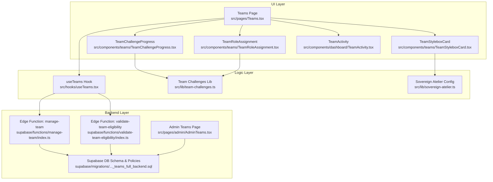
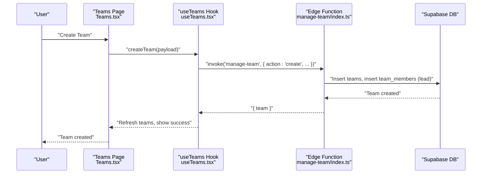
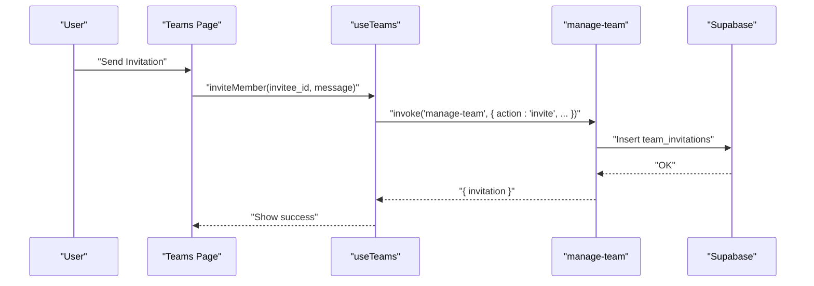
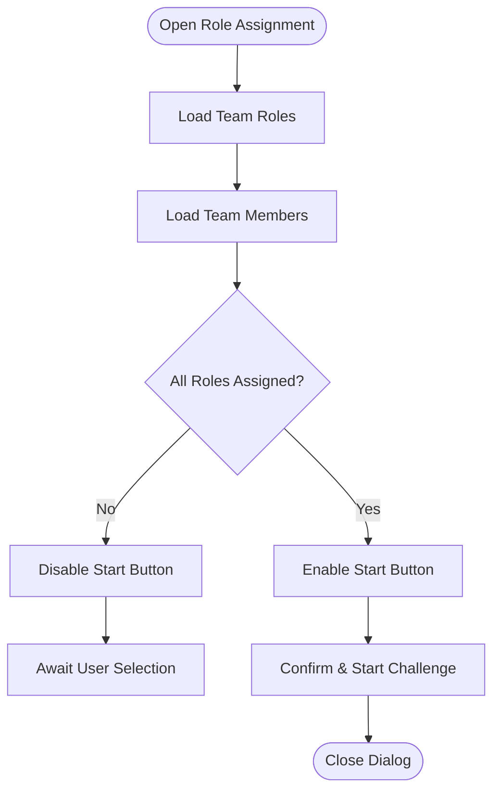
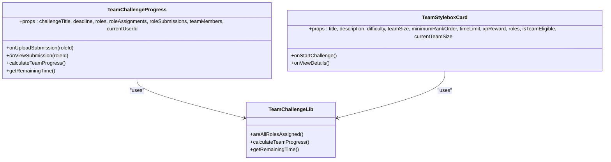
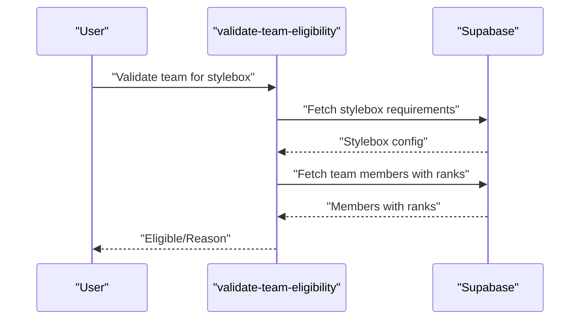
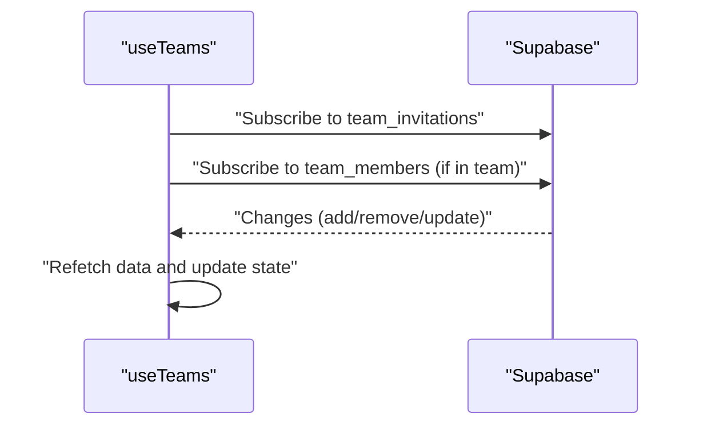
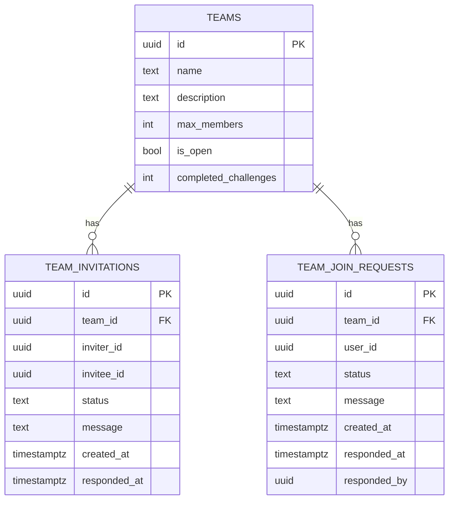
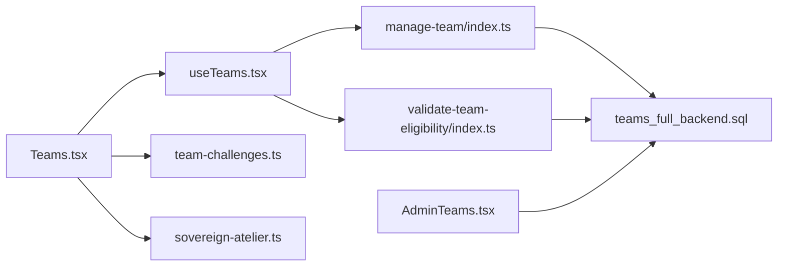

# Team Collaboration

<cite>
**Referenced Files in This Document**
- [src/pages/Teams.tsx](file://src/pages/Teams.tsx)
- [src/components/teams/TeamStyleboxCard.tsx](file://src/components/teams/TeamStyleboxCard.tsx)
- [src/components/teams/TeamChallengeProgress.tsx](file://src/components/teams/TeamChallengeProgress.tsx)
- [src/components/teams/TeamRoleAssignment.tsx](file://src/components/teams/TeamRoleAssignment.tsx)
- [src/components/dashboard/TeamActivity.tsx](file://src/components/dashboard/TeamActivity.tsx)
- [src/hooks/useTeams.tsx](file://src/hooks/useTeams.tsx)
- [src/lib/team-challenges.ts](file://src/lib/team-challenges.ts)
- [src/lib/sovereign-atelier.ts](file://src/lib/sovereign-atelier.ts)
- [supabase/functions/manage-team/index.ts](file://supabase/functions/manage-team/index.ts)
- [supabase/functions/validate-team-eligibility/index.ts](file://supabase/functions/validate-team-eligibility/index.ts)
- [supabase/migrations/20260127020000_teams_full_backend.sql](file://supabase/migrations/20260127020000_teams_full_backend.sql)
- [src/pages/admin/AdminTeams.tsx](file://src/pages/admin/AdminTeams.tsx)
- [src/integrations/supabase/types.ts](file://src/integrations/supabase/types.ts)
</cite>

## Table of Contents
1. [Introduction](#introduction)
2. [Project Structure](#project-structure)
3. [Core Components](#core-components)
4. [Architecture Overview](#architecture-overview)
5. [Detailed Component Analysis](#detailed-component-analysis)
6. [Dependency Analysis](#dependency-analysis)
7. [Performance Considerations](#performance-considerations)
8. [Troubleshooting Guide](#troubleshooting-guide)
9. [Conclusion](#conclusion)
10. [Appendices](#appendices)

## Introduction
This document explains the team collaboration system in the application, focusing on team creation and invitations, member role assignments, collaborative project management, and team-based competitions. It also covers team challenge progress tracking, team stylebox cards, real-time collaboration features, integration between individual stylebox progress and team objectives, shared resource management, and role-based access control. Practical examples illustrate team setup, member onboarding, collaborative stylebox creation, and progress monitoring, along with team permissions and activity feeds.

## Project Structure
The team collaboration system spans UI components, hooks, libraries, Supabase edge functions, and database migrations:
- Pages and UI: Team landing page, team cards, challenge progress, role assignment dialogs, and team activity feed.
- Hooks: Centralized team state and API interactions.
- Libraries: Team challenge types, helpers, and predefined challenges.
- Edge Functions: Team lifecycle operations and eligibility validation.
- Database: Tables, policies, and triggers supporting teams, invitations, join requests, and submissions.
- Admin: Team and submission management for moderation.

**Diagram sources**
- [src/pages/Teams.tsx](file://src/pages/Teams.tsx#L1-L633)
- [src/components/teams/TeamStyleboxCard.tsx](file://src/components/teams/TeamStyleboxCard.tsx#L1-L159)
- [src/components/teams/TeamChallengeProgress.tsx](file://src/components/teams/TeamChallengeProgress.tsx#L1-L215)
- [src/components/teams/TeamRoleAssignment.tsx](file://src/components/teams/TeamRoleAssignment.tsx#L1-L201)
- [src/components/dashboard/TeamActivity.tsx](file://src/components/dashboard/TeamActivity.tsx#L1-L97)
- [src/hooks/useTeams.tsx](file://src/hooks/useTeams.tsx#L1-L579)
- [src/lib/team-challenges.ts](file://src/lib/team-challenges.ts#L1-L133)
- [src/lib/sovereign-atelier.ts](file://src/lib/sovereign-atelier.ts#L1-L177)
- [supabase/functions/manage-team/index.ts](file://supabase/functions/manage-team/index.ts#L1-L549)
- [supabase/functions/validate-team-eligibility/index.ts](file://supabase/functions/validate-team-eligibility/index.ts#L1-L145)
- [supabase/migrations/20260127020000_teams_full_backend.sql](file://supabase/migrations/20260127020000_teams_full_backend.sql#L1-L213)
- [src/pages/admin/AdminTeams.tsx](file://src/pages/admin/AdminTeams.tsx#L1-L369)

**Section sources**
- [src/pages/Teams.tsx](file://src/pages/Teams.tsx#L1-L633)
- [src/hooks/useTeams.tsx](file://src/hooks/useTeams.tsx#L1-L579)
- [src/lib/team-challenges.ts](file://src/lib/team-challenges.ts#L1-L133)
- [src/lib/sovereign-atelier.ts](file://src/lib/sovereign-atelier.ts#L1-L177)
- [supabase/functions/manage-team/index.ts](file://supabase/functions/manage-team/index.ts#L1-L549)
- [supabase/functions/validate-team-eligibility/index.ts](file://supabase/functions/validate-team-eligibility/index.ts#L1-L145)
- [supabase/migrations/20260127020000_teams_full_backend.sql](file://supabase/migrations/20260127020000_teams_full_backend.sql#L1-L213)
- [src/pages/admin/AdminTeams.tsx](file://src/pages/admin/AdminTeams.tsx#L1-L369)

## Core Components
- Team Management UI: Team landing page with tabs for My Team, Challenges, Discover Teams, and Invitations.
- Team Cards: Display challenge details, eligibility, and actions to start or view details.
- Challenge Progress: Visual progress per role, deadlines, and submission states.
- Role Assignment: Modal to assign each team member to a role with availability checks.
- Team Activity Feed: Highlights active team, current project, and members.
- Team Hook: Centralized logic for team CRUD, invitations, join requests, and real-time updates.
- Team Challenge Library: Types, helpers, and constants for roles, progress calculation, and deadlines.
- Sovereign Atelier Challenge: Predefined team challenge with roles, deliverables, and evaluation criteria.
- Edge Functions: Team lifecycle operations and eligibility validation.
- Database Schema: Tables, RLS policies, and triggers for teams, invitations, join requests, and submissions.

**Section sources**
- [src/pages/Teams.tsx](file://src/pages/Teams.tsx#L1-L633)
- [src/components/teams/TeamStyleboxCard.tsx](file://src/components/teams/TeamStyleboxCard.tsx#L1-L159)
- [src/components/teams/TeamChallengeProgress.tsx](file://src/components/teams/TeamChallengeProgress.tsx#L1-L215)
- [src/components/teams/TeamRoleAssignment.tsx](file://src/components/teams/TeamRoleAssignment.tsx#L1-L201)
- [src/components/dashboard/TeamActivity.tsx](file://src/components/dashboard/TeamActivity.tsx#L1-L97)
- [src/hooks/useTeams.tsx](file://src/hooks/useTeams.tsx#L1-L579)
- [src/lib/team-challenges.ts](file://src/lib/team-challenges.ts#L1-L133)
- [src/lib/sovereign-atelier.ts](file://src/lib/sovereign-atelier.ts#L1-L177)
- [supabase/functions/manage-team/index.ts](file://supabase/functions/manage-team/index.ts#L1-L549)
- [supabase/functions/validate-team-eligibility/index.ts](file://supabase/functions/validate-team-eligibility/index.ts#L1-L145)
- [supabase/migrations/20260127020000_teams_full_backend.sql](file://supabase/migrations/20260127020000_teams_full_backend.sql#L1-L213)

## Architecture Overview
The system integrates React UI with Supabase for data and serverless functions for team operations and validations. The useTeams hook orchestrates team state and real-time subscriptions. Edge functions encapsulate team business logic and enforce authorization and RLS policies.

**Diagram sources**
- [src/pages/Teams.tsx](file://src/pages/Teams.tsx#L67-L86)
- [src/hooks/useTeams.tsx](file://src/hooks/useTeams.tsx#L306-L351)
- [supabase/functions/manage-team/index.ts](file://supabase/functions/manage-team/index.ts#L84-L202)
- [supabase/migrations/20260127020000_teams_full_backend.sql](file://supabase/migrations/20260127020000_teams_full_backend.sql#L11-L22)

**Section sources**
- [src/pages/Teams.tsx](file://src/pages/Teams.tsx#L1-L633)
- [src/hooks/useTeams.tsx](file://src/hooks/useTeams.tsx#L1-L579)
- [supabase/functions/manage-team/index.ts](file://supabase/functions/manage-team/index.ts#L1-L549)
- [supabase/migrations/20260127020000_teams_full_backend.sql](file://supabase/migrations/20260127020000_teams_full_backend.sql#L1-L213)

## Detailed Component Analysis

### Team Creation and Invitation Workflows
- Team Creation:
  - UI collects name, description, category, max members, and openness.
  - useTeams invokes the manage-team function with action "create".
  - Function validates rank requirements, checks existing membership, inserts team and adds creator as lead, and sends notifications.
- Invitation:
  - Only team leads can send invitations; function checks role and prevents inviting users already in teams.
  - Invitation records are stored with status and timestamps; notifications are sent to invitee.
- Join Requests:
  - Users request to join open teams; function checks eligibility using a stored procedure.
  - Team leads receive notifications and can approve or reject requests.

**Diagram sources**
- [src/pages/Teams.tsx](file://src/pages/Teams.tsx#L562-L625)
- [src/hooks/useTeams.tsx](file://src/hooks/useTeams.tsx#L353-L377)
- [supabase/functions/manage-team/index.ts](file://supabase/functions/manage-team/index.ts#L204-L274)

**Section sources**
- [src/pages/Teams.tsx](file://src/pages/Teams.tsx#L1-L633)
- [src/hooks/useTeams.tsx](file://src/hooks/useTeams.tsx#L306-L406)
- [supabase/functions/manage-team/index.ts](file://supabase/functions/manage-team/index.ts#L84-L482)
- [supabase/migrations/20260127020000_teams_full_backend.sql](file://supabase/migrations/20260127020000_teams_full_backend.sql#L11-L37)

### Member Role Assignments
- The TeamRoleAssignment modal allows assigning each role to a single team member.
- Availability is enforced so one member cannot hold multiple roles.
- Confirmation starts the challenge when all roles are assigned.

**Diagram sources**
- [src/components/teams/TeamRoleAssignment.tsx](file://src/components/teams/TeamRoleAssignment.tsx#L43-L201)
- [src/lib/team-challenges.ts](file://src/lib/team-challenges.ts#L48-L53)

**Section sources**
- [src/components/teams/TeamRoleAssignment.tsx](file://src/components/teams/TeamRoleAssignment.tsx#L1-L201)
- [src/lib/team-challenges.ts](file://src/lib/team-challenges.ts#L1-L133)

### Collaborative Project Management and Progress Tracking
- TeamStyleboxCard displays challenge metadata, eligibility, and team formation progress.
- TeamChallengeProgress shows per-role status, submission actions, and overall progress.
- Remaining time and deadline handling are centralized in the team-challenges library.

**Diagram sources**
- [src/components/teams/TeamChallengeProgress.tsx](file://src/components/teams/TeamChallengeProgress.tsx#L35-L61)
- [src/components/teams/TeamStyleboxCard.tsx](file://src/components/teams/TeamStyleboxCard.tsx#L17-L45)
- [src/lib/team-challenges.ts](file://src/lib/team-challenges.ts#L66-L113)

**Section sources**
- [src/components/teams/TeamChallengeProgress.tsx](file://src/components/teams/TeamChallengeProgress.tsx#L1-L215)
- [src/components/teams/TeamStyleboxCard.tsx](file://src/components/teams/TeamStyleboxCard.tsx#L1-L159)
- [src/lib/team-challenges.ts](file://src/lib/team-challenges.ts#L1-L133)

### Team-Based Competitions and Shared Resources
- Sovereign Atelier defines a team challenge with four specialized roles, deliverables, evaluation criteria, and constraints.
- Eligibility validation ensures all members meet the minimum rank and team size requirements before starting a challenge.
- AdminTeams page manages submissions and reviews team entries.

**Diagram sources**
- [src/lib/sovereign-atelier.ts](file://src/lib/sovereign-atelier.ts#L132-L177)
- [supabase/functions/validate-team-eligibility/index.ts](file://supabase/functions/validate-team-eligibility/index.ts#L26-L134)
- [src/pages/admin/AdminTeams.tsx](file://src/pages/admin/AdminTeams.tsx#L80-L121)

**Section sources**
- [src/lib/sovereign-atelier.ts](file://src/lib/sovereign-atelier.ts#L1-L177)
- [supabase/functions/validate-team-eligibility/index.ts](file://supabase/functions/validate-team-eligibility/index.ts#L1-L145)
- [src/pages/admin/AdminTeams.tsx](file://src/pages/admin/AdminTeams.tsx#L1-L369)

### Real-Time Collaboration Features
- useTeams establishes real-time subscriptions for invitations and team member changes, keeping UI synchronized without manual refresh.
- Notifications are triggered during team operations to inform users instantly.

**Diagram sources**
- [src/hooks/useTeams.tsx](file://src/hooks/useTeams.tsx#L511-L556)

**Section sources**
- [src/hooks/useTeams.tsx](file://src/hooks/useTeams.tsx#L511-L556)

### Team Permissions and Role-Based Access Control
- RLS policies restrict access to teams, invitations, and join requests based on user identity and role (lead).
- Team leads can manage invitations and join requests; invitees and requesters can only view/update their own records.
- Admins can view and manage all invitations and join requests.

**Diagram sources**
- [supabase/migrations/20260127020000_teams_full_backend.sql](file://supabase/migrations/20260127020000_teams_full_backend.sql#L11-L37)

**Section sources**
- [supabase/migrations/20260127020000_teams_full_backend.sql](file://supabase/migrations/20260127020000_teams_full_backend.sql#L42-L113)
- [src/hooks/useTeams.tsx](file://src/hooks/useTeams.tsx#L511-L556)

### Team Activity Feeds
- TeamActivity displays active team, current project, and team members with unread message indicators.
- Intended to provide quick access to team spaces and recent activity.

**Section sources**
- [src/components/dashboard/TeamActivity.tsx](file://src/components/dashboard/TeamActivity.tsx#L1-L97)

## Dependency Analysis
- UI depends on useTeams for state and operations.
- useTeams depends on Supabase client and edge functions for backend operations.
- Edge functions depend on Supabase RLS policies and database tables.
- AdminTeams depends on Supabase admin client and team submissions schema.

**Diagram sources**
- [src/pages/Teams.tsx](file://src/pages/Teams.tsx#L1-L633)
- [src/hooks/useTeams.tsx](file://src/hooks/useTeams.tsx#L1-L579)
- [supabase/functions/manage-team/index.ts](file://supabase/functions/manage-team/index.ts#L1-L549)
- [supabase/functions/validate-team-eligibility/index.ts](file://supabase/functions/validate-team-eligibility/index.ts#L1-L145)
- [supabase/migrations/20260127020000_teams_full_backend.sql](file://supabase/migrations/20260127020000_teams_full_backend.sql#L1-L213)
- [src/pages/admin/AdminTeams.tsx](file://src/pages/admin/AdminTeams.tsx#L1-L369)
- [src/lib/team-challenges.ts](file://src/lib/team-challenges.ts#L1-L133)
- [src/lib/sovereign-atelier.ts](file://src/lib/sovereign-atelier.ts#L1-L177)

**Section sources**
- [src/pages/Teams.tsx](file://src/pages/Teams.tsx#L1-L633)
- [src/hooks/useTeams.tsx](file://src/hooks/useTeams.tsx#L1-L579)
- [supabase/functions/manage-team/index.ts](file://supabase/functions/manage-team/index.ts#L1-L549)
- [supabase/functions/validate-team-eligibility/index.ts](file://supabase/functions/validate-team-eligibility/index.ts#L1-L145)
- [supabase/migrations/20260127020000_teams_full_backend.sql](file://supabase/migrations/20260127020000_teams_full_backend.sql#L1-L213)
- [src/pages/admin/AdminTeams.tsx](file://src/pages/admin/AdminTeams.tsx#L1-L369)
- [src/lib/team-challenges.ts](file://src/lib/team-challenges.ts#L1-L133)
- [src/lib/sovereign-atelier.ts](file://src/lib/sovereign-atelier.ts#L1-L177)

## Performance Considerations
- Real-time subscriptions reduce polling overhead; ensure channels unsubscribe on unmount.
- Batch operations (e.g., refresh multiple datasets) minimize redundant queries.
- Indexes on frequently filtered columns (pending invitations, join requests, team membership) improve query performance.
- Edge functions handle authorization and validation server-side to avoid unnecessary client retries.

[No sources needed since this section provides general guidance]

## Troubleshooting Guide
- Team creation fails due to rank requirement:
  - Ensure the user meets the minimum rank threshold before creating a team.
- Cannot join a team:
  - Verify the team is open and not full; confirm the user is not already in another team.
- Invitation not received:
  - Confirm the invitee is not already in a team; check RLS policy for invitations.
- Progress not updating:
  - Ensure real-time subscriptions are active and refetch data after state changes.
- Admin review issues:
  - Confirm submission exists and status is pending; ensure admin privileges.

**Section sources**
- [src/hooks/useTeams.tsx](file://src/hooks/useTeams.tsx#L306-L406)
- [supabase/functions/manage-team/index.ts](file://supabase/functions/manage-team/index.ts#L84-L482)
- [supabase/migrations/20260127020000_teams_full_backend.sql](file://supabase/migrations/20260127020000_teams_full_backend.sql#L42-L113)
- [src/pages/admin/AdminTeams.tsx](file://src/pages/admin/AdminTeams.tsx#L98-L121)

## Conclusion
The team collaboration system provides a robust foundation for designers to form teams, assign specialized roles, collaborate on team challenges, and track progress in real time. Through role-based access control, real-time updates, and predefined competitive challenges, the platform supports structured, scalable collaboration. Administrators can oversee submissions and maintain system integrity.

[No sources needed since this section summarizes without analyzing specific files]

## Appendices

### Practical Examples
- Team Setup:
  - Navigate to the Teams page, click Create Team, fill in details, and submit.
  - As the team lead, invite members or allow open join requests.
- Member Onboarding:
  - Use the Invitations tab to accept or decline invitations.
  - Team leads can manage join requests from users.
- Collaborative Stylebox Creation:
  - Start a team challenge from the Challenges tab.
  - Assign roles in the Role Assignment dialog; ensure all roles are filled before starting.
  - Monitor progress in TeamChallengeProgress; upload and review submissions per role.
- Progress Monitoring:
  - Track overall progress and deadlines via TeamChallengeProgress.
  - Use TeamActivity to quickly access the team space and see current project.

**Section sources**
- [src/pages/Teams.tsx](file://src/pages/Teams.tsx#L1-L633)
- [src/components/teams/TeamRoleAssignment.tsx](file://src/components/teams/TeamRoleAssignment.tsx#L1-L201)
- [src/components/teams/TeamChallengeProgress.tsx](file://src/components/teams/TeamChallengeProgress.tsx#L1-L215)
- [src/components/dashboard/TeamActivity.tsx](file://src/components/dashboard/TeamActivity.tsx#L1-L97)