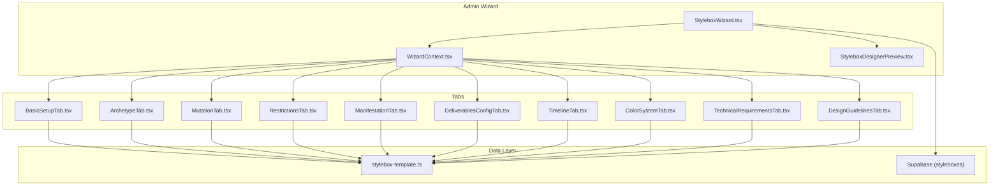
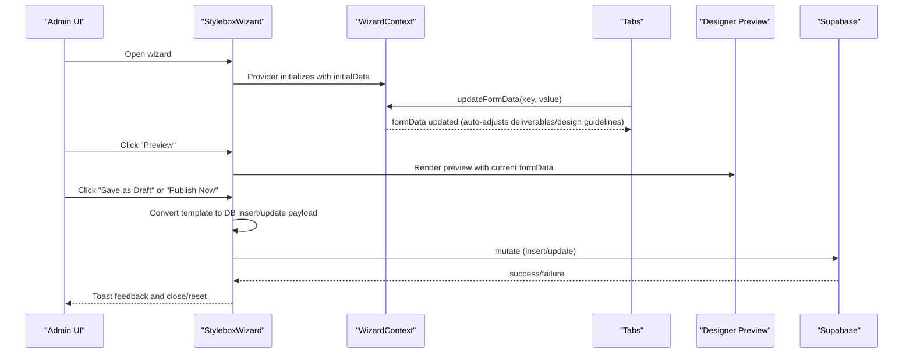
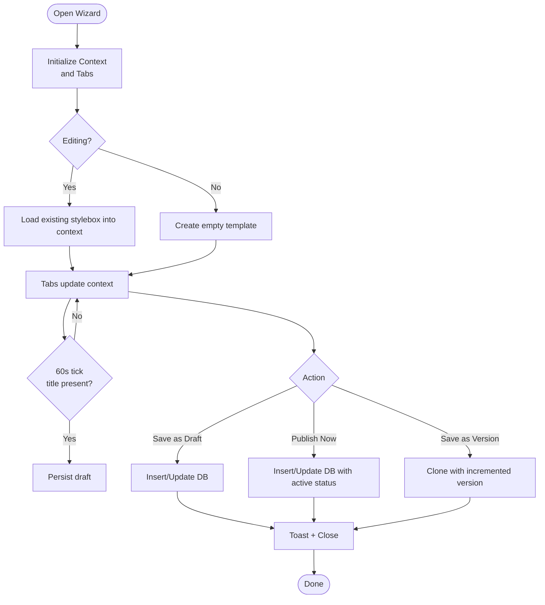
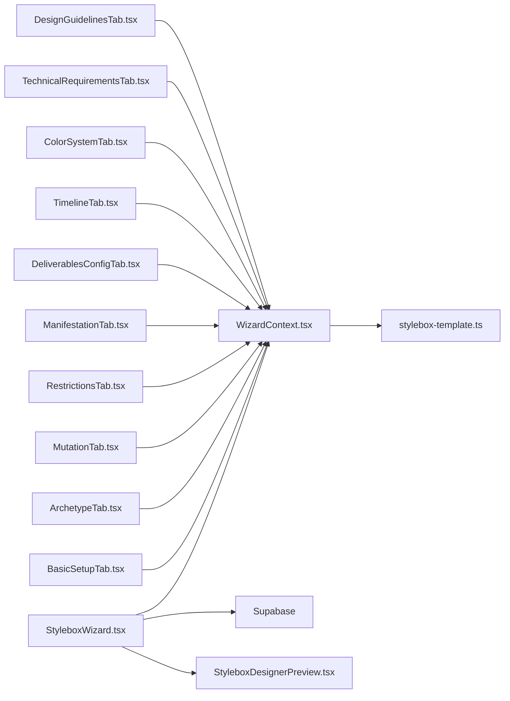

# Challenge Creation & Administration

<cite>
**Referenced Files in This Document**
- [StyleboxWizard.tsx](file://src/components/admin/stylebox-wizard/StyleboxWizard.tsx)
- [WizardContext.tsx](file://src/components/admin/stylebox-wizard/WizardContext.tsx)
- [StyleboxDesignerPreview.tsx](file://src/components/admin/stylebox-wizard/StyleboxDesignerPreview.tsx)
- [BasicSetupTab.tsx](file://src/components/admin/stylebox-wizard/tabs/BasicSetupTab.tsx)
- [ArchetypeTab.tsx](file://src/components/admin/stylebox-wizard/tabs/ArchetypeTab.tsx)
- [MutationTab.tsx](file://src/components/admin/stylebox-wizard/tabs/MutationTab.tsx)
- [RestrictionsTab.tsx](file://src/components/admin/stylebox-wizard/tabs/RestrictionsTab.tsx)
- [ManifestationTab.tsx](file://src/components/admin/stylebox-wizard/tabs/ManifestationTab.tsx)
- [DeliverablesConfigTab.tsx](file://src/components/admin/stylebox-wizard/tabs/DeliverablesConfigTab.tsx)
- [TimelineTab.tsx](file://src/components/admin/stylebox-wizard/tabs/TimelineTab.tsx)
- [ColorSystemTab.tsx](file://src/components/admin/stylebox-wizard/tabs/ColorSystemTab.tsx)
- [TechnicalRequirementsTab.tsx](file://src/components/admin/stylebox-wizard/tabs/TechnicalRequirementsTab.tsx)
- [DesignGuidelinesTab.tsx](file://src/components/admin/stylebox-wizard/tabs/DesignGuidelinesTab.tsx)
- [stylebox-template.ts](file://src/lib/stylebox-template.ts)
- [AdminStyleboxes.tsx](file://src/pages/admin/AdminStyleboxes.tsx)
</cite>

## Table of Contents
1. [Introduction](#introduction)
2. [Project Structure](#project-structure)
3. [Core Components](#core-components)
4. [Architecture Overview](#architecture-overview)
5. [Detailed Component Analysis](#detailed-component-analysis)
6. [Dependency Analysis](#dependency-analysis)
7. [Performance Considerations](#performance-considerations)
8. [Troubleshooting Guide](#troubleshooting-guide)
9. [Conclusion](#conclusion)

## Introduction
This document explains the Stylebox challenge creation and administration system used by administrators to build, configure, and publish design challenges. It covers the step-by-step tabbed wizard, real-time preview, data persistence, validation, and the underlying template system. It also outlines administrative workflows for approvals, status management, and bulk operations.

## Project Structure
The Stylebox wizard is organized as a modular, tab-driven interface with a shared context managing form state and auto-updates. The wizard persists data to Supabase and supports real-time preview for designers.



**Diagram sources**
- [StyleboxWizard.tsx](file://src/components/admin/stylebox-wizard/StyleboxWizard.tsx#L50-L103)
- [WizardContext.tsx](file://src/components/admin/stylebox-wizard/WizardContext.tsx#L45-L119)
- [StyleboxDesignerPreview.tsx](file://src/components/admin/stylebox-wizard/StyleboxDesignerPreview.tsx#L11-L187)
- [BasicSetupTab.tsx](file://src/components/admin/stylebox-wizard/tabs/BasicSetupTab.tsx#L27-L269)
- [ArchetypeTab.tsx](file://src/components/admin/stylebox-wizard/tabs/ArchetypeTab.tsx#L32-L218)
- [MutationTab.tsx](file://src/components/admin/stylebox-wizard/tabs/MutationTab.tsx#L12-L186)
- [RestrictionsTab.tsx](file://src/components/admin/stylebox-wizard/tabs/RestrictionsTab.tsx#L14-L184)
- [ManifestationTab.tsx](file://src/components/admin/stylebox-wizard/tabs/ManifestationTab.tsx#L6-L57)
- [DeliverablesConfigTab.tsx](file://src/components/admin/stylebox-wizard/tabs/DeliverablesConfigTab.tsx#L25-L187)
- [TimelineTab.tsx](file://src/components/admin/stylebox-wizard/tabs/TimelineTab.tsx#L31-L223)
- [ColorSystemTab.tsx](file://src/components/admin/stylebox-wizard/tabs/ColorSystemTab.tsx#L17-L252)
- [TechnicalRequirementsTab.tsx](file://src/components/admin/stylebox-wizard/tabs/TechnicalRequirementsTab.tsx#L8-L231)
- [DesignGuidelinesTab.tsx](file://src/components/admin/stylebox-wizard/tabs/DesignGuidelinesTab.tsx#L9-L204)
- [stylebox-template.ts](file://src/lib/stylebox-template.ts#L209-L282)

**Section sources**
- [StyleboxWizard.tsx](file://src/components/admin/stylebox-wizard/StyleboxWizard.tsx#L50-L103)
- [WizardContext.tsx](file://src/components/admin/stylebox-wizard/WizardContext.tsx#L45-L119)

## Core Components
- StyleboxWizard: Orchestrates the modal dialog, tab navigation, auto-save, and persistence via Supabase mutations. It converts between database rows and the internal template format and exposes actions to save drafts or publish immediately.
- WizardContext: Provides a centralized state machine for the entire wizard, including tab tracking, form updates, nested updates, and initialization/reset logic. It auto-adjusts deliverables and design guidelines based on category and difficulty.
- StyleboxDesignerPreview: Renders a real-time preview of the challenge as designers would see it, including quadrants, deliverables checklist, and workspace prompt.
- Tabs: Modular UI panels for each stage of the wizard (basic setup, archetype, mutation, restrictions, manifestation, deliverables, timeline).
- Template System: Strongly typed StyleBoxTemplate with presets, defaults, and helpers for difficulty, deliverables, and evaluation criteria.

**Section sources**
- [StyleboxWizard.tsx](file://src/components/admin/stylebox-wizard/StyleboxWizard.tsx#L105-L381)
- [WizardContext.tsx](file://src/components/admin/stylebox-wizard/WizardContext.tsx#L15-L119)
- [StyleboxDesignerPreview.tsx](file://src/components/admin/stylebox-wizard/StyleboxDesignerPreview.tsx#L11-L187)
- [stylebox-template.ts](file://src/lib/stylebox-template.ts#L209-L282)

## Architecture Overview
The wizard follows a unidirectional data flow: tabs update the shared context; the context triggers auto-updates; the wizard persists to the backend; a preview component reads the same context to render a live view.



**Diagram sources**
- [StyleboxWizard.tsx](file://src/components/admin/stylebox-wizard/StyleboxWizard.tsx#L146-L266)
- [WizardContext.tsx](file://src/components/admin/stylebox-wizard/WizardContext.tsx#L53-L92)
- [StyleboxDesignerPreview.tsx](file://src/components/admin/stylebox-wizard/StyleboxDesignerPreview.tsx#L11-L187)

## Detailed Component Analysis

### Wizard Orchestration and Persistence
- Tab navigation: Uses a fixed ordered list of tabs with programmatic navigation and step indicators.
- Auto-save: Periodically saves drafts when title is present and data changed, with a timestamp indicator.
- Validation: Prevents publishing without a title; focuses the first tab on validation errors.
- Persistence: Converts the template to a DB insert/update payload, handling dates, arrays, and JSON fields. Supports versioning by creating a new record when saving as a new version.
- Real-time preview: Opens a full-screen preview of the designer workspace using the current form data.



**Diagram sources**
- [StyleboxWizard.tsx](file://src/components/admin/stylebox-wizard/StyleboxWizard.tsx#L120-L133)
- [StyleboxWizard.tsx](file://src/components/admin/stylebox-wizard/StyleboxWizard.tsx#L195-L266)

**Section sources**
- [StyleboxWizard.tsx](file://src/components/admin/stylebox-wizard/StyleboxWizard.tsx#L120-L133)
- [StyleboxWizard.tsx](file://src/components/admin/stylebox-wizard/StyleboxWizard.tsx#L195-L266)

### Wizard Context Management
- Centralized state: Holds formData, currentTab, and helpers to update top-level and nested fields.
- Auto-updates:
  - Difficulty change updates design guidelines with preset notes and recommended piece counts.
  - Category change resets deliverables to category-appropriate defaults.
- Reset and editing detection: Supports resetting to empty template and detecting edit mode for UI cues.

```mermaid
classDiagram
class WizardContext {
+formData : StyleBoxTemplate
+currentTab : string
+updateFormData(key, value)
+updateNestedData(parent, key, value)
+setFormData(data)
+resetForm()
+setCurrentTab(tab)
+isEditing : boolean
}
class StyleBoxTemplate {
+title : string
+category : "fashion"|"textile"|"jewelry"
+difficulty : "free"|"easy"|"medium"|"hard"|"insane"
+deliverables : DeliverableItem[]
+design_guidelines : DesignGuidelines
+technical_requirements : TechnicalRequirements
+color_system : ColorEntry[]
+moodboard_images : MoodboardImage[]
+manifestation : { prompt : string }
+archetype : { silhouette, rationale, anchor_image }
+mutation : { concept, directive, moodboard }
+restrictions : { points[], tolerances }
+status : "draft"|"active"|"archived"
+version : number
+submission_deadline? : Date|string
+release_date? : Date|string
+required_rank_order? : number
+required_subscription_tier? : "basic"|"pro"|"elite"
}
WizardContext --> StyleBoxTemplate : "manages"
```

**Diagram sources**
- [WizardContext.tsx](file://src/components/admin/stylebox-wizard/WizardContext.tsx#L15-L28)
- [stylebox-template.ts](file://src/lib/stylebox-template.ts#L209-L282)

**Section sources**
- [WizardContext.tsx](file://src/components/admin/stylebox-wizard/WizardContext.tsx#L53-L92)

### Basic Setup (Core Metadata)
- Title, StyleBox ID, classification (collection line, market context, season, collection size), category, difficulty, XP reward, status, visibility tags, short description, and feature toggles (featured, walkthrough).
- Auto-generates StyleBox ID when missing; difficulty presets influence design guidelines.

**Section sources**
- [BasicSetupTab.tsx](file://src/components/admin/stylebox-wizard/tabs/BasicSetupTab.tsx#L27-L269)

### Archetype (Q1: Commercial Constant)
- Defines silhouette (standard list or custom), rationale, and anchor reference image upload with watermarking and storage.
- Enforces required fields and provides drag-and-drop UX.

**Section sources**
- [ArchetypeTab.tsx](file://src/components/admin/stylebox-wizard/tabs/ArchetypeTab.tsx#L32-L218)

### Mutation (Q2: The Disruption)
- Captures mutation concept and directive, plus a moodboard builder with multi-upload, watermarking, and removal.
- Supports reordering visuals to shape the narrative.

**Section sources**
- [MutationTab.tsx](file://src/components/admin/stylebox-wizard/tabs/MutationTab.tsx#L12-L186)

### Restrictions (Q3: Technical Brief)
- Dynamic list of restriction points with collapsible details and categories.
- Numerical tolerances (max weight, max cost) with validation notes.

**Section sources**
- [RestrictionsTab.tsx](file://src/components/admin/stylebox-wizard/tabs/RestrictionsTab.tsx#L14-L184)

### Manifestation (Q4: Final Prompt)
- Final design prompt for the workspace; emphasizes bridging Archetype and Mutation.

**Section sources**
- [ManifestationTab.tsx](file://src/components/admin/stylebox-wizard/tabs/ManifestationTab.tsx#L6-L57)

### Deliverables Configuration
- Configurable deliverables list with file type, requirement flag, description, and grading rubric visibility.
- Ensures at least one deliverable is defined for submissions.

**Section sources**
- [DeliverablesConfigTab.tsx](file://src/components/admin/stylebox-wizard/tabs/DeliverablesConfigTab.tsx#L25-L187)

### Timeline & Publish
- Submission deadline selection with quick presets.
- Optional release date scheduling.
- Access restrictions: subscription tier and rank order.
- Publish vs. draft actions with summary preview.

**Section sources**
- [TimelineTab.tsx](file://src/components/admin/stylebox-wizard/tabs/TimelineTab.tsx#L31-L223)

### Color System
- Palette builder with HEX, optional Pantone, type (core/accent/optional), and usage ratio.
- Grouped chips with hover controls to remove entries.

**Section sources**
- [ColorSystemTab.tsx](file://src/components/admin/stylebox-wizard/tabs/ColorSystemTab.tsx#L17-L252)

### Technical Requirements
- File formats and required views toggles with defaults.
- Category-specific fields:
  - Textile: repeat dimensions and color separations.
  - Jewelry: weight range and CAD requirements, scale drawings.
- Naming conventions and additional notes.

**Section sources**
- [TechnicalRequirementsTab.tsx](file://src/components/admin/stylebox-wizard/tabs/TechnicalRequirementsTab.tsx#L8-L231)

### Design Guidelines
- Difficulty badge with icon and color coding.
- Difficulty presets drive complexity notes and recommended piece counts.
- Category-specific guidance fields (construction, silhouette, category build for fashion; repeat structure, print complexity for textile; engineering, hardware for jewelry).
- Reference notes for designer inspiration.

**Section sources**
- [DesignGuidelinesTab.tsx](file://src/components/admin/stylebox-wizard/tabs/DesignGuidelinesTab.tsx#L9-L204)

### Real-Time Preview
- Designer preview mode mirrors the 4-quadrant layout with editable fields from the wizard.
- Includes deliverables checklist and workspace prompt area.

**Section sources**
- [StyleboxDesignerPreview.tsx](file://src/components/admin/stylebox-wizard/StyleboxDesignerPreview.tsx#L11-L187)

### Administrative Workflows
- Approval and status management:
  - Draft → Active publishes immediately to designers.
  - Archive toggles visibility.
- Bulk operations:
  - The admin page aggregates lists of Styleboxes and supports filtering, sorting, and batch actions (e.g., bulk publish/archive).
- Integration points:
  - Supabase queries and mutations for CRUD operations.
  - Storage for curated assets (watermarked uploads).

**Section sources**
- [AdminStyleboxes.tsx](file://src/pages/admin/AdminStyleboxes.tsx)

## Dependency Analysis
- Wizard depends on:
  - WizardContext for state and auto-updates.
  - Tabs for modular UI segments.
  - Template system for types and defaults.
  - Supabase client for persistence.
- Preview depends on WizardContext to reflect live changes.
- Tabs depend on:
  - WizardContext for updates.
  - Template presets for defaults and validation.



**Diagram sources**
- [StyleboxWizard.tsx](file://src/components/admin/stylebox-wizard/StyleboxWizard.tsx#L10-L27)
- [WizardContext.tsx](file://src/components/admin/stylebox-wizard/WizardContext.tsx#L15-L28)
- [stylebox-template.ts](file://src/lib/stylebox-template.ts#L209-L282)

**Section sources**
- [StyleboxWizard.tsx](file://src/components/admin/stylebox-wizard/StyleboxWizard.tsx#L10-L27)
- [WizardContext.tsx](file://src/components/admin/stylebox-wizard/WizardContext.tsx#L15-L28)

## Performance Considerations
- Auto-save throttling: A 60-second interval prevents excessive writes while ensuring drafts are preserved.
- Conditional rendering: Preview and tabs render only when active to minimize DOM overhead.
- Image uploads: Watermarking and storage occur client-side before upload; consider chunked uploads for very large files.
- Nested updates: updateNestedData minimizes re-renders by updating only the targeted nested field.

## Troubleshooting Guide
- Validation errors:
  - Missing title blocks publishing; the wizard focuses the first tab and displays a toast.
- Upload failures:
  - Image/moodboard uploads show a destructive toast and leave the field empty; verify storage permissions and file types.
- Persistence errors:
  - Mutations surface errors via toasts; check network connectivity and Supabase policies.
- Preview discrepancies:
  - Ensure all required fields are filled in the respective tabs; preview reflects the current context state.

**Section sources**
- [StyleboxWizard.tsx](file://src/components/admin/stylebox-wizard/StyleboxWizard.tsx#L195-L204)
- [ArchetypeTab.tsx](file://src/components/admin/stylebox-wizard/tabs/ArchetypeTab.tsx#L64-L78)
- [MutationTab.tsx](file://src/components/admin/stylebox-wizard/tabs/MutationTab.tsx#L52-L66)

## Conclusion
The Stylebox wizard provides a robust, guided workflow for administrators to define challenges across four quadrants, configure deliverables and technical requirements, and publish with precise timelines and access controls. Its context-driven architecture, real-time preview, and strong typing ensure consistency and reduce errors. Administrative pages enable efficient oversight and bulk management of Stylebox lifecycles.