# Progress Tracking & Rewards

<cite>
**Referenced Files in This Document**
- [CompletionProgressBar.tsx](file://src/components/stylebox/CompletionProgressBar.tsx)
- [LevelBadge.tsx](file://src/components/stylebox/LevelBadge.tsx)
- [SCRewardBadge.tsx](file://src/components/stylebox/SCRewardBadge.tsx)
- [NextUnlockHint.tsx](file://src/components/stylebox/NextUnlockHint.tsx)
- [StatusBadge.tsx](file://src/components/stylebox/StatusBadge.tsx)
- [SCProgressCard.tsx](file://src/components/dashboard/SCProgressCard.tsx)
- [RankProgress.tsx](file://src/components/dashboard/RankProgress.tsx)
- [style-credits.ts](file://src/lib/style-credits.ts)
- [scoring.ts](file://src/lib/scoring.ts)
- [ranks.ts](file://src/lib/ranks.ts)
</cite>

## Table of Contents
1. [Introduction](#introduction)
2. [Project Structure](#project-structure)
3. [Core Components](#core-components)
4. [Architecture Overview](#architecture-overview)
5. [Detailed Component Analysis](#detailed-component-analysis)
6. [Dependency Analysis](#dependency-analysis)
7. [Performance Considerations](#performance-considerations)
8. [Troubleshooting Guide](#troubleshooting-guide)
9. [Conclusion](#conclusion)

## Introduction
This document explains the Stylebox progress tracking and rewards system in the Adorzia platform. It covers how completion progress is indicated, how designers advance through rank tiers, how Style Credits (SC) are calculated and awarded, and how the badge system communicates achievement levels and unlockable benefits. It also documents the scoring algorithms, XP-like accumulation via Stylebox evaluations, tier progression mechanics, milestone rewards, next unlock hints, progress visualization components, and integration with the broader ranking system.

## Project Structure
The Stylebox progress and rewards system spans UI components and shared libraries:
- UI components visualize progress, status, rewards, and unlocks.
- Libraries define SC difficulty ranges, rank tiers, and scoring formulas.

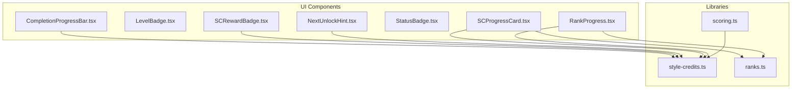

**Diagram sources**
- [CompletionProgressBar.tsx](file://src/components/stylebox/CompletionProgressBar.tsx#L1-L49)
- [LevelBadge.tsx](file://src/components/stylebox/LevelBadge.tsx#L1-L40)
- [SCRewardBadge.tsx](file://src/components/stylebox/SCRewardBadge.tsx#L1-L46)
- [NextUnlockHint.tsx](file://src/components/stylebox/NextUnlockHint.tsx#L1-L82)
- [StatusBadge.tsx](file://src/components/stylebox/StatusBadge.tsx#L1-L89)
- [SCProgressCard.tsx](file://src/components/dashboard/SCProgressCard.tsx#L1-L226)
- [RankProgress.tsx](file://src/components/dashboard/RankProgress.tsx#L1-L204)
- [style-credits.ts](file://src/lib/style-credits.ts#L1-L188)
- [scoring.ts](file://src/lib/scoring.ts#L1-L239)
- [ranks.ts](file://src/lib/ranks.ts#L1-L246)

**Section sources**
- [CompletionProgressBar.tsx](file://src/components/stylebox/CompletionProgressBar.tsx#L1-L49)
- [SCRewardBadge.tsx](file://src/components/stylebox/SCRewardBadge.tsx#L1-L46)
- [NextUnlockHint.tsx](file://src/components/stylebox/NextUnlockHint.tsx#L1-L82)
- [SCProgressCard.tsx](file://src/components/dashboard/SCProgressCard.tsx#L1-L226)
- [RankProgress.tsx](file://src/components/dashboard/RankProgress.tsx#L1-L204)
- [style-credits.ts](file://src/lib/style-credits.ts#L1-L188)
- [scoring.ts](file://src/lib/scoring.ts#L1-L239)
- [ranks.ts](file://src/lib/ranks.ts#L1-L246)

## Core Components
- CompletionProgressBar: Tracks deliverables completion and displays potential SC reward range.
- SCRewardBadge: Visualizes SC reward ranges per difficulty.
- NextUnlockHint: Shows next challenge unlock requirement and progress toward it.
- StatusBadge: Displays Stylebox lifecycle status (draft, submitted, approved, etc.).
- SCProgressCard: Summarizes SC balance, rank, commission, and progress to next rank.
- RankProgress: Alternative rank progress card with recent badges display.
- Libraries:
  - style-credits.ts: Defines SC difficulty ranges, rank tiers, and SC-based rank progression helpers.
  - scoring.ts: Defines Stylebox scoring, evaluation weights, quality multipliers, timeliness adjustments, and weighted totals.
  - ranks.ts: Defines rank tiers, thresholds, progression, and effective commission calculation.

**Section sources**
- [CompletionProgressBar.tsx](file://src/components/stylebox/CompletionProgressBar.tsx#L1-L49)
- [SCRewardBadge.tsx](file://src/components/stylebox/SCRewardBadge.tsx#L1-L46)
- [NextUnlockHint.tsx](file://src/components/stylebox/NextUnlockHint.tsx#L1-L82)
- [StatusBadge.tsx](file://src/components/stylebox/StatusBadge.tsx#L1-L89)
- [SCProgressCard.tsx](file://src/components/dashboard/SCProgressCard.tsx#L1-L226)
- [RankProgress.tsx](file://src/components/dashboard/RankProgress.tsx#L1-L204)
- [style-credits.ts](file://src/lib/style-credits.ts#L1-L188)
- [scoring.ts](file://src/lib/scoring.ts#L1-L239)
- [ranks.ts](file://src/lib/ranks.ts#L1-L246)

## Architecture Overview
The system combines frontend visualization with backend-driven calculations:
- Frontend components consume library functions to compute and render progress, ranks, and rewards.
- Backend functions (not shown here) award SC upon Stylebox approval and may trigger notifications and leaderboards updates.

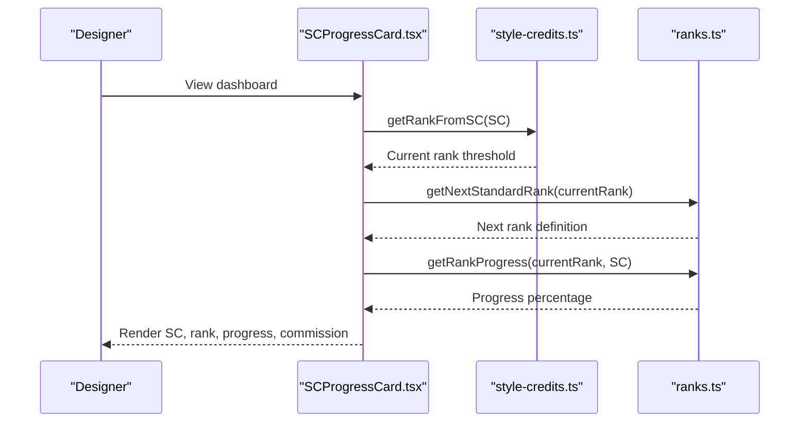

**Diagram sources**
- [SCProgressCard.tsx](file://src/components/dashboard/SCProgressCard.tsx#L75-L90)
- [style-credits.ts](file://src/lib/style-credits.ts#L111-L119)
- [ranks.ts](file://src/lib/ranks.ts#L187-L215)

## Detailed Component Analysis

### Completion Progress Indicators
- Purpose: Show deliverables completion and potential SC reward range.
- Inputs: completedItems, totalItems, optional scReward range.
- Behavior:
  - Computes percentage and renders a progress bar.
  - Highlights completion state and displays reward range when provided.
- Integration: Used in Stylebox workspace to guide submissions.

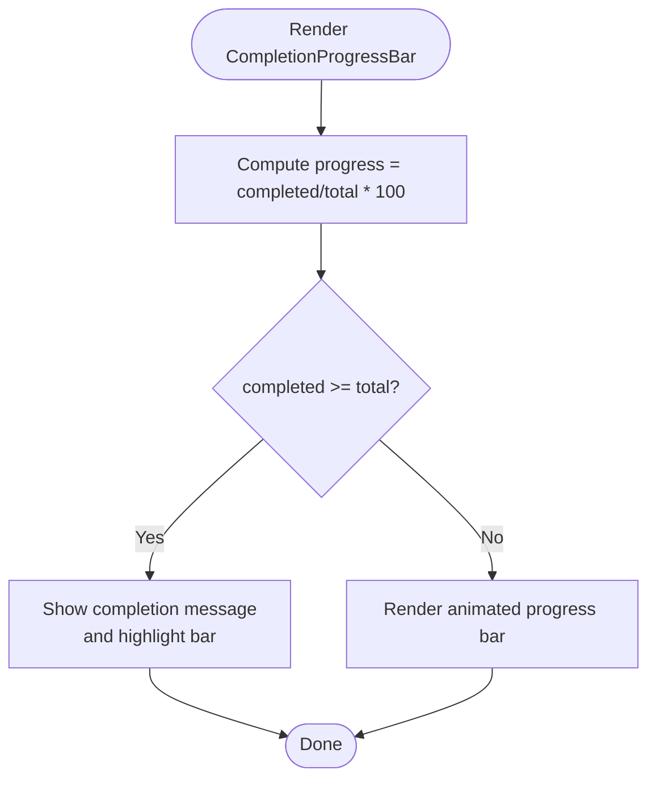

**Diagram sources**
- [CompletionProgressBar.tsx](file://src/components/stylebox/CompletionProgressBar.tsx#L12-L48)

**Section sources**
- [CompletionProgressBar.tsx](file://src/components/stylebox/CompletionProgressBar.tsx#L1-L49)

### Level Badge System
- Purpose: Visualize Stylebox level (I–IV) with contextual labels.
- Inputs: level number, size, className.
- Behavior: Maps numeric level to themed badge with label and tooltip.

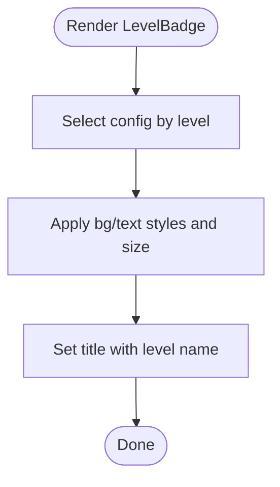

**Diagram sources**
- [LevelBadge.tsx](file://src/components/stylebox/LevelBadge.tsx#L22-L39)

**Section sources**
- [LevelBadge.tsx](file://src/components/stylebox/LevelBadge.tsx#L1-L40)

### Style Credits Reward Badges
- Purpose: Display SC reward range for a given difficulty.
- Inputs: difficulty, showRange flag, compact mode.
- Behavior: Renders a badge with sparkles and the min-max range or max-only.

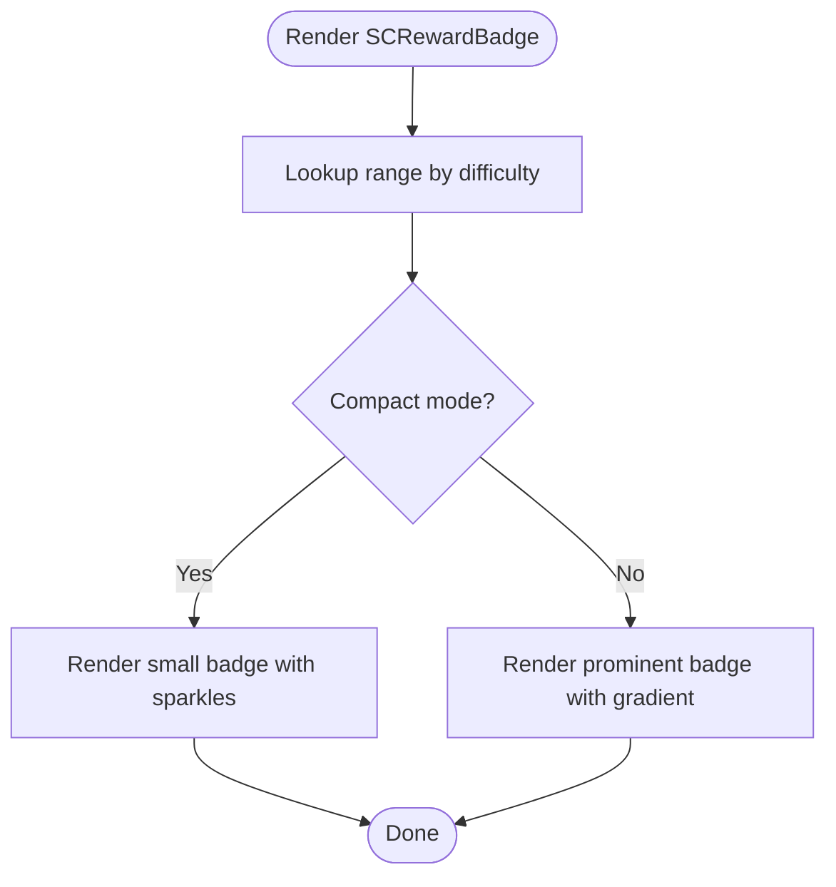

**Diagram sources**
- [SCRewardBadge.tsx](file://src/components/stylebox/SCRewardBadge.tsx#L12-L45)

**Section sources**
- [SCRewardBadge.tsx](file://src/components/stylebox/SCRewardBadge.tsx#L1-L46)

### Next Unlock Hint System
- Purpose: Communicate next Stylebox unlock requirement and progress.
- Inputs: currentSC, nextStyleboxTitle, nextStyleboxId, requiredSC.
- Behavior:
  - If unlocked: show unlock notification and CTA to start.
  - Else: show lock icon, progress bar, and remaining SC needed.

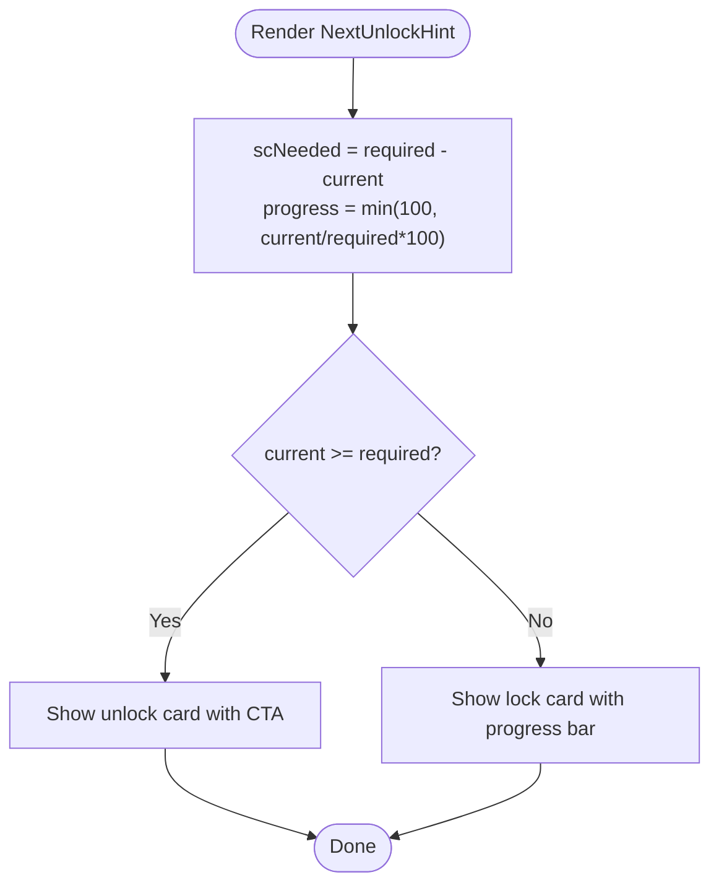

**Diagram sources**
- [NextUnlockHint.tsx](file://src/components/stylebox/NextUnlockHint.tsx#L14-L81)

**Section sources**
- [NextUnlockHint.tsx](file://src/components/stylebox/NextUnlockHint.tsx#L1-L82)

### Status Badge System
- Purpose: Display Stylebox lifecycle status with icons and color-coded labels.
- Inputs: status enum, showIcon flag.
- Behavior: Maps status to themed badge with icon and label.

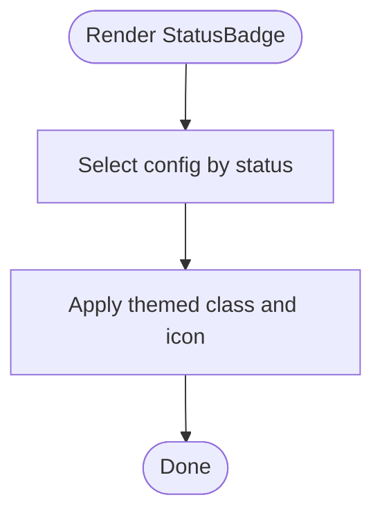

**Diagram sources**
- [StatusBadge.tsx](file://src/components/stylebox/StatusBadge.tsx#L74-L88)

**Section sources**
- [StatusBadge.tsx](file://src/components/stylebox/StatusBadge.tsx#L1-L89)

### SC Progress Visualization Cards
- SCProgressCard:
  - Displays current SC, lifetime SC, rank, commission, and progress to next rank.
  - Integrates with rank styles and foundation bonuses.
- RankProgress:
  - Alternative card focusing on rank and recent badges.

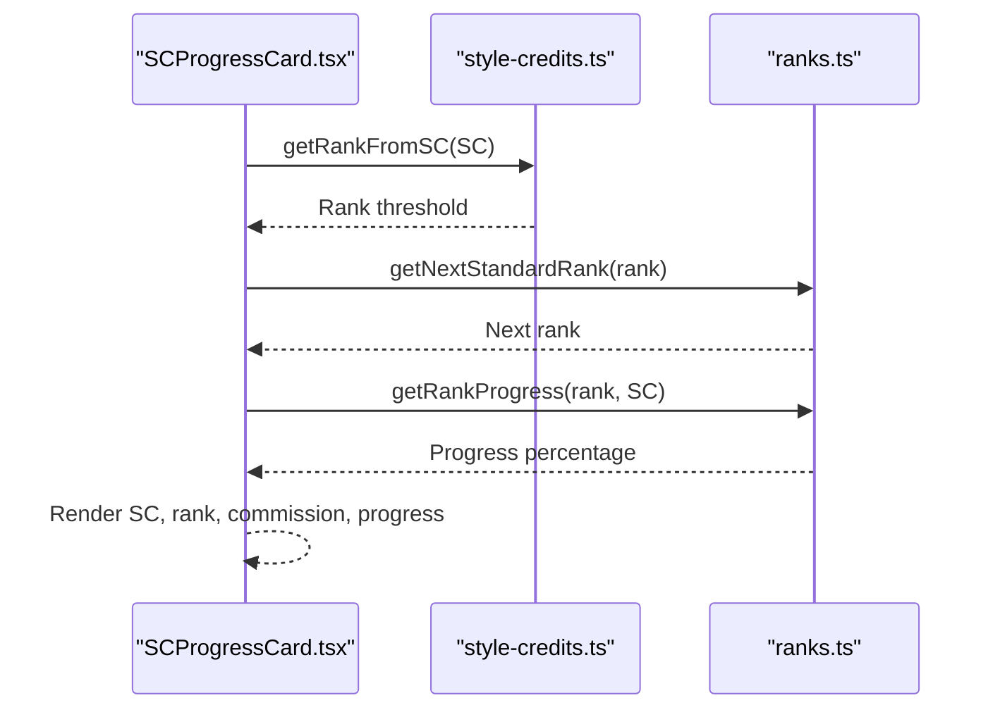

**Diagram sources**
- [SCProgressCard.tsx](file://src/components/dashboard/SCProgressCard.tsx#L75-L90)
- [style-credits.ts](file://src/lib/style-credits.ts#L111-L119)
- [ranks.ts](file://src/lib/ranks.ts#L187-L215)

**Section sources**
- [SCProgressCard.tsx](file://src/components/dashboard/SCProgressCard.tsx#L1-L226)
- [RankProgress.tsx](file://src/components/dashboard/RankProgress.tsx#L1-L204)

### Scoring Algorithms and XP Accumulation
- Stylebox scoring:
  - Base points per difficulty.
  - Weighted evaluation score using domain-specific weights.
  - Quality multiplier based on average score band.
  - Timeliness bonus/penalty (early/on-time/late).
  - Contribution to weighted total across components.
- Designer weighted total:
  - Aggregates Stylebox, Portfolio, Publication, and Selling contributions with fixed weights.

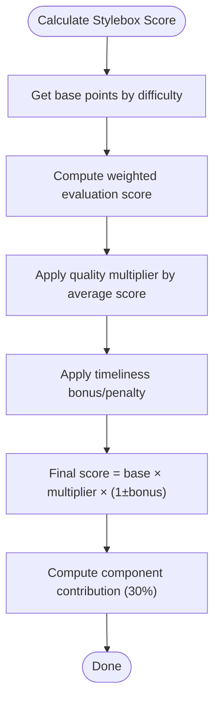

**Diagram sources**
- [scoring.ts](file://src/lib/scoring.ts#L129-L148)

**Section sources**
- [scoring.ts](file://src/lib/scoring.ts#L1-L239)

### Tier Progression and Milestone Rewards
- Rank tiers and thresholds:
  - Apprentice → Patternist → Stylist → Couturier → Visionary → Creative Director.
  - Thresholds define min/max SC and commission rates.
- Progress calculation:
  - Percentage within current tier and SC needed to next tier.
- Milestone rewards:
  - Access to higher-difficulty Styleboxes.
  - Enhanced commission rates and badges.

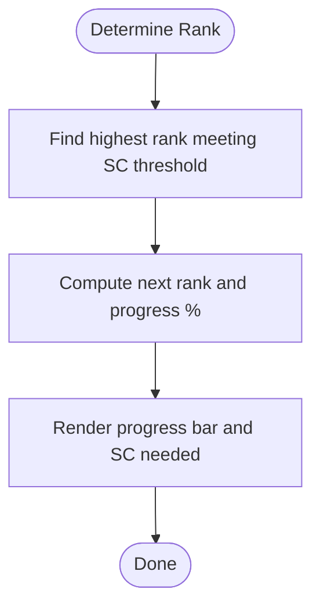

**Diagram sources**
- [style-credits.ts](file://src/lib/style-credits.ts#L111-L158)
- [ranks.ts](file://src/lib/ranks.ts#L199-L232)

**Section sources**
- [style-credits.ts](file://src/lib/style-credits.ts#L23-L100)
- [ranks.ts](file://src/lib/ranks.ts#L60-L177)

### Reward Distribution Mechanisms and Timing
- Random SC award on approval:
  - Difficulty-based range determines award.
  - Optional sold-out bonus range.
- Commission computation:
  - Effective commission includes foundation rank bonus, capped at 50%.
- Timing considerations:
  - Awards occur after Stylebox approval.
  - Leaderboard updates follow award events.

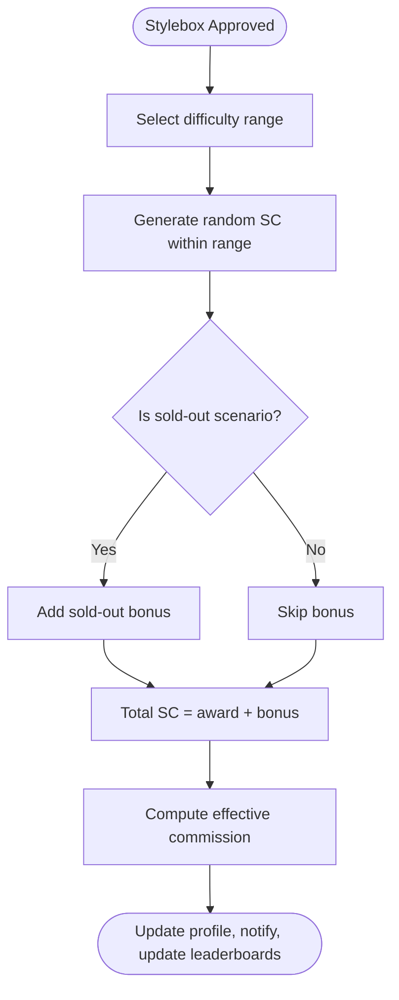

**Diagram sources**
- [style-credits.ts](file://src/lib/style-credits.ts#L160-L173)
- [style-credits.ts](file://src/lib/style-credits.ts#L121-L129)

**Section sources**
- [style-credits.ts](file://src/lib/style-credits.ts#L1-L188)

### Integration with the Broader Ranking System
- Rank tiers and thresholds are shared across UI cards and libraries.
- Effective commission considers both standard rank and foundation rank bonuses.
- UI cards render rank visuals, progress bars, and unlock hints aligned with library-defined thresholds.

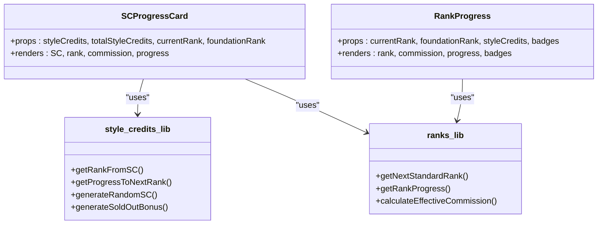

**Diagram sources**
- [SCProgressCard.tsx](file://src/components/dashboard/SCProgressCard.tsx#L75-L90)
- [RankProgress.tsx](file://src/components/dashboard/RankProgress.tsx#L71-L86)
- [style-credits.ts](file://src/lib/style-credits.ts#L111-L158)
- [ranks.ts](file://src/lib/ranks.ts#L187-L221)

**Section sources**
- [SCProgressCard.tsx](file://src/components/dashboard/SCProgressCard.tsx#L1-L226)
- [RankProgress.tsx](file://src/components/dashboard/RankProgress.tsx#L1-L204)
- [style-credits.ts](file://src/lib/style-credits.ts#L1-L188)
- [ranks.ts](file://src/lib/ranks.ts#L1-L246)

## Dependency Analysis
- UI components depend on library functions for SC and rank computations.
- Libraries are cohesive and focused: style-credits.ts handles SC mechanics, ranks.ts handles rank mechanics, scoring.ts handles Stylebox evaluation math.
- No circular dependencies observed among the analyzed files.

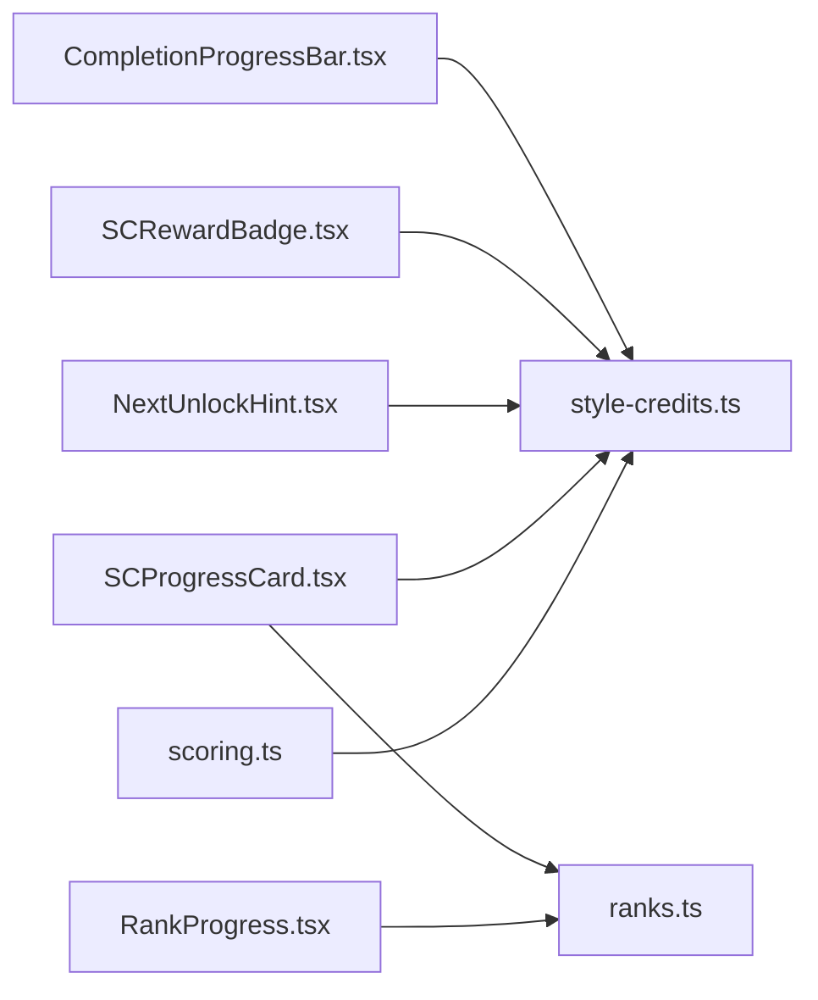

**Diagram sources**
- [CompletionProgressBar.tsx](file://src/components/stylebox/CompletionProgressBar.tsx#L1-L49)
- [SCRewardBadge.tsx](file://src/components/stylebox/SCRewardBadge.tsx#L1-L46)
- [NextUnlockHint.tsx](file://src/components/stylebox/NextUnlockHint.tsx#L1-L82)
- [SCProgressCard.tsx](file://src/components/dashboard/SCProgressCard.tsx#L1-L226)
- [RankProgress.tsx](file://src/components/dashboard/RankProgress.tsx#L1-L204)
- [style-credits.ts](file://src/lib/style-credits.ts#L1-L188)
- [scoring.ts](file://src/lib/scoring.ts#L1-L239)
- [ranks.ts](file://src/lib/ranks.ts#L1-L246)

**Section sources**
- [style-credits.ts](file://src/lib/style-credits.ts#L1-L188)
- [scoring.ts](file://src/lib/scoring.ts#L1-L239)
- [ranks.ts](file://src/lib/ranks.ts#L1-L246)

## Performance Considerations
- Rendering:
  - Progress bars and animations are lightweight; avoid frequent re-renders by passing memoized props.
- Computation:
  - Rank and progress calculations are constant-time lookups and arithmetic; negligible cost.
- Data fetching:
  - Ensure SC and rank data are cached to minimize repeated network requests.

## Troubleshooting Guide
- Invalid rank values:
  - Use safe accessors to prevent rendering crashes on unexpected rank keys.
- Missing next rank:
  - When at the top tier, next rank is undefined; UI should disable progress and unlock hints.
- Incorrect SC display:
  - Verify formatting helpers and ensure values are integers or properly rounded.

**Section sources**
- [RankProgress.tsx](file://src/components/dashboard/RankProgress.tsx#L77-L79)
- [ranks.ts](file://src/lib/ranks.ts#L235-L240)

## Conclusion
The Stylebox progress and rewards system integrates UI components with robust libraries to visualize SC accumulation, rank progression, and unlockable milestones. The design emphasizes clarity and motivation through progress bars, themed badges, and clear communication of next steps. The backend functions for awarding SC and computing effective commission complement the frontend to maintain a cohesive designer progression experience.