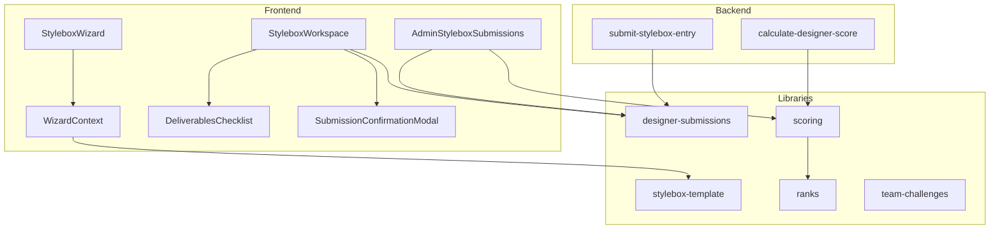
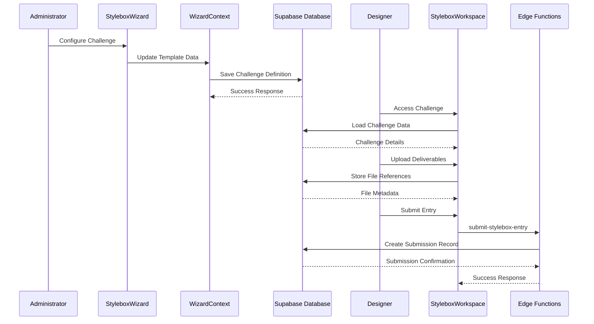
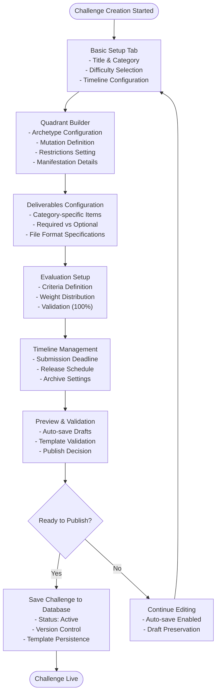
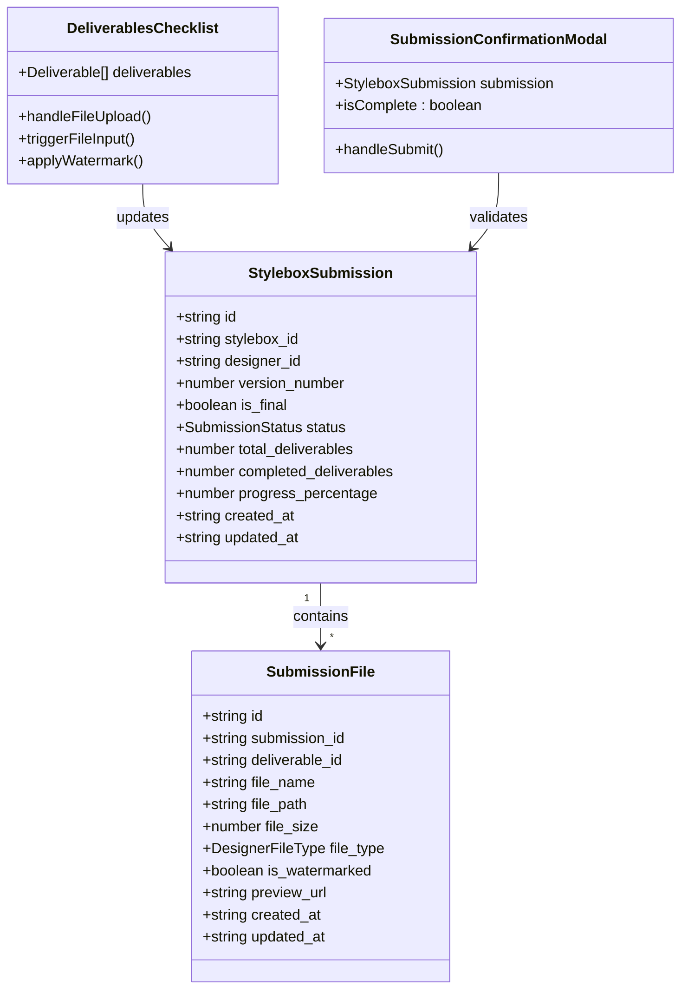
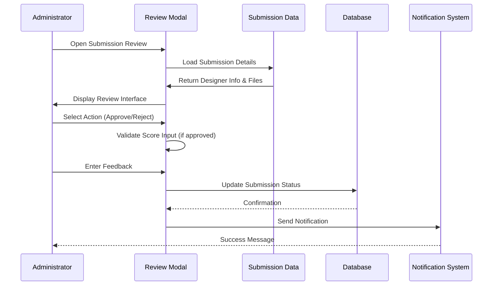
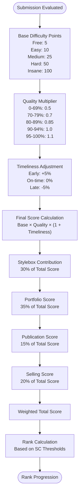
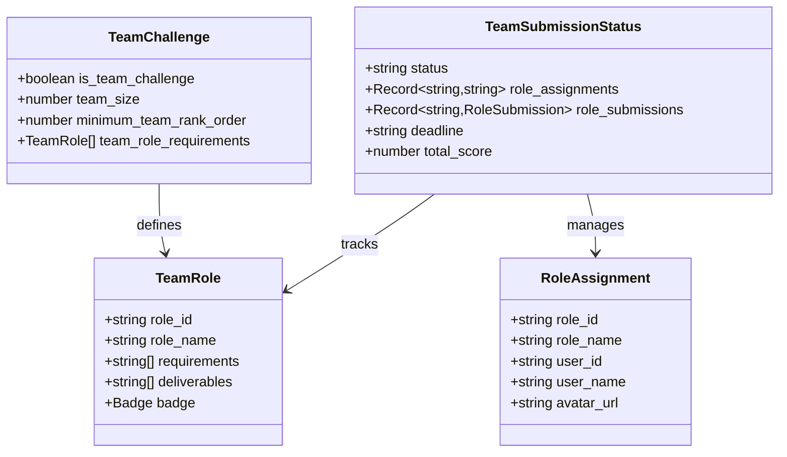
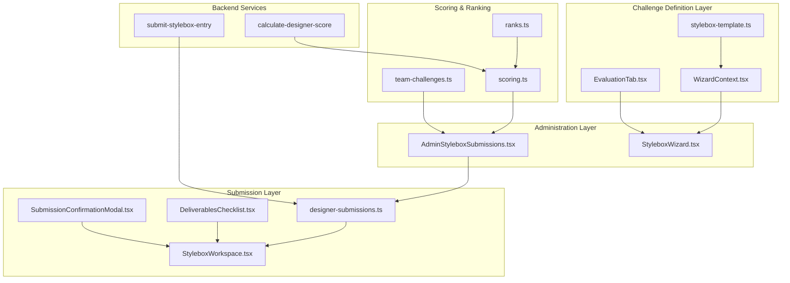

# Stylebox Challenge System

<cite>
**Referenced Files in This Document**
- [StyleboxWizard.tsx](file://src/components/admin/stylebox-wizard/StyleboxWizard.tsx)
- [WizardContext.tsx](file://src/components/admin/stylebox-wizard/WizardContext.tsx)
- [EvaluationTab.tsx](file://src/components/admin/stylebox-wizard/tabs/EvaluationTab.tsx)
- [StyleboxWorkspace.tsx](file://src/pages/StyleboxWorkspace.tsx)
- [DeliverablesChecklist.tsx](file://src/components/stylebox/workspace/DeliverablesChecklist.tsx)
- [SubmissionConfirmationModal.tsx](file://src/components/stylebox/workspace/SubmissionConfirmationModal.tsx)
- [AdminStyleboxSubmissions.tsx](file://src/pages/admin/AdminStyleboxSubmissions.tsx)
- [stylebox-template.ts](file://src/lib/stylebox-template.ts)
- [scoring.ts](file://src/lib/scoring.ts)
- [ranks.ts](file://src/lib/ranks.ts)
- [team-challenges.ts](file://src/lib/team-challenges.ts)
- [designer-submissions.ts](file://src/types/designer-submissions.ts)
- [submit-stylebox-entry/index.ts](file://supabase/functions/submit-stylebox-entry/index.ts)
- [calculate-designer-score/index.ts](file://supabase/functions/calculate-designer-score/index.ts)
</cite>

## Table of Contents
1. [Introduction](#introduction)
2. [Project Structure](#project-structure)
3. [Core Components](#core-components)
4. [Architecture Overview](#architecture-overview)
5. [Detailed Component Analysis](#detailed-component-analysis)
6. [Dependency Analysis](#dependency-analysis)
7. [Performance Considerations](#performance-considerations)
8. [Troubleshooting Guide](#troubleshooting-guide)
9. [Conclusion](#conclusion)

## Introduction
The Stylebox Challenge System is a comprehensive creative competition platform enabling designers to engage with themed challenges while providing administrators with powerful tools to define, manage, and evaluate submissions. The system supports:
- Challenge creation via an intuitive wizard with quadrant-based design guidance
- Submission workspace with deliverables tracking and file upload
- Evaluation and review workflows with configurable criteria
- Progress tracking and XP reward calculations
- Tier-based ranking and reward systems
- Team-based collaborative challenges

## Project Structure
The Stylebox system spans frontend React components, TypeScript libraries, and Supabase edge functions:

**Diagram sources**
- [StyleboxWizard.tsx](file://src/components/admin/stylebox-wizard/StyleboxWizard.tsx#L1-L381)
- [WizardContext.tsx](file://src/components/admin/stylebox-wizard/WizardContext.tsx#L1-L120)
- [StyleboxWorkspace.tsx](file://src/pages/StyleboxWorkspace.tsx#L1-L378)
- [DeliverablesChecklist.tsx](file://src/components/stylebox/workspace/DeliverablesChecklist.tsx#L1-L364)
- [SubmissionConfirmationModal.tsx](file://src/components/stylebox/workspace/SubmissionConfirmationModal.tsx#L1-L271)
- [AdminStyleboxSubmissions.tsx](file://src/pages/admin/AdminStyleboxSubmissions.tsx#L1-L545)
- [stylebox-template.ts](file://src/lib/stylebox-template.ts#L1-L531)
- [scoring.ts](file://src/lib/scoring.ts#L1-L239)
- [ranks.ts](file://src/lib/ranks.ts#L1-L246)
- [team-challenges.ts](file://src/lib/team-challenges.ts#L1-L133)
- [designer-submissions.ts](file://src/types/designer-submissions.ts#L1-L255)
- [submit-stylebox-entry/index.ts](file://supabase/functions/submit-stylebox-entry/index.ts#L1-L142)
- [calculate-designer-score/index.ts](file://supabase/functions/calculate-designer-score/index.ts#L1-L223)

**Section sources**
- [StyleboxWizard.tsx](file://src/components/admin/stylebox-wizard/StyleboxWizard.tsx#L1-L381)
- [StyleboxWorkspace.tsx](file://src/pages/StyleboxWorkspace.tsx#L1-L378)
- [AdminStyleboxSubmissions.tsx](file://src/pages/admin/AdminStyleboxSubmissions.tsx#L1-L545)

## Core Components
The Stylebox system comprises four primary components:

### Challenge Creation and Management
The Stylebox Wizard provides administrators with a guided interface to create and configure challenges using quadrant-based design principles. The wizard supports:
- Basic setup including title, category, difficulty, and timeline
- Quadrant-based content creation (Archetype, Mutation, Restrictions, Manifestation)
- Deliverables configuration with category-specific defaults
- Evaluation criteria definition with automatic weight validation
- Timeline management including submission deadlines and release dates
- Auto-save functionality with draft persistence

### Submission Workspace Implementation
The designer-facing workspace enables creators to:
- Access quadrant-based brief information in a distraction-free environment
- Track deliverables completion with visual progress indicators
- Upload files with automatic watermarking for image assets
- Submit final entries after meeting all requirements
- Monitor submission status and progress

### Evaluation and Review Procedures
Administrators can:
- Review submissions with integrated file viewing capabilities
- Apply configurable evaluation criteria with adjustable weights
- Assign scores and provide feedback for each submission
- Manage submission status transitions (pending, approved, rejected)
- Track reviewer activity and submission history

### Progress Tracking and Reward Systems
The system implements comprehensive tracking mechanisms:
- Real-time progress monitoring for individual designers
- Automated XP reward calculation based on challenge difficulty and performance
- Tier-based ranking system with progression indicators
- Team-based collaboration with role assignment and progress tracking
- Integration with external scoring functions for advanced analytics

**Section sources**
- [StyleboxWizard.tsx](file://src/components/admin/stylebox-wizard/StyleboxWizard.tsx#L50-L381)
- [StyleboxWorkspace.tsx](file://src/pages/StyleboxWorkspace.tsx#L29-L378)
- [AdminStyleboxSubmissions.tsx](file://src/pages/admin/AdminStyleboxSubmissions.tsx#L54-L545)

## Architecture Overview
The Stylebox system follows a modern React architecture with Supabase backend services:

**Diagram sources**
- [StyleboxWizard.tsx](file://src/components/admin/stylebox-wizard/StyleboxWizard.tsx#L146-L266)
- [WizardContext.tsx](file://src/components/admin/stylebox-wizard/WizardContext.tsx#L53-L92)
- [StyleboxWorkspace.tsx](file://src/pages/StyleboxWorkspace.tsx#L77-L98)
- [submit-stylebox-entry/index.ts](file://supabase/functions/submit-stylebox-entry/index.ts#L88-L106)

**Section sources**
- [StyleboxWizard.tsx](file://src/components/admin/stylebox-wizard/StyleboxWizard.tsx#L1-L381)
- [StyleboxWorkspace.tsx](file://src/pages/StyleboxWorkspace.tsx#L1-L378)
- [submit-stylebox-entry/index.ts](file://supabase/functions/submit-stylebox-entry/index.ts#L1-L142)

## Detailed Component Analysis

### Stylebox Challenge Creation Workflow
The challenge creation process utilizes a multi-tab wizard interface with real-time validation and auto-save capabilities:

**Diagram sources**
- [StyleboxWizard.tsx](file://src/components/admin/stylebox-wizard/StyleboxWizard.tsx#L40-L48)
- [EvaluationTab.tsx](file://src/components/admin/stylebox-wizard/tabs/EvaluationTab.tsx#L11-L88)

**Section sources**
- [StyleboxWizard.tsx](file://src/components/admin/stylebox-wizard/StyleboxWizard.tsx#L50-L381)
- [EvaluationTab.tsx](file://src/components/admin/stylebox-wizard/tabs/EvaluationTab.tsx#L1-L177)

### Submission Workspace Implementation
The designer workspace provides an immersive environment for completing challenge submissions:

**Diagram sources**
- [StyleboxWorkspace.tsx](file://src/pages/StyleboxWorkspace.tsx#L54-L98)
- [DeliverablesChecklist.tsx](file://src/components/stylebox/workspace/DeliverablesChecklist.tsx#L30-L42)
- [SubmissionConfirmationModal.tsx](file://src/components/stylebox/workspace/SubmissionConfirmationModal.tsx#L17-L33)

**Section sources**
- [StyleboxWorkspace.tsx](file://src/pages/StyleboxWorkspace.tsx#L29-L378)
- [DeliverablesChecklist.tsx](file://src/components/stylebox/workspace/DeliverablesChecklist.tsx#L1-L364)
- [SubmissionConfirmationModal.tsx](file://src/components/stylebox/workspace/SubmissionConfirmationModal.tsx#L1-L271)

### Evaluation and Review System
The administrative review interface supports comprehensive evaluation workflows:

**Diagram sources**
- [AdminStyleboxSubmissions.tsx](file://src/pages/admin/AdminStyleboxSubmissions.tsx#L99-L144)
- [SubmissionConfirmationModal.tsx](file://src/components/stylebox/workspace/SubmissionConfirmationModal.tsx#L37-L88)

**Section sources**
- [AdminStyleboxSubmissions.tsx](file://src/pages/admin/AdminStyleboxSubmissions.tsx#L54-L545)

### Scoring Algorithms and XP Calculation
The system implements sophisticated scoring mechanisms for performance evaluation:

**Diagram sources**
- [scoring.ts](file://src/lib/scoring.ts#L6-L148)
- [ranks.ts](file://src/lib/ranks.ts#L60-L177)

**Section sources**
- [scoring.ts](file://src/lib/scoring.ts#L1-L239)
- [ranks.ts](file://src/lib/ranks.ts#L1-L246)

### Team Challenge Management
The system supports collaborative challenges with role-based assignments:

**Diagram sources**
- [team-challenges.ts](file://src/lib/team-challenges.ts#L15-L40)
- [team-challenges.ts](file://src/lib/team-challenges.ts#L66-L77)

**Section sources**
- [team-challenges.ts](file://src/lib/team-challenges.ts#L1-L133)

## Dependency Analysis
The Stylebox system exhibits strong modular architecture with clear separation of concerns:

**Diagram sources**
- [stylebox-template.ts](file://src/lib/stylebox-template.ts#L209-L282)
- [WizardContext.tsx](file://src/components/admin/stylebox-wizard/WizardContext.tsx#L15-L28)
- [StyleboxWorkspace.tsx](file://src/pages/StyleboxWorkspace.tsx#L137-L142)
- [AdminStyleboxSubmissions.tsx](file://src/pages/admin/AdminStyleboxSubmissions.tsx#L39-L46)

**Section sources**
- [stylebox-template.ts](file://src/lib/stylebox-template.ts#L1-L531)
- [designer-submissions.ts](file://src/types/designer-submissions.ts#L1-L255)

## Performance Considerations
The Stylebox system incorporates several performance optimization strategies:

### Frontend Performance
- **Auto-save Intervals**: 60-second intervals prevent data loss while minimizing server load
- **Lazy Loading**: Component-based loading reduces initial bundle size
- **Efficient State Management**: Context API prevents unnecessary re-renders
- **Image Watermarking**: Client-side processing with progress indicators

### Backend Performance
- **Edge Function Processing**: Supabase Edge Functions handle scoring calculations asynchronously
- **Database Indexing**: Strategic indexing on frequently queried fields (status, difficulty, category)
- **Query Optimization**: Selective field retrieval and pagination for large datasets
- **Storage Optimization**: Direct CDN delivery for file uploads

### Scalability Features
- **Horizontal Scaling**: Stateless components support load balancing
- **Caching Strategies**: Local storage for drafts and session data
- **Background Processing**: Submission notifications processed asynchronously
- **Resource Management**: Efficient file handling with size limits and validation

## Troubleshooting Guide

### Common Issues and Solutions

#### Challenge Creation Problems
**Issue**: Evaluation criteria weights not summing to 100%
**Solution**: Use the "Distribute Evenly" or "Reset Defaults" buttons in the Evaluation tab

**Issue**: Auto-save not working
**Solution**: Check browser console for storage permission errors; ensure local storage is enabled

#### Submission Workspace Issues
**Issue**: File upload failures
**Solution**: Verify file size limits (500MB max) and supported formats; check network connectivity

**Issue**: Progress not updating
**Solution**: Refresh the page or manually trigger refetch; check submission_files table synchronization

#### Review System Problems
**Issue**: Submissions not appearing in review queue
**Solution**: Verify submission status filtering and search parameters; check database permissions

**Issue**: Score validation errors
**Solution**: Ensure approved submissions have valid evaluation scores; fallback to difficulty-based points

#### Scoring Calculation Issues
**Issue**: Incorrect XP rewards
**Solution**: Verify difficulty settings and quality multipliers; check timeliness adjustments

**Issue**: Rank progression not updating
**Solution**: Trigger manual score recalculation; verify designer_scores table entries

**Section sources**
- [EvaluationTab.tsx](file://src/components/admin/stylebox-wizard/tabs/EvaluationTab.tsx#L44-L58)
- [DeliverablesChecklist.tsx](file://src/components/stylebox/workspace/DeliverablesChecklist.tsx#L162-L176)
- [AdminStyleboxSubmissions.tsx](file://src/pages/admin/AdminStyleboxSubmissions.tsx#L130-L144)

## Conclusion
The Stylebox Challenge System provides a robust, scalable platform for creative competitions with comprehensive administrative controls and designer-friendly workflows. Key strengths include:

- **Intuitive Administration**: Guided challenge creation with quadrant-based design principles
- **Developer Experience**: Well-structured codebase with clear separation of concerns
- **Scalability**: Edge function integration and optimized database queries
- **Flexibility**: Configurable evaluation criteria and scoring algorithms
- **Performance**: Optimized frontend and backend implementations

The system successfully balances ease of use for administrators with powerful customization options, while maintaining strong performance characteristics suitable for production deployment. Future enhancements could include expanded team collaboration features, advanced analytics dashboards, and integration with external design tools.