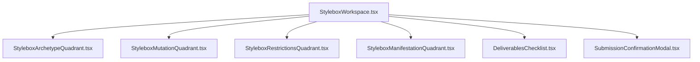
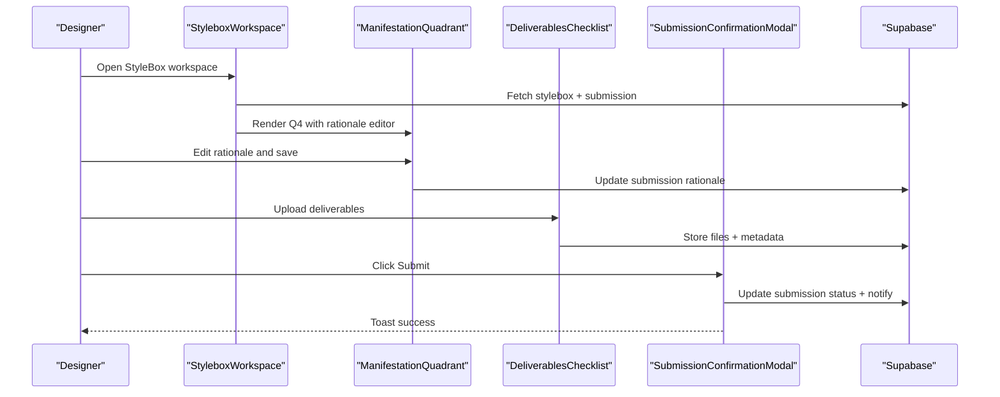
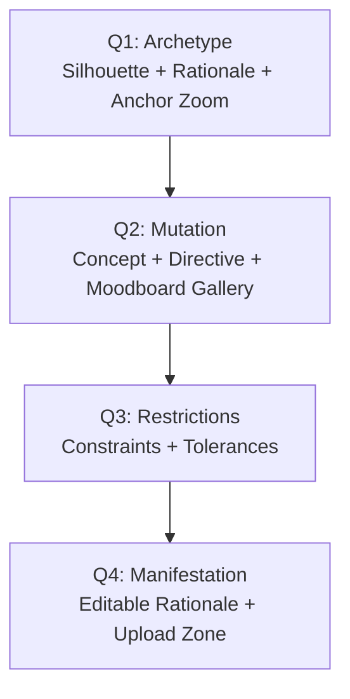
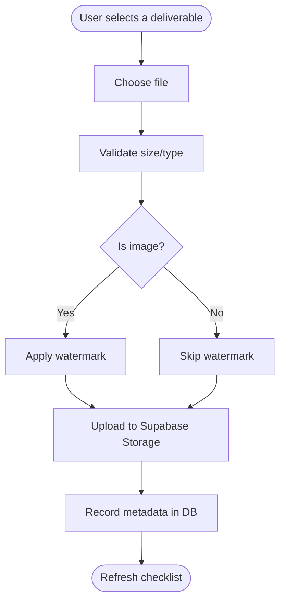
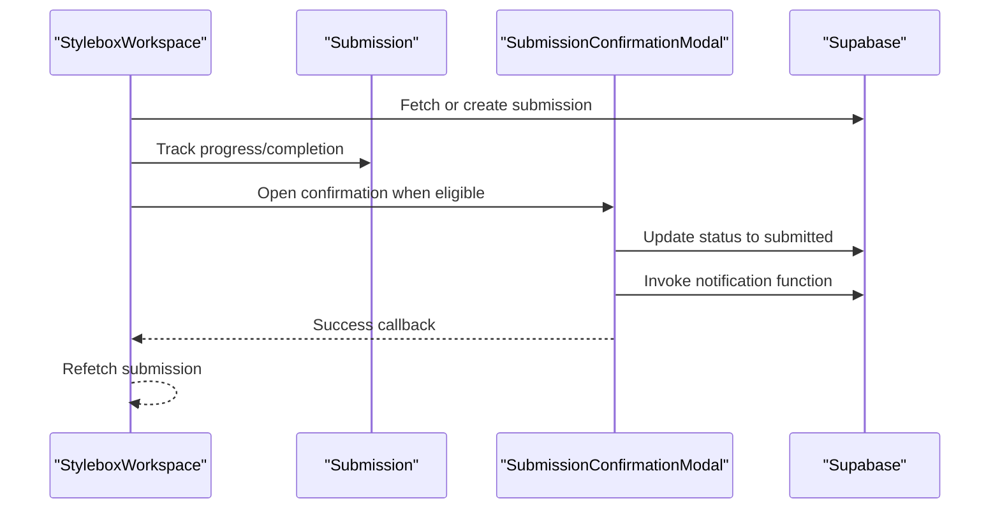
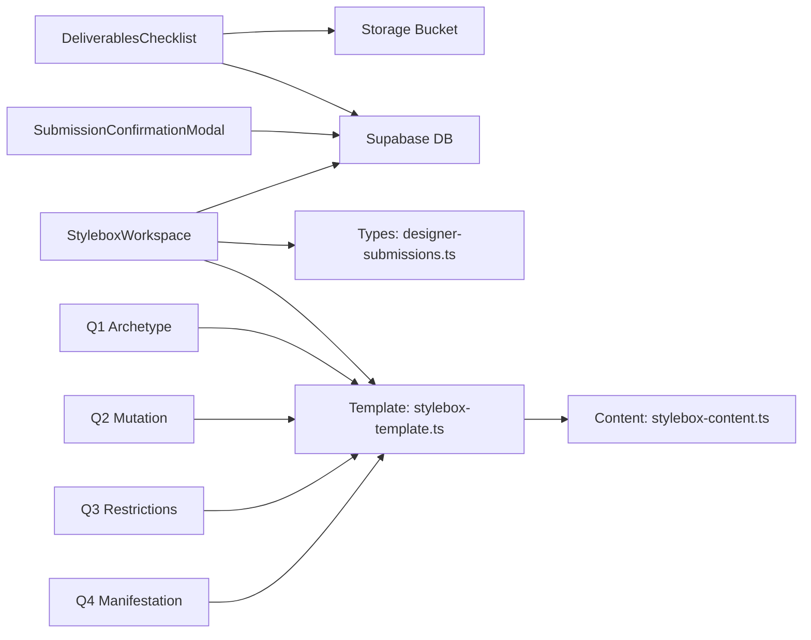

# Submission Workspace

<cite>
**Referenced Files in This Document**
- [StyleboxWorkspace.tsx](file://src/pages/StyleboxWorkspace.tsx)
- [StyleboxArchetypeQuadrant.tsx](file://src/components/stylebox/workspace/StyleboxArchetypeQuadrant.tsx)
- [StyleboxMutationQuadrant.tsx](file://src/components/stylebox/workspace/StyleboxMutationQuadrant.tsx)
- [StyleboxRestrictionsQuadrant.tsx](file://src/components/stylebox/workspace/StyleboxRestrictionsQuadrant.tsx)
- [StyleboxManifestationQuadrant.tsx](file://src/components/stylebox/workspace/StyleboxManifestationQuadrant.tsx)
- [DeliverablesChecklist.tsx](file://src/components/stylebox/workspace/DeliverablesChecklist.tsx)
- [SubmissionConfirmationModal.tsx](file://src/components/stylebox/workspace/SubmissionConfirmationModal.tsx)
- [designer-submissions.ts](file://src/types/designer-submissions.ts)
- [stylebox-template.ts](file://src/lib/stylebox-template.ts)
- [stylebox-content.ts](file://src/lib/stylebox-content.ts)
- [StyleboxWizard.tsx](file://src/components/admin/stylebox-wizard/StyleboxWizard.tsx)
- [WizardContext.tsx](file://src/components/admin/stylebox-wizard/WizardContext.tsx)
</cite>

## Table of Contents
1. [Introduction](#introduction)
2. [Project Structure](#project-structure)
3. [Core Components](#core-components)
4. [Architecture Overview](#architecture-overview)
5. [Detailed Component Analysis](#detailed-component-analysis)
6. [Dependency Analysis](#dependency-analysis)
7. [Performance Considerations](#performance-considerations)
8. [Troubleshooting Guide](#troubleshooting-guide)
9. [Conclusion](#conclusion)
10. [Appendices](#appendices)

## Introduction
This document describes the Submission Workspace interface used by designers to complete StyleBox challenges. It explains the quadrant-based design methodology (Q1 Archetype, Q2 Mutation, Q3 Restrictions, Q4 Manifestation), interactive components, drag-and-drop-like upload flow, real-time preview affordances, and the submission workflow including draft saving, revision tracking, and collaborative editing readiness. It also provides best practices for each quadrant and troubleshooting guidance.

## Project Structure
The workspace is composed of:
- A top header bar with navigation, status badges, darkroom mode toggle, and actions
- A 2x2 grid of quadrants (Q1–Q4) representing the Adorzia Protocol
- A right sidebar with the deliverables checklist and submission controls
- A modal for final submission confirmation

**Diagram sources**
- [StyleboxWorkspace.tsx](file://src/pages/StyleboxWorkspace.tsx#L29-L411)
- [StyleboxArchetypeQuadrant.tsx](file://src/components/stylebox/workspace/StyleboxArchetypeQuadrant.tsx#L20-L204)
- [StyleboxMutationQuadrant.tsx](file://src/components/stylebox/workspace/StyleboxMutationQuadrant.tsx#L19-L229)
- [StyleboxRestrictionsQuadrant.tsx](file://src/components/stylebox/workspace/StyleboxRestrictionsQuadrant.tsx#L24-L229)
- [StyleboxManifestationQuadrant.tsx](file://src/components/stylebox/workspace/StyleboxManifestationQuadrant.tsx#L21-L201)
- [DeliverablesChecklist.tsx](file://src/components/stylebox/workspace/DeliverablesChecklist.tsx#L38-L373)
- [SubmissionConfirmationModal.tsx](file://src/components/stylebox/workspace/SubmissionConfirmationModal.tsx#L26-L270)

**Section sources**
- [StyleboxWorkspace.tsx](file://src/pages/StyleboxWorkspace.tsx#L29-L411)

## Core Components
- StyleboxWorkspace: orchestrates data fetching, auto-save, status display, and renders the quadrant grid and sidebar.
- Quadrant components: present Q1/Q2/Q3/Q4 content and interactions.
- DeliverablesChecklist: manages file uploads, progress, and submission gating.
- SubmissionConfirmationModal: finalizes submission and triggers notifications.

**Section sources**
- [StyleboxWorkspace.tsx](file://src/pages/StyleboxWorkspace.tsx#L29-L411)
- [StyleboxArchetypeQuadrant.tsx](file://src/components/stylebox/workspace/StyleboxArchetypeQuadrant.tsx#L20-L204)
- [StyleboxMutationQuadrant.tsx](file://src/components/stylebox/workspace/StyleboxMutationQuadrant.tsx#L19-L229)
- [StyleboxRestrictionsQuadrant.tsx](file://src/components/stylebox/workspace/StyleboxRestrictionsQuadrant.tsx#L24-L229)
- [StyleboxManifestationQuadrant.tsx](file://src/components/stylebox/workspace/StyleboxManifestationQuadrant.tsx#L21-L201)
- [DeliverablesChecklist.tsx](file://src/components/stylebox/workspace/DeliverablesChecklist.tsx#L38-L373)
- [SubmissionConfirmationModal.tsx](file://src/components/stylebox/workspace/SubmissionConfirmationModal.tsx#L26-L270)

## Architecture Overview
The workspace integrates designer submissions with Supabase for data persistence and storage, and uses a wizard context for admin-side StyleBox authoring. The designer’s workspace is read-only for Q1/Q2/Q3 and active for Q4 (manifestation), with a checklist-driven upload flow and submission gating.

**Diagram sources**
- [StyleboxWorkspace.tsx](file://src/pages/StyleboxWorkspace.tsx#L57-L117)
- [StyleboxManifestationQuadrant.tsx](file://src/components/stylebox/workspace/StyleboxManifestationQuadrant.tsx#L35-L64)
- [DeliverablesChecklist.tsx](file://src/components/stylebox/workspace/DeliverablesChecklist.tsx#L77-L162)
- [SubmissionConfirmationModal.tsx](file://src/components/stylebox/workspace/SubmissionConfirmationModal.tsx#L37-L88)

## Detailed Component Analysis

### Quadrant-Based Methodology
The workspace follows the Adorzia Protocol with four quadrants:
- Q1: Archetype (read-only) — presents silhouette, rationale, and anchor image with deep zoom.
- Q2: Mutation (read-only) — presents concept, directive, and moodboard gallery with full-screen viewer.
- Q3: Restrictions (read-only) — lists constraints and numerical tolerances.
- Q4: Manifestation (active) — editable rationale and upload zone.

**Diagram sources**
- [StyleboxArchetypeQuadrant.tsx](file://src/components/stylebox/workspace/StyleboxArchetypeQuadrant.tsx#L20-L204)
- [StyleboxMutationQuadrant.tsx](file://src/components/stylebox/workspace/StyleboxMutationQuadrant.tsx#L19-L229)
- [StyleboxRestrictionsQuadrant.tsx](file://src/components/stylebox/workspace/StyleboxRestrictionsQuadrant.tsx#L24-L229)
- [StyleboxManifestationQuadrant.tsx](file://src/components/stylebox/workspace/StyleboxManifestationQuadrant.tsx#L21-L201)

**Section sources**
- [StyleboxArchetypeQuadrant.tsx](file://src/components/stylebox/workspace/StyleboxArchetypeQuadrant.tsx#L20-L204)
- [StyleboxMutationQuadrant.tsx](file://src/components/stylebox/workspace/StyleboxMutationQuadrant.tsx#L19-L229)
- [StyleboxRestrictionsQuadrant.tsx](file://src/components/stylebox/workspace/StyleboxRestrictionsQuadrant.tsx#L24-L229)
- [StyleboxManifestationQuadrant.tsx](file://src/components/stylebox/workspace/StyleboxManifestationQuadrant.tsx#L21-L201)

### Interactive Workspace Components
- Darkroom mode toggle switches themes.
- Auto-save indicator shows last save time.
- Progress bar and counters reflect deliverables completion.
- Read-only vs. editable modes per quadrant and submission status.

**Section sources**
- [StyleboxWorkspace.tsx](file://src/pages/StyleboxWorkspace.tsx#L34-L129)

### Drag-and-Drop and Upload Integration
- The Q4 upload zone prompts users to use the sidebar checklist to upload files.
- The checklist handles file selection, watermarking for images, progress indication, and storage upload to Supabase.
- Accepted file types and sizes are validated; large files are handled with chunked upload messaging.

**Diagram sources**
- [DeliverablesChecklist.tsx](file://src/components/stylebox/workspace/DeliverablesChecklist.tsx#L77-L162)

**Section sources**
- [DeliverablesChecklist.tsx](file://src/components/stylebox/workspace/DeliverablesChecklist.tsx#L38-L373)

### Real-Time Preview Capabilities
- Archetype anchor image supports deep zoom with adjustable magnification.
- Mutation moodboard supports full-screen gallery with navigation arrows and thumbnails.
- Manifestation rationale is editable and saved immediately upon action.

**Section sources**
- [StyleboxArchetypeQuadrant.tsx](file://src/components/stylebox/workspace/StyleboxArchetypeQuadrant.tsx#L81-L201)
- [StyleboxMutationQuadrant.tsx](file://src/components/stylebox/workspace/StyleboxMutationQuadrant.tsx#L92-L226)
- [StyleboxManifestationQuadrant.tsx](file://src/components/stylebox/workspace/StyleboxManifestationQuadrant.tsx#L35-L64)

### Submission Editing Workflow
- Draft creation and retrieval per designer and StyleBox.
- Auto-save intervals refresh submission state.
- Submission gating ensures all deliverables are completed before enabling submit.
- Submission confirmation modal updates status and triggers notifications.

**Diagram sources**
- [StyleboxWorkspace.tsx](file://src/pages/StyleboxWorkspace.tsx#L73-L117)
- [SubmissionConfirmationModal.tsx](file://src/components/stylebox/workspace/SubmissionConfirmationModal.tsx#L37-L88)
- [designer-submissions.ts](file://src/types/designer-submissions.ts#L205-L207)

**Section sources**
- [StyleboxWorkspace.tsx](file://src/pages/StyleboxWorkspace.tsx#L73-L117)
- [SubmissionConfirmationModal.tsx](file://src/components/stylebox/workspace/SubmissionConfirmationModal.tsx#L26-L270)
- [designer-submissions.ts](file://src/types/designer-submissions.ts#L205-L207)

### Draft Saving, Revision Tracking, and Collaborative Editing
- Manifestation rationale is saved on demand with immediate feedback.
- Submission progress and versioning are tracked in the database.
- The admin wizard supports versioning and publishing lifecycle, aligning with collaborative review workflows.

**Section sources**
- [StyleboxManifestationQuadrant.tsx](file://src/components/stylebox/workspace/StyleboxManifestationQuadrant.tsx#L35-L64)
- [StyleboxWizard.tsx](file://src/components/admin/stylebox-wizard/StyleboxWizard.tsx#L197-L268)
- [WizardContext.tsx](file://src/components/admin/stylebox-wizard/WizardContext.tsx#L45-L101)

## Dependency Analysis
- Data sources: Supabase tables for styleboxes, stylebox_submissions, submission_files, and storage buckets.
- Types: Strongly typed submission and file interfaces ensure correctness across components.
- Templates: Admin wizard uses standardized StyleBox templates to populate quadrant data.

**Diagram sources**
- [StyleboxWorkspace.tsx](file://src/pages/StyleboxWorkspace.tsx#L57-L117)
- [DeliverablesChecklist.tsx](file://src/components/stylebox/workspace/DeliverablesChecklist.tsx#L77-L162)
- [SubmissionConfirmationModal.tsx](file://src/components/stylebox/workspace/SubmissionConfirmationModal.tsx#L37-L88)
- [designer-submissions.ts](file://src/types/designer-submissions.ts#L33-L67)
- [stylebox-template.ts](file://src/lib/stylebox-template.ts#L209-L282)
- [stylebox-content.ts](file://src/lib/stylebox-content.ts#L865-L926)

**Section sources**
- [StyleboxWorkspace.tsx](file://src/pages/StyleboxWorkspace.tsx#L57-L117)
- [DeliverablesChecklist.tsx](file://src/components/stylebox/workspace/DeliverablesChecklist.tsx#L77-L162)
- [SubmissionConfirmationModal.tsx](file://src/components/stylebox/workspace/SubmissionConfirmationModal.tsx#L37-L88)
- [designer-submissions.ts](file://src/types/designer-submissions.ts#L33-L67)
- [stylebox-template.ts](file://src/lib/stylebox-template.ts#L209-L282)
- [stylebox-content.ts](file://src/lib/stylebox-content.ts#L865-L926)

## Performance Considerations
- Auto-save intervals reduce manual save friction; ensure debounce to avoid excessive writes.
- Large file uploads benefit from chunked handling and progress reporting.
- Image watermarking adds processing overhead; consider async processing and caching.
- Gallery and zoom interactions should throttle re-renders and limit DOM updates.

[No sources needed since this section provides general guidance]

## Troubleshooting Guide
Common issues and resolutions:
- Submission not enabling: ensure all deliverables are marked uploaded and progress equals total deliverables.
- Upload failures: verify file size limits, supported formats, and storage permissions.
- Watermarking errors: confirm image processing pipeline availability and fallback behavior.
- Submission confirmation modal warnings: address incomplete deliverables or adjust expectations.

**Section sources**
- [DeliverablesChecklist.tsx](file://src/components/stylebox/workspace/DeliverablesChecklist.tsx#L318-L328)
- [SubmissionConfirmationModal.tsx](file://src/components/stylebox/workspace/SubmissionConfirmationModal.tsx#L189-L207)

## Conclusion
The Submission Workspace implements a quadrant-based design methodology aligned with the Adorzia Protocol. It provides a focused, distraction-free environment for designers to explore archetypes, understand mutations, adhere to restrictions, and manifest their ideas through editable rationale and curated deliverables. With robust upload integration, real-time previews, and a clear submission workflow, it supports efficient challenge completion and collaborative review readiness.

[No sources needed since this section summarizes without analyzing specific files]

## Appendices

### Best Practices by Quadrant
- Q1: Archetype
  - Use the anchor image zoom to validate proportions and textures against the silhouette.
  - Reference rationale to align your approach with the commercial constant.
- Q2: Mutation
  - Study the concept and directive to inform your interpretation of disruption.
  - Navigate the moodboard to gather inspiration and ensure alignment with the directive.
- Q3: Restrictions
  - Treat constraints as design enablers; document how you addressed each in your rationale.
  - Pay attention to numerical tolerances for feasibility.
- Q4: Manifestation
  - Write a clear rationale explaining your design decisions and constraint adherence.
  - Use the checklist to upload deliverables; ensure completeness before submission.

[No sources needed since this section provides general guidance]