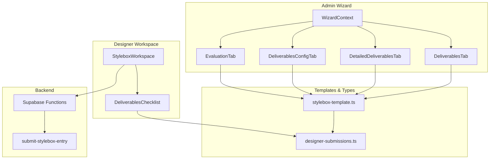
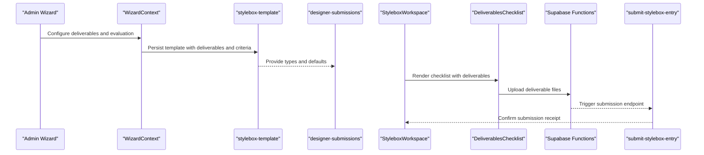
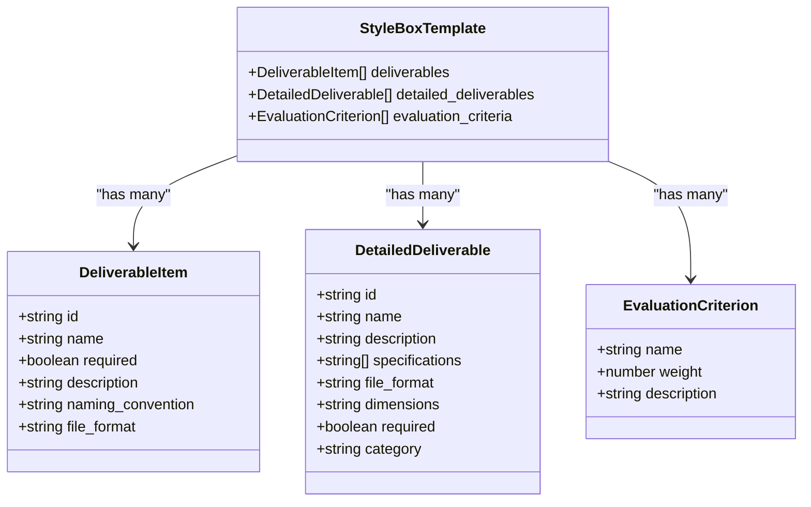
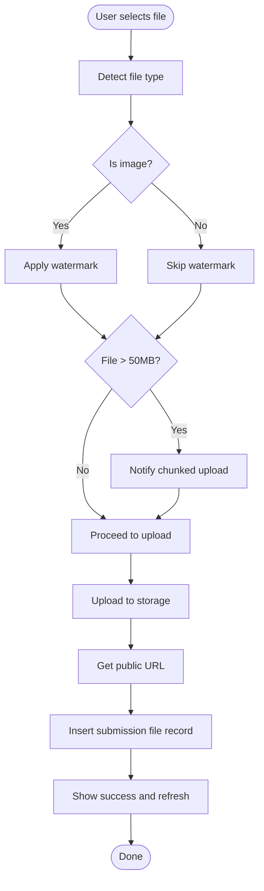
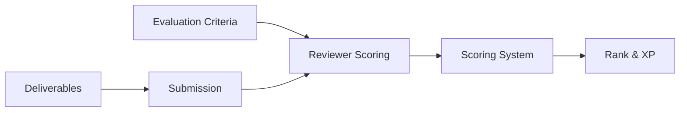
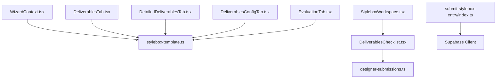

# Deliverables & Evaluation System

<cite>
**Referenced Files in This Document**
- [DeliverablesConfigTab.tsx](file://src/components/admin/stylebox-wizard/tabs/DeliverablesConfigTab.tsx)
- [DeliverablesTab.tsx](file://src/components/admin/stylebox-wizard/tabs/DeliverablesTab.tsx)
- [DetailedDeliverablesTab.tsx](file://src/components/admin/stylebox-wizard/tabs/DetailedDeliverablesTab.tsx)
- [EvaluationTab.tsx](file://src/components/admin/stylebox-wizard/tabs/EvaluationTab.tsx)
- [WizardContext.tsx](file://src/components/admin/stylebox-wizard/WizardContext.tsx)
- [stylebox-template.ts](file://src/lib/stylebox-template.ts)
- [designer-submissions.ts](file://src/types/designer-submissions.ts)
- [DeliverablesChecklist.tsx](file://src/components/stylebox/workspace/DeliverablesChecklist.tsx)
- [StyleboxWorkspace.tsx](file://src/pages/StyleboxWorkspace.tsx)
- [scoring.ts](file://src/lib/scoring.ts)
- [submit-stylebox-entry/index.ts](file://supabase/functions/submit-stylebox-entry/index.ts)
</cite>

## Table of Contents
1. [Introduction](#introduction)
2. [Project Structure](#project-structure)
3. [Core Components](#core-components)
4. [Architecture Overview](#architecture-overview)
5. [Detailed Component Analysis](#detailed-component-analysis)
6. [Dependency Analysis](#dependency-analysis)
7. [Performance Considerations](#performance-considerations)
8. [Troubleshooting Guide](#troubleshooting-guide)
9. [Conclusion](#conclusion)

## Introduction
This document explains the deliverables and evaluation system within the StyleBox creation workflow. It covers the differences between standard deliverables and detailed deliverables, configuration options for each, evaluation criteria setup, the deliverables checklist functionality, required versus optional deliverables, and how deliverables relate to scoring and review processes. Practical examples demonstrate how to configure deliverables for different design scenarios, set up evaluation rubrics, and manage deliverable requirements throughout the design process.

## Project Structure
The deliverables and evaluation system spans several components:
- Admin wizard tabs for configuration
- Template definitions and defaults
- Designer workspace checklist
- Submission and review integration
- Scoring and evaluation logic

**Diagram sources**
- [WizardContext.tsx](file://src/components/admin/stylebox-wizard/WizardContext.tsx#L45-L119)
- [DeliverablesTab.tsx](file://src/components/admin/stylebox-wizard/tabs/DeliverablesTab.tsx#L11-L198)
- [DetailedDeliverablesTab.tsx](file://src/components/admin/stylebox-wizard/tabs/DetailedDeliverablesTab.tsx#L29-L351)
- [DeliverablesConfigTab.tsx](file://src/components/admin/stylebox-wizard/tabs/DeliverablesConfigTab.tsx#L25-L187)
- [EvaluationTab.tsx](file://src/components/admin/stylebox-wizard/tabs/EvaluationTab.tsx#L11-L177)
- [stylebox-template.ts](file://src/lib/stylebox-template.ts#L188-L282)
- [designer-submissions.ts](file://src/types/designer-submissions.ts#L33-L100)
- [StyleboxWorkspace.tsx](file://src/pages/StyleboxWorkspace.tsx#L29-L412)
- [DeliverablesChecklist.tsx](file://src/components/stylebox/workspace/DeliverablesChecklist.tsx#L38-L374)
- [submit-stylebox-entry/index.ts](file://supabase/functions/submit-stylebox-entry/index.ts#L9-L142)

**Section sources**
- [WizardContext.tsx](file://src/components/admin/stylebox-wizard/WizardContext.tsx#L45-L119)
- [stylebox-template.ts](file://src/lib/stylebox-template.ts#L188-L282)
- [StyleboxWorkspace.tsx](file://src/pages/StyleboxWorkspace.tsx#L29-L412)

## Core Components
- Deliverables configuration (standard and detailed)
- Evaluation criteria setup
- Deliverables checklist in the designer workspace
- Submission pipeline and validation

Key responsibilities:
- Admin wizard: define deliverables and evaluation criteria
- Designer workspace: upload deliverables and track progress
- Backend: validate submissions and notify stakeholders

**Section sources**
- [DeliverablesTab.tsx](file://src/components/admin/stylebox-wizard/tabs/DeliverablesTab.tsx#L11-L198)
- [DetailedDeliverablesTab.tsx](file://src/components/admin/stylebox-wizard/tabs/DetailedDeliverablesTab.tsx#L29-L351)
- [DeliverablesConfigTab.tsx](file://src/components/admin/stylebox-wizard/tabs/DeliverablesConfigTab.tsx#L25-L187)
- [EvaluationTab.tsx](file://src/components/admin/stylebox-wizard/tabs/EvaluationTab.tsx#L11-L177)
- [DeliverablesChecklist.tsx](file://src/components/stylebox/workspace/DeliverablesChecklist.tsx#L38-L374)

## Architecture Overview
The deliverables and evaluation system integrates admin configuration with designer submission and backend validation.

**Diagram sources**
- [WizardContext.tsx](file://src/components/admin/stylebox-wizard/WizardContext.tsx#L53-L92)
- [stylebox-template.ts](file://src/lib/stylebox-template.ts#L429-L460)
- [designer-submissions.ts](file://src/types/designer-submissions.ts#L33-L100)
- [StyleboxWorkspace.tsx](file://src/pages/StyleboxWorkspace.tsx#L74-L117)
- [DeliverablesChecklist.tsx](file://src/components/stylebox/workspace/DeliverablesChecklist.tsx#L77-L162)
- [submit-stylebox-entry/index.ts](file://supabase/functions/submit-stylebox-entry/index.ts#L88-L106)

## Detailed Component Analysis

### Standard Deliverables vs Detailed Deliverables
- Standard deliverables: curated, category-aware deliverables included in the template. They are selected by category and can be marked required or optional.
- Detailed deliverables: granular, production-grade deliverables with categories, specifications, file formats, dimensions, and required flags.

Configuration options:
- Standard deliverables: name, description, required flag, naming convention, and removal.
- Detailed deliverables: name, description, category, specifications list, file format, dimensions, required flag, and expandable details.

**Diagram sources**
- [stylebox-template.ts](file://src/lib/stylebox-template.ts#L194-L201)
- [stylebox-template.ts](file://src/lib/stylebox-template.ts#L173-L182)
- [stylebox-template.ts](file://src/lib/stylebox-template.ts#L188-L192)
- [stylebox-template.ts](file://src/lib/stylebox-template.ts#L209-L282)

**Section sources**
- [DeliverablesTab.tsx](file://src/components/admin/stylebox-wizard/tabs/DeliverablesTab.tsx#L11-L198)
- [DetailedDeliverablesTab.tsx](file://src/components/admin/stylebox-wizard/tabs/DetailedDeliverablesTab.tsx#L29-L351)
- [stylebox-template.ts](file://src/lib/stylebox-template.ts#L340-L352)
- [stylebox-template.ts](file://src/lib/stylebox-template.ts#L173-L182)

### Deliverables Checklist Functionality
The checklist displays deliverables, tracks upload progress, applies watermarks for images, validates file sizes, and updates submission progress.

Key behaviors:
- File type detection and icons
- Watermark application for images
- Chunked upload messaging for large files
- Storage upload and database record creation
- Progress indicators and success/error notifications

**Diagram sources**
- [DeliverablesChecklist.tsx](file://src/components/stylebox/workspace/DeliverablesChecklist.tsx#L77-L162)
- [DeliverablesChecklist.tsx](file://src/components/stylebox/workspace/DeliverablesChecklist.tsx#L164-L178)

**Section sources**
- [DeliverablesChecklist.tsx](file://src/components/stylebox/workspace/DeliverablesChecklist.tsx#L38-L374)
- [StyleboxWorkspace.tsx](file://src/pages/StyleboxWorkspace.tsx#L337-L389)

### Evaluation Criteria Setup
Evaluation criteria define the scoring rubric with weights that must sum to 100%. Defaults include Creativity, On-Trend Alignment, Technical Accuracy, and Market Relevance.

Configuration options:
- Add/remove criteria
- Adjust weights with slider
- Reset to defaults
- Distribute evenly across existing criteria

Validation:
- Total weight validation
- Enforce 100% requirement

**Section sources**
- [EvaluationTab.tsx](file://src/components/admin/stylebox-wizard/tabs/EvaluationTab.tsx#L11-L177)
- [stylebox-template.ts](file://src/lib/stylebox-template.ts#L305-L310)

### Required vs Optional Deliverables
- Required deliverables: marked with a required badge and enforced for submission completion.
- Optional deliverables: can be added without blocking submission.

In the workspace:
- Required deliverables are visually emphasized
- Submission is disabled until all required deliverables are uploaded

**Section sources**
- [DeliverablesChecklist.tsx](file://src/components/stylebox/workspace/DeliverablesChecklist.tsx#L279-L286)
- [StyleboxWorkspace.tsx](file://src/pages/StyleboxWorkspace.tsx#L346-L368)

### Relationship to Scoring and Review
Scoring and review are separate from deliverables configuration but integrate with submissions:
- Scoring system calculates weighted contributions from StyleBox, Portfolio, Publications, and Selling
- Evaluation criteria inform reviewer scoring rubrics
- Submission completeness drives submission eligibility

**Diagram sources**
- [scoring.ts](file://src/lib/scoring.ts#L1-L239)
- [stylebox-template.ts](file://src/lib/stylebox-template.ts#L188-L192)
- [designer-submissions.ts](file://src/types/designer-submissions.ts#L33-L100)

**Section sources**
- [scoring.ts](file://src/lib/scoring.ts#L1-L239)
- [StyleboxWorkspace.tsx](file://src/pages/StyleboxWorkspace.tsx#L346-L368)

## Dependency Analysis
- Wizard tabs depend on WizardContext for state management and on stylebox-template for defaults and types.
- Designer workspace depends on stylebox-template for deliverables and on designer-submissions for submission types.
- Backend functions depend on Supabase client for authentication and storage operations.

**Diagram sources**
- [WizardContext.tsx](file://src/components/admin/stylebox-wizard/WizardContext.tsx#L45-L119)
- [DeliverablesTab.tsx](file://src/components/admin/stylebox-wizard/tabs/DeliverablesTab.tsx#L11-L198)
- [DetailedDeliverablesTab.tsx](file://src/components/admin/stylebox-wizard/tabs/DetailedDeliverablesTab.tsx#L29-L351)
- [DeliverablesConfigTab.tsx](file://src/components/admin/stylebox-wizard/tabs/DeliverablesConfigTab.tsx#L25-L187)
- [EvaluationTab.tsx](file://src/components/admin/stylebox-wizard/tabs/EvaluationTab.tsx#L11-L177)
- [stylebox-template.ts](file://src/lib/stylebox-template.ts#L188-L282)
- [designer-submissions.ts](file://src/types/designer-submissions.ts#L33-L100)
- [DeliverablesChecklist.tsx](file://src/components/stylebox/workspace/DeliverablesChecklist.tsx#L38-L374)
- [StyleboxWorkspace.tsx](file://src/pages/StyleboxWorkspace.tsx#L29-L412)
- [submit-stylebox-entry/index.ts](file://supabase/functions/submit-stylebox-entry/index.ts#L9-L142)

**Section sources**
- [WizardContext.tsx](file://src/components/admin/stylebox-wizard/WizardContext.tsx#L45-L119)
- [stylebox-template.ts](file://src/lib/stylebox-template.ts#L188-L282)
- [designer-submissions.ts](file://src/types/designer-submissions.ts#L33-L100)

## Performance Considerations
- Large file uploads: chunked upload messaging improves perceived performance for large assets.
- Watermark application: offloads image processing to client-side before upload to reduce backend load.
- Progress indicators: provide immediate feedback during upload and processing.
- Validation: client-side checks prevent unnecessary backend calls for invalid files.

[No sources needed since this section provides general guidance]

## Troubleshooting Guide
Common issues and resolutions:
- Missing deliverables: ensure at least one deliverable is configured in the wizard; otherwise, the designer cannot submit.
- Evaluation weights not summing to 100%: adjust weights until total equals 100%; use the "Distribute Evenly" or "Reset Defaults" buttons.
- Submission blocked: verify all required deliverables are uploaded; submission is disabled until checklist is complete.
- Upload failures: check file size limits (500MB max) and supported formats; confirm network connectivity and storage permissions.

**Section sources**
- [DeliverablesConfigTab.tsx](file://src/components/admin/stylebox-wizard/tabs/DeliverablesConfigTab.tsx#L170-L181)
- [EvaluationTab.tsx](file://src/components/admin/stylebox-wizard/tabs/EvaluationTab.tsx#L69-L88)
- [DeliverablesChecklist.tsx](file://src/components/stylebox/workspace/DeliverablesChecklist.tsx#L318-L326)
- [StyleboxWorkspace.tsx](file://src/pages/StyleboxWorkspace.tsx#L346-L368)

## Conclusion
The deliverables and evaluation system provides a structured framework for defining submission requirements and scoring criteria. Admins configure deliverables and evaluation rubrics in the wizard, while designers use the workspace checklist to upload deliverables and track progress. The backend enforces submission rules and notifies stakeholders upon successful submission. Proper configuration of required deliverables and balanced evaluation weights ensures a fair and efficient review process aligned with learning outcomes and commercial goals.