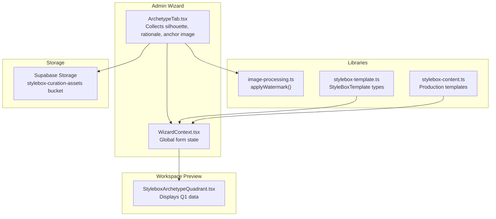
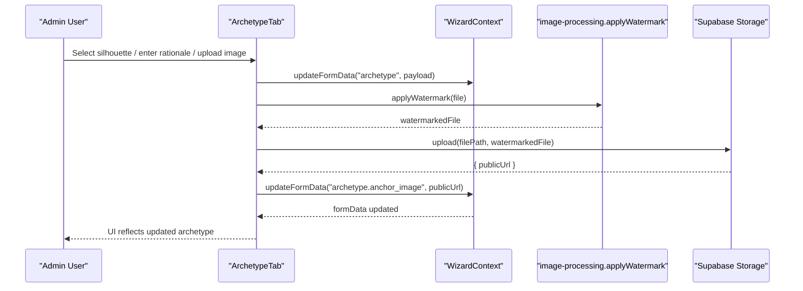
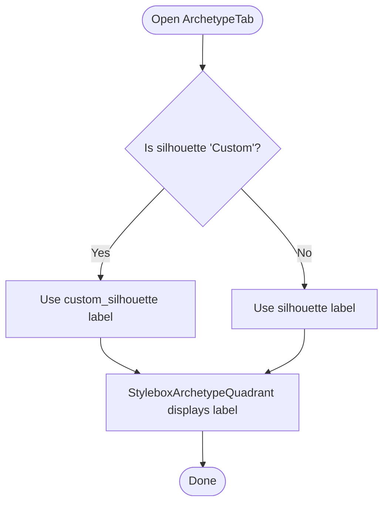
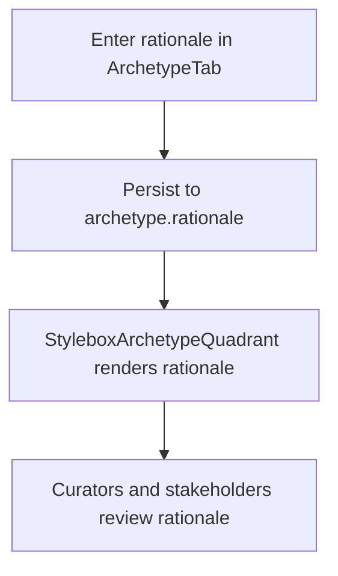
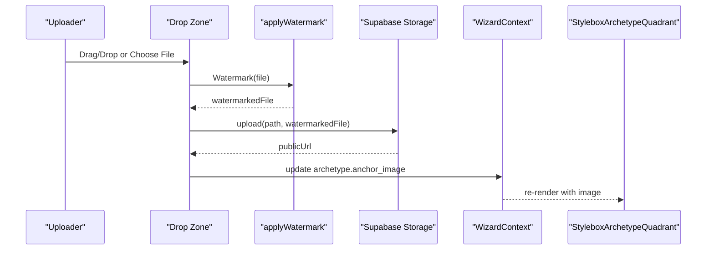
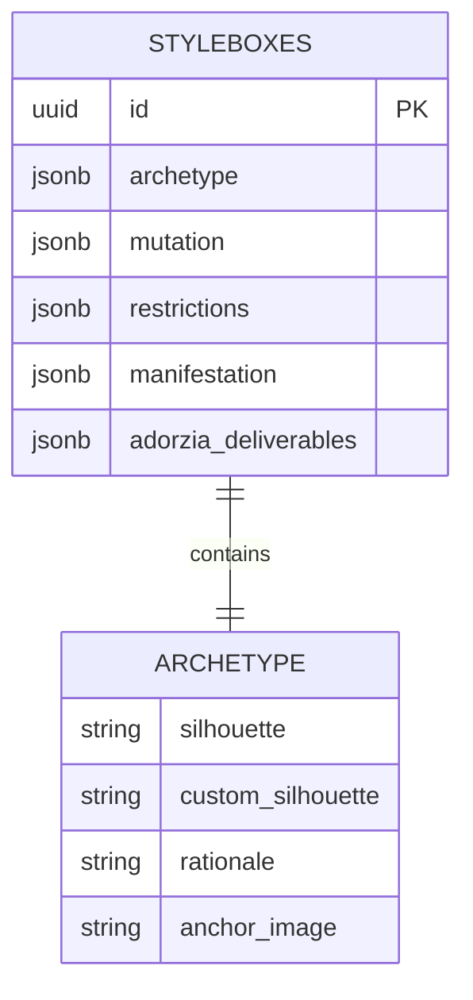
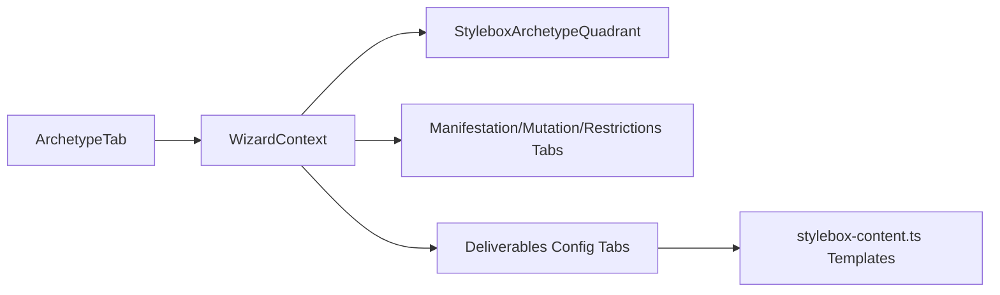
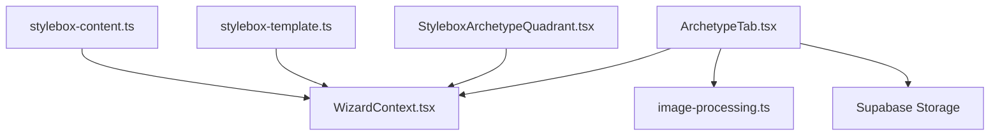

# Archetype Quadrant

<cite>
**Referenced Files in This Document**
- [StyleboxArchetypeQuadrant.tsx](file://src/components/stylebox/workspace/StyleboxArchetypeQuadrant.tsx)
- [ArchetypeTab.tsx](file://src/components/admin/stylebox-wizard/tabs/ArchetypeTab.tsx)
- [WizardContext.tsx](file://src/components/admin/stylebox-wizard/WizardContext.tsx)
- [image-processing.ts](file://src/lib/image-processing.ts)
- [stylebox-template.ts](file://src/lib/stylebox-template.ts)
- [stylebox-content.ts](file://src/lib/stylebox-content.ts)
- [20260130070000_complete_stylebox_schema.sql](file://supabase/migrations/20260130070000_complete_stylebox_schema.sql)
</cite>

## Table of Contents
1. [Introduction](#introduction)
2. [Project Structure](#project-structure)
3. [Core Components](#core-components)
4. [Architecture Overview](#architecture-overview)
5. [Detailed Component Analysis](#detailed-component-analysis)
6. [Dependency Analysis](#dependency-analysis)
7. [Performance Considerations](#performance-considerations)
8. [Troubleshooting Guide](#troubleshooting-guide)
9. [Conclusion](#conclusion)

## Introduction
The Archetype Quadrant component defines the foundational structure and “Commercial Constant” of a StyleBox design. It captures the silhouette classification (standard or custom), rationale and commercial logic, and an anchor reference image. This quadrant anchors the entire StyleBox creation workflow by establishing the core silhouette and rationale that inform downstream quadrants (Manifestation, Mutation, Restrictions) and deliverables.

## Project Structure
The Archetype Quadrant spans two primary UI layers:
- Admin wizard tab for authoring: collects silhouette, rationale, and anchor image via a drag-and-drop uploader with watermarking.
- Workspace quadrant for preview: displays the selected silhouette, rationale, and anchor image with deep zoom.

**Diagram sources**
- [ArchetypeTab.tsx](file://src/components/admin/stylebox-wizard/tabs/ArchetypeTab.tsx#L32-L218)
- [WizardContext.tsx](file://src/components/admin/stylebox-wizard/WizardContext.tsx#L45-L119)
- [image-processing.ts](file://src/lib/image-processing.ts#L17-L81)
- [stylebox-template.ts](file://src/lib/stylebox-template.ts#L209-L282)
- [stylebox-content.ts](file://src/lib/stylebox-content.ts#L1-L120)
- [StyleboxArchetypeQuadrant.tsx](file://src/components/stylebox/workspace/StyleboxArchetypeQuadrant.tsx#L20-L204)

**Section sources**
- [ArchetypeTab.tsx](file://src/components/admin/stylebox-wizard/tabs/ArchetypeTab.tsx#L32-L218)
- [StyleboxArchetypeQuadrant.tsx](file://src/components/stylebox/workspace/StyleboxArchetypeQuadrant.tsx#L20-L204)
- [WizardContext.tsx](file://src/components/admin/stylebox-wizard/WizardContext.tsx#L45-L119)
- [image-processing.ts](file://src/lib/image-processing.ts#L17-L81)
- [stylebox-template.ts](file://src/lib/stylebox-template.ts#L209-L282)
- [stylebox-content.ts](file://src/lib/stylebox-content.ts#L1-L120)

## Core Components
- ArchetypeTab: Authoring UI for Q1. Provides:
  - Silhouette selector with standard options and optional custom field.
  - Rich-text rationale input (Markdown supported).
  - Anchor image upload with drag-and-drop, watermarking, and Supabase storage.
- StyleboxArchetypeQuadrant: Preview UI for Q1. Displays:
  - Silhouette label (standard or custom).
  - “Commercial Constant” label.
  - Rationale text.
  - Anchor image with deep zoom modal and controls.
- WizardContext: Centralizes form state updates for the StyleBox wizard, including nested archetype updates.
- image-processing: Applies a watermark to uploaded images before saving.
- stylebox-template: Defines the StyleBoxTemplate structure used across the system.
- stylebox-content: Provides production-grade StyleBox templates and examples.
- Database schema: Stores archetype quadrant data as JSONB in the styleboxes table.

**Section sources**
- [ArchetypeTab.tsx](file://src/components/admin/stylebox-wizard/tabs/ArchetypeTab.tsx#L32-L218)
- [StyleboxArchetypeQuadrant.tsx](file://src/components/stylebox/workspace/StyleboxArchetypeQuadrant.tsx#L20-L204)
- [WizardContext.tsx](file://src/components/admin/stylebox-wizard/WizardContext.tsx#L45-L119)
- [image-processing.ts](file://src/lib/image-processing.ts#L17-L81)
- [stylebox-template.ts](file://src/lib/stylebox-template.ts#L209-L282)
- [stylebox-content.ts](file://src/lib/stylebox-content.ts#L1-L120)
- [20260130070000_complete_stylebox_schema.sql](file://supabase/migrations/20260130070000_complete_stylebox_schema.sql#L14-L18)

## Architecture Overview
The Archetype Quadrant integrates authoring and preview flows with backend storage and watermarking.

**Diagram sources**
- [ArchetypeTab.tsx](file://src/components/admin/stylebox-wizard/tabs/ArchetypeTab.tsx#L39-L78)
- [WizardContext.tsx](file://src/components/admin/stylebox-wizard/WizardContext.tsx#L53-L78)
- [image-processing.ts](file://src/lib/image-processing.ts#L17-L81)

## Detailed Component Analysis

### Silhouette Selection System
- Standard silhouettes include: A-Line, Ball Gown, Empire, Mermaid, Sheath, Exoskeletal, Modular, Asymmetrical, and Custom.
- When “Custom” is selected, a secondary input enables a custom silhouette label.
- Display logic resolves to either the custom label or the standard silhouette for preview.

**Diagram sources**
- [ArchetypeTab.tsx](file://src/components/admin/stylebox-wizard/tabs/ArchetypeTab.tsx#L107-L128)
- [StyleboxArchetypeQuadrant.tsx](file://src/components/stylebox/workspace/StyleboxArchetypeQuadrant.tsx#L27-L30)

**Section sources**
- [ArchetypeTab.tsx](file://src/components/admin/stylebox-wizard/tabs/ArchetypeTab.tsx#L20-L30)
- [ArchetypeTab.tsx](file://src/components/admin/stylebox-wizard/tabs/ArchetypeTab.tsx#L107-L128)
- [StyleboxArchetypeQuadrant.tsx](file://src/components/stylebox/workspace/StyleboxArchetypeQuadrant.tsx#L27-L30)

### Rationale and Commercial Logic Input
- The rationale field accepts rich text with Markdown support.
- It is displayed prominently in the preview quadrant as the “Commercial Constant” explanation.
- The authoring tab includes a help icon and hint indicating Markdown formatting support.

**Diagram sources**
- [ArchetypeTab.tsx](file://src/components/admin/stylebox-wizard/tabs/ArchetypeTab.tsx#L131-L147)
- [StyleboxArchetypeQuadrant.tsx](file://src/components/stylebox/workspace/StyleboxArchetypeQuadrant.tsx#L71-L78)

**Section sources**
- [ArchetypeTab.tsx](file://src/components/admin/stylebox-wizard/tabs/ArchetypeTab.tsx#L131-L147)
- [StyleboxArchetypeQuadrant.tsx](file://src/components/stylebox/workspace/StyleboxArchetypeQuadrant.tsx#L71-L78)

### Anchor Reference Image Upload and Watermarking
- Drag-and-drop area with visual feedback and click-to-browse fallback.
- On drop/change, the file is watermarked using a centralized utility and uploaded to Supabase storage.
- The resulting public URL is stored in the archetype anchor_image field.
- Preview quadrant shows the anchor image with a zoom affordance and modal with zoom controls.

**Diagram sources**
- [ArchetypeTab.tsx](file://src/components/admin/stylebox-wizard/tabs/ArchetypeTab.tsx#L150-L214)
- [ArchetypeTab.tsx](file://src/components/admin/stylebox-wizard/tabs/ArchetypeTab.tsx#L43-L78)
- [image-processing.ts](file://src/lib/image-processing.ts#L17-L81)
- [StyleboxArchetypeQuadrant.tsx](file://src/components/stylebox/workspace/StyleboxArchetypeQuadrant.tsx#L81-L129)

**Section sources**
- [ArchetypeTab.tsx](file://src/components/admin/stylebox-wizard/tabs/ArchetypeTab.tsx#L150-L214)
- [ArchetypeTab.tsx](file://src/components/admin/stylebox-wizard/tabs/ArchetypeTab.tsx#L43-L78)
- [image-processing.ts](file://src/lib/image-processing.ts#L17-L81)
- [StyleboxArchetypeQuadrant.tsx](file://src/components/stylebox/workspace/StyleboxArchetypeQuadrant.tsx#L81-L129)

### Data Model and Validation
- Frontend data model: The archetype quadrant data is part of the StyleBoxTemplate and is updated via WizardContext.
- Backend schema: The styleboxes table stores archetype quadrant data as JSONB columns, enabling flexible, schema-less storage of silhouette, rationale, and anchor image.
- Validation: The authoring tab enforces required fields for silhouette and anchor image. The watermarking and upload pipeline ensures processed assets are stored and retrievable.

**Diagram sources**
- [20260130070000_complete_stylebox_schema.sql](file://supabase/migrations/20260130070000_complete_stylebox_schema.sql#L14-L18)
- [stylebox-template.ts](file://src/lib/stylebox-template.ts#L209-L282)

**Section sources**
- [20260130070000_complete_stylebox_schema.sql](file://supabase/migrations/20260130070000_complete_stylebox_schema.sql#L14-L18)
- [stylebox-template.ts](file://src/lib/stylebox-template.ts#L209-L282)
- [ArchetypeTab.tsx](file://src/components/admin/stylebox-wizard/tabs/ArchetypeTab.tsx#L105-L109)
- [ArchetypeTab.tsx](file://src/components/admin/stylebox-wizard/tabs/ArchetypeTab.tsx#L152-L158)

### Integration with StyleBox Creation Workflow
- The Archetype Quadrant feeds downstream quadrants and deliverables by establishing the foundational silhouette and rationale.
- Production templates demonstrate how quadrants and deliverables evolve across levels and studios.

**Diagram sources**
- [ArchetypeTab.tsx](file://src/components/admin/stylebox-wizard/tabs/ArchetypeTab.tsx#L32-L218)
- [WizardContext.tsx](file://src/components/admin/stylebox-wizard/WizardContext.tsx#L45-L119)
- [stylebox-content.ts](file://src/lib/stylebox-content.ts#L1-L120)

**Section sources**
- [ArchetypeTab.tsx](file://src/components/admin/stylebox-wizard/tabs/ArchetypeTab.tsx#L32-L218)
- [WizardContext.tsx](file://src/components/admin/stylebox-wizard/WizardContext.tsx#L45-L119)
- [stylebox-content.ts](file://src/lib/stylebox-content.ts#L1-L120)

## Dependency Analysis
- ArchetypeTab depends on:
  - WizardContext for state updates.
  - image-processing for watermarking.
  - Supabase storage for uploads.
- StyleboxArchetypeQuadrant depends on:
  - Data passed from WizardContext.
  - UI primitives for dialogs and buttons.
- Libraries:
  - stylebox-template defines the canonical StyleBoxTemplate structure.
  - stylebox-content provides production-grade examples and constraints.

**Diagram sources**
- [ArchetypeTab.tsx](file://src/components/admin/stylebox-wizard/tabs/ArchetypeTab.tsx#L32-L218)
- [StyleboxArchetypeQuadrant.tsx](file://src/components/stylebox/workspace/StyleboxArchetypeQuadrant.tsx#L20-L204)
- [WizardContext.tsx](file://src/components/admin/stylebox-wizard/WizardContext.tsx#L45-L119)
- [image-processing.ts](file://src/lib/image-processing.ts#L17-L81)
- [stylebox-template.ts](file://src/lib/stylebox-template.ts#L209-L282)
- [stylebox-content.ts](file://src/lib/stylebox-content.ts#L1-L120)

**Section sources**
- [ArchetypeTab.tsx](file://src/components/admin/stylebox-wizard/tabs/ArchetypeTab.tsx#L32-L218)
- [StyleboxArchetypeQuadrant.tsx](file://src/components/stylebox/workspace/StyleboxArchetypeQuadrant.tsx#L20-L204)
- [WizardContext.tsx](file://src/components/admin/stylebox-wizard/WizardContext.tsx#L45-L119)
- [image-processing.ts](file://src/lib/image-processing.ts#L17-L81)
- [stylebox-template.ts](file://src/lib/stylebox-template.ts#L209-L282)
- [stylebox-content.ts](file://src/lib/stylebox-content.ts#L1-L120)

## Performance Considerations
- Watermarking occurs client-side using Canvas, which is efficient for small to medium images. For very large images, consider server-side processing to avoid long client-side operations.
- Drag-and-drop upload triggers immediate watermarking and upload; consider debouncing or queueing for multiple simultaneous uploads.
- Deep zoom modal scales the image client-side; large images may impact rendering performance.

## Troubleshooting Guide
- Upload fails:
  - Verify the watermarking utility executes without errors.
  - Confirm Supabase storage bucket permissions and file size limits.
- Watermark not visible:
  - Check opacity and color settings in the watermark utility.
  - Ensure the image MIME type is supported.
- Preview not updating:
  - Confirm WizardContext update is called with the correct archetype keys.
  - Verify the preview component receives updated props.

**Section sources**
- [ArchetypeTab.tsx](file://src/components/admin/stylebox-wizard/tabs/ArchetypeTab.tsx#L43-L78)
- [image-processing.ts](file://src/lib/image-processing.ts#L17-L81)
- [StyleboxArchetypeQuadrant.tsx](file://src/components/stylebox/workspace/StyleboxArchetypeQuadrant.tsx#L81-L129)

## Conclusion
The Archetype Quadrant establishes the foundational structure and “Commercial Constant” for a StyleBox. It integrates a robust authoring experience with watermarking and storage, and it cleanly feeds downstream quadrants and deliverables. The component’s design balances flexibility (custom silhouette) with standardization (rich rationale and anchor image), ensuring strong alignment across the StyleBox creation workflow.