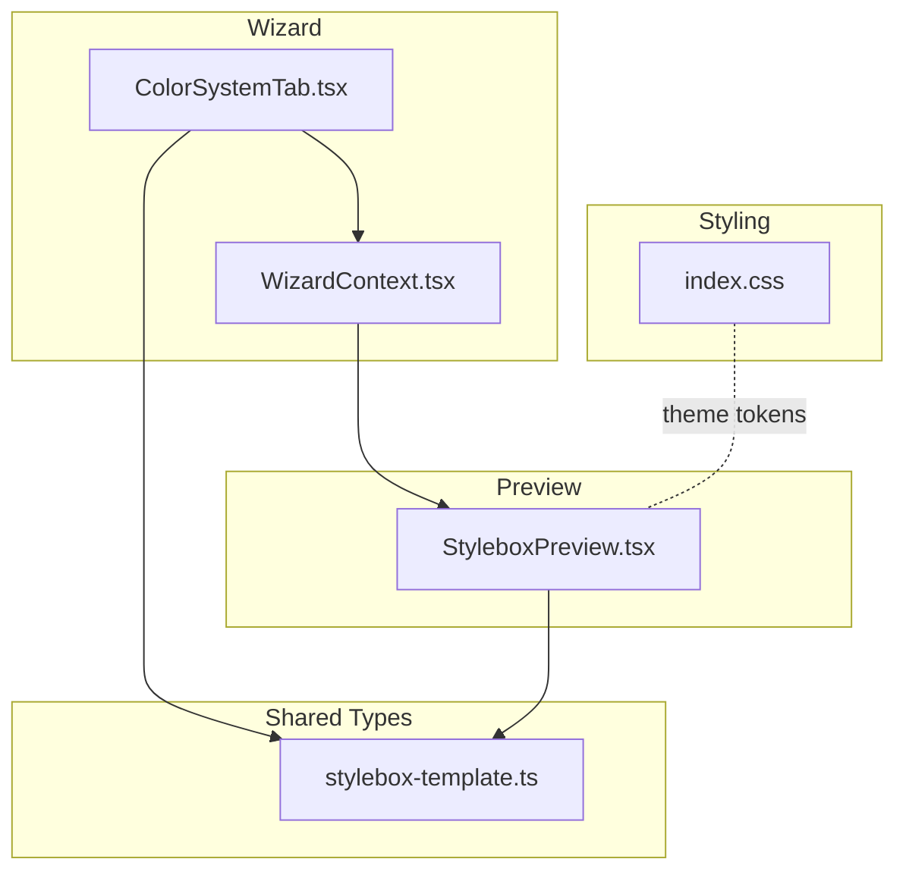
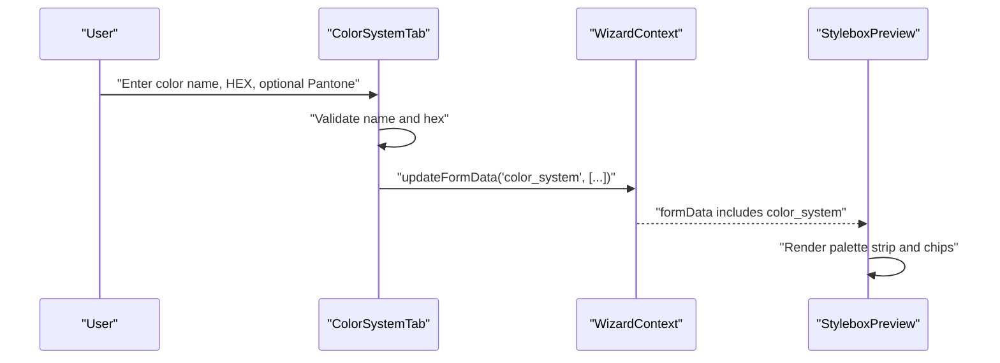
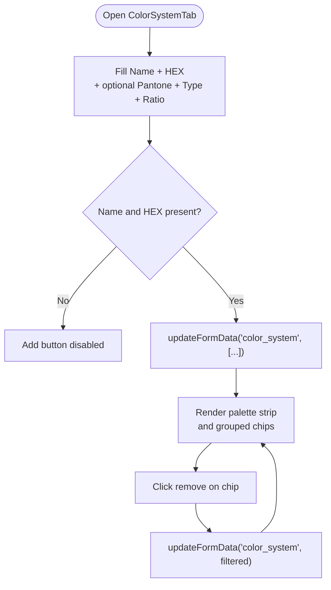
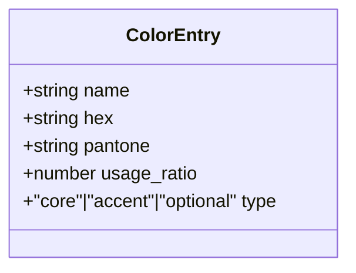
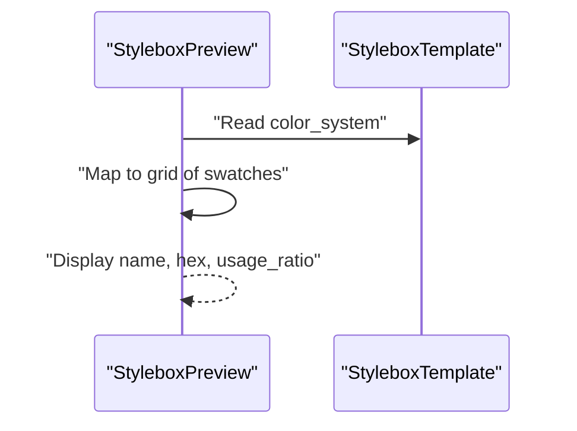
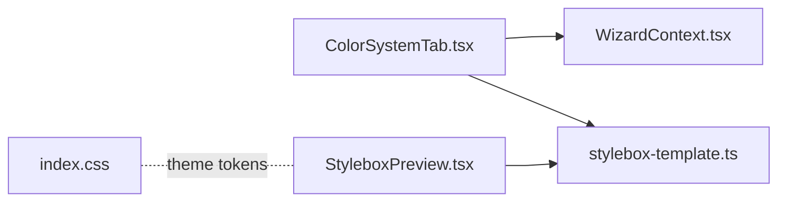

# Color System Quadrant

<cite>
**Referenced Files in This Document**
- [ColorSystemTab.tsx](file://src/components/admin/stylebox-wizard/tabs/ColorSystemTab.tsx)
- [WizardContext.tsx](file://src/components/admin/stylebox-wizard/WizardContext.tsx)
- [stylebox-template.ts](file://src/lib/stylebox-template.ts)
- [StyleboxPreview.tsx](file://src/pages/StyleboxPreview.tsx)
- [index.css](file://src/index.css)
- [stylebox-content.ts](file://src/lib/stylebox-content.ts)
</cite>

## Table of Contents
1. [Introduction](#introduction)
2. [Project Structure](#project-structure)
3. [Core Components](#core-components)
4. [Architecture Overview](#architecture-overview)
5. [Detailed Component Analysis](#detailed-component-analysis)
6. [Dependency Analysis](#dependency-analysis)
7. [Performance Considerations](#performance-considerations)
8. [Troubleshooting Guide](#troubleshooting-guide)
9. [Conclusion](#conclusion)

## Introduction
This document explains the Color System quadrant component within the Stylebox wizard. It focuses on how designers define and manage color palettes, how the system captures color metadata (name, HEX, optional Pantone, type, and usage ratio), and how the resulting palette is rendered and consumed downstream. It also outlines configuration options, user interface affordances, and how the color system integrates with broader design elements such as deliverables, visual direction, and preview surfaces.

## Project Structure
The Color System quadrant is implemented as a dedicated tab in the Stylebox wizard and backed by shared type definitions and context. The preview page consumes the finalized color system for presentation.

**Diagram sources**
- [ColorSystemTab.tsx](file://src/components/admin/stylebox-wizard/tabs/ColorSystemTab.tsx#L17-L216)
- [WizardContext.tsx](file://src/components/admin/stylebox-wizard/WizardContext.tsx#L45-L119)
- [stylebox-template.ts](file://src/lib/stylebox-template.ts#L17-L24)
- [StyleboxPreview.tsx](file://src/pages/StyleboxPreview.tsx#L239-L487)
- [index.css](file://src/index.css#L130-L238)

**Section sources**
- [ColorSystemTab.tsx](file://src/components/admin/stylebox-wizard/tabs/ColorSystemTab.tsx#L17-L216)
- [WizardContext.tsx](file://src/components/admin/stylebox-wizard/WizardContext.tsx#L45-L119)
- [stylebox-template.ts](file://src/lib/stylebox-template.ts#L17-L24)
- [StyleboxPreview.tsx](file://src/pages/StyleboxPreview.tsx#L239-L487)
- [index.css](file://src/index.css#L130-L238)

## Core Components
- ColorSystemTab: The wizard tab that collects color entries, groups them by type, and previews the palette strip.
- WizardContext: Provides shared state and update functions for the entire Stylebox form, including color_system.
- ColorEntry type: Defines the structure for each color (name, hex, optional pantone, type, optional usage_ratio).
- StyleboxPreview: Renders the color system in the Stylebox preview, displaying swatches and usage percentages.

Key responsibilities:
- Capture color metadata and enforce minimal validation (name and hex).
- Group colors into Core, Accent, and Optional categories.
- Provide a palette strip and individual chips with removal affordances.
- Persist the color system into the Stylebox template via context.

**Section sources**
- [ColorSystemTab.tsx](file://src/components/admin/stylebox-wizard/tabs/ColorSystemTab.tsx#L17-L216)
- [WizardContext.tsx](file://src/components/admin/stylebox-wizard/WizardContext.tsx#L45-L119)
- [stylebox-template.ts](file://src/lib/stylebox-template.ts#L17-L24)
- [StyleboxPreview.tsx](file://src/pages/StyleboxPreview.tsx#L458-L487)

## Architecture Overview
The Color System quadrant follows a unidirectional data flow:
- Users add colors in the wizard tab.
- The tab updates the shared form state through the wizard context.
- The preview reads the finalized Stylebox template and renders the color system.

**Diagram sources**
- [ColorSystemTab.tsx](file://src/components/admin/stylebox-wizard/tabs/ColorSystemTab.tsx#L27-L44)
- [WizardContext.tsx](file://src/components/admin/stylebox-wizard/WizardContext.tsx#L53-L78)
- [StyleboxPreview.tsx](file://src/pages/StyleboxPreview.tsx#L239-L487)

## Detailed Component Analysis

### ColorSystemTab: Color Entry and Palette Management
Responsibilities:
- Provide a form to add a new color with name, HEX, optional Pantone, type, and usage ratio.
- Enforce basic validation (name and hex required).
- Persist the new color into the shared form state.
- Render a palette strip and categorized chips (Core, Accent, Optional).
- Allow removing colors via a chip’s action.

User interface highlights:
- Color picker and HEX input for quick color capture.
- Type selector constrained to core, accent, optional.
- Usage ratio field for each color.
- Palette strip visualization for immediate feedback.
- Grouped chips with dynamic text contrast based on luminance.

**Diagram sources**
- [ColorSystemTab.tsx](file://src/components/admin/stylebox-wizard/tabs/ColorSystemTab.tsx#L17-L216)

**Section sources**
- [ColorSystemTab.tsx](file://src/components/admin/stylebox-wizard/tabs/ColorSystemTab.tsx#L17-L216)

### WizardContext: Shared State and Updates
Responsibilities:
- Initialize and maintain the Stylebox form state.
- Provide updateFormData and updateNestedData helpers.
- Automatically adjust dependent fields when category or difficulty change (not directly related to color, but demonstrates state flow).

Integration with Color System:
- Exposes updateFormData for color_system updates.
- Ensures downstream consumers (preview) receive the latest state.

**Section sources**
- [WizardContext.tsx](file://src/components/admin/stylebox-wizard/WizardContext.tsx#L45-L119)

### ColorEntry Type: Data Model
Defines the shape of each color entry:
- Required: name, hex
- Optional: pantone, usage_ratio
- Type: one of core, accent, optional

Usage in wizard and preview:
- Wizard tab constructs ColorEntry instances and pushes them into color_system.
- Preview reads color_system to render swatches and usage badges.

**Diagram sources**
- [stylebox-template.ts](file://src/lib/stylebox-template.ts#L17-L24)

**Section sources**
- [stylebox-template.ts](file://src/lib/stylebox-template.ts#L17-L24)

### StyleboxPreview: Rendering the Color System
Responsibilities:
- Parse and render the finalized Stylebox template.
- Display the color system as a grid of swatches with labels and usage percentages.
- Integrate with the broader Stylebox preview layout.

**Diagram sources**
- [StyleboxPreview.tsx](file://src/pages/StyleboxPreview.tsx#L239-L487)

**Section sources**
- [StyleboxPreview.tsx](file://src/pages/StyleboxPreview.tsx#L239-L487)

### Color Theory, Harmony, and Practical Guidance
While the current implementation does not compute harmonies or undertones automatically, the structure supports:
- Core, Accent, Optional grouping to reflect hierarchy and balance.
- Usage ratio to indicate prominence and distribution.
- Optional Pantone identifiers for production alignment.

Designers can apply color theory by:
- Choosing 3–5 Core colors that anchor the palette.
- Adding 1–2 Accent colors for emphasis.
- Using Optional colors for flexibility and seasonal variants.
- Assigning usage ratios that reflect intended distribution.

[No sources needed since this section provides general guidance]

### Undertone and Seasonal Variations
The current Color System quadrant does not include dedicated fields for undertone or seasonal variants. However, the broader Stylebox template includes season and category fields, and the Founding Submissions module includes a seasonal launch target. These can be leveraged alongside the color system to align collections with seasonal trends and target audiences.

**Section sources**
- [stylebox-template.ts](file://src/lib/stylebox-template.ts#L209-L282)
- [useFoundingSubmissions.tsx](file://src/hooks/useFoundingSubmissions.tsx#L28-L55)

### Integration with Other Design Elements
- Deliverables: The standard deliverables include a Color Board, enabling designers to present the color system as part of the submission.
- Visual Direction: The color system complements moodboard images and visual keywords to communicate trend direction and aesthetic focus.
- Preview and Presentation: The preview page surfaces the color system prominently, aiding stakeholders in reviewing and approving the palette.

**Section sources**
- [stylebox-template.ts](file://src/lib/stylebox-template.ts#L340-L352)
- [StyleboxPreview.tsx](file://src/pages/StyleboxPreview.tsx#L458-L487)

### Practical Examples and Impact on Design Coherence
- Example 1: A bridal collection uses 4 Core colors for foundational wear, 1 Accent for trim details, and Optional colors for alternate seasonal editions. Usage ratios emphasize the dominant tones while reserving accents for key elements.
- Example 2: A textile collection defines Pantone specifications for screen printing, ensuring accurate reproduction across products.
- Example 3: A jewelry collection pairs metal and stone choices with the color system to maintain cohesive visual storytelling.

These examples illustrate how the Color System quadrant anchors design decisions, improves production alignment, and strengthens brand coherence.

[No sources needed since this section provides general guidance]

## Dependency Analysis
The Color System quadrant depends on:
- WizardContext for state updates.
- ColorEntry type for consistent data representation.
- Preview page for consumption and rendering.

**Diagram sources**
- [ColorSystemTab.tsx](file://src/components/admin/stylebox-wizard/tabs/ColorSystemTab.tsx#L17-L216)
- [WizardContext.tsx](file://src/components/admin/stylebox-wizard/WizardContext.tsx#L45-L119)
- [stylebox-template.ts](file://src/lib/stylebox-template.ts#L17-L24)
- [StyleboxPreview.tsx](file://src/pages/StyleboxPreview.tsx#L239-L487)
- [index.css](file://src/index.css#L130-L238)

**Section sources**
- [ColorSystemTab.tsx](file://src/components/admin/stylebox-wizard/tabs/ColorSystemTab.tsx#L17-L216)
- [WizardContext.tsx](file://src/components/admin/stylebox-wizard/WizardContext.tsx#L45-L119)
- [stylebox-template.ts](file://src/lib/stylebox-template.ts#L17-L24)
- [StyleboxPreview.tsx](file://src/pages/StyleboxPreview.tsx#L239-L487)
- [index.css](file://src/index.css#L130-L238)

## Performance Considerations
- Rendering efficiency: The palette strip and chips are simple DOM nodes; performance remains strong with typical palette sizes.
- Validation: Minimal client-side checks reduce overhead; server-side validation should be considered for production data persistence.
- Contrast calculation: The luminance-based text color logic is lightweight and suitable for real-time rendering.

[No sources needed since this section provides general guidance]

## Troubleshooting Guide
Common issues and resolutions:
- Missing name or HEX: The Add button is disabled until both are provided. Ensure both fields are filled before adding.
- Removing colors: Use the remove action on the chip; confirm the updated palette strip reflects the change.
- Preview not updating: Verify that the wizard has persisted the color_system into the shared form state and that the preview reads the updated template.

**Section sources**
- [ColorSystemTab.tsx](file://src/components/admin/stylebox-wizard/tabs/ColorSystemTab.tsx#L17-L216)
- [WizardContext.tsx](file://src/components/admin/stylebox-wizard/WizardContext.tsx#L53-L78)

## Conclusion
The Color System quadrant provides a focused, extensible foundation for defining and managing color palettes within the Stylebox workflow. By capturing essential metadata, grouping colors by type, and surfacing usage ratios, it enables coherent design decisions and seamless integration with deliverables, visual direction, and preview experiences. While advanced color theory features (harmony computation, undertone detection) are not currently implemented, the underlying data model supports future enhancements aligned with the existing architecture.