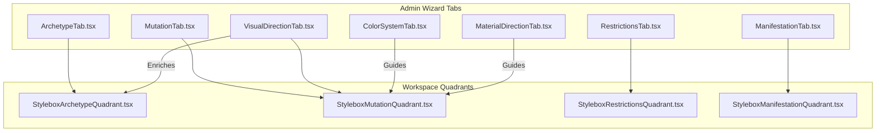
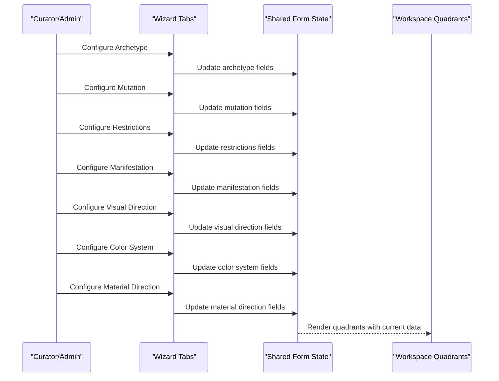
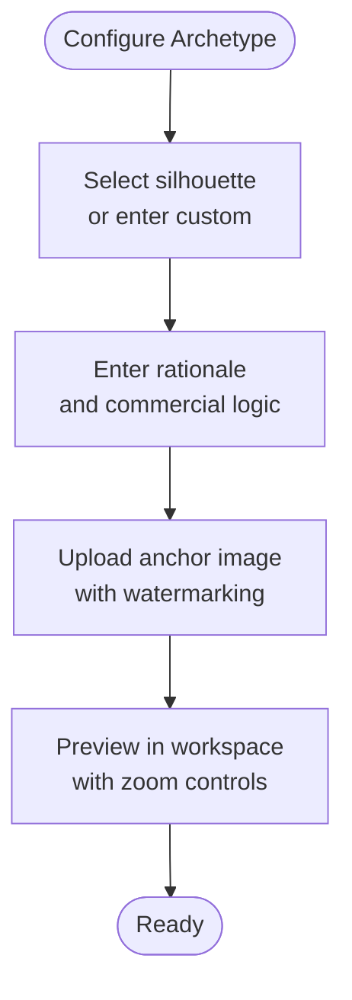
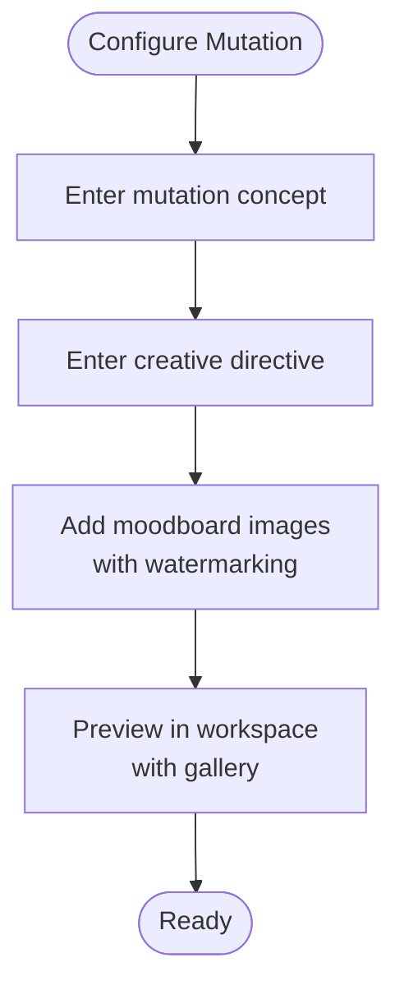
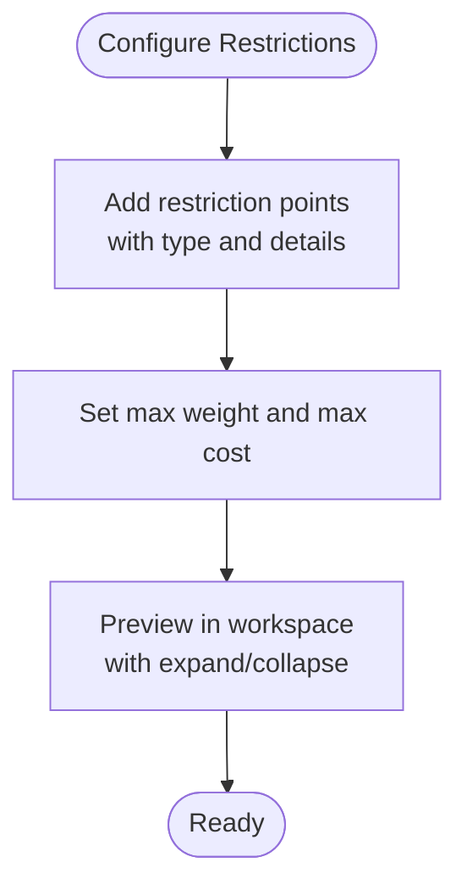
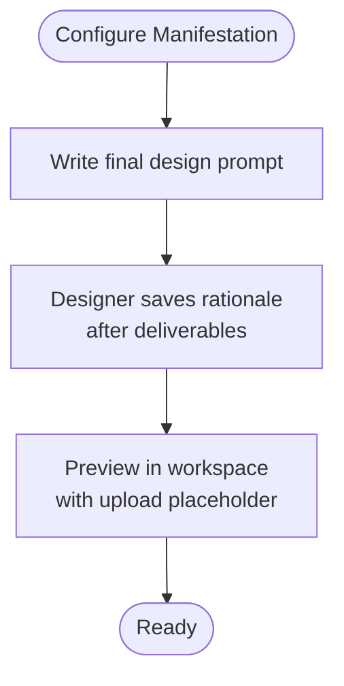
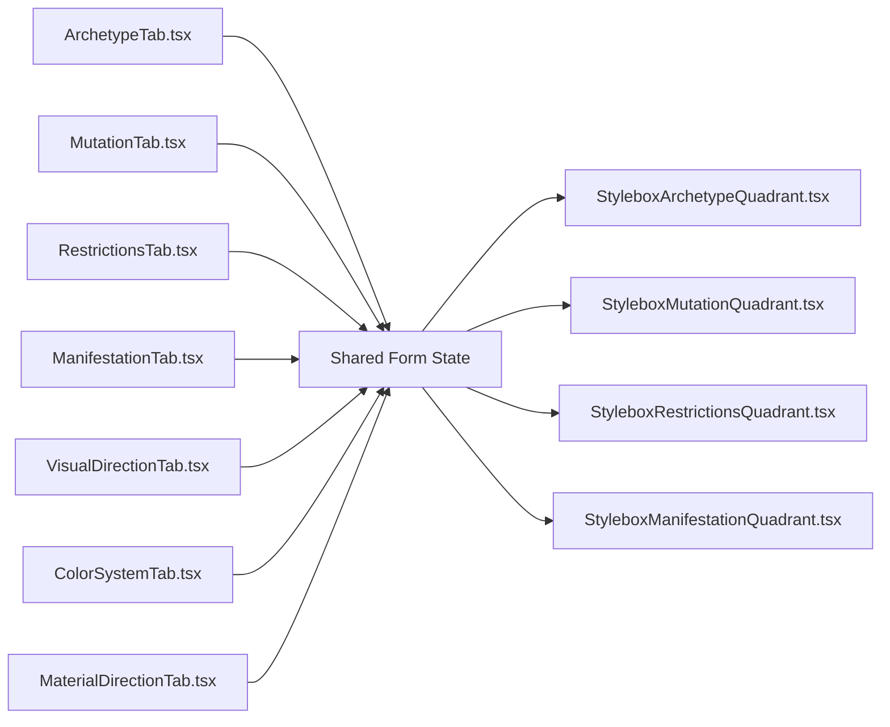

# Design Quadrant System

<cite>
**Referenced Files in This Document**
- [StyleboxArchetypeQuadrant.tsx](file://src/components/stylebox/workspace/StyleboxArchetypeQuadrant.tsx)
- [StyleboxMutationQuadrant.tsx](file://src/components/stylebox/workspace/StyleboxMutationQuadrant.tsx)
- [StyleboxRestrictionsQuadrant.tsx](file://src/components/stylebox/workspace/StyleboxRestrictionsQuadrant.tsx)
- [StyleboxManifestationQuadrant.tsx](file://src/components/stylebox/workspace/StyleboxManifestationQuadrant.tsx)
- [ArchetypeTab.tsx](file://src/components/admin/stylebox-wizard/tabs/ArchetypeTab.tsx)
- [MutationTab.tsx](file://src/components/admin/stylebox-wizard/tabs/MutationTab.tsx)
- [RestrictionsTab.tsx](file://src/components/admin/stylebox-wizard/tabs/RestrictionsTab.tsx)
- [ManifestationTab.tsx](file://src/components/admin/stylebox-wizard/tabs/ManifestationTab.tsx)
- [VisualDirectionTab.tsx](file://src/components/admin/stylebox-wizard/tabs/VisualDirectionTab.tsx)
- [ColorSystemTab.tsx](file://src/components/admin/stylebox-wizard/tabs/ColorSystemTab.tsx)
- [MaterialDirectionTab.tsx](file://src/components/admin/stylebox-wizard/tabs/MaterialDirectionTab.tsx)
</cite>

## Table of Contents
1. [Introduction](#introduction)
2. [Project Structure](#project-structure)
3. [Core Components](#core-components)
4. [Architecture Overview](#architecture-overview)
5. [Detailed Component Analysis](#detailed-component-analysis)
6. [Dependency Analysis](#dependency-analysis)
7. [Performance Considerations](#performance-considerations)
8. [Troubleshooting Guide](#troubleshooting-guide)
9. [Conclusion](#conclusion)

## Introduction
This document explains the four design quadrant system that defines stylebox creation: Archetype, Mutation, Restrictions, and Manifestation. It also documents supporting quadrants: Visual Direction, Color System, and Material Direction. Each quadrant captures a distinct aspect of the design process—identity and positioning, evolution and transformation, constraints and limitations, and expression and realization—while the supporting quadrants provide visual and material grounding. The guide covers configuration, relationships, and decision-making workflows to help curators and designers align creative intent with technical feasibility and brand coherence.

## Project Structure
The design quadrant system is implemented as:
- Four quadrant display components under the stylebox workspace
- Four wizard tabs under the admin stylebox wizard for configuration
- Three supporting quadrants (Visual Direction, Color System, Material Direction) for contextual enrichment

**Diagram sources**
- [ArchetypeTab.tsx](file://src/components/admin/stylebox-wizard/tabs/ArchetypeTab.tsx#L32-L218)
- [MutationTab.tsx](file://src/components/admin/stylebox-wizard/tabs/MutationTab.tsx#L12-L186)
- [RestrictionsTab.tsx](file://src/components/admin/stylebox-wizard/tabs/RestrictionsTab.tsx#L14-L184)
- [ManifestationTab.tsx](file://src/components/admin/stylebox-wizard/tabs/ManifestationTab.tsx#L6-L57)
- [VisualDirectionTab.tsx](file://src/components/admin/stylebox-wizard/tabs/VisualDirectionTab.tsx#L10-L189)
- [ColorSystemTab.tsx](file://src/components/admin/stylebox-wizard/tabs/ColorSystemTab.tsx#L17-L252)
- [MaterialDirectionTab.tsx](file://src/components/admin/stylebox-wizard/tabs/MaterialDirectionTab.tsx#L10-L363)
- [StyleboxArchetypeQuadrant.tsx](file://src/components/stylebox/workspace/StyleboxArchetypeQuadrant.tsx#L20-L205)
- [StyleboxMutationQuadrant.tsx](file://src/components/stylebox/workspace/StyleboxMutationQuadrant.tsx#L19-L230)
- [StyleboxRestrictionsQuadrant.tsx](file://src/components/stylebox/workspace/StyleboxRestrictionsQuadrant.tsx#L24-L230)
- [StyleboxManifestationQuadrant.tsx](file://src/components/stylebox/workspace/StyleboxManifestationQuadrant.tsx#L21-L202)

**Section sources**
- [ArchetypeTab.tsx](file://src/components/admin/stylebox-wizard/tabs/ArchetypeTab.tsx#L32-L218)
- [MutationTab.tsx](file://src/components/admin/stylebox-wizard/tabs/MutationTab.tsx#L12-L186)
- [RestrictionsTab.tsx](file://src/components/admin/stylebox-wizard/tabs/RestrictionsTab.tsx#L14-L184)
- [ManifestationTab.tsx](file://src/components/admin/stylebox-wizard/tabs/ManifestationTab.tsx#L6-L57)
- [VisualDirectionTab.tsx](file://src/components/admin/stylebox-wizard/tabs/VisualDirectionTab.tsx#L10-L189)
- [ColorSystemTab.tsx](file://src/components/admin/stylebox-wizard/tabs/ColorSystemTab.tsx#L17-L252)
- [MaterialDirectionTab.tsx](file://src/components/admin/stylebox-wizard/tabs/MaterialDirectionTab.tsx#L10-L363)
- [StyleboxArchetypeQuadrant.tsx](file://src/components/stylebox/workspace/StyleboxArchetypeQuadrant.tsx#L20-L205)
- [StyleboxMutationQuadrant.tsx](file://src/components/stylebox/workspace/StyleboxMutationQuadrant.tsx#L19-L230)
- [StyleboxRestrictionsQuadrant.tsx](file://src/components/stylebox/workspace/StyleboxRestrictionsQuadrant.tsx#L24-L230)
- [StyleboxManifestationQuadrant.tsx](file://src/components/stylebox/workspace/StyleboxManifestationQuadrant.tsx#L21-L202)

## Core Components
- Archetype (Q1): Establishes identity and positioning via silhouette, rationale, and an anchor reference image.
- Mutation (Q2): Defines conceptual disruption and creative direction through a concept, directive, and a mood board.
- Restrictions (Q3): Documents technical constraints and numerical tolerances to keep designs feasible.
- Manifestation (Q4): Captures the final prompt and rationale for realization, linking back to Archetype and Mutation.
- Visual Direction: Provides keywords and moodboard images to guide aesthetic direction.
- Color System: Defines palette entries with usage ratios and optional Pantone identifiers.
- Material Direction: Offers category-specific guidance for fabrics, trims, prints, construction, and jewelry materials.

**Section sources**
- [StyleboxArchetypeQuadrant.tsx](file://src/components/stylebox/workspace/StyleboxArchetypeQuadrant.tsx#L20-L205)
- [StyleboxMutationQuadrant.tsx](file://src/components/stylebox/workspace/StyleboxMutationQuadrant.tsx#L19-L230)
- [StyleboxRestrictionsQuadrant.tsx](file://src/components/stylebox/workspace/StyleboxRestrictionsQuadrant.tsx#L24-L230)
- [StyleboxManifestationQuadrant.tsx](file://src/components/stylebox/workspace/StyleboxManifestationQuadrant.tsx#L21-L202)
- [VisualDirectionTab.tsx](file://src/components/admin/stylebox-wizard/tabs/VisualDirectionTab.tsx#L10-L189)
- [ColorSystemTab.tsx](file://src/components/admin/stylebox-wizard/tabs/ColorSystemTab.tsx#L17-L252)
- [MaterialDirectionTab.tsx](file://src/components/admin/stylebox-wizard/tabs/MaterialDirectionTab.tsx#L10-L363)

## Architecture Overview
The wizard tabs collect configuration into a shared form state. Workspace quadrants render the current stylebox state for designers. Supporting quadrants enrich the Mutation quadrant with color and material guidance, while the Manifestation quadrant synthesizes the final prompt.

**Diagram sources**
- [ArchetypeTab.tsx](file://src/components/admin/stylebox-wizard/tabs/ArchetypeTab.tsx#L32-L218)
- [MutationTab.tsx](file://src/components/admin/stylebox-wizard/tabs/MutationTab.tsx#L12-L186)
- [RestrictionsTab.tsx](file://src/components/admin/stylebox-wizard/tabs/RestrictionsTab.tsx#L14-L184)
- [ManifestationTab.tsx](file://src/components/admin/stylebox-wizard/tabs/ManifestationTab.tsx#L6-L57)
- [VisualDirectionTab.tsx](file://src/components/admin/stylebox-wizard/tabs/VisualDirectionTab.tsx#L10-L189)
- [ColorSystemTab.tsx](file://src/components/admin/stylebox-wizard/tabs/ColorSystemTab.tsx#L17-L252)
- [MaterialDirectionTab.tsx](file://src/components/admin/stylebox-wizard/tabs/MaterialDirectionTab.tsx#L10-L363)
- [StyleboxArchetypeQuadrant.tsx](file://src/components/stylebox/workspace/StyleboxArchetypeQuadrant.tsx#L20-L205)
- [StyleboxMutationQuadrant.tsx](file://src/components/stylebox/workspace/StyleboxMutationQuadrant.tsx#L19-L230)
- [StyleboxRestrictionsQuadrant.tsx](file://src/components/stylebox/workspace/StyleboxRestrictionsQuadrant.tsx#L24-L230)
- [StyleboxManifestationQuadrant.tsx](file://src/components/stylebox/workspace/StyleboxManifestationQuadrant.tsx#L21-L202)

## Detailed Component Analysis

### Archetype Quadrant (Identity and Positioning)
- Purpose: Establish the foundational silhouette, rationale, and an anchor reference image.
- Key fields:
  - Silhouette selection (standard list or custom)
  - Rationale explaining commercial constant logic
  - Anchor image upload with watermarking and preview
- Workspace rendering:
  - Displays silhouette, rationale, and anchor image
  - Supports deep zoom modal with controls
- Configuration flow:
  - Curator sets silhouette and rationale in the wizard tab
  - Optional anchor image is uploaded and stored with watermarking
  - Workspace shows the chosen silhouette and rationale, with interactive zoom

**Diagram sources**
- [ArchetypeTab.tsx](file://src/components/admin/stylebox-wizard/tabs/ArchetypeTab.tsx#L32-L218)
- [StyleboxArchetypeQuadrant.tsx](file://src/components/stylebox/workspace/StyleboxArchetypeQuadrant.tsx#L20-L205)

**Section sources**
- [ArchetypeTab.tsx](file://src/components/admin/stylebox-wizard/tabs/ArchetypeTab.tsx#L32-L218)
- [StyleboxArchetypeQuadrant.tsx](file://src/components/stylebox/workspace/StyleboxArchetypeQuadrant.tsx#L20-L205)

### Mutation Quadrant (Evolution and Transformation)
- Purpose: Define the conceptual disruption and creative narrative.
- Key fields:
  - Mutation concept (high-level idea)
  - Creative directive (specific instructions)
  - Mood board images with drag-reorder capability
- Workspace rendering:
  - Shows concept, directive, and mood board grid
  - Full-screen gallery with navigation and thumbnails
- Configuration flow:
  - Curator adds concept and directive
  - Adds multiple mood board images with watermarking
  - Workspace renders the visual narrative and enables deep viewing

**Diagram sources**
- [MutationTab.tsx](file://src/components/admin/stylebox-wizard/tabs/MutationTab.tsx#L12-L186)
- [StyleboxMutationQuadrant.tsx](file://src/components/stylebox/workspace/StyleboxMutationQuadrant.tsx#L19-L230)

**Section sources**
- [MutationTab.tsx](file://src/components/admin/stylebox-wizard/tabs/MutationTab.tsx#L12-L186)
- [StyleboxMutationQuadrant.tsx](file://src/components/stylebox/workspace/StyleboxMutationQuadrant.tsx#L19-L230)

### Restrictions Quadrant (Constraints and Limitations)
- Purpose: Capture technical constraints and enforce numerical tolerances.
- Key fields:
  - Dynamic restriction points (type, label, collapsible details)
  - Numerical tolerances (max weight, max cost)
- Workspace rendering:
  - Lists restriction points with expandable details
  - Shows tolerances in a bordered summary area
- Configuration flow:
  - Curator adds restriction points with categories and details
  - Sets max weight and max cost
  - Workspace displays points and tolerances for review

**Diagram sources**
- [RestrictionsTab.tsx](file://src/components/admin/stylebox-wizard/tabs/RestrictionsTab.tsx#L14-L184)
- [StyleboxRestrictionsQuadrant.tsx](file://src/components/stylebox/workspace/StyleboxRestrictionsQuadrant.tsx#L24-L230)

**Section sources**
- [RestrictionsTab.tsx](file://src/components/admin/stylebox-wizard/tabs/RestrictionsTab.tsx#L14-L184)
- [StyleboxRestrictionsQuadrant.tsx](file://src/components/stylebox/workspace/StyleboxRestrictionsQuadrant.tsx#L24-L230)

### Manifestation Quadrant (Expression and Realization)
- Purpose: Synthesize the final prompt and rationale for realization.
- Key fields:
  - Design prompt (final instruction to the designer)
  - Rationale explaining how constraints were met
- Workspace rendering:
  - Displays the prompt prominently
  - Provides editable rationale with save action
  - Includes upload zone placeholder
- Configuration flow:
  - Curator writes the final prompt
  - Designer saves rationale after completing deliverables
  - Workspace shows prompt and rationale for review

**Diagram sources**
- [ManifestationTab.tsx](file://src/components/admin/stylebox-wizard/tabs/ManifestationTab.tsx#L6-L57)
- [StyleboxManifestationQuadrant.tsx](file://src/components/stylebox/workspace/StyleboxManifestationQuadrant.tsx#L21-L202)

**Section sources**
- [ManifestationTab.tsx](file://src/components/admin/stylebox-wizard/tabs/ManifestationTab.tsx#L6-L57)
- [StyleboxManifestationQuadrant.tsx](file://src/components/stylebox/workspace/StyleboxManifestationQuadrant.tsx#L21-L202)

### Visual Direction (Supporting Quadrant)
- Purpose: Provide keywords and moodboard images to guide aesthetics.
- Key fields:
  - Visual keywords (6–12 recommended)
  - Moodboard images with theme tags
- Configuration flow:
  - Curator adds keywords and images
  - Images can be tagged and removed
  - Enriches Archetype and Mutation visuals

**Section sources**
- [VisualDirectionTab.tsx](file://src/components/admin/stylebox-wizard/tabs/VisualDirectionTab.tsx#L10-L189)

### Color System (Supporting Quadrant)
- Purpose: Define palettes with usage ratios and optional Pantone identifiers.
- Key fields:
  - Color entries (name, HEX, optional Pantone)
  - Type classification (core, accent, optional)
  - Usage ratio per color
- Configuration flow:
  - Curator adds colors grouped by type
  - Palette preview shows color order
  - Guides Mutation mood board composition

**Section sources**
- [ColorSystemTab.tsx](file://src/components/admin/stylebox-wizard/tabs/ColorSystemTab.tsx#L17-L252)

### Material Direction (Supporting Quadrant)
- Purpose: Offer category-specific material and construction guidance.
- Key fields:
  - Fashion: fabrics, trims, silhouette guidance, layering rules, construction suggestions
  - Textile: print styles, surface techniques, repeat structure, print story
  - Jewelry: metals/plating, stones/crystals, metal hierarchy, scale/proportion, hardware mechanics
- Configuration flow:
  - Curator selects category and fills relevant fields
  - Guides Mutation decisions around materials and construction

**Section sources**
- [MaterialDirectionTab.tsx](file://src/components/admin/stylebox-wizard/tabs/MaterialDirectionTab.tsx#L10-L363)

## Dependency Analysis
- Wizard tabs depend on a shared form state to persist configuration across quadrants.
- Workspace quadrants render the current state for designers.
- Supporting quadrants influence Mutation by providing color and material guidance.
- Manifestation links back to Archetype and Mutation by synthesizing the final prompt and rationale.

**Diagram sources**
- [ArchetypeTab.tsx](file://src/components/admin/stylebox-wizard/tabs/ArchetypeTab.tsx#L32-L218)
- [MutationTab.tsx](file://src/components/admin/stylebox-wizard/tabs/MutationTab.tsx#L12-L186)
- [RestrictionsTab.tsx](file://src/components/admin/stylebox-wizard/tabs/RestrictionsTab.tsx#L14-L184)
- [ManifestationTab.tsx](file://src/components/admin/stylebox-wizard/tabs/ManifestationTab.tsx#L6-L57)
- [VisualDirectionTab.tsx](file://src/components/admin/stylebox-wizard/tabs/VisualDirectionTab.tsx#L10-L189)
- [ColorSystemTab.tsx](file://src/components/admin/stylebox-wizard/tabs/ColorSystemTab.tsx#L17-L252)
- [MaterialDirectionTab.tsx](file://src/components/admin/stylebox-wizard/tabs/MaterialDirectionTab.tsx#L10-L363)
- [StyleboxArchetypeQuadrant.tsx](file://src/components/stylebox/workspace/StyleboxArchetypeQuadrant.tsx#L20-L205)
- [StyleboxMutationQuadrant.tsx](file://src/components/stylebox/workspace/StyleboxMutationQuadrant.tsx#L19-L230)
- [StyleboxRestrictionsQuadrant.tsx](file://src/components/stylebox/workspace/StyleboxRestrictionsQuadrant.tsx#L24-L230)
- [StyleboxManifestationQuadrant.tsx](file://src/components/stylebox/workspace/StyleboxManifestationQuadrant.tsx#L21-L202)

**Section sources**
- [ArchetypeTab.tsx](file://src/components/admin/stylebox-wizard/tabs/ArchetypeTab.tsx#L32-L218)
- [MutationTab.tsx](file://src/components/admin/stylebox-wizard/tabs/MutationTab.tsx#L12-L186)
- [RestrictionsTab.tsx](file://src/components/admin/stylebox-wizard/tabs/RestrictionsTab.tsx#L14-L184)
- [ManifestationTab.tsx](file://src/components/admin/stylebox-wizard/tabs/ManifestationTab.tsx#L6-L57)
- [VisualDirectionTab.tsx](file://src/components/admin/stylebox-wizard/tabs/VisualDirectionTab.tsx#L10-L189)
- [ColorSystemTab.tsx](file://src/components/admin/stylebox-wizard/tabs/ColorSystemTab.tsx#L17-L252)
- [MaterialDirectionTab.tsx](file://src/components/admin/stylebox-wizard/tabs/MaterialDirectionTab.tsx#L10-L363)
- [StyleboxArchetypeQuadrant.tsx](file://src/components/stylebox/workspace/StyleboxArchetypeQuadrant.tsx#L20-L205)
- [StyleboxMutationQuadrant.tsx](file://src/components/stylebox/workspace/StyleboxMutationQuadrant.tsx#L19-L230)
- [StyleboxRestrictionsQuadrant.tsx](file://src/components/stylebox/workspace/StyleboxRestrictionsQuadrant.tsx#L24-L230)
- [StyleboxManifestationQuadrant.tsx](file://src/components/stylebox/workspace/StyleboxManifestationQuadrant.tsx#L21-L202)

## Performance Considerations
- Image uploads leverage watermarking; batch uploads are supported for mood boards to reduce repeated processing overhead.
- Workspace modals (zoom and gallery) use controlled state transitions to avoid unnecessary re-renders.
- Collapsible details in Restrictions reduce DOM clutter until expanded.
- Palette previews compute luminance once per color to optimize rendering.

## Troubleshooting Guide
- Upload failures:
  - Verify file types and sizes; watermarking errors surface via toast notifications.
  - Re-attempt upload after checking storage bucket permissions.
- Watermarking issues:
  - Ensure image-processing pipeline is healthy and storage URLs resolve correctly.
- Gallery navigation:
  - Confirm mood board array is populated; navigation arrows are hidden when single image.
- Rationale saving:
  - Check network connectivity; errors are surfaced via toast and state remains unchanged.

**Section sources**
- [ArchetypeTab.tsx](file://src/components/admin/stylebox-wizard/tabs/ArchetypeTab.tsx#L43-L78)
- [MutationTab.tsx](file://src/components/admin/stylebox-wizard/tabs/MutationTab.tsx#L22-L66)
- [StyleboxMutationQuadrant.tsx](file://src/components/stylebox/workspace/StyleboxMutationQuadrant.tsx#L162-L181)
- [StyleboxManifestationQuadrant.tsx](file://src/components/stylebox/workspace/StyleboxManifestationQuadrant.tsx#L35-L64)

## Conclusion
The four design quadrants—Archetype, Mutation, Restrictions, and Manifestation—form the backbone of stylebox creation by anchoring identity, enabling evolution, enforcing feasibility, and capturing realization. The supporting quadrants (Visual Direction, Color System, Material Direction) enrich the Mutation quadrant with visual and material guidance, ensuring cohesive and feasible outcomes. Together, they define a structured design philosophy that balances creative disruption with technical rigor and brand coherence.