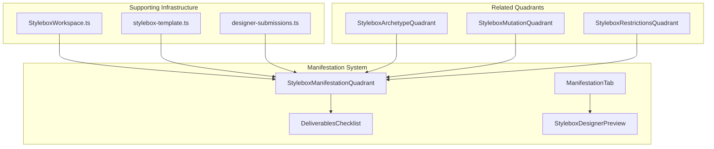
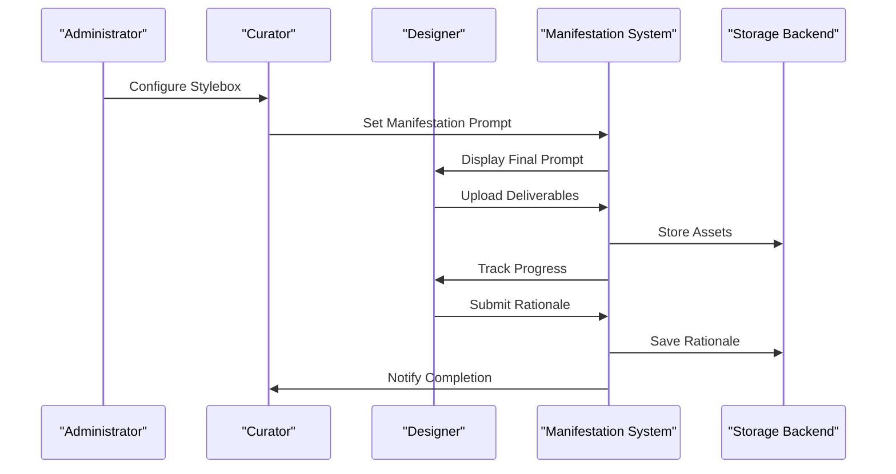
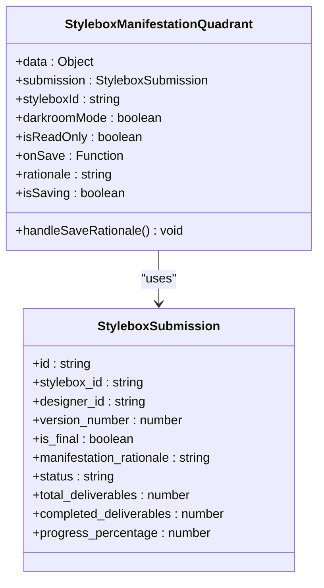
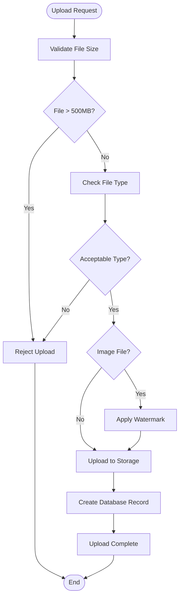
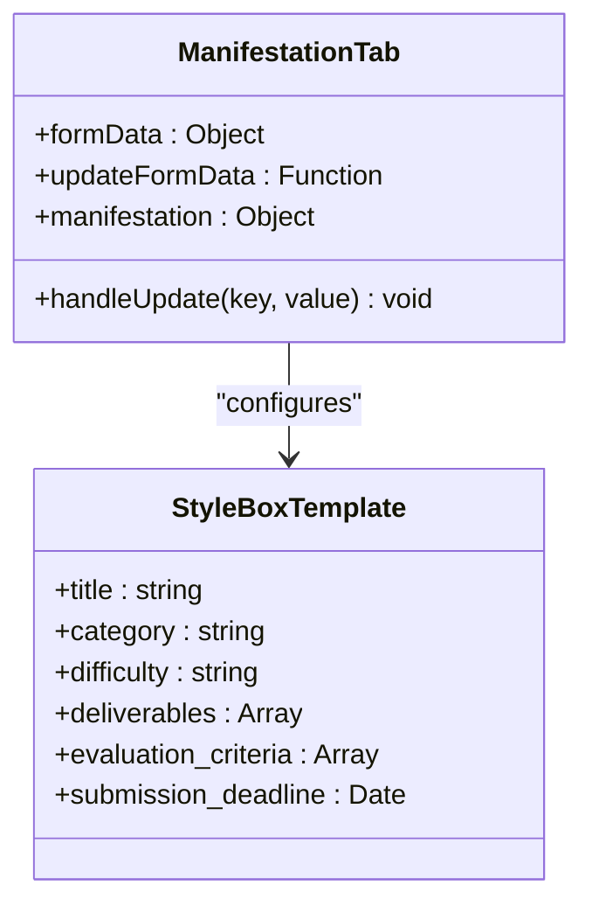
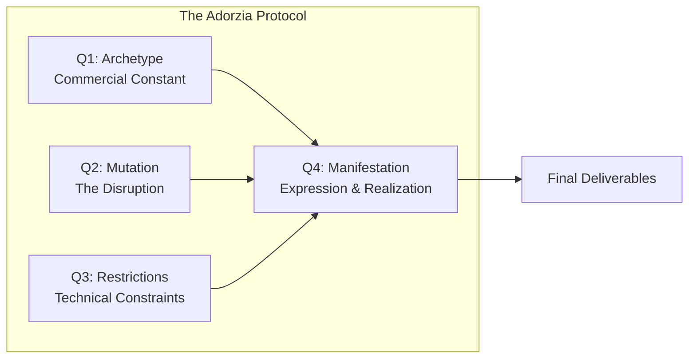
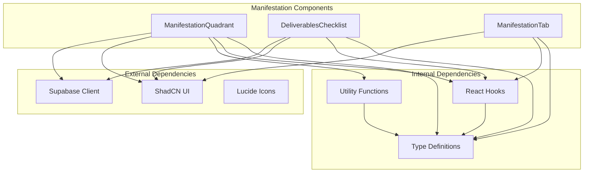

# Manifestation Quadrant

<cite>
**Referenced Files in This Document**
- [StyleboxManifestationQuadrant.tsx](file://src/components/stylebox/workspace/StyleboxManifestationQuadrant.tsx)
- [ManifestationTab.tsx](file://src/components/admin/stylebox-wizard/tabs/ManifestationTab.tsx)
- [StyleboxDesignerPreview.tsx](file://src/components/admin/stylebox-wizard/StyleboxDesignerPreview.tsx)
- [StyleboxWorkspace.tsx](file://src/pages/StyleboxWorkspace.tsx)
- [DeliverablesChecklist.tsx](file://src/components/stylebox/workspace/DeliverablesChecklist.tsx)
- [stylebox-template.ts](file://src/lib/stylebox-template.ts)
- [designer-submissions.ts](file://src/types/designer-submissions.ts)
- [StyleboxArchetypeQuadrant.tsx](file://src/components/stylebox/workspace/StyleboxArchetypeQuadrant.tsx)
- [StyleboxMutationQuadrant.tsx](file://src/components/stylebox/workspace/StyleboxMutationQuadrant.tsx)
- [StyleboxRestrictionsQuadrant.tsx](file://src/components/stylebox/workspace/StyleboxRestrictionsQuadrant.tsx)
</cite>

## Table of Contents
1. [Introduction](#introduction)
2. [Project Structure](#project-structure)
3. [Core Components](#core-components)
4. [Architecture Overview](#architecture-overview)
5. [Detailed Component Analysis](#detailed-component-analysis)
6. [Dependency Analysis](#dependency-analysis)
7. [Performance Considerations](#performance-considerations)
8. [Troubleshooting Guide](#troubleshooting-guide)
9. [Conclusion](#conclusion)

## Introduction
The Manifestation quadrant is the fourth and final stage of the Adorzia design protocol, representing the expression and realization phase where designers translate conceptual frameworks into tangible deliverables. This quadrant serves as the bridge between abstract design thinking and concrete production-ready assets, focusing on how design concepts are physically realized through various mediums, materials, and presentation formats.

Unlike the previous quadrants that establish foundation (Archetype), disruption (Mutation), and constraints (Restrictions), the Manifestation quadrant emphasizes the practical execution of design decisions. It captures the designer's rationale for meeting constraints while maintaining creative integrity, and provides structured mechanisms for delivering production-ready assets.

## Project Structure
The Manifestation quadrant implementation spans multiple interconnected components within the Stylebox ecosystem:

**Diagram sources**
- [StyleboxManifestationQuadrant.tsx](file://src/components/stylebox/workspace/StyleboxManifestationQuadrant.tsx#L1-L202)
- [DeliverablesChecklist.tsx](file://src/components/stylebox/workspace/DeliverablesChecklist.tsx#L1-L374)
- [ManifestationTab.tsx](file://src/components/admin/stylebox-wizard/tabs/ManifestationTab.tsx#L1-L56)

**Section sources**
- [StyleboxManifestationQuadrant.tsx](file://src/components/stylebox/workspace/StyleboxManifestationQuadrant.tsx#L1-L202)
- [StyleboxWorkspace.tsx](file://src/pages/StyleboxWorkspace.tsx#L314-L343)

## Core Components
The Manifestation quadrant consists of three primary components that work together to facilitate design expression and realization:

### StyleboxManifestationQuadrant
The main workspace component that presents the final design prompt and collects designer rationale. This component serves as the central hub for the manifestation process, displaying the culmination of previous quadrant work while enabling the final expression phase.

### DeliverablesChecklist
A comprehensive asset management system that tracks and validates all required deliverables. This component ensures designers meet all technical and creative requirements through structured upload workflows and quality checks.

### ManifestationTab
The administrative interface for configuring manifestation prompts during the Stylebox creation process. This component allows curators to define the final design instructions that guide designers through the realization phase.

**Section sources**
- [StyleboxManifestationQuadrant.tsx](file://src/components/stylebox/workspace/StyleboxManifestationQuadrant.tsx#L21-L202)
- [DeliverablesChecklist.tsx](file://src/components/stylebox/workspace/DeliverablesChecklist.tsx#L30-L374)
- [ManifestationTab.tsx](file://src/components/admin/stylebox-wizard/tabs/ManifestationTab.tsx#L6-L56)

## Architecture Overview
The Manifestation quadrant operates within the broader Adorzia design protocol, functioning as the final stage that transforms conceptual frameworks into production-ready assets:

**Diagram sources**
- [StyleboxManifestationQuadrant.tsx](file://src/components/stylebox/workspace/StyleboxManifestationQuadrant.tsx#L35-L64)
- [DeliverablesChecklist.tsx](file://src/components/stylebox/workspace/DeliverablesChecklist.tsx#L77-L162)

The architecture follows a structured progression where administrators define the final design constraints, designers execute within those constraints, and the system validates compliance through deliverable requirements and rationale documentation.

**Section sources**
- [StyleboxDesignerPreview.tsx](file://src/components/admin/stylebox-wizard/StyleboxDesignerPreview.tsx#L132-L154)
- [stylebox-template.ts](file://src/lib/stylebox-template.ts#L340-L352)

## Detailed Component Analysis

### StyleboxManifestationQuadrant Component
The primary manifestation workspace component that encapsulates the final design expression phase:

**Diagram sources**
- [StyleboxManifestationQuadrant.tsx](file://src/components/stylebox/workspace/StyleboxManifestationQuadrant.tsx#L10-L28)
- [designer-submissions.ts](file://src/types/designer-submissions.ts#L33-L48)

The component implements a sophisticated state management system with real-time saving capabilities, error handling, and responsive design modes. The rationale field serves as the critical documentation mechanism for how designers met technical constraints while maintaining creative vision.

**Section sources**
- [StyleboxManifestationQuadrant.tsx](file://src/components/stylebox/workspace/StyleboxManifestationQuadrant.tsx#L21-L202)

### DeliverablesChecklist System
The comprehensive asset management infrastructure that validates and tracks all required deliverables:

**Diagram sources**
- [DeliverablesChecklist.tsx](file://src/components/stylebox/workspace/DeliverablesChecklist.tsx#L77-L162)

The system implements robust file validation, automatic watermarking for image assets, and comprehensive error handling. It supports multiple file formats and provides real-time upload progress feedback.

**Section sources**
- [DeliverablesChecklist.tsx](file://src/components/stylebox/workspace/DeliverablesChecklist.tsx#L38-L374)

### ManifestationTab Configuration
The administrative interface for defining final design prompts and curator guidance:

**Diagram sources**
- [ManifestationTab.tsx](file://src/components/admin/stylebox-wizard/tabs/ManifestationTab.tsx#L6-L12)
- [stylebox-template.ts](file://src/lib/stylebox-template.ts#L209-L282)

The configuration interface provides curated guidance for creating effective manifestation prompts that bridge conceptual frameworks with practical execution.

**Section sources**
- [ManifestationTab.tsx](file://src/components/admin/stylebox-wizard/tabs/ManifestationTab.tsx#L6-L56)

### Relationship to Other Quadrants
The Manifestation quadrant serves as the synthesis point for all previous quadrant work:

**Diagram sources**
- [StyleboxArchetypeQuadrant.tsx](file://src/components/stylebox/workspace/StyleboxArchetypeQuadrant.tsx#L49-L70)
- [StyleboxMutationQuadrant.tsx](file://src/components/stylebox/workspace/StyleboxMutationQuadrant.tsx#L72-L89)
- [StyleboxRestrictionsQuadrant.tsx](file://src/components/stylebox/workspace/StyleboxRestrictionsQuadrant.tsx#L68-L70)

Each preceding quadrant contributes essential elements to the manifestation process: Archetype provides the foundational structure, Mutation introduces creative disruption, and Restrictions establish technical boundaries.

**Section sources**
- [StyleboxDesignerPreview.tsx](file://src/components/admin/stylebox-wizard/StyleboxDesignerPreview.tsx#L42-L154)

## Dependency Analysis
The Manifestation quadrant system exhibits well-structured dependencies that support modularity and maintainability:

**Diagram sources**
- [StyleboxManifestationQuadrant.tsx](file://src/components/stylebox/workspace/StyleboxManifestationQuadrant.tsx#L1-L8)
- [DeliverablesChecklist.tsx](file://src/components/stylebox/workspace/DeliverablesChecklist.tsx#L1-L20)

The system maintains clean separation of concerns with clear dependency boundaries, facilitating testing and maintenance.

**Section sources**
- [stylebox-template.ts](file://src/lib/stylebox-template.ts#L1-L539)
- [designer-submissions.ts](file://src/types/designer-submissions.ts#L1-L255)

## Performance Considerations
The Manifestation quadrant system implements several performance optimization strategies:

### File Upload Optimization
- **Chunked Uploads**: Large files (>50MB) are processed using chunked upload mechanisms to prevent timeouts
- **Progress Tracking**: Real-time upload progress with visual feedback reduces perceived latency
- **Automatic Watermarking**: Images are watermarked asynchronously to maintain responsive UI

### State Management Efficiency
- **Selective Re-rendering**: Components only re-render when relevant state changes occur
- **Debounced Operations**: Save operations are debounced to minimize database writes
- **Memory Management**: Proper cleanup of event listeners and timers prevents memory leaks

### Storage Optimization
- **CDN Integration**: Static assets leverage CDN networks for improved load times
- **Lazy Loading**: Non-critical resources are loaded on-demand
- **Compression**: Automatic compression of images and documents reduces bandwidth usage

## Troubleshooting Guide

### Common Issues and Solutions

**Upload Failures**
- **Large File Uploads**: Files exceeding 500MB require compression or alternative transfer methods
- **Format Compatibility**: Unsupported file formats are rejected with specific error messages
- **Network Connectivity**: Chunked uploads resume automatically after connection restoration

**Rationale Saving Problems**
- **Database Errors**: Network failures trigger automatic retry mechanisms
- **Permission Issues**: Authentication problems require user re-authentication
- **Validation Failures**: Input validation errors provide specific field-level feedback

**Asset Management Issues**
- **Missing Deliverables**: System identifies incomplete submissions with detailed progress tracking
- **Quality Validation**: Automated checks ensure deliverables meet technical requirements
- **Version Conflicts**: Concurrent edits are handled through conflict resolution mechanisms

**Section sources**
- [DeliverablesChecklist.tsx](file://src/components/stylebox/workspace/DeliverablesChecklist.tsx#L151-L158)
- [StyleboxManifestationQuadrant.tsx](file://src/components/stylebox/workspace/StyleboxManifestationQuadrant.tsx#L54-L63)

## Conclusion
The Manifestation quadrant represents the sophisticated synthesis of the Adorzia design protocol, transforming conceptual frameworks into production-ready assets through structured expression mechanisms. Its comprehensive architecture supports both creative freedom and technical precision, ensuring that design innovation translates effectively into market-ready products.

The system's strength lies in its balanced approach to constraint management and creative expression, providing designers with clear guidance while maintaining artistic integrity. Through robust deliverable tracking, comprehensive asset management, and thoughtful user interface design, the Manifestation quadrant facilitates successful design realization across diverse fashion, textile, and jewelry applications.

The modular architecture ensures scalability and maintainability, while the integration with the broader Stylebox ecosystem enables seamless coordination between administrative oversight and creative execution. This foundation supports continued innovation in design education and professional development workflows.