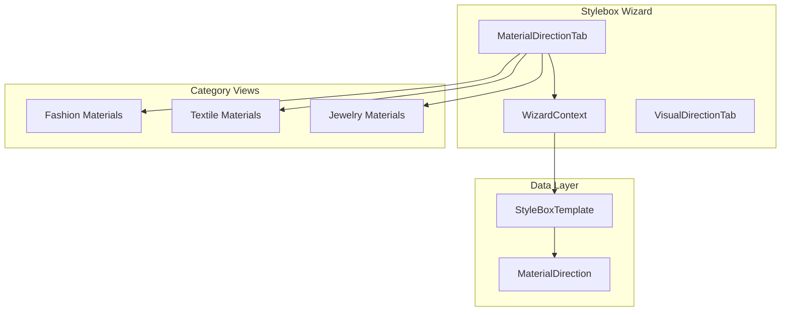
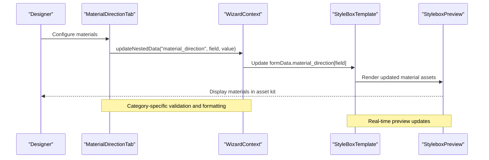
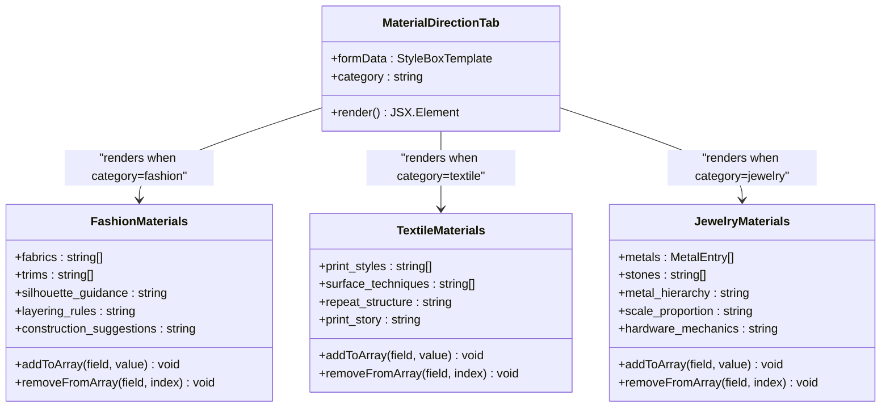
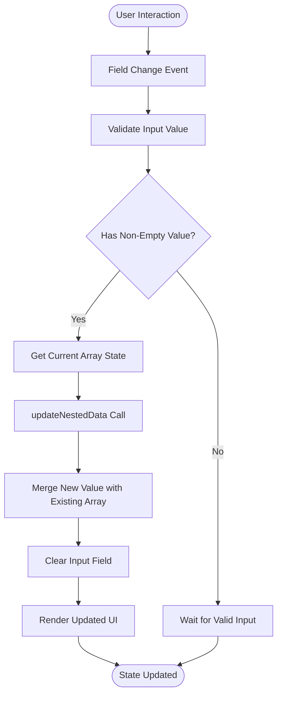
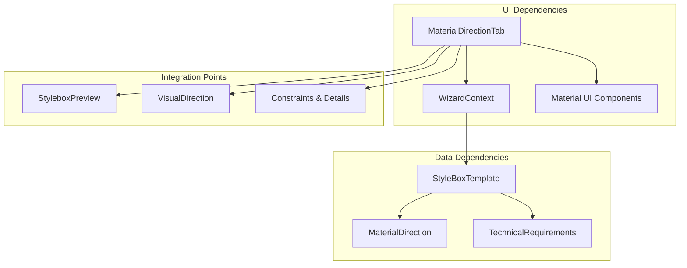

# Material Direction Quadrant

<cite>
**Referenced Files in This Document**
- [MaterialDirectionTab.tsx](file://src/components/admin/stylebox-wizard/tabs/MaterialDirectionTab.tsx)
- [WizardContext.tsx](file://src/components/admin/stylebox-wizard/WizardContext.tsx)
- [stylebox-template.ts](file://src/lib/stylebox-template.ts)
- [StyleboxPreview.tsx](file://src/pages/StyleboxPreview.tsx)
- [VisualDirectionTab.tsx](file://src/components/admin/stylebox-wizard/tabs/VisualDirectionTab.tsx)
</cite>

## Table of Contents
1. [Introduction](#introduction)
2. [Project Structure](#project-structure)
3. [Core Components](#core-components)
4. [Architecture Overview](#architecture-overview)
5. [Detailed Component Analysis](#detailed-component-analysis)
6. [Dependency Analysis](#dependency-analysis)
7. [Performance Considerations](#performance-considerations)
8. [Troubleshooting Guide](#troubleshooting-guide)
9. [Conclusion](#conclusion)

## Introduction
The Material Direction quadrant component defines how materials, textures, and tactile qualities are selected and realized within the design process. It serves as a production-grade specification layer that translates creative vision into actionable material choices, construction techniques, and finishing approaches. This quadrant ensures designers understand the physical constraints and possibilities of their chosen materials while maintaining alignment with the broader design ecosystem.

## Project Structure
The Material Direction quadrant is implemented as a specialized tab within the Stylebox Wizard, with category-specific configurations for fashion, textile, and jewelry domains. The implementation leverages a shared wizard context that manages form state and provides category-aware rendering.

**Diagram sources**
- [MaterialDirectionTab.tsx](file://src/components/admin/stylebox-wizard/tabs/MaterialDirectionTab.tsx#L10-L28)
- [WizardContext.tsx](file://src/components/admin/stylebox-wizard/WizardContext.tsx#L45-L92)
- [stylebox-template.ts](file://src/lib/stylebox-template.ts#L209-L282)

**Section sources**
- [MaterialDirectionTab.tsx](file://src/components/admin/stylebox-wizard/tabs/MaterialDirectionTab.tsx#L1-L363)
- [WizardContext.tsx](file://src/components/admin/stylebox-wizard/WizardContext.tsx#L1-L120)
- [stylebox-template.ts](file://src/lib/stylebox-template.ts#L1-L539)

## Core Components
The Material Direction quadrant consists of three primary category-specific views, each tailored to the unique material considerations of fashion, textile, and jewelry design:

### MaterialDirection Interface
The core data structure defines category-specific material properties:

- **Fashion Materials**: Fabric selections, trim options, construction guidance, and silhouette preferences
- **Textile Materials**: Print styles, surface techniques, repeat structures, and texture suggestions  
- **Jewelry Materials**: Metal compositions, stone selections, finishing approaches, and hardware mechanics

### Wizard Context Integration
The wizard context provides centralized state management with nested data updates for the material direction configuration, enabling real-time collaboration and validation across all category-specific forms.

**Section sources**
- [stylebox-template.ts](file://src/lib/stylebox-template.ts#L52-L84)
- [WizardContext.tsx](file://src/components/admin/stylebox-wizard/WizardContext.tsx#L80-L92)

## Architecture Overview
The Material Direction quadrant follows a modular architecture that separates concerns between category-specific logic, shared UI components, and data persistence through the wizard context.

**Diagram sources**
- [MaterialDirectionTab.tsx](file://src/components/admin/stylebox-wizard/tabs/MaterialDirectionTab.tsx#L36-L47)
- [WizardContext.tsx](file://src/components/admin/stylebox-wizard/WizardContext.tsx#L80-L92)
- [StyleboxPreview.tsx](file://src/pages/StyleboxPreview.tsx#L414-L456)

## Detailed Component Analysis

### MaterialDirectionTab Component
The main tab component orchestrates category-specific material configuration through conditional rendering based on the selected category.

**Diagram sources**
- [MaterialDirectionTab.tsx](file://src/components/admin/stylebox-wizard/tabs/MaterialDirectionTab.tsx#L10-L28)
- [MaterialDirectionTab.tsx](file://src/components/admin/stylebox-wizard/tabs/MaterialDirectionTab.tsx#L30-L143)
- [MaterialDirectionTab.tsx](file://src/components/admin/stylebox-wizard/tabs/MaterialDirectionTab.tsx#L145-L247)
- [MaterialDirectionTab.tsx](file://src/components/admin/stylebox-wizard/tabs/MaterialDirectionTab.tsx#L249-L362)

### Data Flow and State Management
The wizard context provides a centralized state management solution with nested data updates specifically designed for complex form structures like material direction.

**Diagram sources**
- [MaterialDirectionTab.tsx](file://src/components/admin/stylebox-wizard/tabs/MaterialDirectionTab.tsx#L36-L47)
- [WizardContext.tsx](file://src/components/admin/stylebox-wizard/WizardContext.tsx#L80-L92)

**Section sources**
- [MaterialDirectionTab.tsx](file://src/components/admin/stylebox-wizard/tabs/MaterialDirectionTab.tsx#L30-L362)
- [WizardContext.tsx](file://src/components/admin/stylebox-wizard/WizardContext.tsx#L80-L92)

### Category-Specific Material Configuration

#### Fashion Materials
Fashion materials focus on fabric selection, trim coordination, and construction guidance. The interface supports both simple string entries and structured fabric entries with detailed descriptions.

#### Textile Materials  
Textile materials emphasize print design and surface treatment techniques. The configuration includes repeat structure guidance and narrative storytelling for print collections.

#### Jewelry Materials
Jewelry materials address metal composition, stone selection, and hardware mechanics. The interface supports both basic string entries and detailed metal entries with plating specifications.

**Section sources**
- [MaterialDirectionTab.tsx](file://src/components/admin/stylebox-wizard/tabs/MaterialDirectionTab.tsx#L50-L142)
- [MaterialDirectionTab.tsx](file://src/components/admin/stylebox-wizard/tabs/MaterialDirectionTab.tsx#L164-L246)
- [MaterialDirectionTab.tsx](file://src/components/admin/stylebox-wizard/tabs/MaterialDirectionTab.tsx#L268-L361)

## Dependency Analysis
The Material Direction quadrant integrates with several system components to provide a cohesive design experience.

**Diagram sources**
- [MaterialDirectionTab.tsx](file://src/components/admin/stylebox-wizard/tabs/MaterialDirectionTab.tsx#L1-L8)
- [stylebox-template.ts](file://src/lib/stylebox-template.ts#L209-L282)
- [StyleboxPreview.tsx](file://src/pages/StyleboxPreview.tsx#L414-L456)

**Section sources**
- [stylebox-template.ts](file://src/lib/stylebox-template.ts#L209-L282)
- [StyleboxPreview.tsx](file://src/pages/StyleboxPreview.tsx#L414-L456)

## Performance Considerations
The Material Direction quadrant is designed for optimal performance through several key strategies:

- **Lazy Rendering**: Category-specific components render only when their respective category is selected
- **Efficient State Updates**: Nested data updates minimize re-renders by targeting specific fields
- **Memory Management**: Arrays are filtered rather than recreated unnecessarily
- **Validation Efficiency**: Input validation occurs before state updates to prevent invalid states

## Troubleshooting Guide

### Common Issues and Solutions

#### Material List Not Updating
**Symptoms**: Added materials don't appear in the list
**Causes**: Empty input values or incorrect field names
**Solutions**: 
- Ensure input fields contain non-empty values before submission
- Verify field names match MaterialDirection interface properties
- Check that updateNestedData is called with correct parameters

#### Category-Specific Features Missing
**Symptoms**: Expected category-specific fields are not visible
**Causes**: Incorrect category selection or incomplete MaterialDirection implementation
**Solutions**:
- Verify category is properly set in formData.category
- Ensure MaterialDirection interface includes all required properties
- Check that category-specific components are properly exported

#### State Synchronization Issues
**Symptoms**: Material changes don't persist across sessions
**Causes**: Missing data persistence or context provider issues
**Solutions**:
- Confirm WizardProvider wraps the application
- Verify formData is properly persisted to backend storage
- Check that updateNestedData is used consistently for nested updates

**Section sources**
- [MaterialDirectionTab.tsx](file://src/components/admin/stylebox-wizard/tabs/MaterialDirectionTab.tsx#L36-L47)
- [WizardContext.tsx](file://src/components/admin/stylebox-wizard/WizardContext.tsx#L80-L92)

## Conclusion
The Material Direction quadrant provides a comprehensive framework for defining material choices, texture directions, and tactile qualities within the design process. Through category-specific configurations, real-time state management, and seamless integration with other design quadrants, it enables designers to translate creative vision into production-ready specifications. The component's modular architecture ensures scalability across different design domains while maintaining consistency in material selection and construction guidance.

The implementation demonstrates best practices in form state management, category-specific rendering, and data persistence, making it a robust foundation for advanced design workflows. By providing clear material configuration options and construction techniques, the quadrant supports both novice and expert designers in achieving their creative goals while maintaining technical feasibility and production quality.