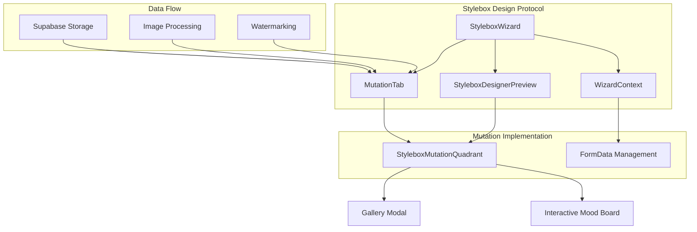
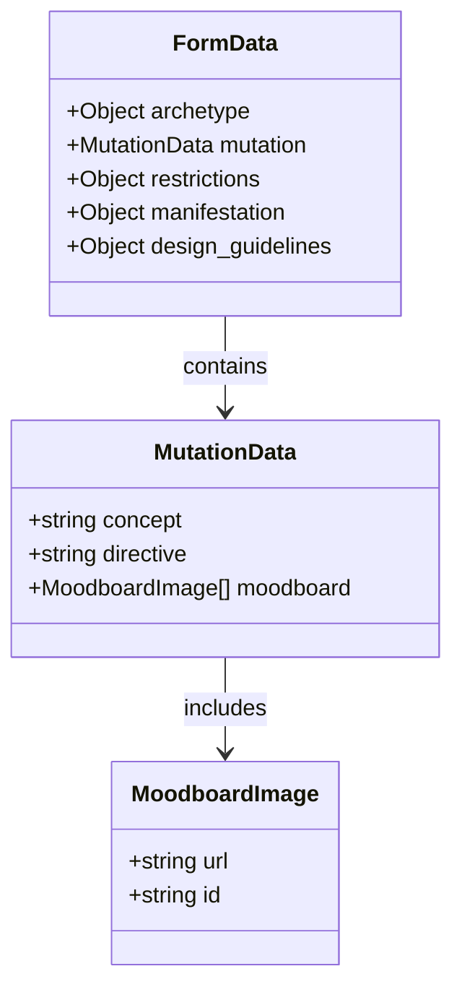
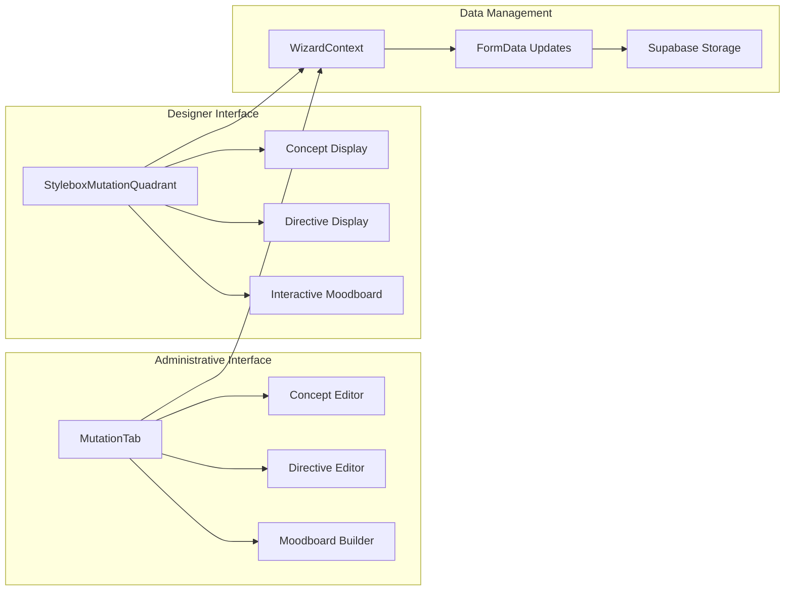
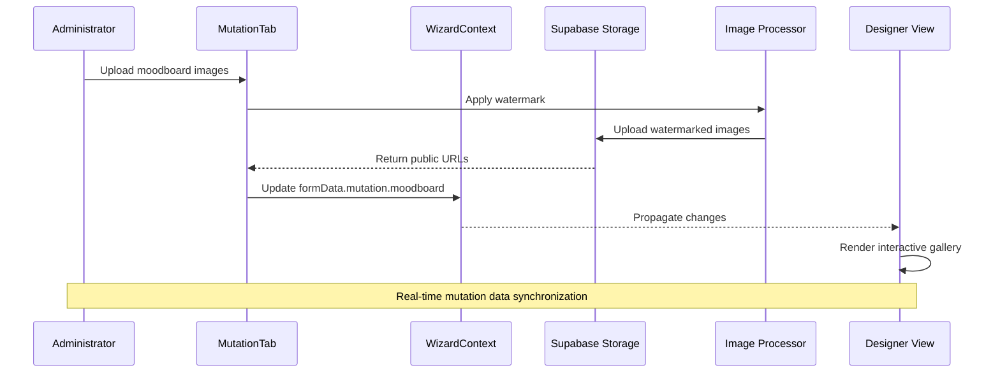
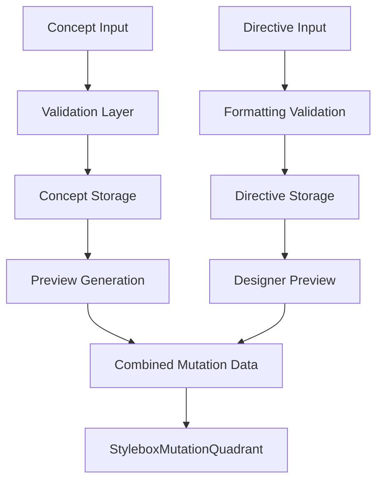
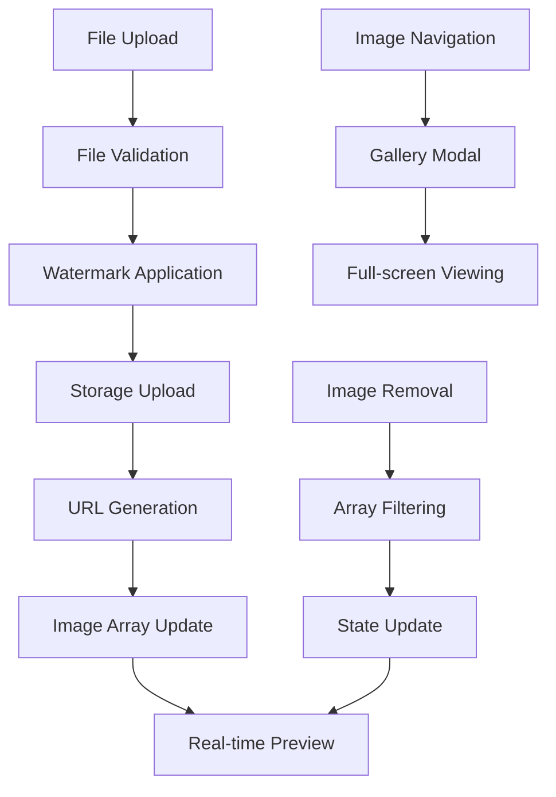
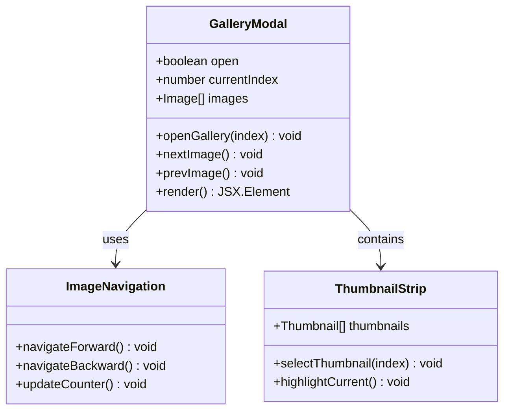
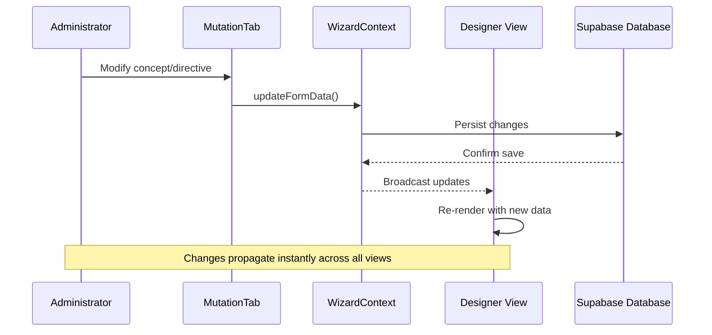
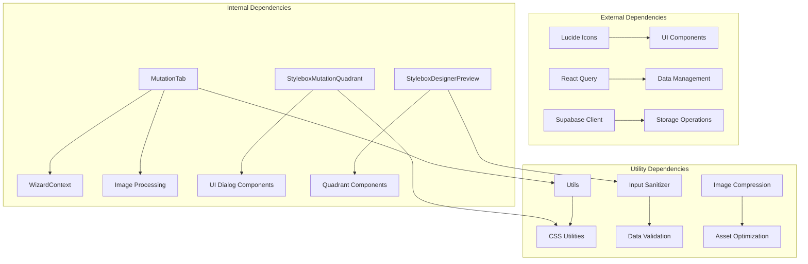

# Mutation Quadrant

<cite>
**Referenced Files in This Document**
- [StyleboxMutationQuadrant.tsx](file://src/components/stylebox/workspace/StyleboxMutationQuadrant.tsx)
- [MutationTab.tsx](file://src/components/admin/stylebox-wizard/tabs/MutationTab.tsx)
- [WizardContext.tsx](file://src/components/admin/stylebox-wizard/WizardContext.tsx)
- [StyleboxWizard.tsx](file://src/components/admin/stylebox-wizard/StyleboxWizard.tsx)
- [StyleboxDesignerPreview.tsx](file://src/components/admin/stylebox-wizard/StyleboxDesignerPreview.tsx)
- [stylebox-template.ts](file://src/lib/stylebox-template.ts)
- [StyleboxArchetypeQuadrant.tsx](file://src/components/stylebox/workspace/StyleboxArchetypeQuadrant.tsx)
- [RestrictionsTab.tsx](file://src/components/admin/stylebox-wizard/tabs/RestrictionsTab.tsx)
- [ManifestationTab.tsx](file://src/components/admin/stylebox-wizard/tabs/ManifestationTab.tsx)
</cite>

## Table of Contents
1. [Introduction](#introduction)
2. [Project Structure](#project-structure)
3. [Core Components](#core-components)
4. [Architecture Overview](#architecture-overview)
5. [Detailed Component Analysis](#detailed-component-analysis)
6. [Dependency Analysis](#dependency-analysis)
7. [Performance Considerations](#performance-considerations)
8. [Troubleshooting Guide](#troubleshooting-guide)
9. [Conclusion](#conclusion)

## Introduction

The Mutation quadrant represents the second stage in the Adorzia design protocol, capturing the evolution and transformation aspects of the design concept. This quadrant serves as the catalyst for creative disruption, transforming the established commercial constant into something innovative and forward-looking.

Unlike the Archetype quadrant which establishes the foundational structure and commercial logic, the Mutation quadrant introduces conceptual shifts and creative narratives that push boundaries while maintaining design coherence. It embodies the principle of controlled evolution, where transformation occurs within carefully defined parameters.

The Mutation quadrant operates on three fundamental pillars: conceptual disruption, visual narrative through mood boards, and strategic constraint integration. These elements work together to create a framework for meaningful design evolution that respects both creative vision and practical limitations.

## Project Structure

The Mutation quadrant implementation follows a modular architecture that integrates seamlessly with the broader Stylebox ecosystem:

**Diagram sources**
- [StyleboxWizard.tsx](file://src/components/admin/stylebox-wizard/StyleboxWizard.tsx#L41-L49)
- [MutationTab.tsx](file://src/components/admin/stylebox-wizard/tabs/MutationTab.tsx#L12-L20)
- [StyleboxMutationQuadrant.tsx](file://src/components/stylebox/workspace/StyleboxMutationQuadrant.tsx#L19-L22)

**Section sources**
- [StyleboxMutationQuadrant.tsx](file://src/components/stylebox/workspace/StyleboxMutationQuadrant.tsx#L1-L230)
- [MutationTab.tsx](file://src/components/admin/stylebox-wizard/tabs/MutationTab.tsx#L1-L186)

## Core Components

### Mutation Data Structure

The Mutation quadrant utilizes a structured data model that captures both conceptual and visual elements:

**Diagram sources**
- [stylebox-template.ts](file://src/lib/stylebox-template.ts#L209-L282)
- [MutationTab.tsx](file://src/components/admin/stylebox-wizard/tabs/MutationTab.tsx#L14-L20)

The mutation data structure consists of three primary components:

1. **Concept**: High-level mutation concept describing the fundamental shift or innovation
2. **Directive**: Specific creative instructions for implementing the disruption
3. **Moodboard**: Visual narrative supporting the conceptual framework

### User Interface Architecture

The Mutation quadrant employs a dual-interface approach serving both administrative and designer perspectives:

**Diagram sources**
- [MutationTab.tsx](file://src/components/admin/stylebox-wizard/tabs/MutationTab.tsx#L95-L117)
- [StyleboxMutationQuadrant.tsx](file://src/components/stylebox/workspace/StyleboxMutationQuadrant.tsx#L64-L90)

**Section sources**
- [stylebox-template.ts](file://src/lib/stylebox-template.ts#L209-L282)
- [WizardContext.tsx](file://src/components/admin/stylebox-wizard/WizardContext.tsx#L15-L28)

## Architecture Overview

The Mutation quadrant architecture demonstrates sophisticated separation of concerns while maintaining seamless integration across the design workflow:

**Diagram sources**
- [MutationTab.tsx](file://src/components/admin/stylebox-wizard/tabs/MutationTab.tsx#L22-L66)
- [WizardContext.tsx](file://src/components/admin/stylebox-wizard/WizardContext.tsx#L53-L78)

The architecture ensures that administrative actions immediately translate to designer-facing content, maintaining design coherence throughout the transformation process.

## Detailed Component Analysis

### Administrative Mutation Builder

The MutationTab component provides comprehensive administrative controls for defining mutation parameters:

#### Concept and Directive Management

The concept field captures high-level mutation ideas, while the directive provides specific implementation instructions:

**Diagram sources**
- [MutationTab.tsx](file://src/components/admin/stylebox-wizard/tabs/MutationTab.tsx#L95-L117)
- [StyleboxMutationQuadrant.tsx](file://src/components/stylebox/workspace/StyleboxMutationQuadrant.tsx#L74-L89)

#### Moodboard Image Management

The moodboard builder implements sophisticated image handling with watermarking and quality assurance:

**Diagram sources**
- [MutationTab.tsx](file://src/components/admin/stylebox-wizard/tabs/MutationTab.tsx#L22-L66)
- [StyleboxMutationQuadrant.tsx](file://src/components/stylebox/workspace/StyleboxMutationQuadrant.tsx#L28-L41)

**Section sources**
- [MutationTab.tsx](file://src/components/admin/stylebox-wizard/tabs/MutationTab.tsx#L12-L186)

### Designer Experience Implementation

The StyleboxMutationQuadrant component delivers an immersive designer experience focused on visual storytelling:

#### Interactive Gallery System

The gallery modal provides sophisticated navigation and viewing capabilities:

**Diagram sources**
- [StyleboxMutationQuadrant.tsx](file://src/components/stylebox/workspace/StyleboxMutationQuadrant.tsx#L23-L41)
- [StyleboxMutationQuadrant.tsx](file://src/components/stylebox/workspace/StyleboxMutationQuadrant.tsx#L202-L223)

#### Responsive Design Implementation

The component adapts seamlessly to different design environments:

| Environment | Features | Behavior |
|-------------|----------|----------|
| Darkroom Mode | Enhanced contrast, reduced glare | Dark backgrounds, white text, subtle borders |
| Light Mode | Traditional design aesthetic | White backgrounds, gray accents, standard borders |
| Mobile View | Touch-optimized interactions | Larger touch targets, simplified navigation |
| Desktop View | Full-feature experience | Advanced gallery controls, detailed thumbnails |

**Section sources**
- [StyleboxMutationQuadrant.tsx](file://src/components/stylebox/workspace/StyleboxMutationQuadrant.tsx#L19-L230)

### Data Flow and Synchronization

The Mutation quadrant maintains real-time synchronization between administrative and designer interfaces:

**Diagram sources**
- [WizardContext.tsx](file://src/components/admin/stylebox-wizard/WizardContext.tsx#L53-L78)
- [StyleboxWizard.tsx](file://src/components/admin/stylebox-wizard/StyleboxWizard.tsx#L218-L279)

**Section sources**
- [WizardContext.tsx](file://src/components/admin/stylebox-wizard/WizardContext.tsx#L45-L120)
- [StyleboxWizard.tsx](file://src/components/admin/stylebox-wizard/StyleboxWizard.tsx#L183-L196)

## Dependency Analysis

The Mutation quadrant exhibits well-managed dependencies that support scalability and maintainability:

**Diagram sources**
- [MutationTab.tsx](file://src/components/admin/stylebox-wizard/tabs/MutationTab.tsx#L1-L11)
- [StyleboxMutationQuadrant.tsx](file://src/components/stylebox/workspace/StyleboxMutationQuadrant.tsx#L1-L8)

### Component Coupling Analysis

The Mutation quadrant demonstrates optimal coupling characteristics:

| Aspect | Coupling Level | Impact | Management Strategy |
|--------|----------------|--------|-------------------|
| Administrative Interface | Low | Easy maintenance, flexible updates | Modular component design |
| Designer Interface | Low | Seamless user experience | Shared data context |
| Data Persistence | Medium | Reliable storage, versioning | Context-based state management |
| Image Processing | Medium | Quality assurance, performance | Asynchronous operations |

**Section sources**
- [stylebox-template.ts](file://src/lib/stylebox-template.ts#L209-L282)
- [MutationTab.tsx](file://src/components/admin/stylebox-wizard/tabs/MutationTab.tsx#L22-L66)

## Performance Considerations

The Mutation quadrant implementation incorporates several performance optimization strategies:

### Image Loading Optimization

The system employs progressive loading and lazy initialization to minimize initial load times:

- **Lazy Gallery Initialization**: Gallery modal only loads when user interacts with images
- **Progressive Image Loading**: Moodboard images load progressively as user scrolls
- **Optimized Thumbnails**: Reduced resolution thumbnails for navigation
- **Memory Management**: Automatic cleanup of unused image resources

### State Management Efficiency

The context-based state management ensures optimal performance:

- **Selective Re-renders**: Only affected components re-render on data changes
- **Debounced Updates**: Input changes are debounced to prevent excessive re-renders
- **Efficient Array Operations**: Optimized filtering and updating of moodboard arrays

### Storage and Network Optimization

The system implements intelligent caching and network optimization:

- **CDN Integration**: Public URLs leverage CDN for fast delivery
- **Watermark Caching**: Watermarked images cached for reuse
- **Batch Operations**: Multiple image uploads processed efficiently

## Troubleshooting Guide

Common issues and their solutions in the Mutation quadrant:

### Image Upload Failures

**Symptoms**: Upload errors, failed image addition
**Causes**: 
- Network connectivity issues
- File format incompatibility
- Storage quota exceeded
- Watermark processing failures

**Solutions**:
- Verify network connectivity and retry upload
- Check file format support (image/*)
- Monitor storage quotas and clean up unused assets
- Review watermark processing logs

### Gallery Navigation Issues

**Symptoms**: Navigation arrows not responding, thumbnail selection problems
**Causes**:
- State synchronization issues
- Memory leaks in gallery modal
- Event handler conflicts

**Solutions**:
- Force refresh page to reset state
- Clear browser cache and cookies
- Check for JavaScript errors in console
- Restart gallery modal session

### Data Synchronization Problems

**Symptoms**: Designer view not reflecting administrative changes
**Causes**:
- Context provider issues
- Database connection problems
- Real-time update failures

**Solutions**:
- Verify context provider wrapping
- Check database connection status
- Refresh page to re-establish connections
- Monitor real-time subscription status

**Section sources**
- [MutationTab.tsx](file://src/components/admin/stylebox-wizard/tabs/MutationTab.tsx#L56-L66)
- [StyleboxMutationQuadrant.tsx](file://src/components/stylebox/workspace/StyleboxMutationQuadrant.tsx#L28-L41)

## Conclusion

The Mutation quadrant represents a sophisticated implementation of design evolution principles within the Adorzia ecosystem. Its architecture successfully balances administrative control with designer accessibility while maintaining real-time synchronization and performance optimization.

The quadrant's strength lies in its comprehensive approach to transformation management, combining conceptual frameworks with visual storytelling through mood boards. The integration of watermarking, quality assurance, and responsive design ensures both professional standards and user-friendly experiences.

Future enhancements could include advanced AI-assisted moodboard curation, collaborative editing capabilities, and enhanced analytics for tracking design evolution patterns. The current implementation provides a solid foundation for these potential extensions while maintaining the core principles of controlled transformation and creative disruption.

The Mutation quadrant exemplifies how thoughtful architecture can transform complex design processes into intuitive, efficient workflows that serve both administrators and designers effectively.