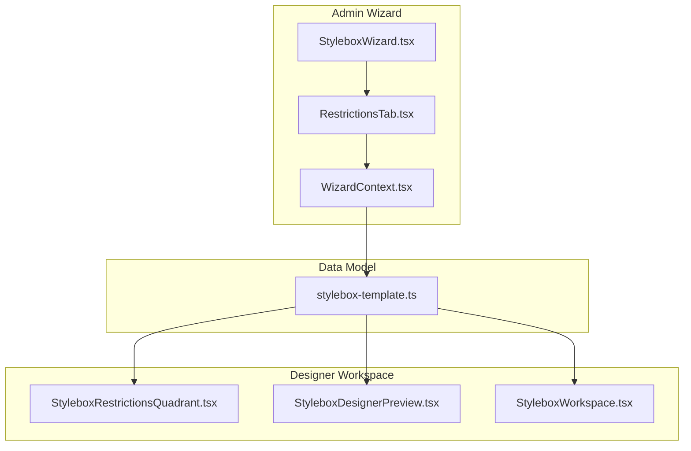
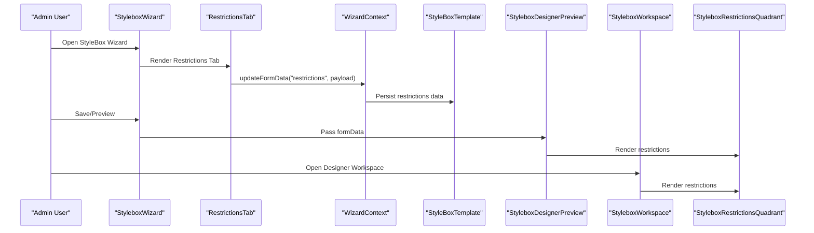
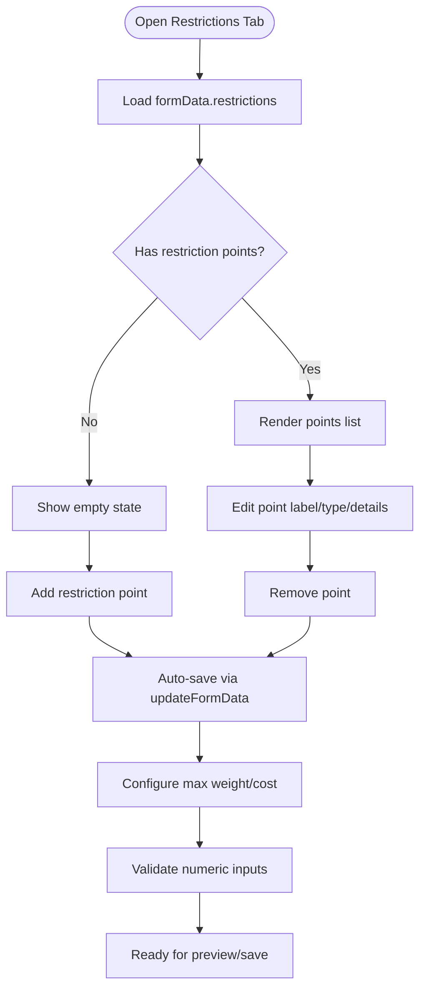
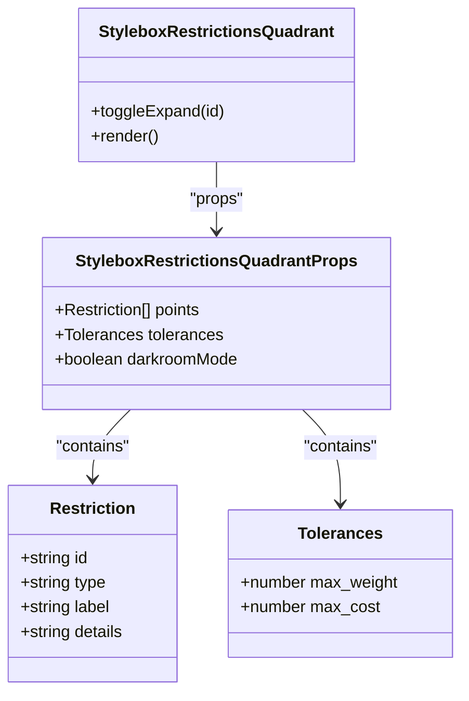
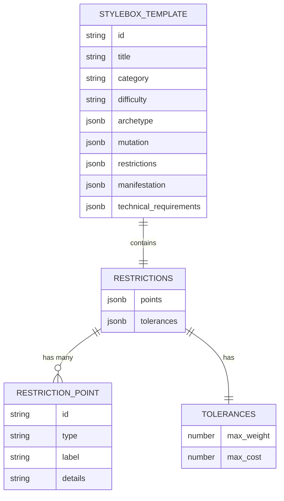
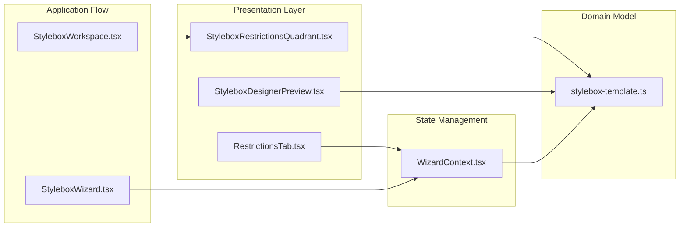

# Restrictions Quadrant

<cite>
**Referenced Files in This Document**
- [StyleboxRestrictionsQuadrant.tsx](file://src/components/stylebox/workspace/StyleboxRestrictionsQuadrant.tsx)
- [RestrictionsTab.tsx](file://src/components/admin/stylebox-wizard/tabs/RestrictionsTab.tsx)
- [StyleboxDesignerPreview.tsx](file://src/components/admin/stylebox-wizard/StyleboxDesignerPreview.tsx)
- [WizardContext.tsx](file://src/components/admin/stylebox-wizard/WizardContext.tsx)
- [StyleboxWizard.tsx](file://src/components/admin/stylebox-wizard/StyleboxWizard.tsx)
- [stylebox-template.ts](file://src/lib/stylebox-template.ts)
- [StyleboxWorkspace.tsx](file://src/pages/StyleboxWorkspace.tsx)
</cite>

## Table of Contents
1. [Introduction](#introduction)
2. [Project Structure](#project-structure)
3. [Core Components](#core-components)
4. [Architecture Overview](#architecture-overview)
5. [Detailed Component Analysis](#detailed-component-analysis)
6. [Dependency Analysis](#dependency-analysis)
7. [Performance Considerations](#performance-considerations)
8. [Troubleshooting Guide](#troubleshooting-guide)
9. [Conclusion](#conclusion)

## Introduction
The Restrictions quadrant defines the hard constraints that shape design possibilities. It establishes the technical and commercial boundaries within which designers must operate, ensuring feasibility, safety, and alignment with production realities. This quadrant balances creative freedom with practical limitations, guiding design decisions while maintaining coherent outcomes.

## Project Structure
The Restrictions quadrant spans two primary UI layers:
- Admin wizard: interactive builder for defining restriction points and numerical tolerances
- Designer workspace: read-only display of restrictions for reference during creation

**Diagram sources**
- [RestrictionsTab.tsx](file://src/components/admin/stylebox-wizard/tabs/RestrictionsTab.tsx#L1-L183)
- [WizardContext.tsx](file://src/components/admin/stylebox-wizard/WizardContext.tsx#L1-L120)
- [StyleboxWizard.tsx](file://src/components/admin/stylebox-wizard/StyleboxWizard.tsx#L1-L392)
- [StyleboxRestrictionsQuadrant.tsx](file://src/components/stylebox/workspace/StyleboxRestrictionsQuadrant.tsx#L1-L230)
- [StyleboxDesignerPreview.tsx](file://src/components/admin/stylebox-wizard/StyleboxDesignerPreview.tsx#L1-L187)
- [StyleboxWorkspace.tsx](file://src/pages/StyleboxWorkspace.tsx#L292-L326)
- [stylebox-template.ts](file://src/lib/stylebox-template.ts#L209-L282)

**Section sources**
- [RestrictionsTab.tsx](file://src/components/admin/stylebox-wizard/tabs/RestrictionsTab.tsx#L1-L183)
- [StyleboxRestrictionsQuadrant.tsx](file://src/components/stylebox/workspace/StyleboxRestrictionsQuadrant.tsx#L1-L230)
- [StyleboxDesignerPreview.tsx](file://src/components/admin/stylebox-wizard/StyleboxDesignerPreview.tsx#L1-L187)
- [WizardContext.tsx](file://src/components/admin/stylebox-wizard/WizardContext.tsx#L1-L120)
- [StyleboxWizard.tsx](file://src/components/admin/stylebox-wizard/StyleboxWizard.tsx#L1-L392)
- [stylebox-template.ts](file://src/lib/stylebox-template.ts#L209-L282)
- [StyleboxWorkspace.tsx](file://src/pages/StyleboxWorkspace.tsx#L292-L326)

## Core Components
The Restrictions quadrant comprises two complementary components:

- **RestrictionsTab (Admin)**: Interactive builder enabling administrators to define restriction points and numerical tolerances
- **StyleboxRestrictionsQuadrant (Designer)**: Read-only display showing restrictions during the design process

Key data model:
- Restriction point: structured object with type, label, and optional details
- Numerical tolerances: maximum weight and cost constraints

**Section sources**
- [RestrictionsTab.tsx](file://src/components/admin/stylebox-wizard/tabs/RestrictionsTab.tsx#L14-L183)
- [StyleboxRestrictionsQuadrant.tsx](file://src/components/stylebox/workspace/StyleboxRestrictionsQuadrant.tsx#L6-L41)
- [stylebox-template.ts](file://src/lib/stylebox-template.ts#L209-L282)

## Architecture Overview
The Restrictions quadrant follows a unidirectional data flow: administrators configure restrictions in the wizard, which are persisted and later rendered in the designer workspace.

**Diagram sources**
- [StyleboxWizard.tsx](file://src/components/admin/stylebox-wizard/StyleboxWizard.tsx#L198-L279)
- [RestrictionsTab.tsx](file://src/components/admin/stylebox-wizard/tabs/RestrictionsTab.tsx#L18-L41)
- [WizardContext.tsx](file://src/components/admin/stylebox-wizard/WizardContext.tsx#L53-L92)
- [StyleboxDesignerPreview.tsx](file://src/components/admin/stylebox-wizard/StyleboxDesignerPreview.tsx#L11-L17)
- [StyleboxWorkspace.tsx](file://src/pages/StyleboxWorkspace.tsx#L292-L326)
- [StyleboxRestrictionsQuadrant.tsx](file://src/components/stylebox/workspace/StyleboxRestrictionsQuadrant.tsx#L24-L41)

## Detailed Component Analysis

### RestrictionsTab (Admin Builder)
The RestrictionsTab provides an intuitive interface for defining technical constraints and numerical tolerances.

Key capabilities:
- Dynamic restriction point management (add/remove/collapse)
- Type-based categorization for constraints
- Numeric tolerance inputs with units
- Real-time validation feedback

**Section sources**
- [RestrictionsTab.tsx](file://src/components/admin/stylebox-wizard/tabs/RestrictionsTab.tsx#L14-L183)
- [WizardContext.tsx](file://src/components/admin/stylebox-wizard/WizardContext.tsx#L53-L92)

### StyleboxRestrictionsQuadrant (Designer Display)
The designer-facing quadrant renders restrictions in a compact, readable format with expandable details.

Design features:
- Expandable restriction details with chevron controls
- Darkroom mode support for workspace integration
- Numerical tolerance display with units
- Responsive grid layout for readability

**Section sources**
- [StyleboxRestrictionsQuadrant.tsx](file://src/components/stylebox/workspace/StyleboxRestrictionsQuadrant.tsx#L6-L41)
- [StyleboxRestrictionsQuadrant.tsx](file://src/components/stylebox/workspace/StyleboxRestrictionsQuadrant.tsx#L24-L229)

### Data Model and Persistence
Restrictions are part of the broader StyleBoxTemplate structure, persisted through the wizard's context provider.

Persistence flow:
- Admin updates restrictions via RestrictionsTab
- WizardContext.updateFormData persists to formData.restrictions
- StyleboxWizard serializes restrictions into database payload
- Designer workspace receives pre-populated restrictions

**Section sources**
- [stylebox-template.ts](file://src/lib/stylebox-template.ts#L209-L282)
- [StyleboxWizard.tsx](file://src/components/admin/stylebox-wizard/StyleboxWizard.tsx#L218-L268)
- [WizardContext.tsx](file://src/components/admin/stylebox-wizard/WizardContext.tsx#L53-L92)

## Dependency Analysis
The Restrictions quadrant integrates across multiple layers with clear separation of concerns.

Key dependencies:
- RestrictionsTab depends on WizardContext for state updates
- Designer components depend on stylebox-template for type safety
- StyleboxWizard orchestrates persistence and serialization
- StyleboxWorkspace renders restrictions in read-only mode

**Diagram sources**
- [RestrictionsTab.tsx](file://src/components/admin/stylebox-wizard/tabs/RestrictionsTab.tsx#L14-L41)
- [StyleboxRestrictionsQuadrant.tsx](file://src/components/stylebox/workspace/StyleboxRestrictionsQuadrant.tsx#L24-L41)
- [StyleboxDesignerPreview.tsx](file://src/components/admin/stylebox-wizard/StyleboxDesignerPreview.tsx#L11-L17)
- [WizardContext.tsx](file://src/components/admin/stylebox-wizard/WizardContext.tsx#L53-L92)
- [StyleboxWizard.tsx](file://src/components/admin/stylebox-wizard/StyleboxWizard.tsx#L218-L268)
- [StyleboxWorkspace.tsx](file://src/pages/StyleboxWorkspace.tsx#L308-L312)
- [stylebox-template.ts](file://src/lib/stylebox-template.ts#L209-L282)

**Section sources**
- [RestrictionsTab.tsx](file://src/components/admin/stylebox-wizard/tabs/RestrictionsTab.tsx#L14-L41)
- [StyleboxRestrictionsQuadrant.tsx](file://src/components/stylebox/workspace/StyleboxRestrictionsQuadrant.tsx#L24-L41)
- [StyleboxDesignerPreview.tsx](file://src/components/admin/stylebox-wizard/StyleboxDesignerPreview.tsx#L11-L17)
- [WizardContext.tsx](file://src/components/admin/stylebox-wizard/WizardContext.tsx#L53-L92)
- [StyleboxWizard.tsx](file://src/components/admin/stylebox-wizard/StyleboxWizard.tsx#L218-L268)
- [StyleboxWorkspace.tsx](file://src/pages/StyleboxWorkspace.tsx#L308-L312)
- [stylebox-template.ts](file://src/lib/stylebox-template.ts#L209-L282)

## Performance Considerations
- Restriction rendering uses efficient list virtualization through simple map operations
- Expand/collapse state is managed locally in the quadrant component, minimizing re-renders
- Tolerance calculations are constant-time operations with no heavy computations
- Preview mode duplicates data minimally, focusing on essential restriction display

## Troubleshooting Guide
Common issues and resolutions:

**Restrictions not appearing in preview**
- Verify formData.restrictions is properly structured with points array
- Check that WizardContext.updateFormData is being called with correct payload
- Ensure StyleboxWizard serializes restrictions into database payload

**Numeric tolerance validation errors**
- Confirm max_weight and max_cost are valid numeric strings
- Verify units match expected format (KG, USD)
- Check for trailing whitespace or invalid characters

**Designer workspace restrictions missing**
- Confirm StyleboxWorkspace passes quadrantData.restrictions to StyleboxRestrictionsQuadrant
- Verify darkroomMode prop is correctly passed through
- Check that restrictions data is included in the stylebox template

**Section sources**
- [StyleboxWizard.tsx](file://src/components/admin/stylebox-wizard/StyleboxWizard.tsx#L218-L268)
- [StyleboxDesignerPreview.tsx](file://src/components/admin/stylebox-wizard/StyleboxDesignerPreview.tsx#L11-L17)
- [StyleboxWorkspace.tsx](file://src/pages/StyleboxWorkspace.tsx#L308-L312)

## Conclusion
The Restrictions quadrant serves as the foundation for disciplined design creation. By establishing clear technical and commercial boundaries, it channels creative energy into feasible solutions while preserving design coherence. The dual-layer architecture ensures administrators can precisely define constraints while designers have immediate access to these boundaries during the creative process.

Effective use of the Restrictions quadrant involves:
- Defining clear, measurable constraints that align with production capabilities
- Balancing strict limits with creative flexibility to encourage innovation within bounds
- Regularly reviewing and adjusting restrictions based on design outcomes and feedback
- Using the preview and workspace displays to maintain consistency across the design process