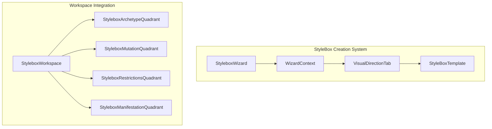
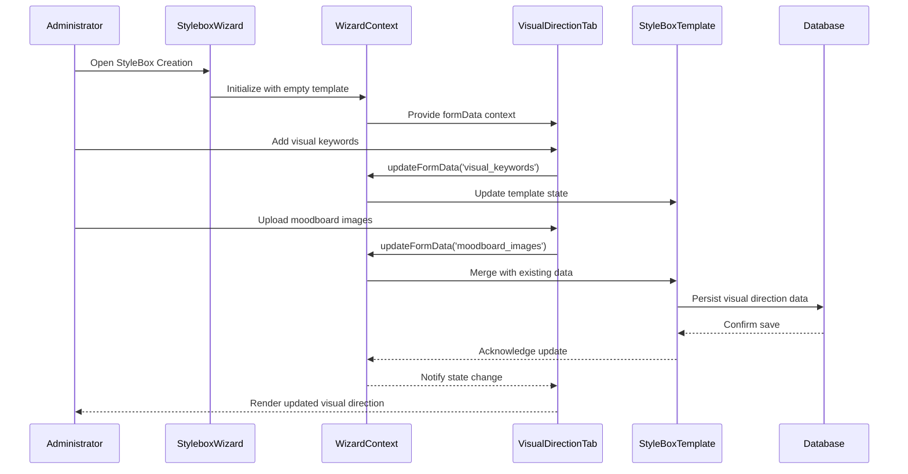
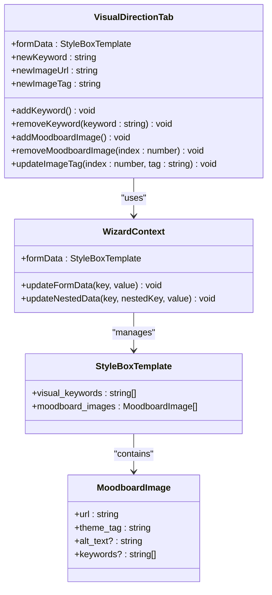
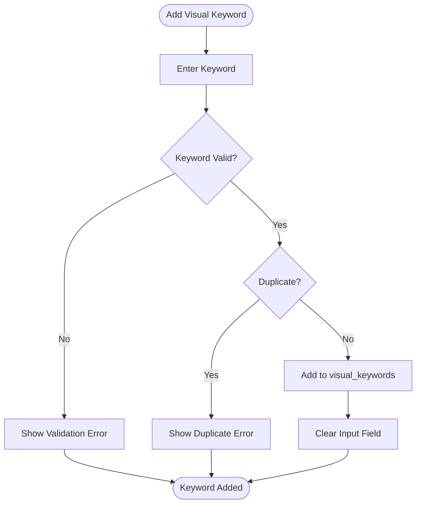
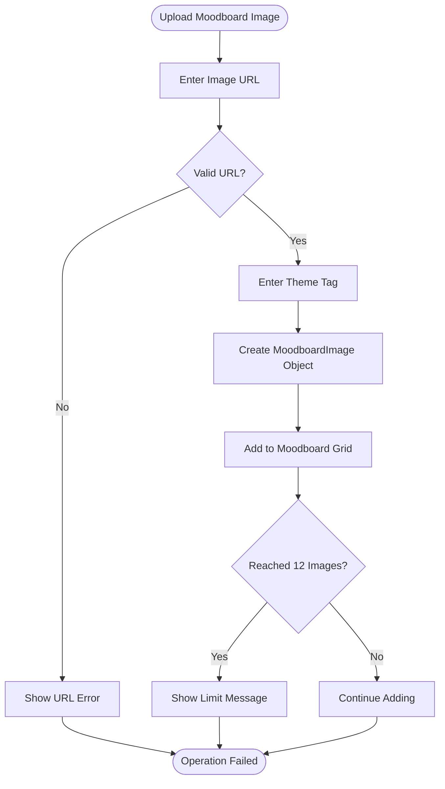
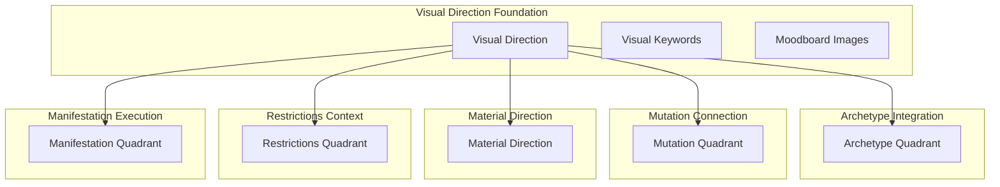
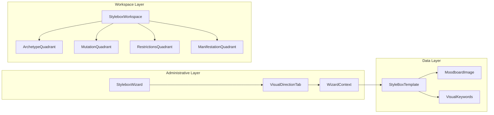

# Visual Direction Quadrant

<cite>
**Referenced Files in This Document**
- [VisualDirectionTab.tsx](file://src/components/admin/stylebox-wizard/tabs/VisualDirectionTab.tsx)
- [stylebox-template.ts](file://src/lib/stylebox-template.ts)
- [WizardContext.tsx](file://src/components/admin/stylebox-wizard/WizardContext.tsx)
- [StyleboxWizard.tsx](file://src/components/admin/stylebox-wizard/StyleboxWizard.tsx)
- [StyleboxWorkspace.tsx](file://src/pages/StyleboxWorkspace.tsx)
- [StyleboxArchetypeQuadrant.tsx](file://src/components/stylebox/workspace/StyleboxArchetypeQuadrant.tsx)
- [StyleboxMutationQuadrant.tsx](file://src/components/stylebox/workspace/StyleboxMutationQuadrant.tsx)
- [StyleboxRestrictionsQuadrant.tsx](file://src/components/stylebox/workspace/StyleboxRestrictionsQuadrant.tsx)
- [StyleboxManifestationQuadrant.tsx](file://src/components/stylebox/workspace/StyleboxManifestationQuadrant.tsx)
- [TrendDirectionTab.tsx](file://src/components/admin/stylebox-wizard/tabs/TrendDirectionTab.tsx)
- [MaterialDirectionTab.tsx](file://src/components/admin/stylebox-wizard/tabs/MaterialDirectionTab.tsx)
</cite>

## Table of Contents
1. [Introduction](#introduction)
2. [Project Structure](#project-structure)
3. [Core Components](#core-components)
4. [Architecture Overview](#architecture-overview)
5. [Detailed Component Analysis](#detailed-component-analysis)
6. [Dependency Analysis](#dependency-analysis)
7. [Performance Considerations](#performance-considerations)
8. [Troubleshooting Guide](#troubleshooting-guide)
9. [Conclusion](#conclusion)

## Introduction
The Visual Direction quadrant defines the aesthetic identity and visual language of a StyleBox. It captures the creative vision through curated visual references and descriptive keywords, establishing a cohesive brand personality and design direction. This quadrant serves as the foundation for material selection, color systems, and stylistic decisions across all four quadrants of the StyleBox framework.

## Project Structure
The Visual Direction quadrant is implemented as part of the StyleBox creation wizard and integrates with the broader design system through shared templates and context management.

**Diagram sources**
- [StyleboxWizard.tsx](file://src/components/admin/stylebox-wizard/StyleboxWizard.tsx#L95-L104)
- [WizardContext.tsx](file://src/components/admin/stylebox-wizard/WizardContext.tsx#L45-L120)
- [VisualDirectionTab.tsx](file://src/components/admin/stylebox-wizard/tabs/VisualDirectionTab.tsx#L10-L189)

**Section sources**
- [StyleboxWizard.tsx](file://src/components/admin/stylebox-wizard/StyleboxWizard.tsx#L41-L49)
- [WizardContext.tsx](file://src/components/admin/stylebox-wizard/WizardContext.tsx#L15-L38)

## Core Components
The Visual Direction quadrant consists of two primary configuration areas: visual keywords and moodboard imagery.

### Visual Keywords System
The visual keywords represent the core aesthetic descriptors that define the design direction. These keywords serve as directional indicators for material selection, color choices, and stylistic elements.

### Moodboard Management
The moodboard system allows administrators to upload and organize visual references with thematic tagging. Each moodboard image can be individually tagged, edited, and removed.

**Section sources**
- [VisualDirectionTab.tsx](file://src/components/admin/stylebox-wizard/tabs/VisualDirectionTab.tsx#L16-L51)
- [stylebox-template.ts](file://src/lib/stylebox-template.ts#L30-L35)

## Architecture Overview
The Visual Direction quadrant operates within a multi-quadrant design framework that establishes visual identity while maintaining technical constraints and material feasibility.

**Diagram sources**
- [StyleboxWizard.tsx](file://src/components/admin/stylebox-wizard/StyleboxWizard.tsx#L198-L279)
- [WizardContext.tsx](file://src/components/admin/stylebox-wizard/WizardContext.tsx#L53-L92)
- [VisualDirectionTab.tsx](file://src/components/admin/stylebox-wizard/tabs/VisualDirectionTab.tsx#L16-L51)

## Detailed Component Analysis

### VisualDirectionTab Component
The VisualDirectionTab provides the administrative interface for defining visual direction through interactive controls and real-time preview capabilities.

**Diagram sources**
- [VisualDirectionTab.tsx](file://src/components/admin/stylebox-wizard/tabs/VisualDirectionTab.tsx#L10-L189)
- [WizardContext.tsx](file://src/components/admin/stylebox-wizard/WizardContext.tsx#L15-L38)
- [stylebox-template.ts](file://src/lib/stylebox-template.ts#L30-L35)

#### Visual Keyword Management
The keyword management system enables administrators to define aesthetic descriptors that guide design decisions throughout the StyleBox process.

**Diagram sources**
- [VisualDirectionTab.tsx](file://src/components/admin/stylebox-wizard/tabs/VisualDirectionTab.tsx#L16-L25)

#### Moodboard Image Workflow
The moodboard system supports image upload, tagging, and interactive management with preview capabilities.

**Diagram sources**
- [VisualDirectionTab.tsx](file://src/components/admin/stylebox-wizard/tabs/VisualDirectionTab.tsx#L27-L51)

**Section sources**
- [VisualDirectionTab.tsx](file://src/components/admin/stylebox-wizard/tabs/VisualDirectionTab.tsx#L10-L189)

### Integration with Other Quadrants
The Visual Direction quadrant works in concert with other quadrants to establish a comprehensive design framework.

**Diagram sources**
- [StyleboxArchetypeQuadrant.tsx](file://src/components/stylebox/workspace/StyleboxArchetypeQuadrant.tsx#L34-L131)
- [StyleboxMutationQuadrant.tsx](file://src/components/stylebox/workspace/StyleboxMutationQuadrant.tsx#L44-L140)
- [StyleboxRestrictionsQuadrant.tsx](file://src/components/stylebox/workspace/StyleboxRestrictionsQuadrant.tsx#L43-L227)
- [StyleboxManifestationQuadrant.tsx](file://src/components/stylebox/workspace/StyleboxManifestationQuadrant.tsx#L66-L201)

**Section sources**
- [StyleboxWorkspace.tsx](file://src/pages/StyleboxWorkspace.tsx#L292-L326)

### Data Model and Configuration Options
The Visual Direction quadrant utilizes a structured data model that supports flexible configuration and extensible properties.

| Property | Type | Description | Default |
|----------|------|-------------|---------|
| visual_keywords | string[] | Aesthetic descriptors guiding design direction | [] |
| moodboard_images | MoodboardImage[] | Curated visual references with metadata | [] |
| thumbnail_url | string | Representative image for the StyleBox | undefined |

**Section sources**
- [stylebox-template.ts](file://src/lib/stylebox-template.ts#L240-L243)

## Dependency Analysis
The Visual Direction quadrant maintains loose coupling with other system components while providing essential configuration data.

**Diagram sources**
- [StyleboxWizard.tsx](file://src/components/admin/stylebox-wizard/StyleboxWizard.tsx#L19-L28)
- [WizardContext.tsx](file://src/components/admin/stylebox-wizard/WizardContext.tsx#L15-L38)
- [stylebox-template.ts](file://src/lib/stylebox-template.ts#L209-L282)

**Section sources**
- [StyleboxWizard.tsx](file://src/components/admin/stylebox-wizard/StyleboxWizard.tsx#L51-L93)
- [WizardContext.tsx](file://src/components/admin/stylebox-wizard/WizardContext.tsx#L45-L120)

## Performance Considerations
The Visual Direction quadrant is designed for optimal performance through efficient state management and lazy loading of visual assets.

- **State Management**: Uses React's useState hook for minimal re-renders
- **Image Loading**: Implements error fallbacks and placeholder states
- **Memory Efficiency**: Limits moodboard to 12 images with grid-based rendering
- **Validation**: Real-time input validation prevents invalid states

## Troubleshooting Guide

### Common Issues and Solutions

**Issue**: Moodboard image fails to load
- **Cause**: Invalid URL or network error
- **Solution**: Verify URL validity and check network connectivity
- **Prevention**: Implement URL validation before adding to moodboard

**Issue**: Visual keywords not appearing in workspace
- **Cause**: State synchronization delay
- **Solution**: Ensure proper context provider wrapping
- **Prevention**: Use useEffect for state persistence

**Issue**: Exceeded moodboard image limit
- **Cause**: Attempting to add more than 12 images
- **Solution**: Remove existing images or reduce count
- **Prevention**: Implement real-time limit checking

**Section sources**
- [VisualDirectionTab.tsx](file://src/components/admin/stylebox-wizard/tabs/VisualDirectionTab.tsx#L142-L144)

## Conclusion
The Visual Direction quadrant serves as the cornerstone of the StyleBox design framework, establishing aesthetic identity through curated visual references and descriptive keywords. Its integration with the four-quadrant system ensures that visual direction informs material selection, technical constraints, and final execution while maintaining flexibility for customization across different design categories and complexity levels.

The component architecture supports scalable development with clear separation of concerns, enabling administrators to create comprehensive visual directions that guide designers toward cohesive, market-relevant outcomes while preserving technical feasibility and production quality standards.