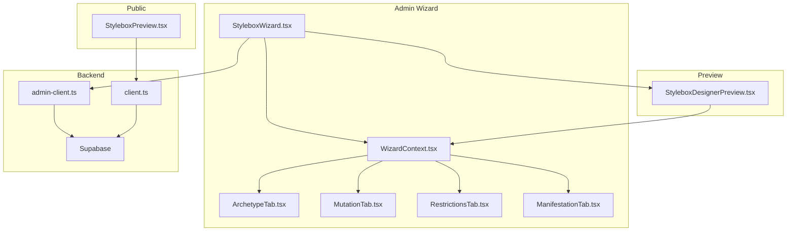
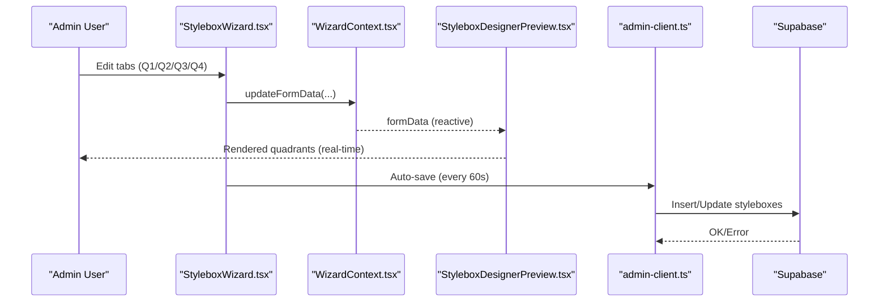
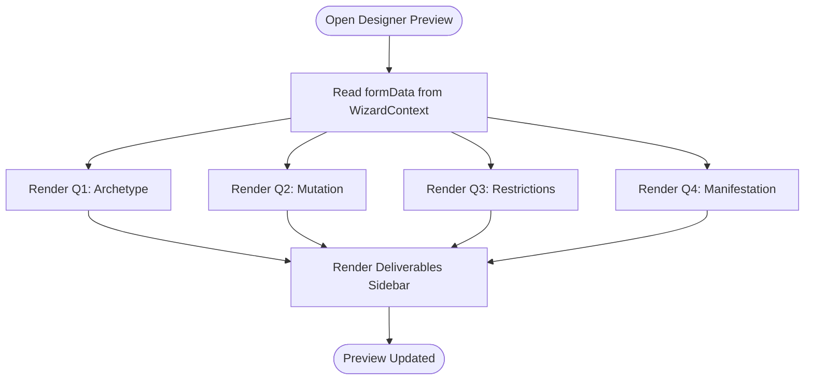
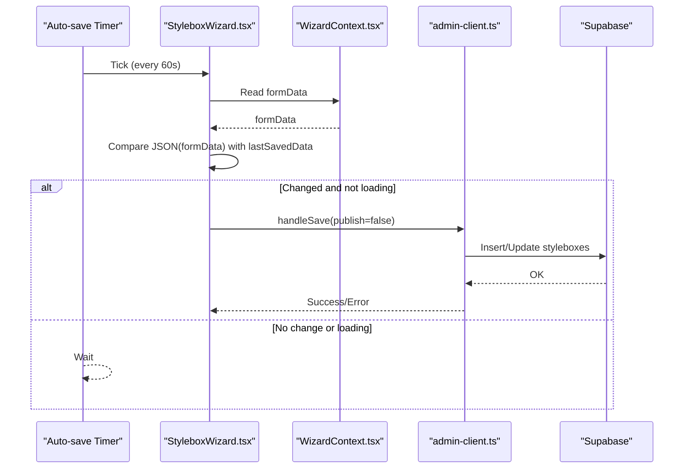
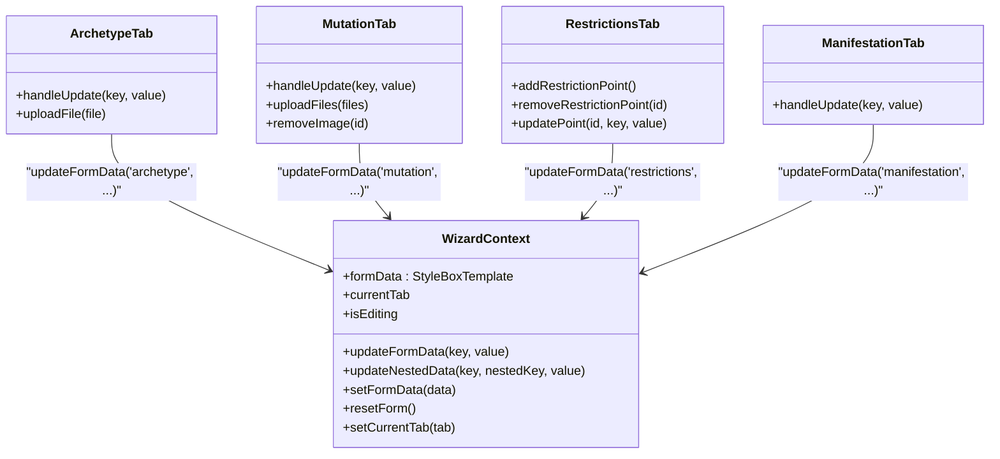
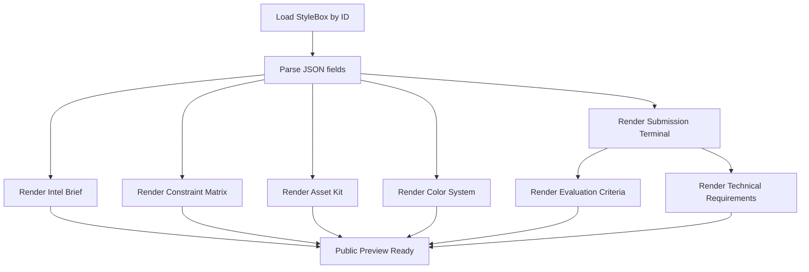
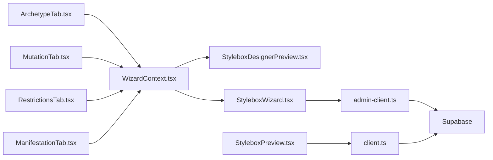

# Real-time Preview & Design Visualization

<cite>
**Referenced Files in This Document**
- [StyleboxDesignerPreview.tsx](file://src/components/admin/stylebox-wizard/StyleboxDesignerPreview.tsx)
- [StyleboxWizard.tsx](file://src/components/admin/stylebox-wizard/StyleboxWizard.tsx)
- [WizardContext.tsx](file://src/components/admin/stylebox-wizard/WizardContext.tsx)
- [ArchetypeTab.tsx](file://src/components/admin/stylebox-wizard/tabs/ArchetypeTab.tsx)
- [MutationTab.tsx](file://src/components/admin/stylebox-wizard/tabs/MutationTab.tsx)
- [RestrictionsTab.tsx](file://src/components/admin/stylebox-wizard/tabs/RestrictionsTab.tsx)
- [ManifestationTab.tsx](file://src/components/admin/stylebox-wizard/tabs/ManifestationTab.tsx)
- [StyleboxPreview.tsx](file://src/pages/StyleboxPreview.tsx)
- [stylebox-template.ts](file://src/lib/stylebox-template.ts)
- [image-processing.ts](file://src/lib/image-processing.ts)
- [admin-client.ts](file://src/integrations/supabase/admin-client.ts)
- [client.ts](file://src/integrations/supabase/client.ts)
- [App.tsx](file://src/App.tsx)
</cite>

## Table of Contents
1. [Introduction](#introduction)
2. [Project Structure](#project-structure)
3. [Core Components](#core-components)
4. [Architecture Overview](#architecture-overview)
5. [Detailed Component Analysis](#detailed-component-analysis)
6. [Dependency Analysis](#dependency-analysis)
7. [Performance Considerations](#performance-considerations)
8. [Troubleshooting Guide](#troubleshooting-guide)
9. [Conclusion](#conclusion)
10. [Appendices](#appendices)

## Introduction
This document explains the real-time preview system for StyleBox creation, focusing on how the wizard captures design intent across four quadrants and how the preview renders those inputs in near real-time. It covers the preview architecture, data synchronization between the wizard and preview, the rendering pipeline for design elements, preview modes, interactive features, and how changes propagate across all quadrants. Practical usage examples, limitations, and integration tips for iterative design are included, along with performance and browser compatibility considerations.

## Project Structure
The preview system spans three primary areas:
- Admin StyleBox Wizard: A guided, multi-tab form that builds a StyleBox template in memory and persists it to the backend.
- Designer Preview: A dedicated preview overlay that mirrors the wizard’s current state for designers.
- Public StyleBox Preview: A read-only page for end users to review published StyleBox content.

**Diagram sources**
- [StyleboxWizard.tsx](file://src/components/admin/stylebox-wizard/StyleboxWizard.tsx#L106-L391)
- [WizardContext.tsx](file://src/components/admin/stylebox-wizard/WizardContext.tsx#L45-L119)
- [ArchetypeTab.tsx](file://src/components/admin/stylebox-wizard/tabs/ArchetypeTab.tsx#L32-L217)
- [MutationTab.tsx](file://src/components/admin/stylebox-wizard/tabs/MutationTab.tsx#L12-L185)
- [RestrictionsTab.tsx](file://src/components/admin/stylebox-wizard/tabs/RestrictionsTab.tsx#L14-L183)
- [ManifestationTab.tsx](file://src/components/admin/stylebox-wizard/tabs/ManifestationTab.tsx#L6-L56)
- [StyleboxDesignerPreview.tsx](file://src/components/admin/stylebox-wizard/StyleboxDesignerPreview.tsx#L11-L186)
- [admin-client.ts](file://src/integrations/supabase/admin-client.ts#L16-L27)
- [client.ts](file://src/integrations/supabase/client.ts#L11-L17)
- [StyleboxPreview.tsx](file://src/pages/StyleboxPreview.tsx#L120-L794)

**Section sources**
- [StyleboxWizard.tsx](file://src/components/admin/stylebox-wizard/StyleboxWizard.tsx#L106-L391)
- [StyleboxDesignerPreview.tsx](file://src/components/admin/stylebox-wizard/StyleboxDesignerPreview.tsx#L11-L186)
- [StyleboxPreview.tsx](file://src/pages/StyleboxPreview.tsx#L120-L794)
- [App.tsx](file://src/App.tsx#L175-L426)

## Core Components
- StyleboxDesignerPreview: Renders the four-quadrant preview with real-time updates from the wizard’s formData.
- StyleboxWizard: Orchestrates the wizard UI, manages auto-save, and controls the preview modal.
- WizardContext: Centralizes form state, updates, and derived defaults for difficulty and deliverables.
- Tab Components: Build the quadrant data (Archetype, Mutation, Restrictions, Manifestation).
- Public StyleboxPreview: Displays published StyleBox content for end users.
- Supabase Clients: Provide admin and public clients for persistence and retrieval.
- Image Processing Utilities: Watermark and prepare assets for upload.

**Section sources**
- [StyleboxDesignerPreview.tsx](file://src/components/admin/stylebox-wizard/StyleboxDesignerPreview.tsx#L11-L186)
- [StyleboxWizard.tsx](file://src/components/admin/stylebox-wizard/StyleboxWizard.tsx#L106-L391)
- [WizardContext.tsx](file://src/components/admin/stylebox-wizard/WizardContext.tsx#L45-L119)
- [ArchetypeTab.tsx](file://src/components/admin/stylebox-wizard/tabs/ArchetypeTab.tsx#L32-L217)
- [MutationTab.tsx](file://src/components/admin/stylebox-wizard/tabs/MutationTab.tsx#L12-L185)
- [RestrictionsTab.tsx](file://src/components/admin/stylebox-wizard/tabs/RestrictionsTab.tsx#L14-L183)
- [ManifestationTab.tsx](file://src/components/admin/stylebox-wizard/tabs/ManifestationTab.tsx#L6-L56)
- [StyleboxPreview.tsx](file://src/pages/StyleboxPreview.tsx#L120-L794)
- [admin-client.ts](file://src/integrations/supabase/admin-client.ts#L16-L27)
- [client.ts](file://src/integrations/supabase/client.ts#L11-L17)
- [image-processing.ts](file://src/lib/image-processing.ts#L17-L81)

## Architecture Overview
The preview system follows a unidirectional data flow:
- Wizard tabs mutate the shared context (formData).
- The preview reads formData and renders the four quadrants in real time.
- Auto-save persists changes to the backend at intervals.
- Public preview fetches published StyleBox data from the public client.

**Diagram sources**
- [StyleboxWizard.tsx](file://src/components/admin/stylebox-wizard/StyleboxWizard.tsx#L183-L196)
- [WizardContext.tsx](file://src/components/admin/stylebox-wizard/WizardContext.tsx#L53-L78)
- [StyleboxDesignerPreview.tsx](file://src/components/admin/stylebox-wizard/StyleboxDesignerPreview.tsx#L11-L186)
- [admin-client.ts](file://src/integrations/supabase/admin-client.ts#L16-L27)

## Detailed Component Analysis

### Designer Preview Modal
The preview modal displays the current wizard state in a 2x2 grid:
- Q1: Archetype (silhouette, rationale, anchor image)
- Q2: Mutation (concept, directive, moodboard)
- Q3: Restrictions (points, tolerances)
- Q4: Manifestation (final prompt)
- A sidebar lists deliverables for the current StyleBox.

Interactive features:
- Hover zoom on the Archetype anchor image.
- Hover reveal for image actions in the Mutation quadrant.
- Responsive grid scaling for desktop/tablet/mobile.

Rendering pipeline:
- Preview reads formData from the context and maps fields to quadrant slots.
- Conditional rendering for empty states and missing data.
- Static “Design Kit” download button and close action.

**Diagram sources**
- [StyleboxDesignerPreview.tsx](file://src/components/admin/stylebox-wizard/StyleboxDesignerPreview.tsx#L11-L186)
- [WizardContext.tsx](file://src/components/admin/stylebox-wizard/WizardContext.tsx#L15-L28)

**Section sources**
- [StyleboxDesignerPreview.tsx](file://src/components/admin/stylebox-wizard/StyleboxDesignerPreview.tsx#L11-L186)

### Wizard and Data Synchronization
The wizard maintains a reactive form state and triggers:
- Auto-save every 60 seconds when formData changes and the form is not loading.
- Validation before saving (title required).
- Conversion of template data to database shape for persistence.

**Diagram sources**
- [StyleboxWizard.tsx](file://src/components/admin/stylebox-wizard/StyleboxWizard.tsx#L183-L196)
- [StyleboxWizard.tsx](file://src/components/admin/stylebox-wizard/StyleboxWizard.tsx#L198-L279)
- [admin-client.ts](file://src/integrations/supabase/admin-client.ts#L16-L27)

**Section sources**
- [StyleboxWizard.tsx](file://src/components/admin/stylebox-wizard/StyleboxWizard.tsx#L183-L279)

### Quadrant Builders and Data Flow
Each tab contributes to a specific quadrant:
- ArchetypeTab: Updates archetype.silhouette, archetype.rationale, archetype.anchor_image.
- MutationTab: Updates mutation.concept, mutation.directive, mutation.moodboard.
- RestrictionsTab: Updates restrictions.points, restrictions.tolerances.
- ManifestationTab: Updates manifestation.prompt.

These updates are applied via updateFormData and updateNestedData in the context, ensuring immediate preview updates.

**Diagram sources**
- [WizardContext.tsx](file://src/components/admin/stylebox-wizard/WizardContext.tsx#L53-L92)
- [ArchetypeTab.tsx](file://src/components/admin/stylebox-wizard/tabs/ArchetypeTab.tsx#L39-L41)
- [MutationTab.tsx](file://src/components/admin/stylebox-wizard/tabs/MutationTab.tsx#L18-L20)
- [RestrictionsTab.tsx](file://src/components/admin/stylebox-wizard/tabs/RestrictionsTab.tsx#L37-L41)
- [ManifestationTab.tsx](file://src/components/admin/stylebox-wizard/tabs/ManifestationTab.tsx#L10-L12)

**Section sources**
- [ArchetypeTab.tsx](file://src/components/admin/stylebox-wizard/tabs/ArchetypeTab.tsx#L32-L217)
- [MutationTab.tsx](file://src/components/admin/stylebox-wizard/tabs/MutationTab.tsx#L12-L185)
- [RestrictionsTab.tsx](file://src/components/admin/stylebox-wizard/tabs/RestrictionsTab.tsx#L14-L183)
- [ManifestationTab.tsx](file://src/components/admin/stylebox-wizard/tabs/ManifestationTab.tsx#L6-L56)
- [WizardContext.tsx](file://src/components/admin/stylebox-wizard/WizardContext.tsx#L53-L92)

### Public Preview Rendering
The public StyleboxPreview page fetches a published StyleBox and renders:
- Intel Brief (scenario/theme/context/difficulty spike)
- Constraint Matrix (physics/construction/material/technical/aesthetic)
- Asset Kit (materials and moodboard)
- Color System
- Submission Terminal (deliverables checklist, file URLs, hack log)
- Evaluation Criteria and Technical Requirements

**Diagram sources**
- [StyleboxPreview.tsx](file://src/pages/StyleboxPreview.tsx#L130-L143)
- [StyleboxPreview.tsx](file://src/pages/StyleboxPreview.tsx#L239-L250)
- [StyleboxPreview.tsx](file://src/pages/StyleboxPreview.tsx#L330-L368)
- [StyleboxPreview.tsx](file://src/pages/StyleboxPreview.tsx#L370-L411)
- [StyleboxPreview.tsx](file://src/pages/StyleboxPreview.tsx#L413-L456)
- [StyleboxPreview.tsx](file://src/pages/StyleboxPreview.tsx#L458-L487)
- [StyleboxPreview.tsx](file://src/pages/StyleboxPreview.tsx#L489-L623)
- [StyleboxPreview.tsx](file://src/pages/StyleboxPreview.tsx#L724-L788)

**Section sources**
- [StyleboxPreview.tsx](file://src/pages/StyleboxPreview.tsx#L120-L794)

### Preview Modes and Interactive Features
- Designer Preview Mode: Dedicated overlay with quadrant labels and a sidebar checklist.
- Interactive elements:
  - Archetype anchor image hover zoom.
  - Mutation moodboard image hover actions and drag hints.
  - Restrictions points collapsible details.
  - Manifestation prompt editor with character counter.
- Preview modes:
  - Designer Preview: Admin-only, for reviewing the current draft.
  - Public Preview: End-user read-only view of published StyleBoxes.

**Section sources**
- [StyleboxDesignerPreview.tsx](file://src/components/admin/stylebox-wizard/StyleboxDesignerPreview.tsx#L42-L154)
- [StyleboxDesignerPreview.tsx](file://src/components/admin/stylebox-wizard/StyleboxDesignerPreview.tsx#L156-L183)
- [ArchetypeTab.tsx](file://src/components/admin/stylebox-wizard/tabs/ArchetypeTab.tsx#L170-L213)
- [MutationTab.tsx](file://src/components/admin/stylebox-wizard/tabs/MutationTab.tsx#L141-L181)
- [ManifestationTab.tsx](file://src/components/admin/stylebox-wizard/tabs/ManifestationTab.tsx#L34-L45)

### Real-time Propagation Across Quadrants
- Changes in any tab immediately update formData in the context.
- The preview re-renders all four quadrants based on the latest formData.
- Deliverables sidebar updates when category or difficulty changes via context helpers.

**Section sources**
- [WizardContext.tsx](file://src/components/admin/stylebox-wizard/WizardContext.tsx#L53-L78)
- [StyleboxDesignerPreview.tsx](file://src/components/admin/stylebox-wizard/StyleboxDesignerPreview.tsx#L11-L186)

### Practical Examples
- Using the preview during design:
  - Switch tabs to see how the Manifestation prompt evolves and how it affects the Q4 prompt area.
  - Add images to the Mutation moodboard and observe their appearance in the preview grid.
  - Toggle Restriction points to refine constraints and see numerical tolerances reflected.
- Integrating preview feedback:
  - Use the preview to validate that the Archetype rationale and silhouette align with the Mutation concept.
  - Confirm deliverables match the chosen category and difficulty.
- Iterative workflow:
  - Make small adjustments in one quadrant, preview the impact, then refine adjacent quadrants accordingly.

[No sources needed since this section provides practical guidance]

### Preview Limitations
- Designer Preview is read-only; it does not persist changes—use the wizard’s auto-save and explicit save actions.
- Public Preview requires a published StyleBox; drafts are not rendered.
- Image uploads are watermarked and stored in Supabase; previews reflect public URLs after upload completes.

**Section sources**
- [StyleboxDesignerPreview.tsx](file://src/components/admin/stylebox-wizard/StyleboxDesignerPreview.tsx#L11-L186)
- [StyleboxPreview.tsx](file://src/pages/StyleboxPreview.tsx#L120-L794)
- [ArchetypeTab.tsx](file://src/components/admin/stylebox-wizard/tabs/ArchetypeTab.tsx#L43-L78)
- [MutationTab.tsx](file://src/components/admin/stylebox-wizard/tabs/MutationTab.tsx#L22-L66)

### Browser Compatibility
- Canvas-based watermarking relies on modern browser APIs; ensure support for FileReader, OffscreenCanvas, and Blob conversion.
- Supabase client requires HTTPS-compatible environments for secure storage operations.

**Section sources**
- [image-processing.ts](file://src/lib/image-processing.ts#L17-L81)
- [admin-client.ts](file://src/integrations/supabase/admin-client.ts#L16-L27)

## Dependency Analysis
The preview system depends on:
- WizardContext for centralized state.
- Tab components for data entry and image processing.
- Supabase clients for persistence and retrieval.
- Template definitions for type safety and defaults.

**Diagram sources**
- [WizardContext.tsx](file://src/components/admin/stylebox-wizard/WizardContext.tsx#L45-L119)
- [StyleboxDesignerPreview.tsx](file://src/components/admin/stylebox-wizard/StyleboxDesignerPreview.tsx#L11-L186)
- [StyleboxWizard.tsx](file://src/components/admin/stylebox-wizard/StyleboxWizard.tsx#L106-L391)
- [ArchetypeTab.tsx](file://src/components/admin/stylebox-wizard/tabs/ArchetypeTab.tsx#L32-L217)
- [MutationTab.tsx](file://src/components/admin/stylebox-wizard/tabs/MutationTab.tsx#L12-L185)
- [RestrictionsTab.tsx](file://src/components/admin/stylebox-wizard/tabs/RestrictionsTab.tsx#L14-L183)
- [ManifestationTab.tsx](file://src/components/admin/stylebox-wizard/tabs/ManifestationTab.tsx#L6-L56)
- [admin-client.ts](file://src/integrations/supabase/admin-client.ts#L16-L27)
- [client.ts](file://src/integrations/supabase/client.ts#L11-L17)

**Section sources**
- [stylebox-template.ts](file://src/lib/stylebox-template.ts#L209-L282)
- [App.tsx](file://src/App.tsx#L175-L426)

## Performance Considerations
- Auto-save interval: 60 seconds reduces server load while preserving drafts.
- Image watermarking occurs client-side before upload; large batches may impact responsiveness—consider batching or progress indicators.
- Public preview uses React Query caching; ensure cache keys are stable to avoid unnecessary refetches.
- Preview rendering is lightweight; keep image sizes reasonable to maintain smooth hover effects and grid layouts.

[No sources needed since this section provides general guidance]

## Troubleshooting Guide
- Preview not updating:
  - Verify that tabs are calling updateFormData/updateNestedData.
  - Ensure the preview is mounted and reading from the same context provider.
- Upload failures:
  - Check console for errors during watermarking or Supabase upload.
  - Confirm storage bucket permissions and file size limits.
- Public preview blank:
  - Confirm the StyleBox ID exists and the user is authenticated if required.
  - Validate JSON parsing for arrays/objects (e.g., color_system, moodboard_images).

**Section sources**
- [ArchetypeTab.tsx](file://src/components/admin/stylebox-wizard/tabs/ArchetypeTab.tsx#L43-L78)
- [MutationTab.tsx](file://src/components/admin/stylebox-wizard/tabs/MutationTab.tsx#L22-L66)
- [StyleboxPreview.tsx](file://src/pages/StyleboxPreview.tsx#L130-L143)

## Conclusion
The real-time preview system couples a robust wizard with a responsive preview overlay, enabling designers and curators to visualize StyleBox creations instantly. With context-driven updates, quadrant-specific builders, and a clean separation between admin preview and public read-only views, the system supports an efficient, iterative design workflow. By leveraging auto-save, type-safe templates, and secure asset handling, it balances usability with reliability.

## Appendices
- Template Types and Defaults: See [stylebox-template.ts](file://src/lib/stylebox-template.ts#L209-L282) for the canonical structure and presets.
- Routing: The App router defines where the preview and wizard are accessible. See [App.tsx](file://src/App.tsx#L175-L426).