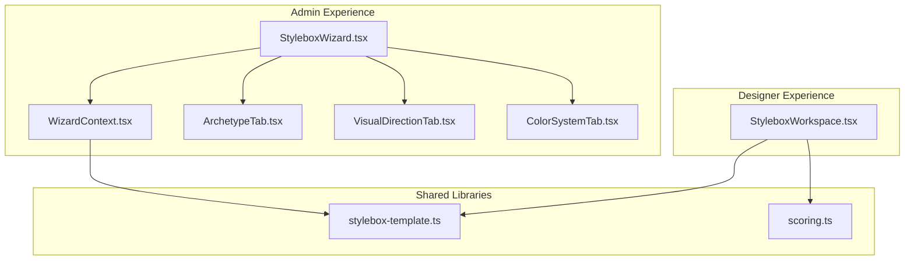
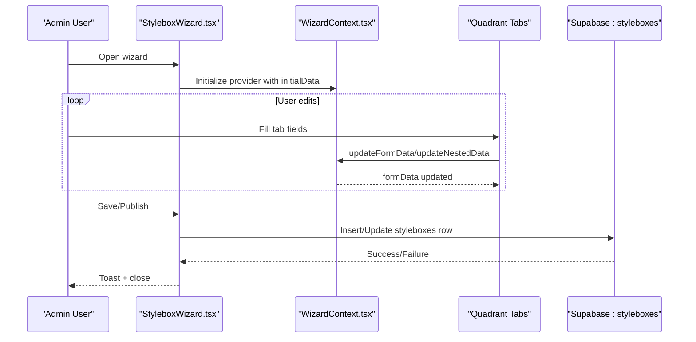
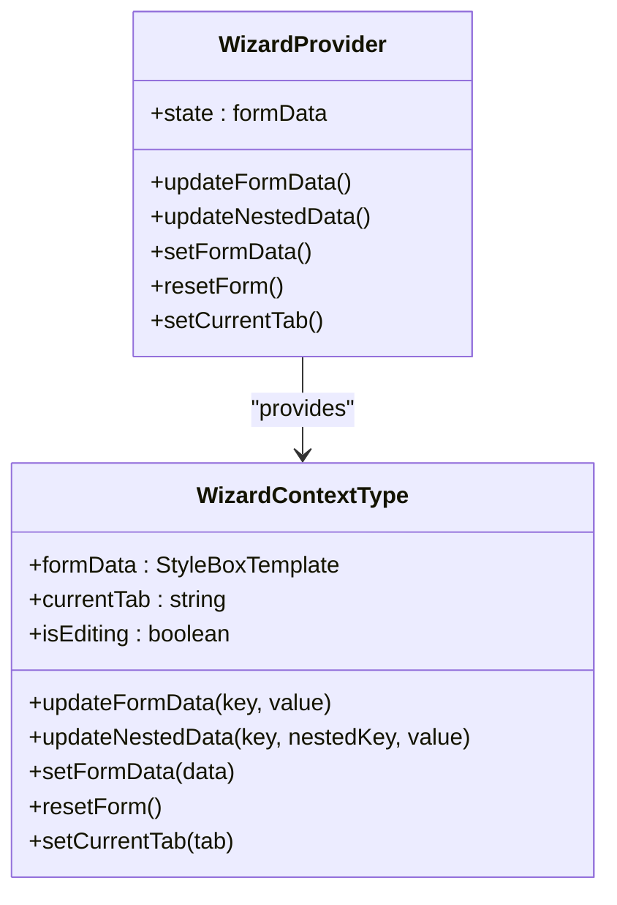
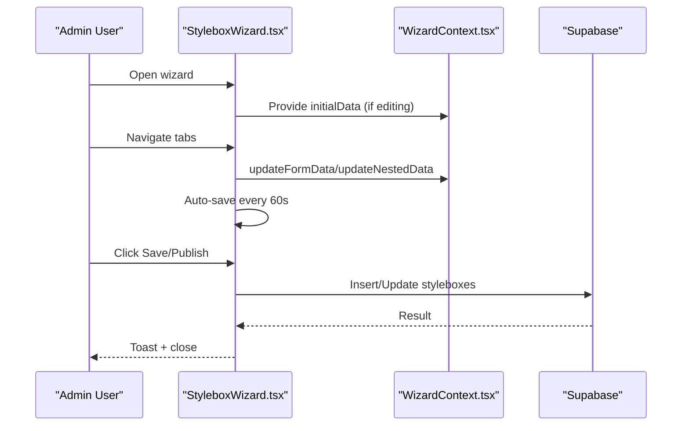
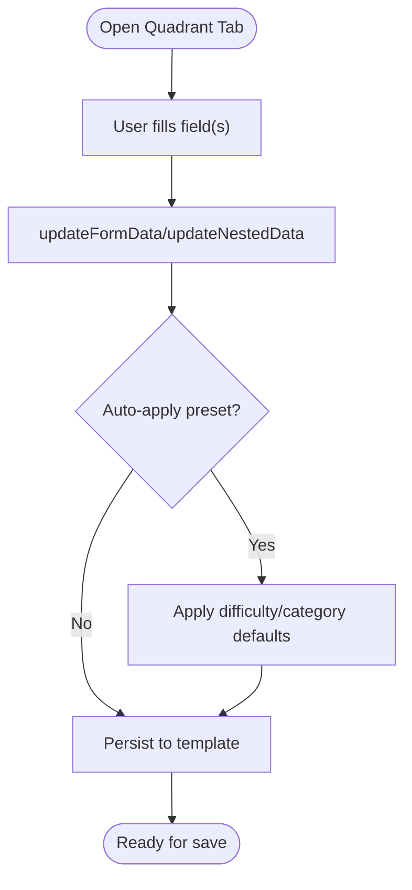
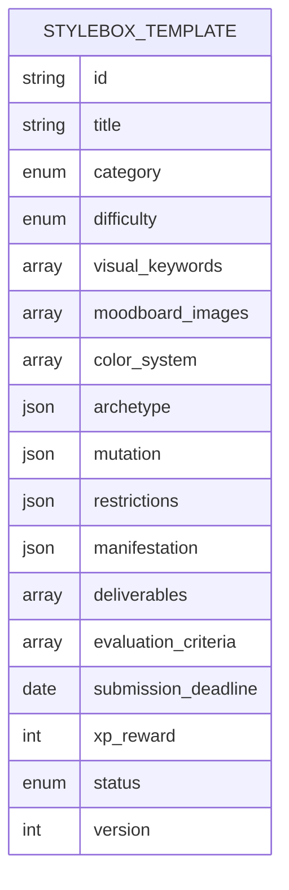
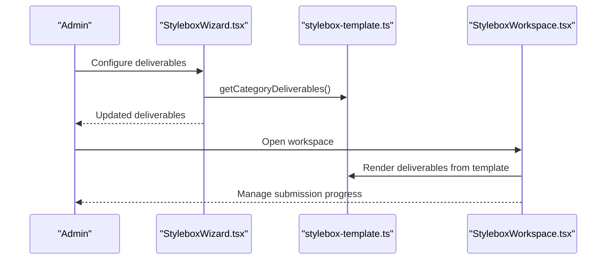
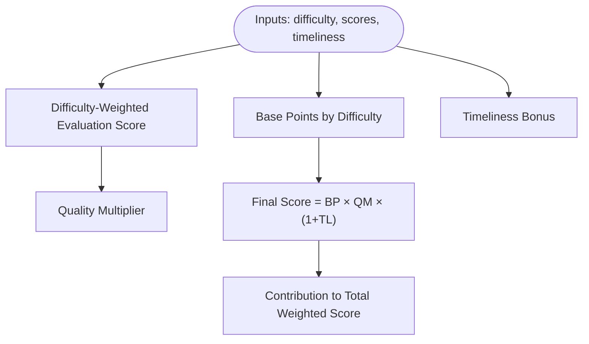
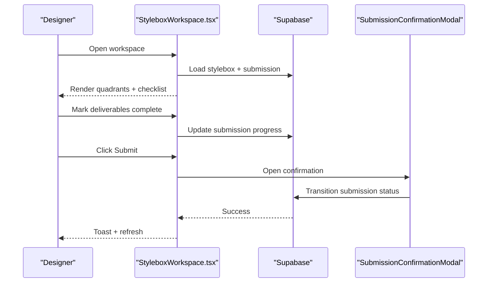
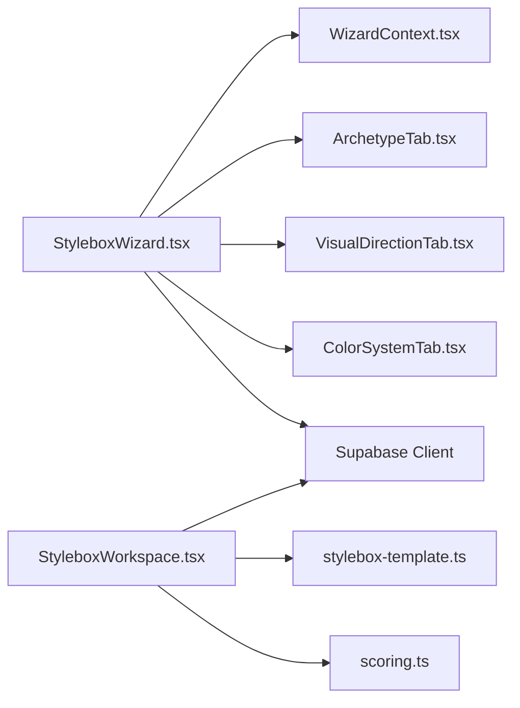

# Stylebox Creation System

<cite>
**Referenced Files in This Document**
- [stylebox-template.ts](file://src/lib/stylebox-template.ts)
- [scoring.ts](file://src/lib/scoring.ts)
- [StyleboxWizard.tsx](file://src/components/admin/stylebox-wizard/StyleboxWizard.tsx)
- [WizardContext.tsx](file://src/components/admin/stylebox-wizard/WizardContext.tsx)
- [ArchetypeTab.tsx](file://src/components/admin/stylebox-wizard/tabs/ArchetypeTab.tsx)
- [VisualDirectionTab.tsx](file://src/components/admin/stylebox-wizard/tabs/VisualDirectionTab.tsx)
- [ColorSystemTab.tsx](file://src/components/admin/stylebox-wizard/tabs/ColorSystemTab.tsx)
- [StyleboxWorkspace.tsx](file://src/pages/StyleboxWorkspace.tsx)
</cite>

## Table of Contents
1. [Introduction](#introduction)
2. [Project Structure](#project-structure)
3. [Core Components](#core-components)
4. [Architecture Overview](#architecture-overview)
5. [Detailed Component Analysis](#detailed-component-analysis)
6. [Dependency Analysis](#dependency-analysis)
7. [Performance Considerations](#performance-considerations)
8. [Troubleshooting Guide](#troubleshooting-guide)
9. [Conclusion](#conclusion)
10. [Appendices](#appendices)

## Introduction
This document explains the advanced Stylebox creation system, focusing on the wizard interface architecture, the four-quadrant design methodology (archetype, mutation, restrictions, manifestation), the template system, deliverables management, and the scoring system for design evaluation. It also covers the wizard’s state management via a dedicated context, real-time preview capabilities, and how the workspace integrates with the broader studio submission and review workflows.

## Project Structure
The Stylebox system spans three primary areas:
- Admin creation wizard: a guided, multi-tab form that builds a standardized StyleBox template.
- Workspace: a designer-facing environment for working on a StyleBox, with quadrant views and deliverables checklist.
- Shared libraries: strongly typed templates and scoring logic used across admin and designer experiences.

**Diagram sources**
- [StyleboxWizard.tsx](file://src/components/admin/stylebox-wizard/StyleboxWizard.tsx#L51-L104)
- [WizardContext.tsx](file://src/components/admin/stylebox-wizard/WizardContext.tsx#L45-L119)
- [ArchetypeTab.tsx](file://src/components/admin/stylebox-wizard/tabs/ArchetypeTab.tsx#L32-L87)
- [VisualDirectionTab.tsx](file://src/components/admin/stylebox-wizard/tabs/VisualDirectionTab.tsx#L10-L53)
- [ColorSystemTab.tsx](file://src/components/admin/stylebox-wizard/tabs/ColorSystemTab.tsx#L17-L64)
- [StyleboxWorkspace.tsx](file://src/pages/StyleboxWorkspace.tsx#L29-L166)
- [stylebox-template.ts](file://src/lib/stylebox-template.ts#L209-L282)
- [scoring.ts](file://src/lib/scoring.ts#L85-L97)

**Section sources**
- [StyleboxWizard.tsx](file://src/components/admin/stylebox-wizard/StyleboxWizard.tsx#L51-L104)
- [WizardContext.tsx](file://src/components/admin/stylebox-wizard/WizardContext.tsx#L45-L119)
- [StyleboxWorkspace.tsx](file://src/pages/StyleboxWorkspace.tsx#L29-L166)
- [stylebox-template.ts](file://src/lib/stylebox-template.ts#L209-L282)
- [scoring.ts](file://src/lib/scoring.ts#L85-L97)

## Core Components
- StyleBox Template: A production-grade, strongly typed schema that standardizes all StyleBox metadata, quadrants, deliverables, evaluation criteria, and lifecycle fields.
- Wizard Provider and Context: Centralized state for the admin wizard, including form updates, auto-applied presets, and navigation.
- Quadrant Tabs: Specialized forms for Archetype, Visual Direction, and Color System, each tailored to capture domain-specific inputs.
- Workspace: A designer workspace that renders the four quadrants and a deliverables checklist, enabling iterative work and submission.
- Scoring Library: A reusable module for calculating weighted designer scores and evaluation contributions.

**Section sources**
- [stylebox-template.ts](file://src/lib/stylebox-template.ts#L209-L282)
- [WizardContext.tsx](file://src/components/admin/stylebox-wizard/WizardContext.tsx#L15-L38)
- [ArchetypeTab.tsx](file://src/components/admin/stylebox-wizard/tabs/ArchetypeTab.tsx#L32-L87)
- [VisualDirectionTab.tsx](file://src/components/admin/stylebox-wizard/tabs/VisualDirectionTab.tsx#L10-L53)
- [ColorSystemTab.tsx](file://src/components/admin/stylebox-wizard/tabs/ColorSystemTab.tsx#L17-L64)
- [StyleboxWorkspace.tsx](file://src/pages/StyleboxWorkspace.tsx#L29-L166)
- [scoring.ts](file://src/lib/scoring.ts#L85-L97)

## Architecture Overview
The system follows a layered architecture:
- Presentation Layer: Wizard tabs and workspace UI components.
- State Management: WizardProvider maintains form state and applies intelligent defaults.
- Data Model: StyleBoxTemplate defines canonical structure and validation rules.
- Persistence: Admin wizard writes to the styleboxes table; workspace manages designer submissions.
- Scoring: Independent library computes evaluation-based scores.

**Diagram sources**
- [StyleboxWizard.tsx](file://src/components/admin/stylebox-wizard/StyleboxWizard.tsx#L106-L196)
- [WizardContext.tsx](file://src/components/admin/stylebox-wizard/WizardContext.tsx#L45-L101)
- [ArchetypeTab.tsx](file://src/components/admin/stylebox-wizard/tabs/ArchetypeTab.tsx#L39-L41)
- [VisualDirectionTab.tsx](file://src/components/admin/stylebox-wizard/tabs/VisualDirectionTab.tsx#L16-L25)
- [ColorSystemTab.tsx](file://src/components/admin/stylebox-wizard/tabs/ColorSystemTab.tsx#L27-L45)

## Detailed Component Analysis

### Wizard Context and State Management
The WizardProvider centralizes form state and exposes helpers to update top-level and nested fields. It auto-applies:
- Difficulty presets to design guidelines when difficulty changes.
- Category-specific deliverables when category changes.

**Diagram sources**
- [WizardContext.tsx](file://src/components/admin/stylebox-wizard/WizardContext.tsx#L15-L38)
- [WizardContext.tsx](file://src/components/admin/stylebox-wizard/WizardContext.tsx#L45-L119)

**Section sources**
- [WizardContext.tsx](file://src/components/admin/stylebox-wizard/WizardContext.tsx#L15-L38)
- [WizardContext.tsx](file://src/components/admin/stylebox-wizard/WizardContext.tsx#L45-L119)

### Admin Wizard Interface
The wizard is a multi-tab dialog with:
- Navigation controls and step indicators.
- Auto-save every 60 seconds when title is present and data differs.
- Real-time preview and versioning support for editing existing StyleBoxes.
- Sanitized persistence pipeline converting template data to database rows.

**Diagram sources**
- [StyleboxWizard.tsx](file://src/components/admin/stylebox-wizard/StyleboxWizard.tsx#L106-L196)
- [StyleboxWizard.tsx](file://src/components/admin/stylebox-wizard/StyleboxWizard.tsx#L198-L279)
- [WizardContext.tsx](file://src/components/admin/stylebox-wizard/WizardContext.tsx#L53-L92)

**Section sources**
- [StyleboxWizard.tsx](file://src/components/admin/stylebox-wizard/StyleboxWizard.tsx#L106-L196)
- [StyleboxWizard.tsx](file://src/components/admin/stylebox-wizard/StyleboxWizard.tsx#L198-L279)

### Quadrant Tabs: Archetype, Visual Direction, Color System
- Archetype Tab: Captures silhouette selection (including custom), rationale, and anchor image upload with watermarking and storage.
- Visual Direction Tab: Manages visual keywords and a moodboard image gallery with theme tagging.
- Color System Tab: Defines color entries with type and usage ratio, grouped and previewed by type.

**Diagram sources**
- [ArchetypeTab.tsx](file://src/components/admin/stylebox-wizard/tabs/ArchetypeTab.tsx#L39-L41)
- [VisualDirectionTab.tsx](file://src/components/admin/stylebox-wizard/tabs/VisualDirectionTab.tsx#L16-L25)
- [ColorSystemTab.tsx](file://src/components/admin/stylebox-wizard/tabs/ColorSystemTab.tsx#L27-L45)
- [WizardContext.tsx](file://src/components/admin/stylebox-wizard/WizardContext.tsx#L60-L74)

**Section sources**
- [ArchetypeTab.tsx](file://src/components/admin/stylebox-wizard/tabs/ArchetypeTab.tsx#L32-L87)
- [VisualDirectionTab.tsx](file://src/components/admin/stylebox-wizard/tabs/VisualDirectionTab.tsx#L10-L53)
- [ColorSystemTab.tsx](file://src/components/admin/stylebox-wizard/tabs/ColorSystemTab.tsx#L17-L64)
- [WizardContext.tsx](file://src/components/admin/stylebox-wizard/WizardContext.tsx#L60-L74)

### Template System: Strong Typing and Defaults
The StyleBoxTemplate defines:
- Basic metadata (title, category, difficulty, season, visibility).
- Four-quadrant builder data (archetype, mutation, restrictions, manifestation).
- Visual assets (moodboard images, color system).
- Deliverables and evaluation criteria.
- Lifecycle fields (status, version, timestamps).
- Helpers for validation, defaults, and category-specific deliverables.

**Diagram sources**
- [stylebox-template.ts](file://src/lib/stylebox-template.ts#L209-L282)

**Section sources**
- [stylebox-template.ts](file://src/lib/stylebox-template.ts#L209-L282)
- [stylebox-template.ts](file://src/lib/stylebox-template.ts#L429-L460)
- [stylebox-template.ts](file://src/lib/stylebox-template.ts#L473-L492)

### Deliverables Management
- Admin wizard: Configurable deliverables per category and evaluation criteria weights.
- Designer workspace: A deliverables checklist bound to the StyleBox definition and designer submission progress.

**Diagram sources**
- [StyleboxWizard.tsx](file://src/components/admin/stylebox-wizard/StyleboxWizard.tsx#L218-L268)
- [stylebox-template.ts](file://src/lib/stylebox-template.ts#L473-L492)
- [StyleboxWorkspace.tsx](file://src/pages/StyleboxWorkspace.tsx#L337-L343)

**Section sources**
- [StyleboxWizard.tsx](file://src/components/admin/stylebox-wizard/StyleboxWizard.tsx#L218-L268)
- [stylebox-template.ts](file://src/lib/stylebox-template.ts#L473-L492)
- [StyleboxWorkspace.tsx](file://src/pages/StyleboxWorkspace.tsx#L337-L343)

### Scoring System for Design Evaluation
The scoring library computes:
- Base points by difficulty.
- Weighted evaluation score by difficulty-specific weights.
- Quality multiplier by average score range.
- Timeliness bonus/penalty.
- Contribution to total weighted score across components.

**Diagram sources**
- [scoring.ts](file://src/lib/scoring.ts#L129-L147)
- [scoring.ts](file://src/lib/scoring.ts#L153-L168)

**Section sources**
- [scoring.ts](file://src/lib/scoring.ts#L85-L97)
- [scoring.ts](file://src/lib/scoring.ts#L129-L147)
- [scoring.ts](file://src/lib/scoring.ts#L153-L168)

### Designer Workspace and Submission Workflow
The workspace:
- Loads StyleBox and associated submission for the logged-in designer.
- Renders the four quadrants and a deliverables checklist.
- Enables darkroom mode, auto-save, and submission actions.
- Integrates with submission statuses and progress tracking.

**Diagram sources**
- [StyleboxWorkspace.tsx](file://src/pages/StyleboxWorkspace.tsx#L57-L117)
- [StyleboxWorkspace.tsx](file://src/pages/StyleboxWorkspace.tsx#L314-L325)
- [StyleboxWorkspace.tsx](file://src/pages/StyleboxWorkspace.tsx#L393-L408)

**Section sources**
- [StyleboxWorkspace.tsx](file://src/pages/StyleboxWorkspace.tsx#L29-L166)
- [StyleboxWorkspace.tsx](file://src/pages/StyleboxWorkspace.tsx#L314-L325)
- [StyleboxWorkspace.tsx](file://src/pages/StyleboxWorkspace.tsx#L393-L408)

## Dependency Analysis
- Wizard depends on:
  - WizardContext for state.
  - Quadrant tabs for specialized inputs.
  - Supabase client for persistence.
  - Input sanitizers for safe persistence.
- Workspace depends on:
  - Supabase for StyleBox and submission queries.
  - Template definitions for rendering deliverables.
  - Submission modal for confirmation.

**Diagram sources**
- [StyleboxWizard.tsx](file://src/components/admin/stylebox-wizard/StyleboxWizard.tsx#L106-L196)
- [WizardContext.tsx](file://src/components/admin/stylebox-wizard/WizardContext.tsx#L45-L119)
- [ArchetypeTab.tsx](file://src/components/admin/stylebox-wizard/tabs/ArchetypeTab.tsx#L32-L87)
- [VisualDirectionTab.tsx](file://src/components/admin/stylebox-wizard/tabs/VisualDirectionTab.tsx#L10-L53)
- [ColorSystemTab.tsx](file://src/components/admin/stylebox-wizard/tabs/ColorSystemTab.tsx#L17-L64)
- [StyleboxWorkspace.tsx](file://src/pages/StyleboxWorkspace.tsx#L29-L166)
- [stylebox-template.ts](file://src/lib/stylebox-template.ts#L209-L282)
- [scoring.ts](file://src/lib/scoring.ts#L85-L97)

**Section sources**
- [StyleboxWizard.tsx](file://src/components/admin/stylebox-wizard/StyleboxWizard.tsx#L106-L196)
- [StyleboxWorkspace.tsx](file://src/pages/StyleboxWorkspace.tsx#L29-L166)

## Performance Considerations
- Auto-save throttling: 60-second intervals prevent excessive writes while ensuring drafts are preserved.
- Conditional queries: Workspace queries are enabled only when identifiers are present.
- Lightweight previews: Real-time preview toggles avoid heavy computations during authoring.
- Image processing: Watermarking occurs client-side before upload to reduce server load.

[No sources needed since this section provides general guidance]

## Troubleshooting Guide
Common issues and resolutions:
- Validation errors on save: Ensure title is present; the wizard prevents saving without it.
- Upload failures: Verify file constraints and network connectivity; the Archetype tab handles errors and displays user-friendly messages.
- Auto-save not triggering: Confirm the title is non-empty and that the form data has changed since last save.
- Submission not enabled: Check deliverables completeness; the workspace disables the submit button until all required deliverables are marked complete.

**Section sources**
- [StyleboxWizard.tsx](file://src/components/admin/stylebox-wizard/StyleboxWizard.tsx#L207-L215)
- [ArchetypeTab.tsx](file://src/components/admin/stylebox-wizard/tabs/ArchetypeTab.tsx#L68-L78)
- [StyleboxWorkspace.tsx](file://src/pages/StyleboxWorkspace.tsx#L346-L368)

## Conclusion
The Stylebox creation system combines a robust template schema, a guided admin wizard, and a designer workspace to streamline the end-to-end process of defining, producing, and reviewing design challenges. The wizard’s context-driven state management, auto-applied presets, and real-time preview capabilities accelerate creation, while the workspace’s deliverables checklist and submission workflow integrate seamlessly with studio review processes.

[No sources needed since this section summarizes without analyzing specific files]

## Appendices

### Practical Examples

- Creating a StyleBox from scratch:
  - Open the wizard, fill Basic Setup, then navigate through Archetype, Visual Direction, Color System, and so forth.
  - Use auto-save to preserve progress; publish when ready.

- Configuring design parameters:
  - Adjust difficulty to automatically populate design guidelines.
  - Choose category to align deliverables with fashion/textile/jewelry requirements.

- Managing deliverables:
  - Admin: Set required deliverables and evaluation criteria.
  - Designer: Track completion in the workspace checklist; submit when ready.

[No sources needed since this section provides general guidance]