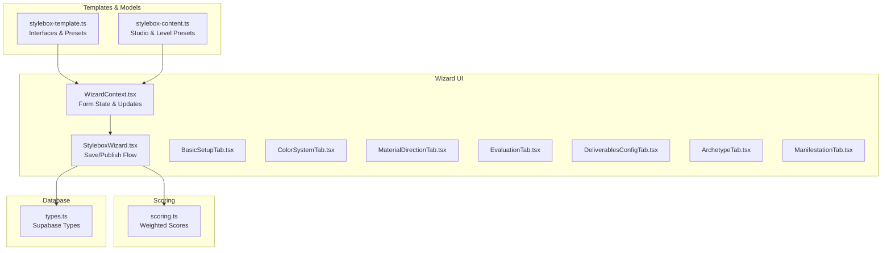
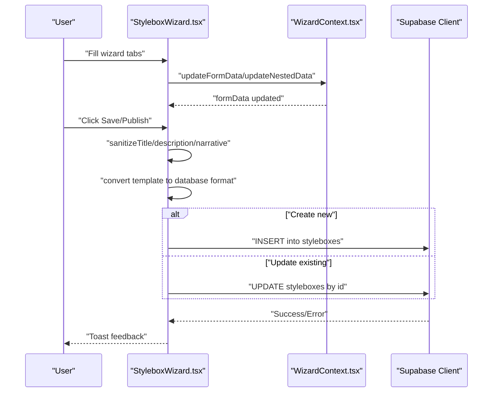
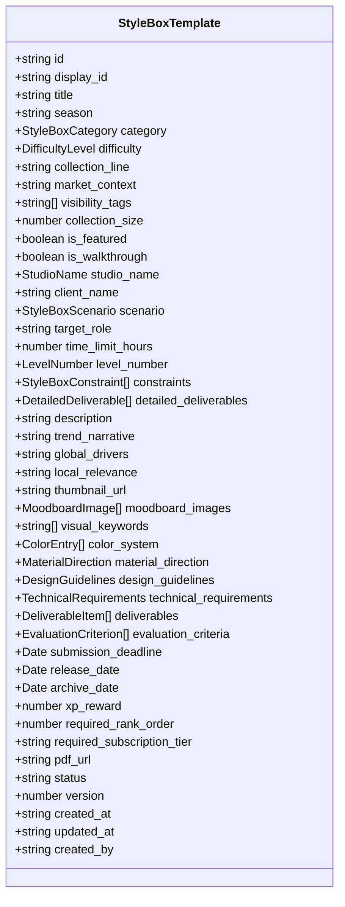
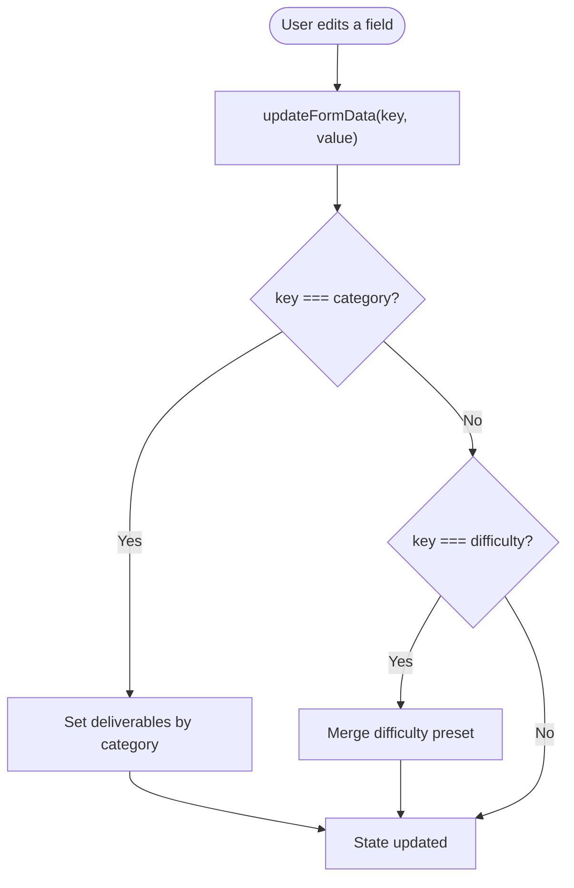
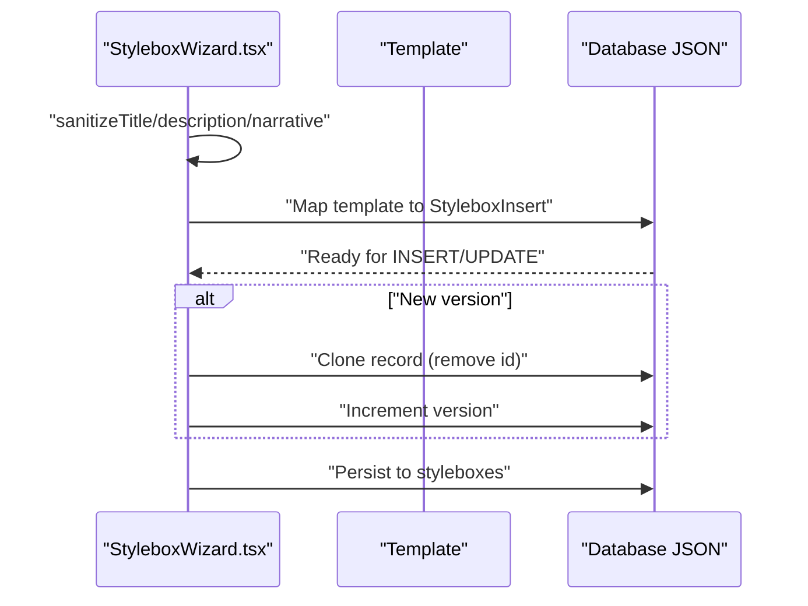
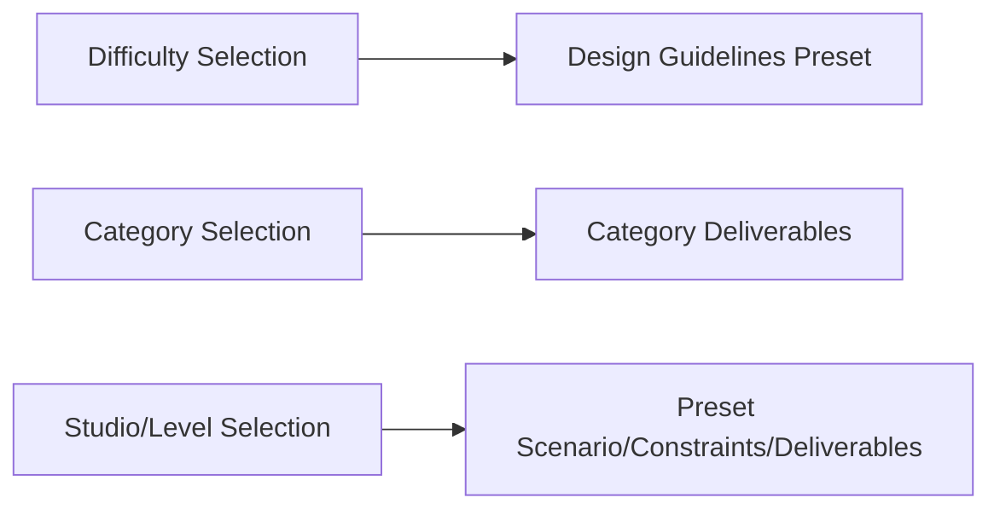
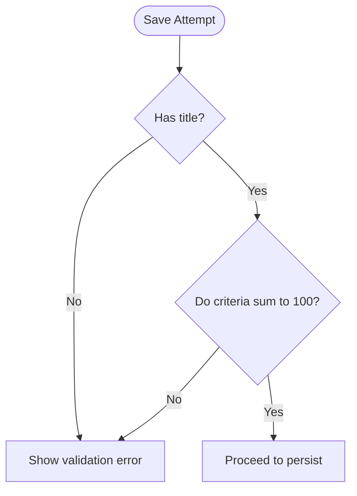
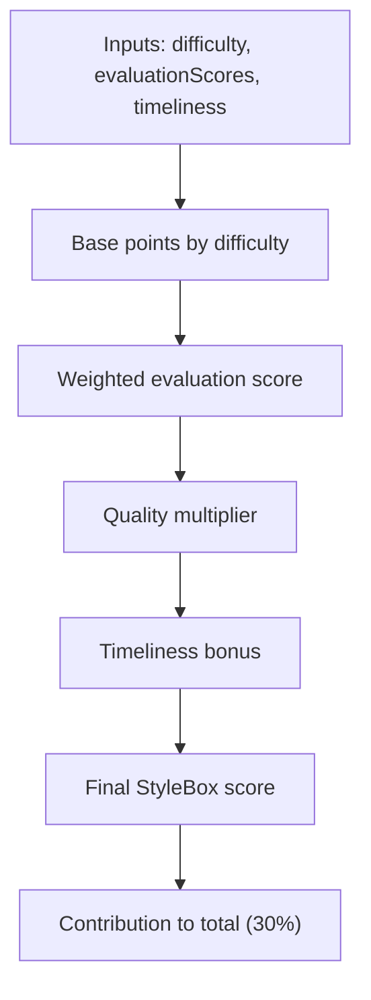
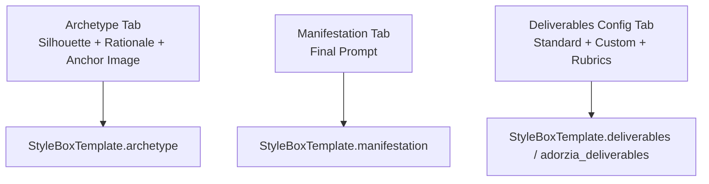
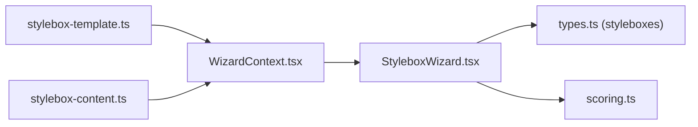

# Template System & Data Models

<cite>
**Referenced Files in This Document**
- [stylebox-template.ts](file://src/lib/stylebox-template.ts)
- [stylebox-content.ts](file://src/lib/stylebox-content.ts)
- [WizardContext.tsx](file://src/components/admin/stylebox-wizard/WizardContext.tsx)
- [StyleboxWizard.tsx](file://src/components/admin/stylebox-wizard/StyleboxWizard.tsx)
- [BasicSetupTab.tsx](file://src/components/admin/stylebox-wizard/tabs/BasicSetupTab.tsx)
- [ColorSystemTab.tsx](file://src/components/admin/stylebox-wizard/tabs/ColorSystemTab.tsx)
- [MaterialDirectionTab.tsx](file://src/components/admin/stylebox-wizard/tabs/MaterialDirectionTab.tsx)
- [EvaluationTab.tsx](file://src/components/admin/stylebox-wizard/tabs/EvaluationTab.tsx)
- [DeliverablesConfigTab.tsx](file://src/components/admin/stylebox-wizard/tabs/DeliverablesConfigTab.tsx)
- [ArchetypeTab.tsx](file://src/components/admin/stylebox-wizard/tabs/ArchetypeTab.tsx)
- [ManifestationTab.tsx](file://src/components/admin/stylebox-wizard/tabs/ManifestationTab.tsx)
- [scoring.ts](file://src/lib/scoring.ts)
- [types.ts](file://src/integrations/supabase/types.ts)
</cite>

## Table of Contents
1. [Introduction](#introduction)
2. [Project Structure](#project-structure)
3. [Core Components](#core-components)
4. [Architecture Overview](#architecture-overview)
5. [Detailed Component Analysis](#detailed-component-analysis)
6. [Dependency Analysis](#dependency-analysis)
7. [Performance Considerations](#performance-considerations)
8. [Troubleshooting Guide](#troubleshooting-guide)
9. [Conclusion](#conclusion)

## Introduction
This document explains the StyleBox template system and its data models, focusing on how templates define design challenges across fashion, textile, and jewelry categories. It covers template structure, field definitions, validation rules, and the transformation pipeline from the wizard interface to database storage. It also documents legacy field mappings, version compatibility, scoring integration, template inheritance via presets, customization options, and how templates support the four design quadrants and deliverables configuration.

## Project Structure
The StyleBox system is composed of:
- Data model definitions and presets in a shared library module
- Production content presets for studios and levels
- A wizard UI that edits StyleBox templates and persists them to the database
- Scoring integration that consumes StyleBox difficulty and evaluation criteria

**Diagram sources**
- [stylebox-template.ts](file://src/lib/stylebox-template.ts#L1-L539)
- [stylebox-content.ts](file://src/lib/stylebox-content.ts#L1-L926)
- [WizardContext.tsx](file://src/components/admin/stylebox-wizard/WizardContext.tsx#L1-L120)
- [StyleboxWizard.tsx](file://src/components/admin/stylebox-wizard/StyleboxWizard.tsx#L1-L392)
- [scoring.ts](file://src/lib/scoring.ts#L1-L239)
- [types.ts](file://src/integrations/supabase/types.ts#L1-L800)

**Section sources**
- [stylebox-template.ts](file://src/lib/stylebox-template.ts#L1-L539)
- [stylebox-content.ts](file://src/lib/stylebox-content.ts#L1-L926)
- [WizardContext.tsx](file://src/components/admin/stylebox-wizard/WizardContext.tsx#L1-L120)
- [StyleboxWizard.tsx](file://src/components/admin/stylebox-wizard/StyleboxWizard.tsx#L1-L392)
- [scoring.ts](file://src/lib/scoring.ts#L1-L239)
- [types.ts](file://src/integrations/supabase/types.ts#L1-L800)

## Core Components
- StyleBoxTemplate: The canonical template interface that defines all fields, including basic setup, quadrants, deliverables, evaluation criteria, timeline, rewards, and metadata.
- Presets and Defaults: Default file formats, required views, evaluation criteria, difficulty presets, standard deliverables, and option lists for seasons, studios, collections, markets, visibility tags, roles, and level labels.
- Helper Functions: Validation helpers, category-specific deliverables, and mapping functions for database compatibility.

Key template fields include:
- Basic Setup: title, category, difficulty, season, collection_line, market_context, visibility_tags, collection_size, is_featured, is_walkthrough, status, version, timestamps, creator.
- Production-Grade Fields: studio_name, client_name, scenario, target_role, time_limit_hours, level_number, constraints, detailed_deliverables.
- Trend Direction: description, trend_narrative, global_drivers, local_relevance.
- Visual Direction: thumbnail_url, moodboard_images[], visual_keywords[].
- Color System: color_system[] with entries for name, hex, pantone, type, usage_ratio.
- Material Direction: category-specific fields for fabrics/trims/closures, construction suggestions, print styles, repeat structure, etc.
- Design Guidelines: difficulty_level, complexity_notes, piece_count, category-specific guidance.
- Technical Requirements: file_formats[], required_views[], measurements, scales, resolutions, repeat_dimensions, color_separations, weight_limits, CAD requirements, naming conventions.
- Deliverables: deliverables[] with id, name, required, description, naming_convention, file_format.
- Evaluation: evaluation_criteria[] with name, weight, description.
- Timeline: submission_deadline, release_date, archive_date.
- Rewards: xp_reward, required_rank_order, required_subscription_tier.
- Generated Assets: pdf_url.
- Metadata: status, version, created_at, updated_at, created_by.

Validation highlights:
- Evaluation criteria weights must sum to 100.
- Title is required for saving.
- Difficulty and category are mapped from database strings to template types.

**Section sources**
- [stylebox-template.ts](file://src/lib/stylebox-template.ts#L209-L282)
- [stylebox-template.ts](file://src/lib/stylebox-template.ts#L465-L468)
- [stylebox-template.ts](file://src/lib/stylebox-template.ts#L497-L518)

## Architecture Overview
The StyleBox wizard transforms user input into a normalized template, sanitizes and validates it, then converts it to database-compatible JSON for insertion or update. The database schema exposes typed rows and inserts/updates for the styleboxes table.

**Diagram sources**
- [StyleboxWizard.tsx](file://src/components/admin/stylebox-wizard/StyleboxWizard.tsx#L121-L279)
- [WizardContext.tsx](file://src/components/admin/stylebox-wizard/WizardContext.tsx#L53-L92)

**Section sources**
- [StyleboxWizard.tsx](file://src/components/admin/stylebox-wizard/StyleboxWizard.tsx#L51-L94)
- [StyleboxWizard.tsx](file://src/components/admin/stylebox-wizard/StyleboxWizard.tsx#L198-L279)
- [WizardContext.tsx](file://src/components/admin/stylebox-wizard/WizardContext.tsx#L45-L101)

## Detailed Component Analysis

### Template Data Model
The StyleBoxTemplate interface defines a comprehensive schema for design challenges. It separates concerns into:
- Basic Setup: identification, classification, and lifecycle metadata
- Production-Grade Fields: studio context, scenario, constraints, deliverables
- Trend Direction: narrative and localization context
- Visual Direction: moodboards and keywords
- Color System: palette definitions
- Material Direction: category-specific guidance
- Design Guidelines: difficulty-based constraints
- Technical Requirements: file formats, views, repeat dimensions, weight limits
- Deliverables: standard and custom deliverables with grading rubrics
- Evaluation: weighted criteria
- Timeline and Rewards: deadlines, XP, rank/subscription gating
- Generated Assets and Metadata

**Diagram sources**
- [stylebox-template.ts](file://src/lib/stylebox-template.ts#L209-L282)

**Section sources**
- [stylebox-template.ts](file://src/lib/stylebox-template.ts#L209-L282)

### Wizard Context and State Management
The wizard maintains a reactive form state and auto-applies presets when category or difficulty changes. It exposes:
- updateFormData: top-level field updates
- updateNestedData: nested object updates (e.g., material_direction)
- resetForm and setFormData
- currentTab navigation and isEditing flag

**Diagram sources**
- [WizardContext.tsx](file://src/components/admin/stylebox-wizard/WizardContext.tsx#L53-L92)

**Section sources**
- [WizardContext.tsx](file://src/components/admin/stylebox-wizard/WizardContext.tsx#L15-L118)

### Data Transformation Pipeline (Wizard → Database)
The wizard converts the template to database-insertable JSON, including:
- Sanitization of rich text and inputs
- Mapping of template fields to database columns
- Legacy field preservation (deliverables array, brief metadata)
- Optional versioning by cloning records

**Diagram sources**
- [StyleboxWizard.tsx](file://src/components/admin/stylebox-wizard/StyleboxWizard.tsx#L198-L279)

**Section sources**
- [StyleboxWizard.tsx](file://src/components/admin/stylebox-wizard/StyleboxWizard.tsx#L51-L94)
- [StyleboxWizard.tsx](file://src/components/admin/stylebox-wizard/StyleboxWizard.tsx#L198-L279)

### Template Inheritance and Customization
- Difficulty Presets: Auto-fill design_guidelines based on selected difficulty.
- Category Deliverables: Auto-select standard deliverables based on category, with category-specific additions (e.g., repeats for textile, CAD for jewelry).
- Preset Studios and Levels: Production-grade presets define scenarios, constraints, and detailed deliverables across four studios and four levels.

**Diagram sources**
- [WizardContext.tsx](file://src/components/admin/stylebox-wizard/WizardContext.tsx#L60-L74)
- [stylebox-template.ts](file://src/lib/stylebox-template.ts#L473-L492)
- [stylebox-content.ts](file://src/lib/stylebox-content.ts#L19-L250)

**Section sources**
- [WizardContext.tsx](file://src/components/admin/stylebox-wizard/WizardContext.tsx#L60-L74)
- [stylebox-template.ts](file://src/lib/stylebox-template.ts#L473-L492)
- [stylebox-content.ts](file://src/lib/stylebox-content.ts#L19-L250)

### Validation Patterns
- Evaluation Criteria: Total weight must equal 100; UI enforces this and offers distribution/reset utilities.
- Title Required: Validation prevents saving without a title.
- Category Options: Controlled via predefined lists for seasons, studios, collections, markets, visibility tags, roles, and levels.

**Diagram sources**
- [StyleboxWizard.tsx](file://src/components/admin/stylebox-wizard/StyleboxWizard.tsx#L207-L215)
- [EvaluationTab.tsx](file://src/components/admin/stylebox-wizard/tabs/EvaluationTab.tsx#L19-L20)

**Section sources**
- [EvaluationTab.tsx](file://src/components/admin/stylebox-wizard/tabs/EvaluationTab.tsx#L19-L20)
- [StyleboxWizard.tsx](file://src/components/admin/stylebox-wizard/StyleboxWizard.tsx#L207-L215)

### Scoring System Integration
The scoring module computes designer scores using StyleBox difficulty, evaluation scores, and timeliness. It:
- Maps difficulty to base points
- Computes weighted evaluation score per difficulty
- Applies quality multipliers based on average score
- Applies timeliness bonuses/penalties
- Aggregates contributions to total weighted score

**Diagram sources**
- [scoring.ts](file://src/lib/scoring.ts#L129-L148)

**Section sources**
- [scoring.ts](file://src/lib/scoring.ts#L1-L239)

### Quadrant Builder and Deliverables Configuration
- Quadrant 1 (Archetype): Silhouette selection and rationale; anchor image upload with watermarking.
- Quadrant 2 (Mutation): Not detailed in referenced files; likely follows similar pattern.
- Quadrant 3 (Restrictions): Not detailed in referenced files; likely follows similar pattern.
- Quadrant 4 (Manifestation): Final design prompt and instructions.
- Deliverables: Standard deliverables plus custom "Adorzia Deliverables" with file types, requirements, and grading rubrics.

**Diagram sources**
- [ArchetypeTab.tsx](file://src/components/admin/stylebox-wizard/tabs/ArchetypeTab.tsx#L32-L86)
- [ManifestationTab.tsx](file://src/components/admin/stylebox-wizard/tabs/ManifestationTab.tsx#L6-L12)
- [DeliverablesConfigTab.tsx](file://src/components/admin/stylebox-wizard/tabs/DeliverablesConfigTab.tsx#L25-L54)

**Section sources**
- [ArchetypeTab.tsx](file://src/components/admin/stylebox-wizard/tabs/ArchetypeTab.tsx#L32-L86)
- [ManifestationTab.tsx](file://src/components/admin/stylebox-wizard/tabs/ManifestationTab.tsx#L6-L12)
- [DeliverablesConfigTab.tsx](file://src/components/admin/stylebox-wizard/tabs/DeliverablesConfigTab.tsx#L25-L54)

### Color System and Material Direction
- Color System: Add/remove colors with type (core/accent/optional), HEX, optional Pantone, and usage ratio; grouped display.
- Material Direction: Category-specific inputs for fabrics/trims/closures, construction guidance, print styles, repeat structure, metal hierarchy, scale/proportion, and hardware mechanics.

**Section sources**
- [ColorSystemTab.tsx](file://src/components/admin/stylebox-wizard/tabs/ColorSystemTab.tsx#L17-L63)
- [MaterialDirectionTab.tsx](file://src/components/admin/stylebox-wizard/tabs/MaterialDirectionTab.tsx#L10-L27)

### Basic Setup and Options
- BasicSetupTab: Title, StyleBox ID, collection line, market context, season, collection size, category, difficulty, XP reward, status, visibility tags, short description, and feature toggles.

**Section sources**
- [BasicSetupTab.tsx](file://src/components/admin/stylebox-wizard/tabs/BasicSetupTab.tsx#L27-L266)

## Dependency Analysis
- Wizard depends on template definitions and presets for defaults and validation.
- WizardContext orchestrates state transitions and auto-presets.
- StyleboxWizard sanitizes inputs and maps to database JSON.
- Scoring module consumes template difficulty and evaluation criteria.
- Database types define the styleboxes table structure and enums.

**Diagram sources**
- [stylebox-template.ts](file://src/lib/stylebox-template.ts#L1-L539)
- [stylebox-content.ts](file://src/lib/stylebox-content.ts#L1-L926)
- [WizardContext.tsx](file://src/components/admin/stylebox-wizard/WizardContext.tsx#L1-L120)
- [StyleboxWizard.tsx](file://src/components/admin/stylebox-wizard/StyleboxWizard.tsx#L1-L392)
- [types.ts](file://src/integrations/supabase/types.ts#L1-L800)
- [scoring.ts](file://src/lib/scoring.ts#L1-L239)

**Section sources**
- [stylebox-template.ts](file://src/lib/stylebox-template.ts#L1-L539)
- [stylebox-content.ts](file://src/lib/stylebox-content.ts#L1-L926)
- [WizardContext.tsx](file://src/components/admin/stylebox-wizard/WizardContext.tsx#L1-L120)
- [StyleboxWizard.tsx](file://src/components/admin/stylebox-wizard/StyleboxWizard.tsx#L1-L392)
- [types.ts](file://src/integrations/supabase/types.ts#L1-L800)
- [scoring.ts](file://src/lib/scoring.ts#L1-L239)

## Performance Considerations
- Auto-save throttling: The wizard auto-saves every minute when title is present and data changed, reducing manual save pressure.
- Nested updates: updateNestedData minimizes re-renders by updating only the targeted nested object.
- Category/difficulty auto-presets: Applying presets on change avoids manual duplication of standard configurations.

[No sources needed since this section provides general guidance]

## Troubleshooting Guide
Common issues and remedies:
- Evaluation criteria not summing to 100: Use the "Distribute Evenly" or "Reset Defaults" actions in the Evaluation tab.
- Missing title on save: Ensure the title is filled; the wizard prevents saving without it.
- Legacy deliverables: When editing older records, deliverables may be stored as strings; the wizard maps them to structured objects.
- Image upload failures: The Archetype tab applies watermarking and uploads to Supabase storage; check network errors and file types.

**Section sources**
- [EvaluationTab.tsx](file://src/components/admin/stylebox-wizard/tabs/EvaluationTab.tsx#L44-L58)
- [StyleboxWizard.tsx](file://src/components/admin/stylebox-wizard/StyleboxWizard.tsx#L207-L215)
- [StyleboxWizard.tsx](file://src/components/admin/stylebox-wizard/StyleboxWizard.tsx#L79-L85)
- [ArchetypeTab.tsx](file://src/components/admin/stylebox-wizard/tabs/ArchetypeTab.tsx#L43-L78)

## Conclusion
The StyleBox template system provides a robust, extensible schema for defining design challenges across multiple studios and difficulty levels. Its wizard-driven UI ensures consistent data entry, while built-in validation and presets streamline creation. The scoring system integrates seamlessly with template difficulty and evaluation criteria. Legacy compatibility and versioning support enable smooth evolution of templates over time.