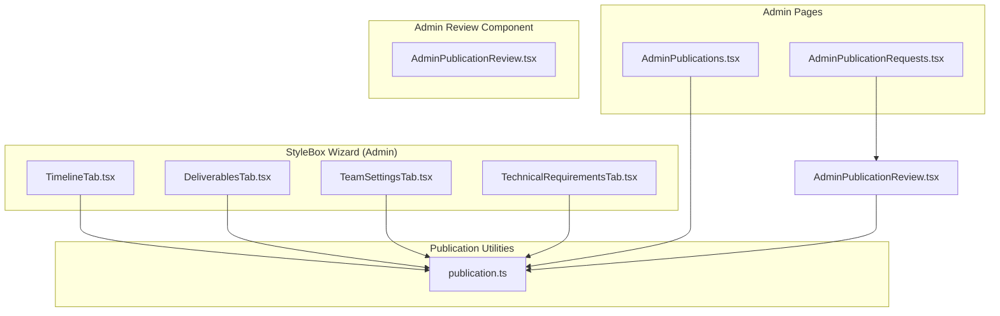
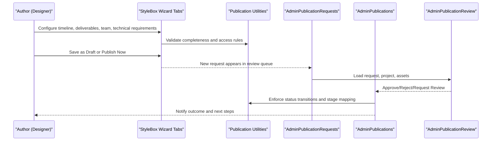
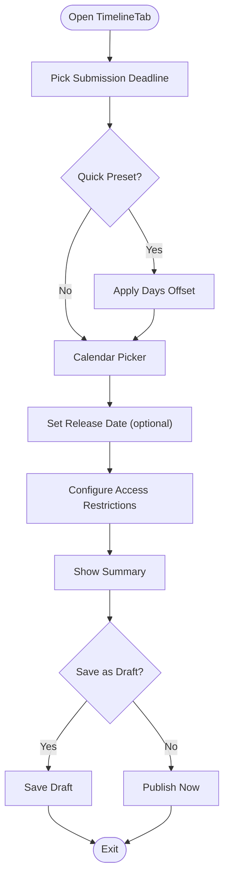
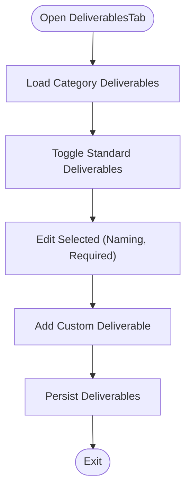
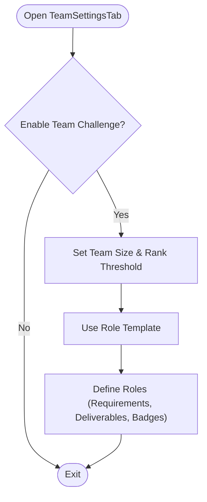
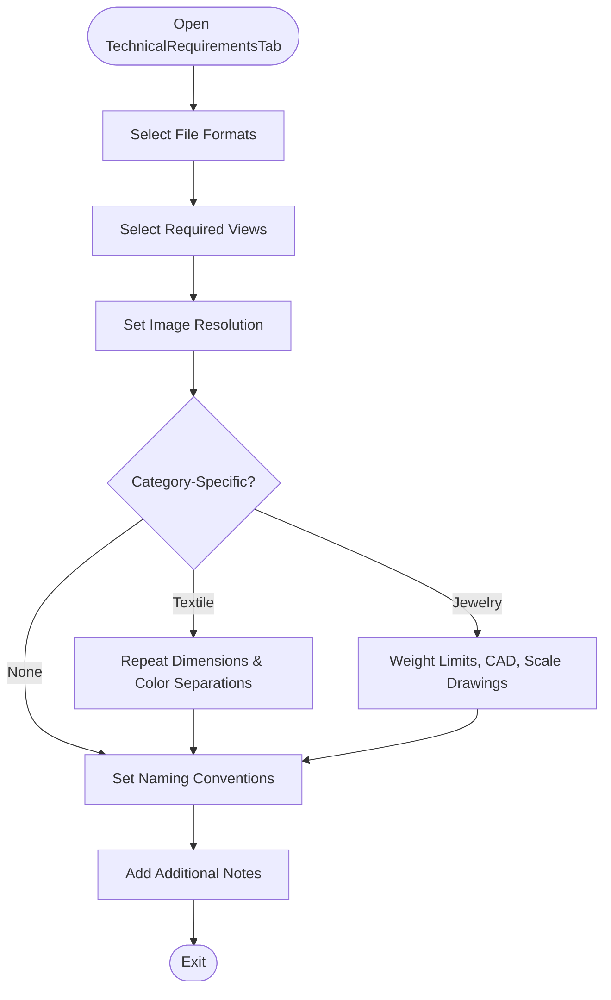
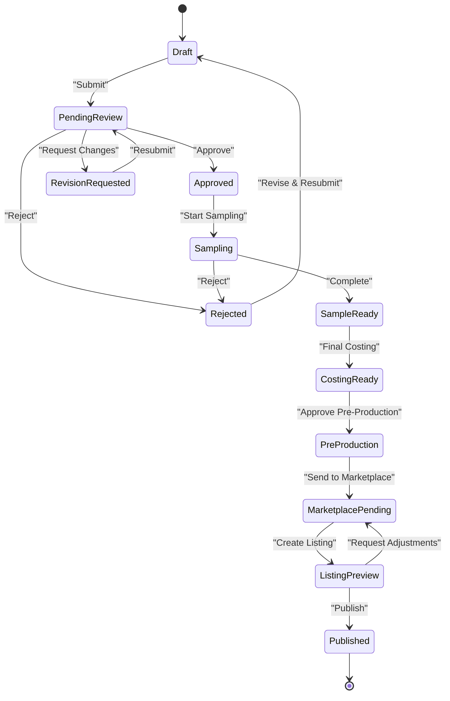
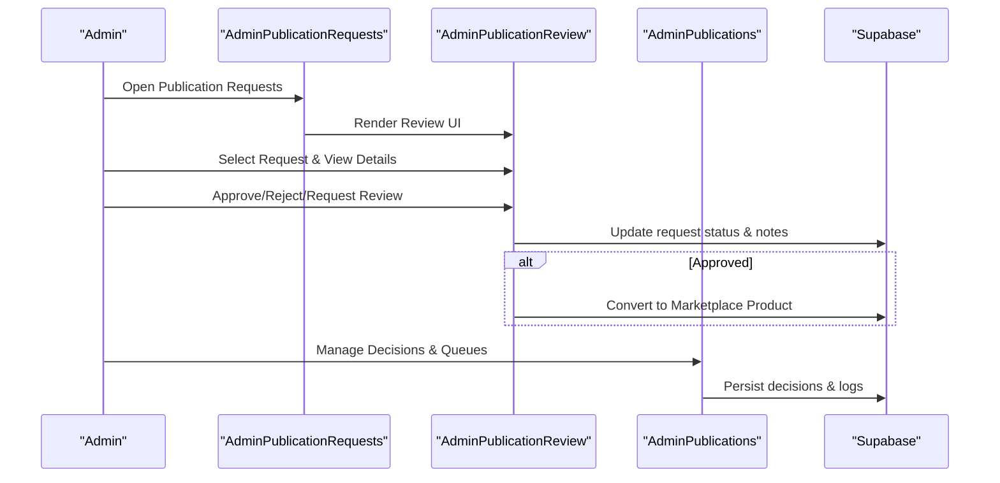
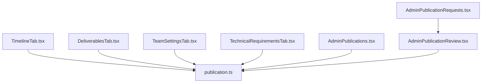

# Timeline & Publishing Workflow

<cite>
**Referenced Files in This Document**
- [TimelineTab.tsx](file://src/components/admin/stylebox-wizard/tabs/TimelineTab.tsx)
- [DeliverablesTab.tsx](file://src/components/admin/stylebox-wizard/tabs/DeliverablesTab.tsx)
- [TeamSettingsTab.tsx](file://src/components/admin/stylebox-wizard/tabs/TeamSettingsTab.tsx)
- [TechnicalRequirementsTab.tsx](file://src/components/admin/stylebox-wizard/tabs/TechnicalRequirementsTab.tsx)
- [publication.ts](file://src/lib/publication.ts)
- [AdminPublicationRequests.tsx](file://src/pages/admin/AdminPublicationRequests.tsx)
- [AdminPublications.tsx](file://src/pages/admin/AdminPublications.tsx)
- [AdminPublicationReview.tsx](file://src/components/projects/AdminPublicationReview.tsx)
</cite>

## Table of Contents
1. [Introduction](#introduction)
2. [Project Structure](#project-structure)
3. [Core Components](#core-components)
4. [Architecture Overview](#architecture-overview)
5. [Detailed Component Analysis](#detailed-component-analysis)
6. [Dependency Analysis](#dependency-analysis)
7. [Performance Considerations](#performance-considerations)
8. [Troubleshooting Guide](#troubleshooting-guide)
9. [Conclusion](#conclusion)

## Introduction
This document explains the timeline and publishing workflow for the StyleBox creation system. It covers how to configure timelines, scenario planning, team collaboration settings, and technical requirements. It also documents the publishing process, version control, and the relationship between timeline phases and deliverable milestones. Practical examples demonstrate setting up publishing schedules, configuring team member roles and permissions, defining technical specifications, and managing transitions from creation to publication. Finally, it addresses integration with the admin review process and approval workflows.

## Project Structure
The StyleBox wizard organizes configuration into modular tabs under the admin stylebox wizard. The publishing lifecycle is managed via dedicated admin pages and shared publication utilities.

**Diagram sources**
- [TimelineTab.tsx](file://src/components/admin/stylebox-wizard/tabs/TimelineTab.tsx#L1-L223)
- [DeliverablesTab.tsx](file://src/components/admin/stylebox-wizard/tabs/DeliverablesTab.tsx#L1-L198)
- [TeamSettingsTab.tsx](file://src/components/admin/stylebox-wizard/tabs/TeamSettingsTab.tsx#L1-L278)
- [TechnicalRequirementsTab.tsx](file://src/components/admin/stylebox-wizard/tabs/TechnicalRequirementsTab.tsx#L1-L231)
- [publication.ts](file://src/lib/publication.ts#L1-L282)
- [AdminPublicationRequests.tsx](file://src/pages/admin/AdminPublicationRequests.tsx#L1-L36)
- [AdminPublications.tsx](file://src/pages/admin/AdminPublications.tsx#L1-L990)
- [AdminPublicationReview.tsx](file://src/components/projects/AdminPublicationReview.tsx#L1-L432)

**Section sources**
- [TimelineTab.tsx](file://src/components/admin/stylebox-wizard/tabs/TimelineTab.tsx#L1-L223)
- [DeliverablesTab.tsx](file://src/components/admin/stylebox-wizard/tabs/DeliverablesTab.tsx#L1-L198)
- [TeamSettingsTab.tsx](file://src/components/admin/stylebox-wizard/tabs/TeamSettingsTab.tsx#L1-L278)
- [TechnicalRequirementsTab.tsx](file://src/components/admin/stylebox-wizard/tabs/TechnicalRequirementsTab.tsx#L1-L231)
- [publication.ts](file://src/lib/publication.ts#L1-L282)
- [AdminPublicationRequests.tsx](file://src/pages/admin/AdminPublicationRequests.tsx#L1-L36)
- [AdminPublications.tsx](file://src/pages/admin/AdminPublications.tsx#L1-L990)
- [AdminPublicationReview.tsx](file://src/components/projects/AdminPublicationReview.tsx#L1-L432)

## Core Components
- Timeline and Publish tab: Configures submission deadlines, release dates, and access restrictions; provides Save as Draft and Publish Now actions.
- Deliverables tab: Defines required deliverables, naming conventions, and custom deliverables.
- Team Settings tab: Enables team challenges, sets team size and rank thresholds, and defines roles with badges and deliverables.
- Technical Requirements tab: Sets accepted file formats, required views, resolution, category-specific specs, naming conventions, and additional notes.
- Publication utilities: Define status lifecycle, stage mapping, eligibility rules, transitions, and auto-approval behavior.
- Admin Publication Requests page: Renders the admin review interface for publication requests.
- Admin Publications page: Manages publication decisions, queues, and marketplace handoffs.
- Admin Publication Review component: Loads requests, projects, assets, and handles approvals/rejections/conversion to marketplace products.

**Section sources**
- [TimelineTab.tsx](file://src/components/admin/stylebox-wizard/tabs/TimelineTab.tsx#L31-L223)
- [DeliverablesTab.tsx](file://src/components/admin/stylebox-wizard/tabs/DeliverablesTab.tsx#L11-L198)
- [TeamSettingsTab.tsx](file://src/components/admin/stylebox-wizard/tabs/TeamSettingsTab.tsx#L32-L278)
- [TechnicalRequirementsTab.tsx](file://src/components/admin/stylebox-wizard/tabs/TechnicalRequirementsTab.tsx#L8-L231)
- [publication.ts](file://src/lib/publication.ts#L4-L282)
- [AdminPublicationRequests.tsx](file://src/pages/admin/AdminPublicationRequests.tsx#L5-L34)
- [AdminPublications.tsx](file://src/pages/admin/AdminPublications.tsx#L103-L990)
- [AdminPublicationReview.tsx](file://src/components/projects/AdminPublicationReview.tsx#L9-L432)

## Architecture Overview
The StyleBox creation workflow integrates authoring, deliverable definition, team collaboration, and technical specification configuration. The publishing lifecycle spans submission, review, production, and marketplace stages with explicit status transitions and admin controls.

**Diagram sources**
- [TimelineTab.tsx](file://src/components/admin/stylebox-wizard/tabs/TimelineTab.tsx#L31-L223)
- [DeliverablesTab.tsx](file://src/components/admin/stylebox-wizard/tabs/DeliverablesTab.tsx#L11-L198)
- [TeamSettingsTab.tsx](file://src/components/admin/stylebox-wizard/tabs/TeamSettingsTab.tsx#L32-L278)
- [TechnicalRequirementsTab.tsx](file://src/components/admin/stylebox-wizard/tabs/TechnicalRequirementsTab.tsx#L8-L231)
- [publication.ts](file://src/lib/publication.ts#L4-L282)
- [AdminPublicationRequests.tsx](file://src/pages/admin/AdminPublicationRequests.tsx#L5-L34)
- [AdminPublications.tsx](file://src/pages/admin/AdminPublications.tsx#L103-L990)
- [AdminPublicationReview.tsx](file://src/components/projects/AdminPublicationReview.tsx#L9-L432)

## Detailed Component Analysis

### Timeline and Publishing Configuration
- Submission Deadline: Quick presets (1 week, 2 weeks, 1 month, 2 months) and calendar picker; enforced against current date.
- Release Date: Optional future date to schedule visibility to designers.
- Access Restrictions: Subscription tier gating and rank order threshold.
- Summary: Displays category, difficulty, XP reward, and deliverable count.
- Actions: Save as Draft and Publish Now buttons.

**Diagram sources**
- [TimelineTab.tsx](file://src/components/admin/stylebox-wizard/tabs/TimelineTab.tsx#L34-L223)

**Section sources**
- [TimelineTab.tsx](file://src/components/admin/stylebox-wizard/tabs/TimelineTab.tsx#L31-L223)

### Deliverables Definition and Milestones
- Standard deliverables per category with selection toggles.
- Selected deliverables support naming conventions and required flags.
- Custom deliverables with name, description, and requirement flag.
- Relationship to timeline: deliverables inform completeness checks and milestone readiness.

**Diagram sources**
- [DeliverablesTab.tsx](file://src/components/admin/stylebox-wizard/tabs/DeliverablesTab.tsx#L11-L198)

**Section sources**
- [DeliverablesTab.tsx](file://src/components/admin/stylebox-wizard/tabs/DeliverablesTab.tsx#L11-L198)

### Team Collaboration Settings
- Team Challenge toggle enables team-based submissions.
- Team size and minimum rank order configuration.
- Role templates (e.g., Sovereign Atelier) and custom role definitions with requirements, deliverables, and badges.
- Integration: Team roles define deliverable ownership and milestone accountability.

**Diagram sources**
- [TeamSettingsTab.tsx](file://src/components/admin/stylebox-wizard/tabs/TeamSettingsTab.tsx#L32-L278)

**Section sources**
- [TeamSettingsTab.tsx](file://src/components/admin/stylebox-wizard/tabs/TeamSettingsTab.tsx#L32-L278)

### Technical Requirements Setup
- File formats and required views selection.
- Image resolution and category-specific specs (e.g., textile repeat dimensions, color separations; jewelry weight limits, CAD requirements, scale drawings).
- Naming conventions and additional notes for submission compliance.

**Diagram sources**
- [TechnicalRequirementsTab.tsx](file://src/components/admin/stylebox-wizard/tabs/TechnicalRequirementsTab.tsx#L8-L231)

**Section sources**
- [TechnicalRequirementsTab.tsx](file://src/components/admin/stylebox-wizard/tabs/TechnicalRequirementsTab.tsx#L8-L231)

### Publishing Lifecycle and Status Management
- Status definitions and stage mapping guide the end-to-end flow from draft to published.
- Eligibility rules enforce completeness and subscription tier requirements.
- Transitions define allowable state changes; auto-approval timers automate outcomes after review windows.

**Diagram sources**
- [publication.ts](file://src/lib/publication.ts#L4-L282)

**Section sources**
- [publication.ts](file://src/lib/publication.ts#L4-L282)

### Admin Review and Approval Workflows
- Admin Publication Requests page renders the review interface for publication requests.
- Admin Publications page aggregates decisions, queues, and marketplace handoffs.
- Admin Publication Review component loads requests, projects, and assets; supports approve/reject/request-review actions and converts approved requests to marketplace products.

**Diagram sources**
- [AdminPublicationRequests.tsx](file://src/pages/admin/AdminPublicationRequests.tsx#L5-L34)
- [AdminPublicationReview.tsx](file://src/components/projects/AdminPublicationReview.tsx#L9-L432)
- [AdminPublications.tsx](file://src/pages/admin/AdminPublications.tsx#L103-L990)

**Section sources**
- [AdminPublicationRequests.tsx](file://src/pages/admin/AdminPublicationRequests.tsx#L5-L34)
- [AdminPublicationReview.tsx](file://src/components/projects/AdminPublicationReview.tsx#L9-L432)
- [AdminPublications.tsx](file://src/pages/admin/AdminPublications.tsx#L103-L990)

## Dependency Analysis
- Wizard tabs depend on shared publication utilities for completeness and eligibility checks.
- Admin pages coordinate with Supabase for data persistence and notifications.
- Admin Publication Review component orchestrates conversion of approved requests into marketplace products.

**Diagram sources**
- [TimelineTab.tsx](file://src/components/admin/stylebox-wizard/tabs/TimelineTab.tsx#L31-L223)
- [DeliverablesTab.tsx](file://src/components/admin/stylebox-wizard/tabs/DeliverablesTab.tsx#L11-L198)
- [TeamSettingsTab.tsx](file://src/components/admin/stylebox-wizard/tabs/TeamSettingsTab.tsx#L32-L278)
- [TechnicalRequirementsTab.tsx](file://src/components/admin/stylebox-wizard/tabs/TechnicalRequirementsTab.tsx#L8-L231)
- [publication.ts](file://src/lib/publication.ts#L4-L282)
- [AdminPublicationRequests.tsx](file://src/pages/admin/AdminPublicationRequests.tsx#L5-L34)
- [AdminPublications.tsx](file://src/pages/admin/AdminPublications.tsx#L103-L990)
- [AdminPublicationReview.tsx](file://src/components/projects/AdminPublicationReview.tsx#L9-L432)

**Section sources**
- [publication.ts](file://src/lib/publication.ts#L4-L282)
- [AdminPublications.tsx](file://src/pages/admin/AdminPublications.tsx#L103-L990)
- [AdminPublicationReview.tsx](file://src/components/projects/AdminPublicationReview.tsx#L9-L432)

## Performance Considerations
- Minimize redundant queries by leveraging memoization and query caching in admin pages.
- Batch updates for bulk deliverable or role changes to reduce network overhead.
- Debounce calendar and input interactions in wizard tabs to avoid excessive re-renders.
- Use server-side filtering and pagination for large publication queues.

## Troubleshooting Guide
- Timeline deadline validation: Ensure the submission deadline is not in the past; quick presets apply offsets from the current date.
- Access restrictions: Verify subscription tier and rank order meet configured thresholds before publishing.
- Deliverables completeness: Confirm required deliverables are selected and naming conventions are set; eligibility requires all mandatory fields completed.
- Team settings: When enabling team challenges, populate roles and badges; use the template to bootstrap configurations.
- Technical requirements: Ensure file formats, required views, and category-specific specs are set appropriately for the chosen category.
- Admin decisions: Use the Admin Publications page to approve, reject, or request revisions; confirm logs and notifications are recorded.

**Section sources**
- [TimelineTab.tsx](file://src/components/admin/stylebox-wizard/tabs/TimelineTab.tsx#L34-L96)
- [publication.ts](file://src/lib/publication.ts#L191-L210)
- [AdminPublications.tsx](file://src/pages/admin/AdminPublications.tsx#L206-L283)
- [AdminPublicationReview.tsx](file://src/components/projects/AdminPublicationReview.tsx#L90-L127)

## Conclusion
The StyleBox timeline and publishing workflow integrates authoring, deliverable definition, team collaboration, and technical requirements with a robust admin review and approval system. By configuring deadlines, access restrictions, deliverables, team roles, and technical specifications, creators can align their submissions with production and marketplace readiness. Admin tools streamline decision-making, enforce status transitions, and automate parts of the approval lifecycle, ensuring efficient and transparent publication outcomes.