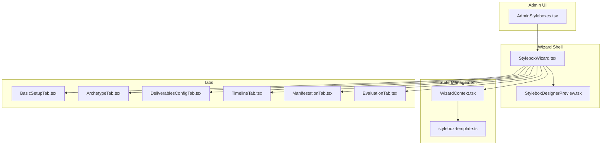
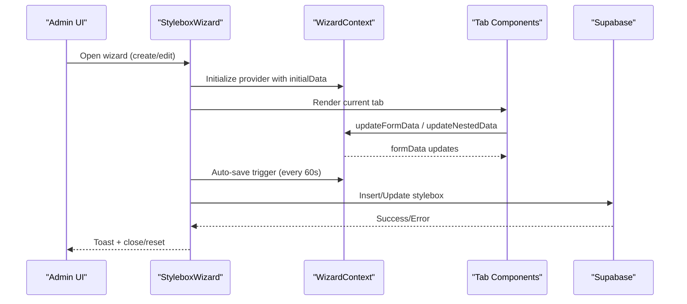
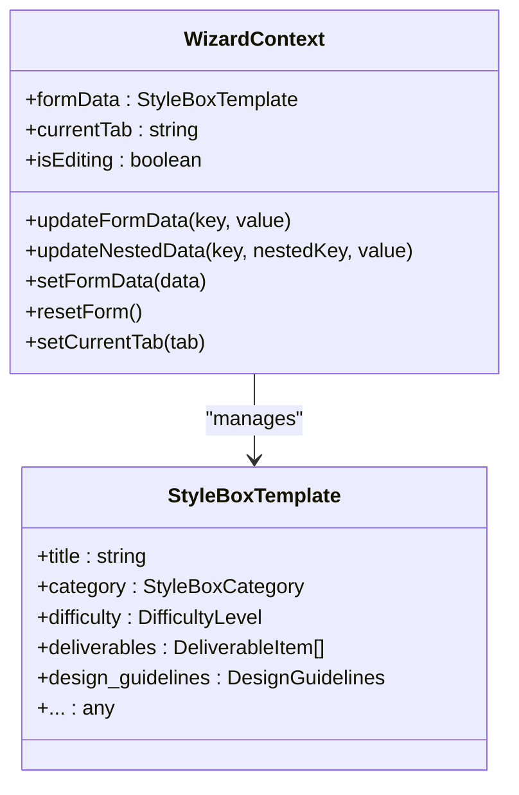
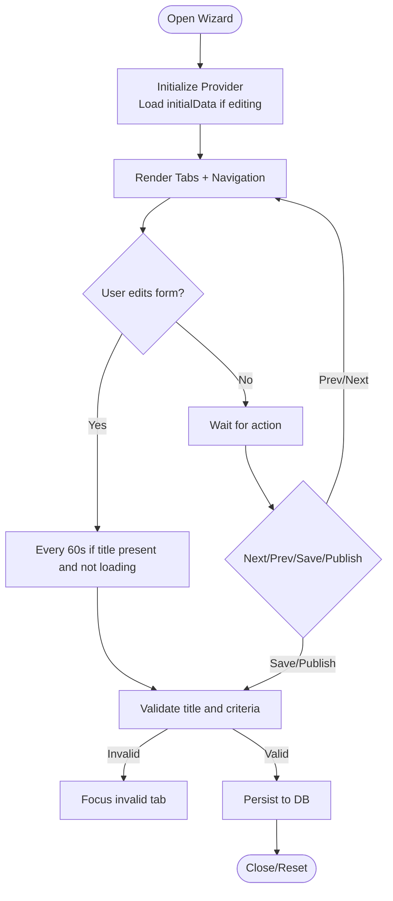
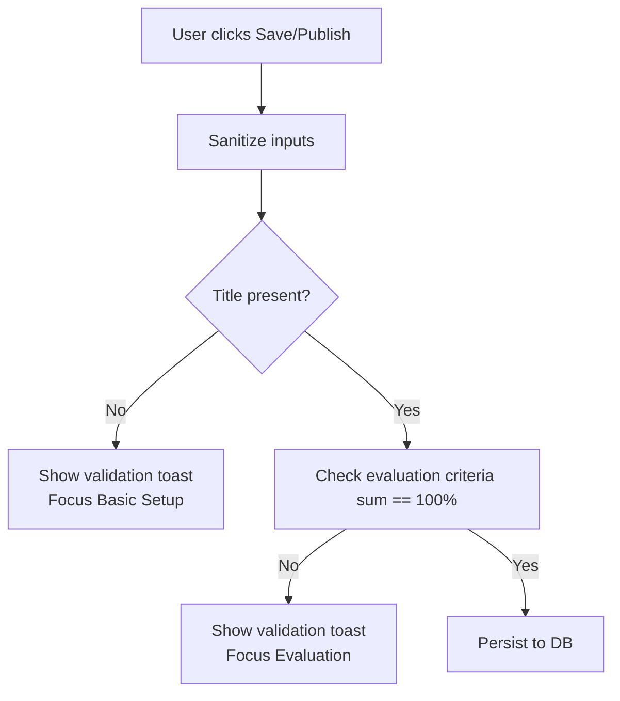
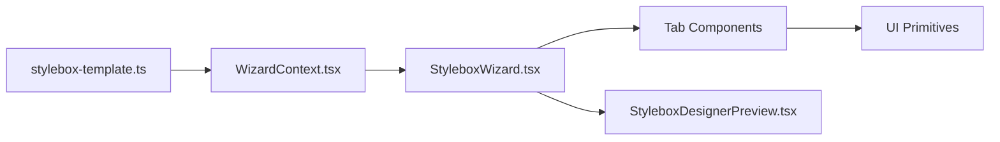

# Wizard Interface & Navigation

<cite>
**Referenced Files in This Document**
- [WizardContext.tsx](file://src/components/admin/stylebox-wizard/WizardContext.tsx)
- [StyleboxWizard.tsx](file://src/components/admin/stylebox-wizard/StyleboxWizard.tsx)
- [StyleboxDesignerPreview.tsx](file://src/components/admin/stylebox-wizard/StyleboxDesignerPreview.tsx)
- [BasicSetupTab.tsx](file://src/components/admin/stylebox-wizard/tabs/BasicSetupTab.tsx)
- [ArchetypeTab.tsx](file://src/components/admin/stylebox-wizard/tabs/ArchetypeTab.tsx)
- [DeliverablesConfigTab.tsx](file://src/components/admin/stylebox-wizard/tabs/DeliverablesConfigTab.tsx)
- [TimelineTab.tsx](file://src/components/admin/stylebox-wizard/tabs/TimelineTab.tsx)
- [ManifestationTab.tsx](file://src/components/admin/stylebox-wizard/tabs/ManifestationTab.tsx)
- [EvaluationTab.tsx](file://src/components/admin/stylebox-wizard/tabs/EvaluationTab.tsx)
- [stylebox-template.ts](file://src/lib/stylebox-template.ts)
- [AdminStyleboxes.tsx](file://src/pages/admin/AdminStyleboxes.tsx)
</cite>

## Table of Contents
1. [Introduction](#introduction)
2. [Project Structure](#project-structure)
3. [Core Components](#core-components)
4. [Architecture Overview](#architecture-overview)
5. [Detailed Component Analysis](#detailed-component-analysis)
6. [Dependency Analysis](#dependency-analysis)
7. [Performance Considerations](#performance-considerations)
8. [Troubleshooting Guide](#troubleshooting-guide)
9. [Conclusion](#conclusion)

## Introduction
This document explains the Stylebox Wizard interface and navigation system used to create and manage StyleBox challenges. It covers the tabbed interface architecture, step-by-step workflow, state management via the WizardContext provider, auto-save functionality, form validation, and the relationship between wizard tabs and the overall design process. It also provides practical examples for navigating tabs, understanding step progression, implementing custom tab components, integrating with the preview system, and completing the save/publish workflow.

## Project Structure
The Stylebox Wizard is organized around a provider-based state container, a wizard shell with a tabbed interface, and modular tab components. Supporting libraries define the data model and presets used across the wizard.

**Diagram sources**
- [AdminStyleboxes.tsx](file://src/pages/admin/AdminStyleboxes.tsx#L499-L503)
- [StyleboxWizard.tsx](file://src/components/admin/stylebox-wizard/StyleboxWizard.tsx#L95-L103)
- [WizardContext.tsx](file://src/components/admin/stylebox-wizard/WizardContext.tsx#L45-L119)
- [stylebox-template.ts](file://src/lib/stylebox-template.ts#L429-L460)
- [BasicSetupTab.tsx](file://src/components/admin/stylebox-wizard/tabs/BasicSetupTab.tsx#L27-L269)
- [ArchetypeTab.tsx](file://src/components/admin/stylebox-wizard/tabs/ArchetypeTab.tsx#L32-L218)
- [DeliverablesConfigTab.tsx](file://src/components/admin/stylebox-wizard/tabs/DeliverablesConfigTab.tsx#L25-L187)
- [TimelineTab.tsx](file://src/components/admin/stylebox-wizard/tabs/TimelineTab.tsx#L31-L223)
- [ManifestationTab.tsx](file://src/components/admin/stylebox-wizard/tabs/ManifestationTab.tsx#L6-L57)
- [EvaluationTab.tsx](file://src/components/admin/stylebox-wizard/tabs/EvaluationTab.tsx#L11-L177)

**Section sources**
- [AdminStyleboxes.tsx](file://src/pages/admin/AdminStyleboxes.tsx#L499-L503)
- [StyleboxWizard.tsx](file://src/components/admin/stylebox-wizard/StyleboxWizard.tsx#L95-L103)
- [WizardContext.tsx](file://src/components/admin/stylebox-wizard/WizardContext.tsx#L45-L119)
- [stylebox-template.ts](file://src/lib/stylebox-template.ts#L429-L460)

## Core Components
- WizardContext: Provides shared state and actions for the entire wizard lifecycle, including form data updates, nested updates, tab navigation, editing mode detection, and reset capabilities.
- StyleboxWizard: Hosts the wizard dialog, manages auto-save, validation, and persistence, and renders the tabbed interface with navigation controls.
- StyleboxDesignerPreview: Presents a designer-facing preview of the StyleBox using the 4-quadrant protocol (Archetype, Mutation, Restrictions, Manifestation).
- Tab Components: Modular UI modules for each step (Basic Setup, Archetype, Mutation, Restrictions, Manifestation, Deliverables, Timeline).

Key responsibilities:
- State synchronization across tabs via WizardContext.
- Auto-save every minute when the form is not empty and not loading.
- Validation prior to save/publish (e.g., require title).
- Publishing workflow with optional immediate activation and versioning support.

**Section sources**
- [WizardContext.tsx](file://src/components/admin/stylebox-wizard/WizardContext.tsx#L15-L38)
- [StyleboxWizard.tsx](file://src/components/admin/stylebox-wizard/StyleboxWizard.tsx#L113-L196)
- [StyleboxDesignerPreview.tsx](file://src/components/admin/stylebox-wizard/StyleboxDesignerPreview.tsx#L11-L187)
- [BasicSetupTab.tsx](file://src/components/admin/stylebox-wizard/tabs/BasicSetupTab.tsx#L27-L269)

## Architecture Overview
The wizard follows a layered architecture:
- Presentation layer: StyleboxWizard and individual tab components.
- State layer: WizardContext provider encapsulates form state and actions.
- Data model layer: stylebox-template defines the canonical data structure and presets.
- Persistence layer: Supabase mutations for create/update operations.
- Preview layer: Designer preview panel rendering the 4-quadrant view.

**Diagram sources**
- [StyleboxWizard.tsx](file://src/components/admin/stylebox-wizard/StyleboxWizard.tsx#L113-L196)
- [WizardContext.tsx](file://src/components/admin/stylebox-wizard/WizardContext.tsx#L53-L92)
- [stylebox-template.ts](file://src/lib/stylebox-template.ts#L429-L460)

## Detailed Component Analysis

### WizardContext Provider
- Purpose: Centralizes form state and exposes typed update functions for top-level and nested fields.
- Auto-updates:
  - Changing difficulty updates design guidelines presets.
  - Changing category updates deliverables list based on category.
- Editing mode: Derived from presence of initialData.id.
- Actions:
  - updateFormData<K>(key, value)
  - updateNestedData<K>(key, nestedKey, value)
  - setFormData(data)
  - resetForm()

**Diagram sources**
- [WizardContext.tsx](file://src/components/admin/stylebox-wizard/WizardContext.tsx#L15-L38)
- [stylebox-template.ts](file://src/lib/stylebox-template.ts#L209-L282)

**Section sources**
- [WizardContext.tsx](file://src/components/admin/stylebox-wizard/WizardContext.tsx#L45-L119)
- [stylebox-template.ts](file://src/lib/stylebox-template.ts#L429-L460)

### StyleboxWizard Shell
- Renders a dialog with a tabbed interface and footer navigation.
- Maintains last-saved timestamp and data fingerprint for auto-save.
- Auto-save interval: 60 seconds, triggered when title is present, not loading, and data changed.
- Validation:
  - Title is required before saving.
  - Evaluation criteria must sum to 100% (enforced in EvaluationTab).
- Save/Publish:
  - Save as Draft or Publish Now.
  - Versioning support via “Save as Version” for existing entries.
- Preview:
  - Opens designer preview panel showing the 4-quadrant layout.

**Diagram sources**
- [StyleboxWizard.tsx](file://src/components/admin/stylebox-wizard/StyleboxWizard.tsx#L113-L196)
- [EvaluationTab.tsx](file://src/components/admin/stylebox-wizard/tabs/EvaluationTab.tsx#L19-L20)

**Section sources**
- [StyleboxWizard.tsx](file://src/components/admin/stylebox-wizard/StyleboxWizard.tsx#L113-L196)
- [StyleboxWizard.tsx](file://src/components/admin/stylebox-wizard/StyleboxWizard.tsx#L198-L279)

### Tabbed Interface and Step Progression
- Tabs definition: Ordered array of tabs with id and label.
- Navigation:
  - Previous/Next buttons move between tabs.
  - Current index determines step number out of total.
- Tab rendering: Each tab is mounted under TabsContent keyed by tab id.

Practical examples:
- Navigate to next tab programmatically:
  - Compute currentIndex from TABS and call setCurrentTab with next id.
- Understanding step progression:
  - Step index = TABS.findIndex(id) + 1.
  - Total steps = TABS.length.

**Section sources**
- [StyleboxWizard.tsx](file://src/components/admin/stylebox-wizard/StyleboxWizard.tsx#L41-L49)
- [StyleboxWizard.tsx](file://src/components/admin/stylebox-wizard/StyleboxWizard.tsx#L172-L181)

### State Management Through WizardContext
- updateFormData: Updates top-level keys and triggers auto-updates for difficulty/category.
- updateNestedData: Updates nested objects (e.g., archetype, mutation, restrictions, manifestation).
- resetForm: Clears state and returns to the first tab.

Best practices:
- Prefer updateNestedData for complex nested structures to avoid losing partial updates.
- Use setFormData to hydrate from persisted data (e.g., editing existing StyleBox).

**Section sources**
- [WizardContext.tsx](file://src/components/admin/stylebox-wizard/WizardContext.tsx#L53-L92)
- [WizardContext.tsx](file://src/components/admin/stylebox-wizard/WizardContext.tsx#L98-L101)

### Auto-Save Functionality
- Triggers every 60 seconds when:
  - formData.title is non-empty.
  - Not in a pending mutation state.
  - Data has changed since last save.
- Persists sanitized fields and converts template to database shape.
- Updates lastSaved timestamp and lastSavedData fingerprint.

Operational notes:
- Auto-save does not publish; use Save as Draft or Publish Now explicitly.
- On success, resets form and closes dialog for new entries.

**Section sources**
- [StyleboxWizard.tsx](file://src/components/admin/stylebox-wizard/StyleboxWizard.tsx#L183-L196)
- [StyleboxWizard.tsx](file://src/components/admin/stylebox-wizard/StyleboxWizard.tsx#L198-L279)

### Form Validation
- Title required: If missing, show validation toast and switch to Basic Setup tab.
- Evaluation criteria must sum to 100%: Enforced in EvaluationTab UI and logic.
- Sanitization: Title, description, trend narrative, and contextual fields are sanitized before persisting.

Validation flow:

**Diagram sources**
- [StyleboxWizard.tsx](file://src/components/admin/stylebox-wizard/StyleboxWizard.tsx#L198-L215)
- [EvaluationTab.tsx](file://src/components/admin/stylebox-wizard/tabs/EvaluationTab.tsx#L19-L20)

**Section sources**
- [StyleboxWizard.tsx](file://src/components/admin/stylebox-wizard/StyleboxWizard.tsx#L198-L215)
- [EvaluationTab.tsx](file://src/components/admin/stylebox-wizard/tabs/EvaluationTab.tsx#L19-L20)

### Relationship Between Tabs and the Design Process
The wizard maps to the 4-quadrant design protocol:
- Archetype (Q1): Defines the commercial constant and silhouette rationale.
- Mutation (Q2): Introduces disruption through moodboard and directives.
- Restrictions (Q3): Technical constraints and tolerances.
- Manifestation (Q4): Final prompt guiding the designer’s work.

Additional tabs:
- Basic Setup: Core metadata, classification, difficulty, XP, status.
- Deliverables: Configure required assets and grading rubrics.
- Timeline: Deadlines, release dates, access restrictions, and publish actions.

**Section sources**
- [ArchetypeTab.tsx](file://src/components/admin/stylebox-wizard/tabs/ArchetypeTab.tsx#L32-L218)
- [ManifestationTab.tsx](file://src/components/admin/stylebox-wizard/tabs/ManifestationTab.tsx#L6-L57)
- [DeliverablesConfigTab.tsx](file://src/components/admin/stylebox-wizard/tabs/DeliverablesConfigTab.tsx#L25-L187)
- [TimelineTab.tsx](file://src/components/admin/stylebox-wizard/tabs/TimelineTab.tsx#L31-L223)

### Practical Examples

- Navigating between tabs:
  - Programmatically go to next tab: compute index from TABS and call setCurrentTab with the next id.
  - Example path: [StyleboxWizard.tsx](file://src/components/admin/stylebox-wizard/StyleboxWizard.tsx#L172-L181)

- Understanding step progression:
  - Step number = TABS.findIndex(t => t.id === currentTab) + 1.
  - Total steps = TABS.length.
  - Example path: [StyleboxWizard.tsx](file://src/components/admin/stylebox-wizard/StyleboxWizard.tsx#L172-L174)

- Implementing a custom tab component:
  - Use WizardContext to read/write formData.
  - For nested data, use updateNestedData to preserve other fields.
  - Example patterns:
    - Basic setup: [BasicSetupTab.tsx](file://src/components/admin/stylebox-wizard/tabs/BasicSetupTab.tsx#L27-L269)
    - Archetype: [ArchetypeTab.tsx](file://src/components/admin/stylebox-wizard/tabs/ArchetypeTab.tsx#L32-L218)
    - Deliverables: [DeliverablesConfigTab.tsx](file://src/components/admin/stylebox-wizard/tabs/DeliverablesConfigTab.tsx#L25-L187)
    - Timeline: [TimelineTab.tsx](file://src/components/admin/stylebox-wizard/tabs/TimelineTab.tsx#L31-L223)
    - Manifestation: [ManifestationTab.tsx](file://src/components/admin/stylebox-wizard/tabs/ManifestationTab.tsx#L6-L57)
    - Evaluation: [EvaluationTab.tsx](file://src/components/admin/stylebox-wizard/tabs/EvaluationTab.tsx#L11-L177)

- Integrating with the preview system:
  - Open designer preview to visualize the 4-quadrant layout and deliverables checklist.
  - Example path: [StyleboxDesignerPreview.tsx](file://src/components/admin/stylebox-wizard/StyleboxDesignerPreview.tsx#L11-L187)

- Save/publish workflow:
  - Save as Draft: persists current state.
  - Publish Now: activates the StyleBox immediately.
  - Save as Version: creates a new version of an existing StyleBox.
  - Example path: [StyleboxWizard.tsx](file://src/components/admin/stylebox-wizard/StyleboxWizard.tsx#L198-L279)

**Section sources**
- [StyleboxWizard.tsx](file://src/components/admin/stylebox-wizard/StyleboxWizard.tsx#L172-L181)
- [StyleboxWizard.tsx](file://src/components/admin/stylebox-wizard/StyleboxWizard.tsx#L198-L279)
- [StyleboxDesignerPreview.tsx](file://src/components/admin/stylebox-wizard/StyleboxDesignerPreview.tsx#L11-L187)
- [BasicSetupTab.tsx](file://src/components/admin/stylebox-wizard/tabs/BasicSetupTab.tsx#L27-L269)
- [ArchetypeTab.tsx](file://src/components/admin/stylebox-wizard/tabs/ArchetypeTab.tsx#L32-L218)
- [DeliverablesConfigTab.tsx](file://src/components/admin/stylebox-wizard/tabs/DeliverablesConfigTab.tsx#L25-L187)
- [TimelineTab.tsx](file://src/components/admin/stylebox-wizard/tabs/TimelineTab.tsx#L31-L223)
- [ManifestationTab.tsx](file://src/components/admin/stylebox-wizard/tabs/ManifestationTab.tsx#L6-L57)
- [EvaluationTab.tsx](file://src/components/admin/stylebox-wizard/tabs/EvaluationTab.tsx#L11-L177)

## Dependency Analysis
- WizardContext depends on stylebox-template for defaults and presets.
- StyleboxWizard depends on WizardContext and tab components.
- Tab components depend on WizardContext for state and on UI primitives for rendering.
- Preview depends on WizardContext for live data binding.

**Diagram sources**
- [stylebox-template.ts](file://src/lib/stylebox-template.ts#L429-L460)
- [WizardContext.tsx](file://src/components/admin/stylebox-wizard/WizardContext.tsx#L45-L119)
- [StyleboxWizard.tsx](file://src/components/admin/stylebox-wizard/StyleboxWizard.tsx#L95-L103)

**Section sources**
- [stylebox-template.ts](file://src/lib/stylebox-template.ts#L429-L460)
- [WizardContext.tsx](file://src/components/admin/stylebox-wizard/WizardContext.tsx#L45-L119)
- [StyleboxWizard.tsx](file://src/components/admin/stylebox-wizard/StyleboxWizard.tsx#L95-L103)

## Performance Considerations
- Auto-save throttling: 60-second intervals prevent excessive writes while ensuring safety.
- Data sanitization occurs before persistence to reduce server-side validation overhead.
- Nested updates minimize re-renders by updating only affected subtrees.
- Consider debouncing heavy inputs (e.g., long text areas) if UI responsiveness becomes an issue.

## Troubleshooting Guide
- Validation errors:
  - Title missing: Wizard focuses Basic Setup and shows a destructive toast.
  - Evaluation criteria not summing to 100%: Wizard focuses Evaluation and shows a warning.
- Auto-save not triggering:
  - Ensure title is non-empty and the form is not in a loading state.
  - Verify that data has changed since last saved fingerprint.
- Preview not reflecting updates:
  - Confirm that the preview is opened after saving or auto-save completes.
- Publishing issues:
  - Confirm that the timeline and deliverables are properly configured before publishing.

**Section sources**
- [StyleboxWizard.tsx](file://src/components/admin/stylebox-wizard/StyleboxWizard.tsx#L198-L215)
- [EvaluationTab.tsx](file://src/components/admin/stylebox-wizard/tabs/EvaluationTab.tsx#L19-L20)
- [StyleboxWizard.tsx](file://src/components/admin/stylebox-wizard/StyleboxWizard.tsx#L183-L196)

## Conclusion
The Stylebox Wizard provides a structured, state-driven workflow for creating and managing StyleBox challenges. Its tabbed interface, robust state management via WizardContext, auto-save mechanism, and integrated preview system streamline the design process. By following the patterns outlined—using updateFormData/updateNestedData, respecting validation rules, and leveraging the preview—the admin can efficiently build comprehensive creative challenges aligned with the 4-quadrant design protocol.