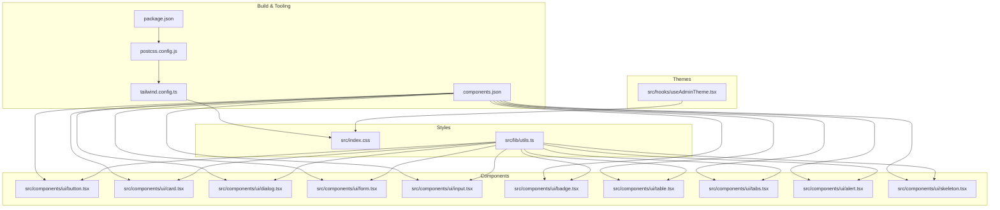
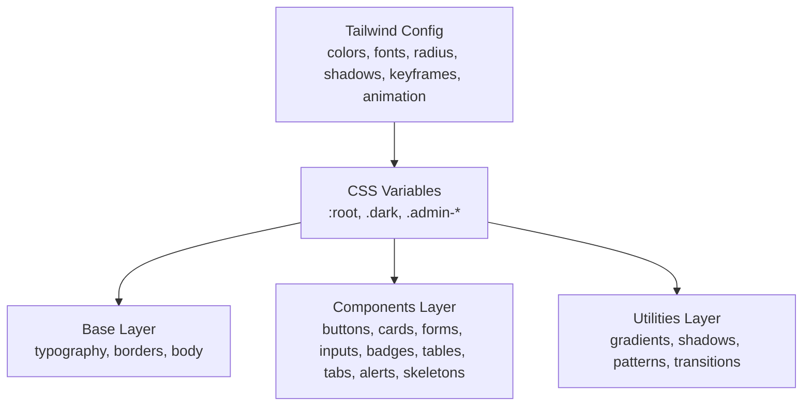
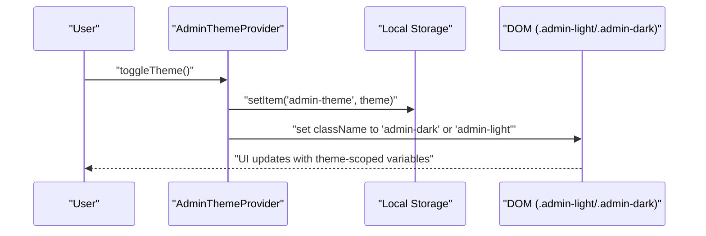
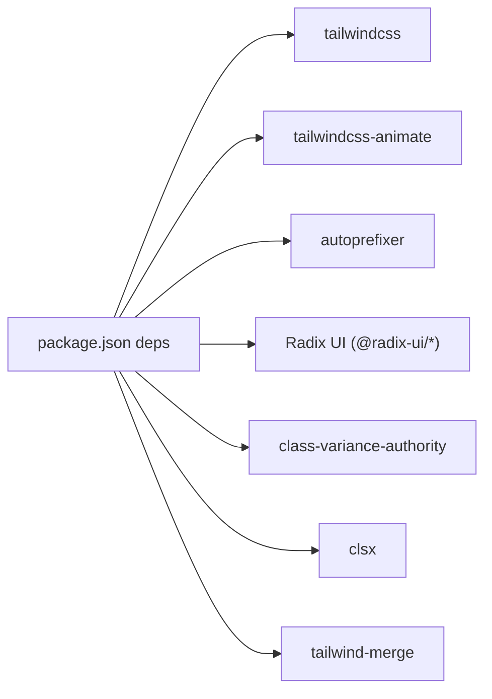

# Styling System & UI Components

<cite>
**Referenced Files in This Document**
- [tailwind.config.ts](file://tailwind.config.ts)
- [components.json](file://components.json)
- [postcss.config.js](file://postcss.config.js)
- [src/index.css](file://src/index.css)
- [package.json](file://package.json)
- [src/lib/utils.ts](file://src/lib/utils.ts)
- [src/hooks/useAdminTheme.tsx](file://src/hooks/useAdminTheme.tsx)
- [src/components/ui/button.tsx](file://src/components/ui/button.tsx)
- [src/components/ui/card.tsx](file://src/components/ui/card.tsx)
- [src/components/ui/dialog.tsx](file://src/components/ui/dialog.tsx)
- [src/components/ui/form.tsx](file://src/components/ui/form.tsx)
- [src/components/ui/input.tsx](file://src/components/ui/input.tsx)
- [src/components/ui/badge.tsx](file://src/components/ui/badge.tsx)
- [src/components/ui/table.tsx](file://src/components/ui/table.tsx)
- [src/components/ui/tabs.tsx](file://src/components/ui/tabs.tsx)
- [src/components/ui/alert.tsx](file://src/components/ui/alert.tsx)
- [src/components/ui/skeleton.tsx](file://src/components/ui/skeleton.tsx)
</cite>

## Table of Contents
1. [Introduction](#introduction)
2. [Project Structure](#project-structure)
3. [Core Components](#core-components)
4. [Architecture Overview](#architecture-overview)
5. [Detailed Component Analysis](#detailed-component-analysis)
6. [Dependency Analysis](#dependency-analysis)
7. [Performance Considerations](#performance-considerations)
8. [Troubleshooting Guide](#troubleshooting-guide)
9. [Conclusion](#conclusion)
10. [Appendices](#appendices)

## Introduction
This document describes the design system and component library used across the application. It covers Tailwind CSS configuration, the custom color palette, typography system, spacing and sizing tokens, and the integration of shadcn/ui primitives. It documents component prop interfaces, customization options, theme variants, responsive design patterns, accessibility compliance, cross-browser compatibility, component composition patterns, styling best practices, and dark/light mode support with state management.

## Project Structure
The styling system is built on Tailwind CSS with PostCSS and shadcn/ui. The configuration defines design tokens (colors, typography, spacing, shadows, animations), while the component library augments Radix UI primitives with consistent variants and utilities.

**Diagram sources**
- [package.json](file://package.json#L1-L92)
- [postcss.config.js](file://postcss.config.js#L1-L7)
- [tailwind.config.ts](file://tailwind.config.ts#L1-L476)
- [components.json](file://components.json#L1-L21)
- [src/index.css](file://src/index.css#L1-L1259)
- [src/lib/utils.ts](file://src/lib/utils.ts#L1-L7)
- [src/hooks/useAdminTheme.tsx](file://src/hooks/useAdminTheme.tsx#L1-L57)
- [src/components/ui/button.tsx](file://src/components/ui/button.tsx#L1-L53)
- [src/components/ui/card.tsx](file://src/components/ui/card.tsx#L1-L62)
- [src/components/ui/dialog.tsx](file://src/components/ui/dialog.tsx#L1-L103)
- [src/components/ui/form.tsx](file://src/components/ui/form.tsx#L1-L130)
- [src/components/ui/input.tsx](file://src/components/ui/input.tsx#L1-L38)
- [src/components/ui/badge.tsx](file://src/components/ui/badge.tsx#L1-L77)
- [src/components/ui/table.tsx](file://src/components/ui/table.tsx#L1-L73)
- [src/components/ui/tabs.tsx](file://src/components/ui/tabs.tsx#L1-L54)
- [src/components/ui/alert.tsx](file://src/components/ui/alert.tsx#L1-L44)
- [src/components/ui/skeleton.tsx](file://src/components/ui/skeleton.tsx#L1-L8)

**Section sources**
- [tailwind.config.ts](file://tailwind.config.ts#L1-L476)
- [components.json](file://components.json#L1-L21)
- [postcss.config.js](file://postcss.config.js#L1-L7)
- [src/index.css](file://src/index.css#L1-L1259)
- [package.json](file://package.json#L1-L92)

## Core Components
This section documents the core UI primitives and their design system integration.

- Button
  - Variants: default, destructive, outline, secondary, ghost, link, accent, success
  - Sizes: default, sm, lg, xl, icon, icon-sm, icon-lg
  - Props: standard button attributes plus variant, size, asChild
  - Composition: uses class variance authority (CVA) and cn utility for merging classes
  - Accessibility: focus-visible ring, disabled states, pointer-events handling
  - Reference: [src/components/ui/button.tsx](file://src/components/ui/button.tsx#L1-L53)

- Card
  - Variants: default, elevated, ghost
  - Props: hover toggle, variant, standard div attributes
  - Composition: consistent border/background/shadow tokens, optional hover elevation
  - Reference: [src/components/ui/card.tsx](file://src/components/ui/card.tsx#L1-L62)

- Dialog
  - Features: overlay blur, portal rendering, animated enter/exit, close button with focus ring
  - Composition: overlays Radix UI Dialog with consistent spacing and shadow
  - Reference: [src/components/ui/dialog.tsx](file://src/components/ui/dialog.tsx#L1-L103)

- Form (Field/Form/Label/Control/Description/Message)
  - Integrates react-hook-form with Radix labels and controlled components
  - Accessibility: aria-describedby, aria-invalid, ids generated per field
  - Reference: [src/components/ui/form.tsx](file://src/components/ui/form.tsx#L1-L130)

- Input
  - Props: error, success toggles for border and ring colors
  - Composition: consistent focus ring, hover states, placeholder and file input styles
  - Reference: [src/components/ui/input.tsx](file://src/components/ui/input.tsx#L1-L38)

- Badge
  - Variants: default, secondary, destructive, outline, success, warning, accent, muted, difficulty levels, rank tiers, access levels, statuses, levels, urgency, season
  - Sizes: default, sm, lg
  - Reference: [src/components/ui/badge.tsx](file://src/components/ui/badge.tsx#L1-L77)

- Table
  - Components: Table, TableHeader, TableBody, TableFooter, TableHead, TableRow, TableCell, TableCaption
  - Composition: overflow wrapper, hover and selection states, checkbox-friendly alignment
  - Reference: [src/components/ui/table.tsx](file://src/components/ui/table.tsx#L1-L73)

- Tabs
  - Components: Tabs, TabsList, TabsTrigger, TabsContent
  - Composition: background/foreground contrast, focus-visible rings, active state styling
  - Reference: [src/components/ui/tabs.tsx](file://src/components/ui/tabs.tsx#L1-L54)

- Alert
  - Variants: default, destructive
  - Composition: icon placement, responsive padding, foreground color binding
  - Reference: [src/components/ui/alert.tsx](file://src/components/ui/alert.tsx#L1-L44)

- Skeleton
  - Composition: pulse animation, merged classes via cn
  - Reference: [src/components/ui/skeleton.tsx](file://src/components/ui/skeleton.tsx#L1-L8)

**Section sources**
- [src/components/ui/button.tsx](file://src/components/ui/button.tsx#L1-L53)
- [src/components/ui/card.tsx](file://src/components/ui/card.tsx#L1-L62)
- [src/components/ui/dialog.tsx](file://src/components/ui/dialog.tsx#L1-L103)
- [src/components/ui/form.tsx](file://src/components/ui/form.tsx#L1-L130)
- [src/components/ui/input.tsx](file://src/components/ui/input.tsx#L1-L38)
- [src/components/ui/badge.tsx](file://src/components/ui/badge.tsx#L1-L77)
- [src/components/ui/table.tsx](file://src/components/ui/table.tsx#L1-L73)
- [src/components/ui/tabs.tsx](file://src/components/ui/tabs.tsx#L1-L54)
- [src/components/ui/alert.tsx](file://src/components/ui/alert.tsx#L1-L44)
- [src/components/ui/skeleton.tsx](file://src/components/ui/skeleton.tsx#L1-L8)

## Architecture Overview
The design system architecture centers on:
- Tailwind configuration extending design tokens (colors, typography, spacing, shadows, animations)
- CSS variables for light/dark/admin themes with layered base, components, and utilities layers
- shadcn/ui components built on Radix UI with CVA variants and cn merging
- Utility functions for class merging and theme isolation

**Diagram sources**
- [tailwind.config.ts](file://tailwind.config.ts#L1-L476)
- [src/index.css](file://src/index.css#L1-L1259)

**Section sources**
- [tailwind.config.ts](file://tailwind.config.ts#L1-L476)
- [src/index.css](file://src/index.css#L1-L1259)

## Detailed Component Analysis

### Tailwind Configuration and Design Tokens
- Dark mode: class-based switching
- Content paths: scans pages, components, app, and src
- Font families: display, body, sans, serif, mono
- Colors: semantic tokens mapped to CSS variables; includes brand palettes (bright snow, platinum, alabaster, slate, grey, iron, gunmetal, carbon) and rank colors
- Border radius: variable radius token
- Shadows: card, card-hover, accent, 2xs to 2xl
- Animations: accordion, fade-in/up/down, slide-in, scale-in, pulse-glow, shimmer, float, spin-slow, bounce-gentle, blur-in, marquee, icon-bounce
- Plugin: tailwindcss-animate

**Section sources**
- [tailwind.config.ts](file://tailwind.config.ts#L1-L476)

### CSS Variables and Themes
- Light and dark modes define background, foreground, primary/secondary/accent/muted, borders, inputs, rings, gradients, shadows, transitions, and font families
- Admin theme isolation: separate variables for admin areas with dedicated light/dark classes
- Studio theme isolation: studio-specific classes for theme scoping
- Base layer applies global typography and borders
- Components layer defines reusable utilities and component styles
- Utilities layer exposes gradients, shadows, patterns, and transition helpers

**Section sources**
- [src/index.css](file://src/index.css#L1-L1259)

### shadcn/ui Integration and Aliases
- Style: default
- RSC: false
- TSX: true
- Tailwind config path and CSS path
- Base color: slate
- CSS variables enabled
- Aliases: components, utils, ui, lib, hooks

**Section sources**
- [components.json](file://components.json#L1-L21)

### Component Prop Interfaces and Customization Options
- Button
  - Props: variant, size, asChild, standard button attributes
  - Customization: variant and size combinations, slot composition
  - Reference: [src/components/ui/button.tsx](file://src/components/ui/button.tsx#L38-L42)
- Card
  - Props: hover, variant, standard div attributes
  - Customization: variant selection and hover behavior
  - Reference: [src/components/ui/card.tsx](file://src/components/ui/card.tsx#L5-L8)
- Dialog
  - Props: standard dialog attributes, close button focus ring
  - Customization: portal rendering, overlay blur, animation classes
  - Reference: [src/components/ui/dialog.tsx](file://src/components/ui/dialog.tsx#L15-L58)
- Form
  - Props: react-hook-form controller props, label/field contexts
  - Customization: integrates with validation and accessibility attributes
  - Reference: [src/components/ui/form.tsx](file://src/components/ui/form.tsx#L20-L31)
- Input
  - Props: error, success toggles
  - Customization: conditional border/ring colors
  - Reference: [src/components/ui/input.tsx](file://src/components/ui/input.tsx#L5-L9)
- Badge
  - Props: variant, size
  - Customization: extensive variant sets for difficulty, ranks, access, statuses, levels, urgency, season
  - Reference: [src/components/ui/badge.tsx](file://src/components/ui/badge.tsx#L68-L70)
- Table
  - Props: standard table attributes
  - Customization: overflow wrapper, hover/selected states
  - Reference: [src/components/ui/table.tsx](file://src/components/ui/table.tsx#L5-L11)
- Tabs
  - Props: standard tabs attributes
  - Customization: active state styling and focus rings
  - Reference: [src/components/ui/tabs.tsx](file://src/components/ui/tabs.tsx#L8-L20)
- Alert
  - Props: variant
  - Customization: destructive variant
  - Reference: [src/components/ui/alert.tsx](file://src/components/ui/alert.tsx#L21-L26)
- Skeleton
  - Props: standard div attributes
  - Reference: [src/components/ui/skeleton.tsx](file://src/components/ui/skeleton.tsx#L3-L4)

**Section sources**
- [src/components/ui/button.tsx](file://src/components/ui/button.tsx#L38-L42)
- [src/components/ui/card.tsx](file://src/components/ui/card.tsx#L5-L8)
- [src/components/ui/dialog.tsx](file://src/components/ui/dialog.tsx#L15-L58)
- [src/components/ui/form.tsx](file://src/components/ui/form.tsx#L20-L31)
- [src/components/ui/input.tsx](file://src/components/ui/input.tsx#L5-L9)
- [src/components/ui/badge.tsx](file://src/components/ui/badge.tsx#L68-L70)
- [src/components/ui/table.tsx](file://src/components/ui/table.tsx#L5-L11)
- [src/components/ui/tabs.tsx](file://src/components/ui/tabs.tsx#L8-L20)
- [src/components/ui/alert.tsx](file://src/components/ui/alert.tsx#L21-L26)
- [src/components/ui/skeleton.tsx](file://src/components/ui/skeleton.tsx#L3-L4)

### Theme Variants and State Management
- Admin theme provider manages light/dark state persisted in localStorage and applies scoped classes (.admin-light/.admin-dark)
- Studio and admin themes are isolated via dedicated CSS variable blocks
- Components consume CSS variables for colors, shadows, and gradients

**Diagram sources**
- [src/hooks/useAdminTheme.tsx](file://src/hooks/useAdminTheme.tsx#L15-L42)
- [src/index.css](file://src/index.css#L265-L409)

**Section sources**
- [src/hooks/useAdminTheme.tsx](file://src/hooks/useAdminTheme.tsx#L1-L57)
- [src/index.css](file://src/index.css#L167-L409)

### Responsive Design and Accessibility
- Responsive breakpoints: use Tailwind’s default breakpoints; components apply responsive variants (e.g., text sizes, padding)
- Accessibility:
  - Focus rings via focus-visible utilities
  - ARIA attributes in Form components (aria-describedby, aria-invalid)
  - Semantic roles and labels in dialogs and alerts
  - Disabled states and pointer-events handling in interactive components
- Cross-browser compatibility:
  - Autoprefixer configured in PostCSS
  - CSS variables for theme tokens
  - Tailwind utilities avoid vendor prefixes where unnecessary

**Section sources**
- [postcss.config.js](file://postcss.config.js#L1-L7)
- [src/components/ui/form.tsx](file://src/components/ui/form.tsx#L85-L98)
- [src/components/ui/dialog.tsx](file://src/components/ui/dialog.tsx#L30-L58)
- [src/components/ui/button.tsx](file://src/components/ui/button.tsx#L4-L8)

### Component Composition Patterns and Styling Best Practices
- Composition:
  - CVA-based variants for consistent styling across components
  - cn utility merges classes deterministically
  - Slot composition for asChild patterns
- Best practices:
  - Prefer semantic tokens (e.g., primary, secondary, destructive) over hardcoded colors
  - Use CSS variables for theme-aware tokens
  - Apply focus-visible rings for keyboard accessibility
  - Use hover/active states sparingly and consistently
  - Keep component props minimal and explicit

**Section sources**
- [src/lib/utils.ts](file://src/lib/utils.ts#L1-L7)
- [src/components/ui/button.tsx](file://src/components/ui/button.tsx#L7-L36)
- [src/components/ui/card.tsx](file://src/components/ui/card.tsx#L14-L21)
- [src/components/ui/input.tsx](file://src/components/ui/input.tsx#L16-L28)

## Dependency Analysis
The design system relies on Tailwind, PostCSS, and shadcn/ui primitives. Utilities and theme providers glue everything together.

**Diagram sources**
- [package.json](file://package.json#L15-L69)

**Section sources**
- [package.json](file://package.json#L15-L69)

## Performance Considerations
- Minimize custom CSS: leverage Tailwind utilities and CSS variables
- Prefer CSS animations over JavaScript where possible
- Use skeleton loaders for perceived performance
- Keep component variants concise to reduce CSS bloat
- Tree-shake unused utilities and animations

## Troubleshooting Guide
- Theme not applying:
  - Verify admin theme provider wraps the app and className matches .admin-light/.admin-dark
  - Confirm CSS variable blocks for admin themes are present
  - Reference: [src/hooks/useAdminTheme.tsx](file://src/hooks/useAdminTheme.tsx#L36-L42), [src/index.css](file://src/index.css#L265-L409)
- Colors look incorrect in dark mode:
  - Ensure .dark class is applied at the root and CSS variables are defined
  - Reference: [src/index.css](file://src/index.css#L167-L263)
- Shadcn/ui variants not working:
  - Check CVA usage and variant names
  - Reference: [src/components/ui/button.tsx](file://src/components/ui/button.tsx#L7-L36), [src/components/ui/badge.tsx](file://src/components/ui/badge.tsx#L6-L66)
- Build errors with Tailwind:
  - Confirm tailwind.config.ts path and content globs
  - Reference: [tailwind.config.ts](file://tailwind.config.ts#L3-L5)
- PostCSS/Autoprefixer issues:
  - Validate postcss.config.js presence and order
  - Reference: [postcss.config.js](file://postcss.config.js#L1-L7)

**Section sources**
- [src/hooks/useAdminTheme.tsx](file://src/hooks/useAdminTheme.tsx#L36-L42)
- [src/index.css](file://src/index.css#L167-L409)
- [src/components/ui/button.tsx](file://src/components/ui/button.tsx#L7-L36)
- [src/components/ui/badge.tsx](file://src/components/ui/badge.tsx#L6-L66)
- [tailwind.config.ts](file://tailwind.config.ts#L3-L5)
- [postcss.config.js](file://postcss.config.js#L1-L7)

## Conclusion
The design system combines Tailwind CSS, CSS variables, and shadcn/ui primitives to deliver a cohesive, theme-aware, and accessible UI library. Components are built with CVA and utility-first CSS, enabling consistent variants, scalable customization, and strong accessibility defaults. The admin/studio theme isolation ensures flexible deployment scenarios, while responsive and performance best practices keep the system maintainable and fast.

## Appendices

### Design Token Reference
- Colors: semantic tokens (background, foreground, primary, secondary, destructive, success, warning, muted, accent, popover, card), brand palettes (bright snow to carbon), rank colors
- Typography: display/body/sans/serif/mono families
- Spacing: rem-based tokens, responsive padding and gaps
- Shadows: card, card-hover, accent, 2xs to 2xl
- Animations: multiple easing and duration presets
- Transitions: fast, base, slow timing functions

**Section sources**
- [tailwind.config.ts](file://tailwind.config.ts#L59-L270)
- [src/index.css](file://src/index.css#L116-L164)