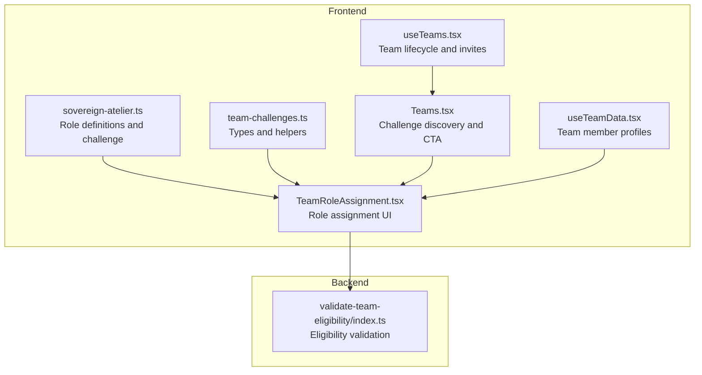
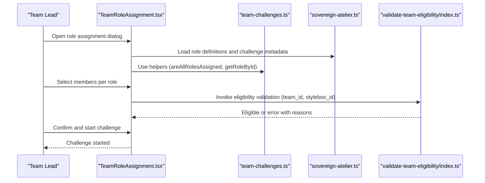
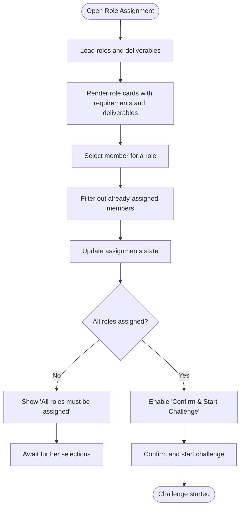
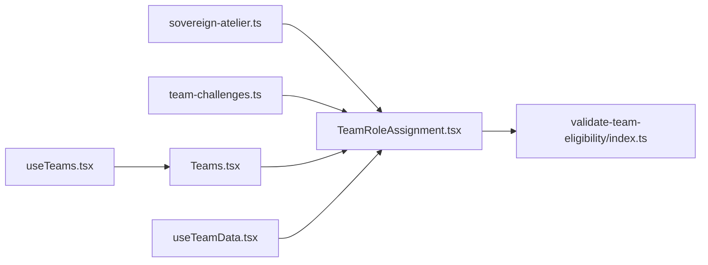

# Role Assignment System

<cite>
**Referenced Files in This Document**
- [sovereign-atelier.ts](file://src/lib/sovereign-atelier.ts)
- [team-challenges.ts](file://src/lib/team-challenges.ts)
- [TeamRoleAssignment.tsx](file://src/components/teams/TeamRoleAssignment.tsx)
- [Teams.tsx](file://src/pages/Teams.tsx)
- [useTeamData.tsx](file://src/hooks/useTeamData.tsx)
- [useTeams.tsx](file://src/hooks/useTeams.tsx)
- [validate-team-eligibility/index.ts](file://supabase/functions/validate-team-eligibility/index.ts)
- [scoring.ts](file://src/lib/scoring.ts)
</cite>

## Table of Contents
1. [Introduction](#introduction)
2. [Project Structure](#project-structure)
3. [Core Components](#core-components)
4. [Architecture Overview](#architecture-overview)
5. [Detailed Component Analysis](#detailed-component-analysis)
6. [Dependency Analysis](#dependency-analysis)
7. [Performance Considerations](#performance-considerations)
8. [Troubleshooting Guide](#troubleshooting-guide)
9. [Conclusion](#conclusion)

## Introduction
This document explains the role assignment system for team collaborations within the Sovereign Atelier team challenge. It covers the four specialized roles, their responsibilities, skill requirements, and deliverables. It also documents the role assignment workflow, role switching mechanisms, evaluation criteria, and performance tracking. Examples of optimal team compositions and conflict resolution strategies are included to help teams succeed in collaborative challenges.

## Project Structure
The role assignment system spans frontend components, shared libraries, and backend validation functions:
- Role definitions and challenge metadata live in a shared library.
- The role assignment UI is implemented as a reusable component.
- Team data and challenge eligibility are managed via hooks and Supabase functions.
- Scoring utilities support performance tracking and evaluation.

**Diagram sources**
- [sovereign-atelier.ts](file://src/lib/sovereign-atelier.ts#L1-L177)
- [team-challenges.ts](file://src/lib/team-challenges.ts#L1-L133)
- [TeamRoleAssignment.tsx](file://src/components/teams/TeamRoleAssignment.tsx#L1-L201)
- [Teams.tsx](file://src/pages/Teams.tsx#L1-L633)
- [useTeamData.tsx](file://src/hooks/useTeamData.tsx#L1-L129)
- [useTeams.tsx](file://src/hooks/useTeams.tsx#L1-L579)
- [validate-team-eligibility/index.ts](file://supabase/functions/validate-team-eligibility/index.ts#L1-L145)

**Section sources**
- [sovereign-atelier.ts](file://src/lib/sovereign-atelier.ts#L1-L177)
- [team-challenges.ts](file://src/lib/team-challenges.ts#L1-L133)
- [TeamRoleAssignment.tsx](file://src/components/teams/TeamRoleAssignment.tsx#L1-L201)
- [Teams.tsx](file://src/pages/Teams.tsx#L1-L633)
- [useTeamData.tsx](file://src/hooks/useTeamData.tsx#L1-L129)
- [useTeams.tsx](file://src/hooks/useTeams.tsx#L1-L579)
- [validate-team-eligibility/index.ts](file://supabase/functions/validate-team-eligibility/index.ts#L1-L145)

## Core Components
- Role definitions and challenge metadata: Defines the four roles, deliverables, requirements, and evaluation criteria for the Sovereign Atelier challenge.
- Team challenge types and helpers: Provides shared types and helper functions for role assignment, progress calculation, and time tracking.
- Role assignment UI: A dialog-driven component enabling team leads to assign each role to a unique team member and confirm the start of the challenge.
- Team discovery and challenge CTA: Displays the challenge card and eligibility status, guiding teams to start a challenge.
- Team data and lifecycle: Loads team members and handles invitations/join requests.
- Eligibility validation: Backend function ensuring teams meet size and rank requirements before starting a challenge.
- Scoring utilities: Provide evaluation metrics and scoring weights used for performance tracking.

**Section sources**
- [sovereign-atelier.ts](file://src/lib/sovereign-atelier.ts#L5-L89)
- [team-challenges.ts](file://src/lib/team-challenges.ts#L3-L77)
- [TeamRoleAssignment.tsx](file://src/components/teams/TeamRoleAssignment.tsx#L43-L201)
- [Teams.tsx](file://src/pages/Teams.tsx#L396-L446)
- [useTeamData.tsx](file://src/hooks/useTeamData.tsx#L24-L129)
- [useTeams.tsx](file://src/hooks/useTeams.tsx#L56-L579)
- [validate-team-eligibility/index.ts](file://supabase/functions/validate-team-eligibility/index.ts#L35-L134)
- [scoring.ts](file://src/lib/scoring.ts#L31-L83)

## Architecture Overview
The role assignment system integrates frontend UI with backend validation and team lifecycle management. The flow begins with a team lead opening the role assignment dialog, selecting members for each role, and confirming. The backend validates eligibility (size and rank thresholds) before allowing the challenge to start.

**Diagram sources**
- [TeamRoleAssignment.tsx](file://src/components/teams/TeamRoleAssignment.tsx#L43-L201)
- [team-challenges.ts](file://src/lib/team-challenges.ts#L42-L77)
- [sovereign-atelier.ts](file://src/lib/sovereign-atelier.ts#L132-L177)
- [validate-team-eligibility/index.ts](file://supabase/functions/validate-team-eligibility/index.ts#L26-L134)

## Detailed Component Analysis

### Sovereign Atelier Roles and Deliverables
The system defines four specialized roles, each with distinct requirements, deliverables, and a signature badge. These roles collectively produce a cohesive, museum-quality digital bridal ensemble.

- Master Cutter (Pattern & Silhouette)
  - Requirements: Pattern accuracy with grain respect, drape simulation for fabric types, internal architecture modeling, realistic tension creases.
  - Deliverables: 14-panel Jamawar lehenga pattern, drape properties distinguishing silk stiffness vs flow, Patti reinforcement, stay-stitched armholes, tension creases at bust and waist.
  - Badge: Golden Scissors.

- Artisan Weaver (Textile & Surface)
  - Requirements: Zardozi stack layering technique, sheen variance simulation, transparency and moiré management.
  - Deliverables: Gold thread-work (Dabka) layer, sequins (Sitara) placement, stone embellishments, sheen variance showing hand-touch, double-tone net Dupatta with moiré control.
  - Badge: Needle-Master.

- Draping Specialist (Styling & Flow)
  - Requirements: Multi-point draping technique, collision physics for jewelry, motion inertia simulation.
  - Deliverables: Signature multi-point Dupatta drape, jewelry collision with fabric indent, delayed swing physics for heavy hem, Nath chain draping.
  - Badge: Sultan of Sway.

- Creative Director (Merchandising & Presentation)
  - Requirements: Heritage narrative development, quality control expertise, market positioning analysis.
  - Deliverables: Collection moodbook with motif explanation, QC review of all seams and finishes, man-hours production estimate, era and cultural context documentation.
  - Badge: Couture Visionary.

Evaluation criteria and fail points define quality gates for submissions.

- Evaluation Criteria (weights and descriptions)
  - Seam Alignment (20%), Lining Logic (15%), Jewelry Interaction (15%), Movement Soul (25%), Color Harmony (15%), Jewelry Integration (10%).

- Fail Points
  - Seam Stress: Motifs don’t align at seams.
  - Lining Logic: Wrong color or insufficient ease.
  - Jewelry Clipping: Nath chain clips through skin or veil.
  - Plastic Look: Fabric lacks realistic tension creases.
  - Missing Hand-Touch: Embroidery lacks sheen variance.

Challenge metadata
- Title, studio, client, category, difficulty, team size, minimum rank order, time limit, XP reward, target role, scenario, constraints, and detailed deliverables.

**Section sources**
- [sovereign-atelier.ts](file://src/lib/sovereign-atelier.ts#L5-L89)
- [sovereign-atelier.ts](file://src/lib/sovereign-atelier.ts#L91-L130)
- [sovereign-atelier.ts](file://src/lib/sovereign-atelier.ts#L132-L177)

### Role Assignment Workflow
The role assignment UI enables a team lead to assign each role to a unique team member and confirm the start of the challenge. The workflow enforces mutual exclusivity of assignments and prevents submission until all roles are filled.

Key behaviors
- Mutual exclusivity: Once a member is assigned to a role, they become unavailable for other roles.
- Availability filtering: The UI filters out already-assigned members when rendering selection lists.
- Validation: The “All roles must be assigned” warning appears until every role has a selected member.
- Confirmation: The “Confirm & Start Challenge” button is enabled only when all roles are assigned and not loading.

**Diagram sources**
- [TeamRoleAssignment.tsx](file://src/components/teams/TeamRoleAssignment.tsx#L53-L64)
- [TeamRoleAssignment.tsx](file://src/components/teams/TeamRoleAssignment.tsx#L122-L167)
- [TeamRoleAssignment.tsx](file://src/components/teams/TeamRoleAssignment.tsx#L175-L196)

**Section sources**
- [TeamRoleAssignment.tsx](file://src/components/teams/TeamRoleAssignment.tsx#L43-L201)

### Role Switching Mechanisms
During an active challenge, role switching is supported by the underlying data model and UI controls. The assignment state is keyed by role_id to user_id, enabling dynamic reassignment. The UI’s availability filtering ensures that switching a role to a previously assigned member removes the prior assignment from that member.

Implementation highlights
- Assignment state shape: role_id → user_id.
- Availability computation: Filters out members already assigned to another role.
- Reassignment: Selecting a new member updates the assignment map; the previous member becomes available again.

**Section sources**
- [team-challenges.ts](file://src/lib/team-challenges.ts#L22-L40)
- [TeamRoleAssignment.tsx](file://src/components/teams/TeamRoleAssignment.tsx#L55-L64)
- [TeamRoleAssignment.tsx](file://src/components/teams/TeamRoleAssignment.tsx#L122-L167)

### Role Progression and Evaluation
Evaluation criteria and fail points provide a structured framework for assessing role deliverables. The scoring utilities support broader performance tracking and can be extended to evaluate individual roles within a team challenge.

Evaluation criteria
- Seam Alignment (20%), Lining Logic (15%), Jewelry Interaction (15%), Movement Soul (25%), Color Harmony (15%), Jewelry Integration (10%).

Fail points
- Specific failure indicators that invalidate submissions if present.

Scoring utilities
- Weighted evaluation calculations, difficulty multipliers, and timeliness adjustments support performance tracking and ranking.

**Section sources**
- [sovereign-atelier.ts](file://src/lib/sovereign-atelier.ts#L91-L130)
- [scoring.ts](file://src/lib/scoring.ts#L31-L83)
- [scoring.ts](file://src/lib/scoring.ts#L112-L148)

### Team Challenge Discovery and Eligibility
The Teams page displays the Sovereign Atelier challenge card and eligibility status. Eligibility is validated server-side by checking team size and minimum rank order before allowing a challenge start.

Discovery and CTA
- The challenge card shows title, description, difficulty, team size, minimum rank order, time limit, XP reward, and roles.
- Eligibility is computed client-side based on current team size; a mock validation function is used in the UI.

Backend eligibility validation
- Validates team size and rank order against the challenge requirements.
- Returns eligible or error with reasons and team roles.

**Section sources**
- [Teams.tsx](file://src/pages/Teams.tsx#L396-L446)
- [Teams.tsx](file://src/pages/Teams.tsx#L93-L94)
- [validate-team-eligibility/index.ts](file://supabase/functions/validate-team-eligibility/index.ts#L35-L134)

### Team Data and Lifecycle
Team data retrieval and lifecycle operations are handled by dedicated hooks. These include fetching team membership, members’ profiles, and active projects, as well as managing invitations and join requests.

Key capabilities
- Loading team membership and member profiles.
- Fetching active team stylebox submissions.
- Managing invitations and join requests for team leads.
- Real-time subscriptions for invitations and team membership changes.

**Section sources**
- [useTeamData.tsx](file://src/hooks/useTeamData.tsx#L24-L129)
- [useTeams.tsx](file://src/hooks/useTeams.tsx#L56-L579)

## Dependency Analysis
The role assignment system relies on shared types and helpers, role definitions, and backend validation. The UI composes these dependencies to enforce business rules and provide a seamless user experience.

**Diagram sources**
- [sovereign-atelier.ts](file://src/lib/sovereign-atelier.ts#L1-L177)
- [team-challenges.ts](file://src/lib/team-challenges.ts#L1-L133)
- [TeamRoleAssignment.tsx](file://src/components/teams/TeamRoleAssignment.tsx#L1-L201)
- [Teams.tsx](file://src/pages/Teams.tsx#L1-L633)
- [useTeamData.tsx](file://src/hooks/useTeamData.tsx#L1-L129)
- [useTeams.tsx](file://src/hooks/useTeams.tsx#L1-L579)
- [validate-team-eligibility/index.ts](file://supabase/functions/validate-team-eligibility/index.ts#L1-L145)

**Section sources**
- [sovereign-atelier.ts](file://src/lib/sovereign-atelier.ts#L1-L177)
- [team-challenges.ts](file://src/lib/team-challenges.ts#L1-L133)
- [TeamRoleAssignment.tsx](file://src/components/teams/TeamRoleAssignment.tsx#L1-L201)
- [Teams.tsx](file://src/pages/Teams.tsx#L1-L633)
- [useTeamData.tsx](file://src/hooks/useTeamData.tsx#L1-L129)
- [useTeams.tsx](file://src/hooks/useTeams.tsx#L1-L579)
- [validate-team-eligibility/index.ts](file://supabase/functions/validate-team-eligibility/index.ts#L1-L145)

## Performance Considerations
- Minimize re-renders by memoizing role and member data in the UI.
- Use efficient filtering for available members to avoid unnecessary computations.
- Debounce search queries in team discovery to reduce backend load.
- Leverage real-time subscriptions for timely updates without polling.

## Troubleshooting Guide
Common issues and resolutions
- Not all roles assigned: The UI disables confirmation until every role has a selected member. Ensure each role card has a valid selection.
- Member already assigned: When switching roles, the previously assigned member becomes available again. Verify the assignment map reflects the intended state.
- Eligibility errors: If the backend reports insufficient team size or rank, adjust team composition or ensure members meet the minimum rank threshold.
- Real-time sync delays: Subscriptions update state reactively; refresh data manually if needed.

**Section sources**
- [TeamRoleAssignment.tsx](file://src/components/teams/TeamRoleAssignment.tsx#L53-L64)
- [TeamRoleAssignment.tsx](file://src/components/teams/TeamRoleAssignment.tsx#L175-L196)
- [validate-team-eligibility/index.ts](file://supabase/functions/validate-team-eligibility/index.ts#L85-L120)
- [useTeams.tsx](file://src/hooks/useTeams.tsx#L511-L556)

## Conclusion
The role assignment system for team collaborations centers on four specialized roles with precise deliverables and evaluation criteria. The UI enforces mutual exclusivity and completeness of assignments, while backend validation ensures eligibility. With clear progression pathways, evaluation criteria, and performance tracking, teams can assemble optimal compositions, resolve conflicts, and achieve excellence in collaborative challenges.