# Team Challenge Participation

<cite>
**Referenced Files in This Document**
- [src/lib/team-challenges.ts](file://src/lib/team-challenges.ts)
- [src/lib/sovereign-atelier.ts](file://src/lib/sovereign-atelier.ts)
- [src/hooks/useTeams.tsx](file://src/hooks/useTeams.tsx)
- [src/hooks/useTeamData.tsx](file://src/hooks/useTeamData.tsx)
- [src/pages/Teams.tsx](file://src/pages/Teams.tsx)
- [src/components/teams/TeamStyleboxCard.tsx](file://src/components/teams/TeamStyleboxCard.tsx)
- [src/components/teams/TeamRoleAssignment.tsx](file://src/components/teams/TeamRoleAssignment.tsx)
- [src/components/teams/TeamChallengeProgress.tsx](file://src/components/teams/TeamChallengeProgress.tsx)
- [src/components/admin/TeamSubmissionReview.tsx](file://src/components/admin/TeamSubmissionReview.tsx)
- [supabase/functions/validate-team-eligibility/index.ts](file://supabase/functions/validate-team-eligibility/index.ts)
- [supabase/functions/manage-team/index.ts](file://supabase/functions/manage-team/index.ts)
</cite>

## Table of Contents
1. [Introduction](#introduction)
2. [Project Structure](#project-structure)
3. [Core Components](#core-components)
4. [Architecture Overview](#architecture-overview)
5. [Detailed Component Analysis](#detailed-component-analysis)
6. [Dependency Analysis](#dependency-analysis)
7. [Performance Considerations](#performance-considerations)
8. [Troubleshooting Guide](#troubleshooting-guide)
9. [Conclusion](#conclusion)

## Introduction
This document explains the team challenge participation mechanics implemented in the application. It covers how teams enroll in challenges, eligibility requirements, role assignments, progress tracking, deliverable submission, evaluation, and reward distribution. It also documents timing constraints, team size requirements, difficulty scaling, and practical strategies for optimizing team performance.

## Project Structure
The team challenge system spans frontend React components and hooks, backend Supabase edge functions, and shared TypeScript libraries that define challenge types and constants.

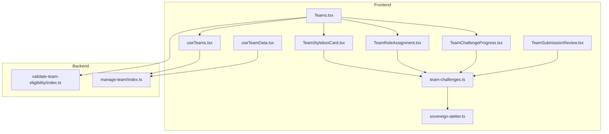

**Diagram sources**
- [src/pages/Teams.tsx](file://src/pages/Teams.tsx#L1-L633)
- [src/components/teams/TeamStyleboxCard.tsx](file://src/components/teams/TeamStyleboxCard.tsx#L1-L159)
- [src/components/teams/TeamRoleAssignment.tsx](file://src/components/teams/TeamRoleAssignment.tsx#L1-L201)
- [src/components/teams/TeamChallengeProgress.tsx](file://src/components/teams/TeamChallengeProgress.tsx#L1-L215)
- [src/hooks/useTeams.tsx](file://src/hooks/useTeams.tsx#L1-L579)
- [src/hooks/useTeamData.tsx](file://src/hooks/useTeamData.tsx#L1-L129)
- [src/components/admin/TeamSubmissionReview.tsx](file://src/components/admin/TeamSubmissionReview.tsx#L42-L128)
- [src/lib/team-challenges.ts](file://src/lib/team-challenges.ts#L1-L133)
- [src/lib/sovereign-atelier.ts](file://src/lib/sovereign-atelier.ts#L1-L177)
- [supabase/functions/validate-team-eligibility/index.ts](file://supabase/functions/validate-team-eligibility/index.ts#L1-L145)
- [supabase/functions/manage-team/index.ts](file://supabase/functions/manage-team/index.ts#L1-L548)

**Section sources**
- [src/pages/Teams.tsx](file://src/pages/Teams.tsx#L1-L633)
- [src/lib/team-challenges.ts](file://src/lib/team-challenges.ts#L1-L133)
- [src/lib/sovereign-atelier.ts](file://src/lib/sovereign-atelier.ts#L1-L177)
- [src/hooks/useTeams.tsx](file://src/hooks/useTeams.tsx#L1-L579)
- [src/hooks/useTeamData.tsx](file://src/hooks/useTeamData.tsx#L1-L129)
- [supabase/functions/validate-team-eligibility/index.ts](file://supabase/functions/validate-team-eligibility/index.ts#L1-L145)
- [supabase/functions/manage-team/index.ts](file://supabase/functions/manage-team/index.ts#L1-L548)

## Core Components
- Team challenge types and helpers: Defines roles, challenge metadata, submission status, and utility functions for progress calculation and deadlines.
- Sovereign Atelier challenge definition: Provides a concrete team challenge with roles, evaluation criteria, constraints, and deliverables.
- Team management hooks: Provide team CRUD, invitations, join requests, and real-time updates.
- UI components: Cards for challenge discovery, role assignment dialogs, and progress dashboards.
- Edge functions: Validate team eligibility and manage team lifecycle operations.

**Section sources**
- [src/lib/team-challenges.ts](file://src/lib/team-challenges.ts#L1-L133)
- [src/lib/sovereign-atelier.ts](file://src/lib/sovereign-atelier.ts#L1-L177)
- [src/hooks/useTeams.tsx](file://src/hooks/useTeams.tsx#L1-L579)
- [src/hooks/useTeamData.tsx](file://src/hooks/useTeamData.tsx#L1-L129)
- [src/pages/Teams.tsx](file://src/pages/Teams.tsx#L1-L633)
- [src/components/teams/TeamStyleboxCard.tsx](file://src/components/teams/TeamStyleboxCard.tsx#L1-L159)
- [src/components/teams/TeamRoleAssignment.tsx](file://src/components/teams/TeamRoleAssignment.tsx#L1-L201)
- [src/components/teams/TeamChallengeProgress.tsx](file://src/components/teams/TeamChallengeProgress.tsx#L1-L215)
- [src/components/admin/TeamSubmissionReview.tsx](file://src/components/admin/TeamSubmissionReview.tsx#L42-L128)
- [supabase/functions/validate-team-eligibility/index.ts](file://supabase/functions/validate-team-eligibility/index.ts#L1-L145)
- [supabase/functions/manage-team/index.ts](file://supabase/functions/manage-team/index.ts#L1-L548)

## Architecture Overview
The system integrates frontend UI with backend Supabase edge functions and database tables to support team-based challenges.

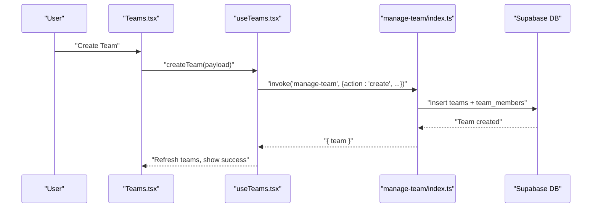

**Diagram sources**
- [src/pages/Teams.tsx](file://src/pages/Teams.tsx#L67-L86)
- [src/hooks/useTeams.tsx](file://src/hooks/useTeams.tsx#L306-L351)
- [supabase/functions/manage-team/index.ts](file://supabase/functions/manage-team/index.ts#L82-L201)

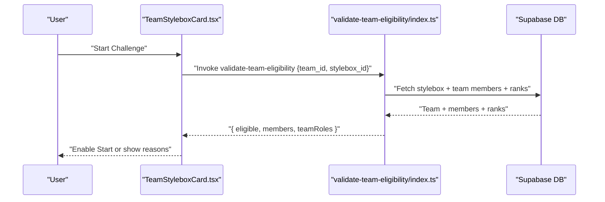

**Diagram sources**
- [src/components/teams/TeamStyleboxCard.tsx](file://src/components/teams/TeamStyleboxCard.tsx#L1-L159)
- [supabase/functions/validate-team-eligibility/index.ts](file://supabase/functions/validate-team-eligibility/index.ts#L16-L134)

## Detailed Component Analysis

### Team Challenge Types and Helpers
Defines the canonical types and helpers for team challenges:
- TeamRole: role identity, requirements, deliverables, and badge metadata.
- TeamChallenge: challenge metadata including team size, minimum rank order, and role requirements.
- TeamSubmissionStatus: submission state per role and overall challenge status.
- Utility functions: role lookup, completeness checks, progress calculation, and countdown formatting.

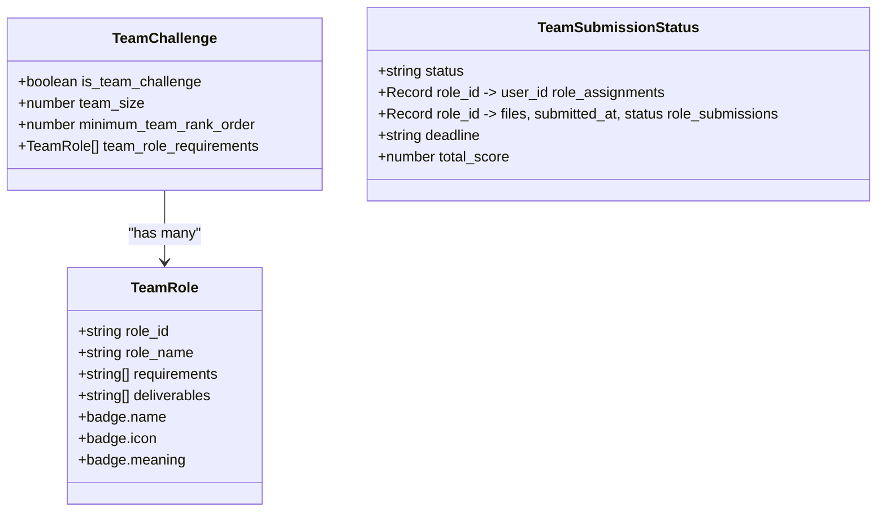

**Diagram sources**
- [src/lib/team-challenges.ts](file://src/lib/team-challenges.ts#L3-L40)

**Section sources**
- [src/lib/team-challenges.ts](file://src/lib/team-challenges.ts#L1-L133)

### Sovereign Atelier Challenge Definition
Provides a concrete team challenge with:
- Roles: Master Cutter, Artisan Weaver, Draping Specialist, Creative Director.
- Evaluation criteria and fail points.
- Constraints: minimum rank, team size, deadlines, and approval requirements.
- Deliverables organized by category.

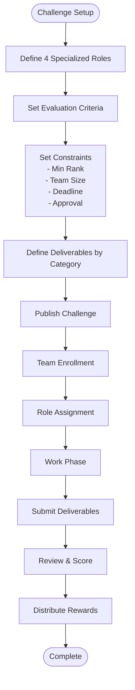

**Diagram sources**
- [src/lib/sovereign-atelier.ts](file://src/lib/sovereign-atelier.ts#L5-L89)
- [src/lib/sovereign-atelier.ts](file://src/lib/sovereign-atelier.ts#L91-L130)
- [src/lib/sovereign-atelier.ts](file://src/lib/sovereign-atelier.ts#L132-L176)

**Section sources**
- [src/lib/sovereign-atelier.ts](file://src/lib/sovereign-atelier.ts#L1-L177)

### Team Management Hooks
The hooks encapsulate team operations and state:
- useTeams: fetch user’s team, available teams, invitations, join requests; create, invite, respond, join, leave team; real-time subscriptions.
- useTeamData: lightweight team data for quick displays.

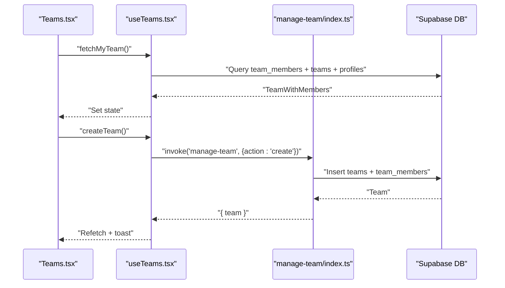

**Diagram sources**
- [src/hooks/useTeams.tsx](file://src/hooks/useTeams.tsx#L66-L147)
- [src/hooks/useTeams.tsx](file://src/hooks/useTeams.tsx#L306-L351)
- [supabase/functions/manage-team/index.ts](file://supabase/functions/manage-team/index.ts#L82-L201)

**Section sources**
- [src/hooks/useTeams.tsx](file://src/hooks/useTeams.tsx#L1-L579)
- [src/hooks/useTeamData.tsx](file://src/hooks/useTeamData.tsx#L1-L129)

### Team Discovery and Eligibility
The Teams page surfaces team challenges and eligibility:
- Displays a challenge card with difficulty, team size, time limit, XP reward, and roles.
- Determines eligibility based on team composition and rank thresholds.
- Provides “Start Challenge” when eligible and team is fully formed.

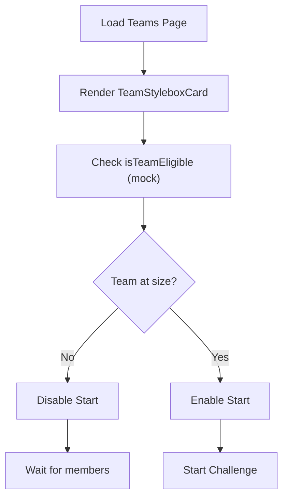

**Diagram sources**
- [src/pages/Teams.tsx](file://src/pages/Teams.tsx#L396-L446)
- [src/components/teams/TeamStyleboxCard.tsx](file://src/components/teams/TeamStyleboxCard.tsx#L1-L159)

**Section sources**
- [src/pages/Teams.tsx](file://src/pages/Teams.tsx#L1-L633)
- [src/components/teams/TeamStyleboxCard.tsx](file://src/components/teams/TeamStyleboxCard.tsx#L1-L159)

### Role Assignment and Confirmation
The role assignment dialog enforces one-role-per-member and allows final confirmation before starting the challenge.

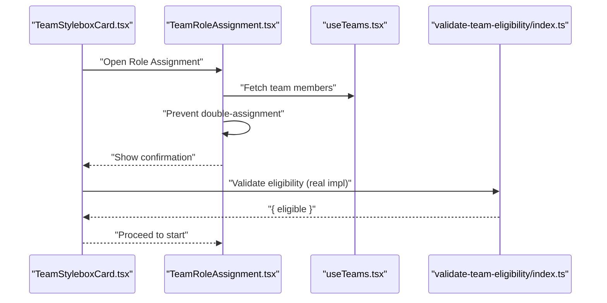

**Diagram sources**
- [src/components/teams/TeamRoleAssignment.tsx](file://src/components/teams/TeamRoleAssignment.tsx#L1-L201)
- [src/components/teams/TeamStyleboxCard.tsx](file://src/components/teams/TeamStyleboxCard.tsx#L1-L159)
- [supabase/functions/validate-team-eligibility/index.ts](file://supabase/functions/validate-team-eligibility/index.ts#L16-L134)

**Section sources**
- [src/components/teams/TeamRoleAssignment.tsx](file://src/components/teams/TeamRoleAssignment.tsx#L1-L201)
- [src/components/teams/TeamStyleboxCard.tsx](file://src/components/teams/TeamStyleboxCard.tsx#L1-L159)

### Progress Tracking and Deliverable Submission
The progress component visualizes deadline, overall progress, per-role status, and submission actions.

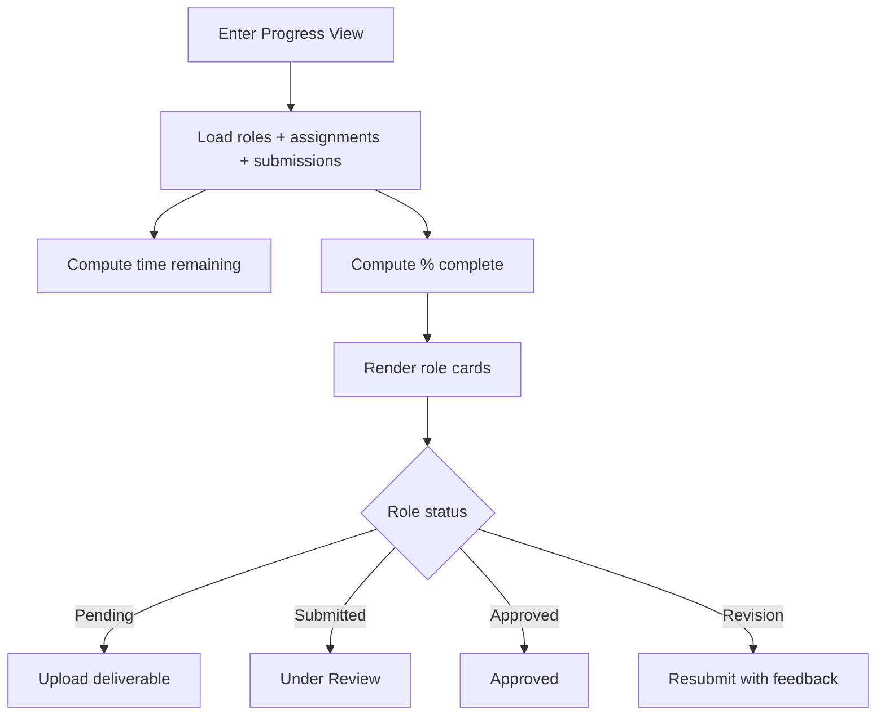

**Diagram sources**
- [src/components/teams/TeamChallengeProgress.tsx](file://src/components/teams/TeamChallengeProgress.tsx#L1-L215)
- [src/lib/team-challenges.ts](file://src/lib/team-challenges.ts#L66-L77)
- [src/lib/team-challenges.ts](file://src/lib/team-challenges.ts#L79-L113)

**Section sources**
- [src/components/teams/TeamChallengeProgress.tsx](file://src/components/teams/TeamChallengeProgress.tsx#L1-L215)
- [src/lib/team-challenges.ts](file://src/lib/team-challenges.ts#L1-L133)

### Evaluation and Review Workflow
Administrators review submissions against evaluation criteria and can approve, request revision, or reject.

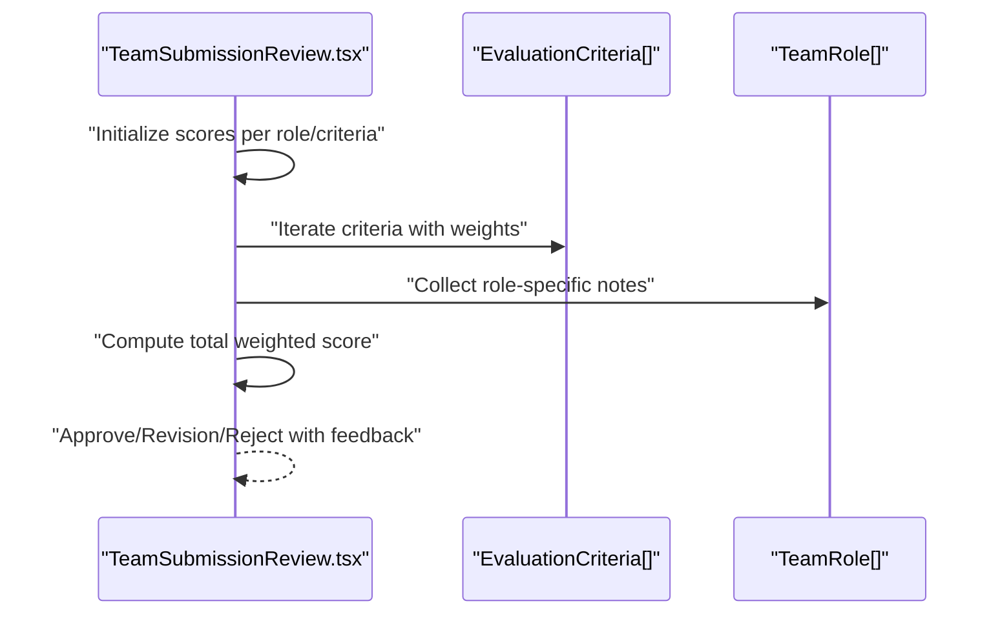

**Diagram sources**
- [src/components/admin/TeamSubmissionReview.tsx](file://src/components/admin/TeamSubmissionReview.tsx#L78-L128)
- [src/lib/sovereign-atelier.ts](file://src/lib/sovereign-atelier.ts#L91-L130)

**Section sources**
- [src/components/admin/TeamSubmissionReview.tsx](file://src/components/admin/TeamSubmissionReview.tsx#L42-L128)
- [src/lib/sovereign-atelier.ts](file://src/lib/sovereign-atelier.ts#L91-L130)

## Dependency Analysis
The system exhibits clear separation of concerns:
- Frontend UI depends on shared types and challenge definitions.
- Hooks orchestrate Supabase edge function invocations.
- Edge functions enforce business rules and update the database.
- Real-time subscriptions keep the UI synchronized.

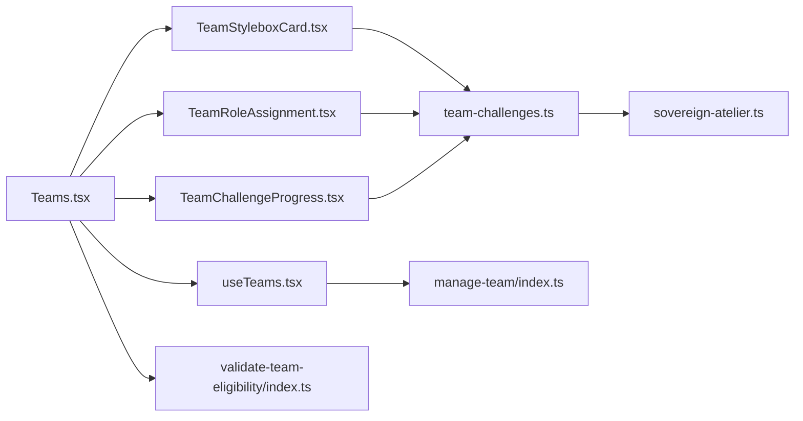

**Diagram sources**
- [src/pages/Teams.tsx](file://src/pages/Teams.tsx#L1-L633)
- [src/components/teams/TeamStyleboxCard.tsx](file://src/components/teams/TeamStyleboxCard.tsx#L1-L159)
- [src/components/teams/TeamRoleAssignment.tsx](file://src/components/teams/TeamRoleAssignment.tsx#L1-L201)
- [src/components/teams/TeamChallengeProgress.tsx](file://src/components/teams/TeamChallengeProgress.tsx#L1-L215)
- [src/hooks/useTeams.tsx](file://src/hooks/useTeams.tsx#L1-L579)
- [src/lib/team-challenges.ts](file://src/lib/team-challenges.ts#L1-L133)
- [src/lib/sovereign-atelier.ts](file://src/lib/sovereign-atelier.ts#L1-L177)
- [supabase/functions/validate-team-eligibility/index.ts](file://supabase/functions/validate-team-eligibility/index.ts#L1-L145)
- [supabase/functions/manage-team/index.ts](file://supabase/functions/manage-team/index.ts#L1-L548)

**Section sources**
- [src/pages/Teams.tsx](file://src/pages/Teams.tsx#L1-L633)
- [src/hooks/useTeams.tsx](file://src/hooks/useTeams.tsx#L1-L579)
- [src/lib/team-challenges.ts](file://src/lib/team-challenges.ts#L1-L133)
- [src/lib/sovereign-atelier.ts](file://src/lib/sovereign-atelier.ts#L1-L177)
- [supabase/functions/validate-team-eligibility/index.ts](file://supabase/functions/validate-team-eligibility/index.ts#L1-L145)
- [supabase/functions/manage-team/index.ts](file://supabase/functions/manage-team/index.ts#L1-L548)

## Performance Considerations
- Minimize redundant queries: use the provided hooks and pass pre-fetched data to components.
- Debounce search and filters in team discovery to reduce network load.
- Cache role and submission metadata locally when appropriate to avoid repeated calculations.
- Use real-time subscriptions for near-real-time updates without polling.

## Troubleshooting Guide
Common issues and resolutions:
- Team creation blocked by rank: Ensure the creator meets the minimum rank threshold before creation.
- Invitation acceptance fails due to team capacity: Verify the team has available slots.
- Join request denied: Check team membership rules and capacity.
- Eligibility validation errors: Confirm all team members meet the minimum rank order and team size requirements.
- Progress not updating: Ensure real-time subscriptions are active and the backend functions are reachable.

**Section sources**
- [supabase/functions/manage-team/index.ts](file://supabase/functions/manage-team/index.ts#L93-L121)
- [supabase/functions/manage-team/index.ts](file://supabase/functions/manage-team/index.ts#L314-L319)
- [supabase/functions/manage-team/index.ts](file://supabase/functions/manage-team/index.ts#L453-L458)
- [supabase/functions/validate-team-eligibility/index.ts](file://supabase/functions/validate-team-eligibility/index.ts#L85-L97)
- [supabase/functions/validate-team-eligibility/index.ts](file://supabase/functions/validate-team-eligibility/index.ts#L109-L120)

## Conclusion
The team challenge system combines robust frontend components with backend validation and team management functions. It supports structured role-based collaboration, transparent progress tracking, and fair evaluation with clear reward pathways. By adhering to the documented constraints and leveraging the provided components and hooks, teams can effectively participate in competitive challenges while maintaining clarity and fairness across all stages.