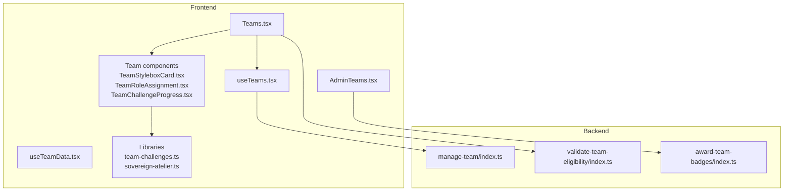
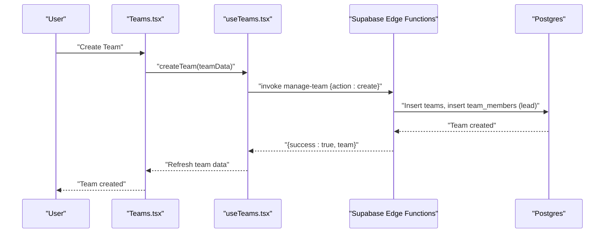
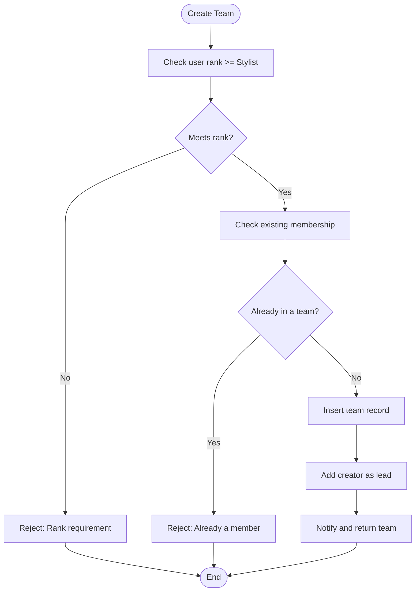
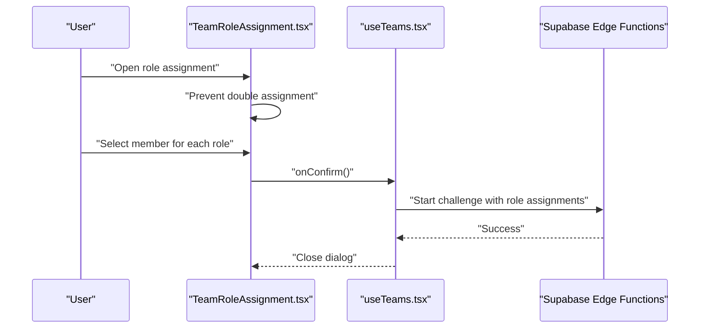
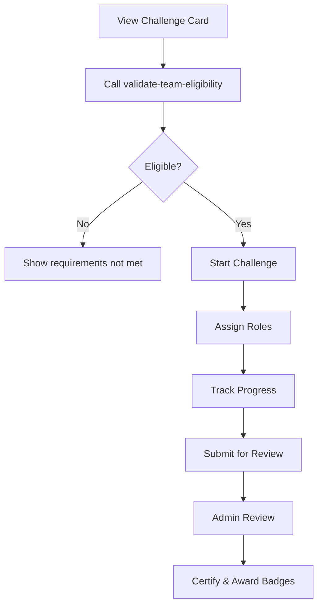
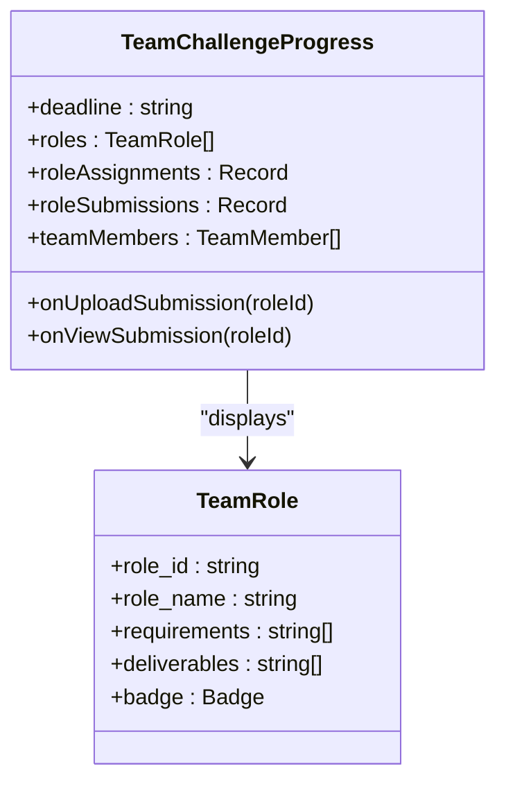
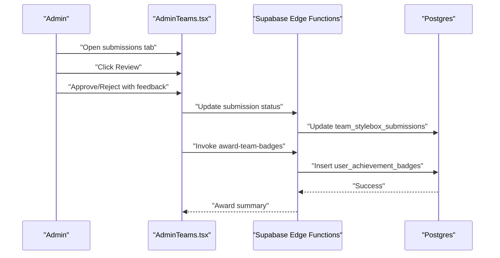
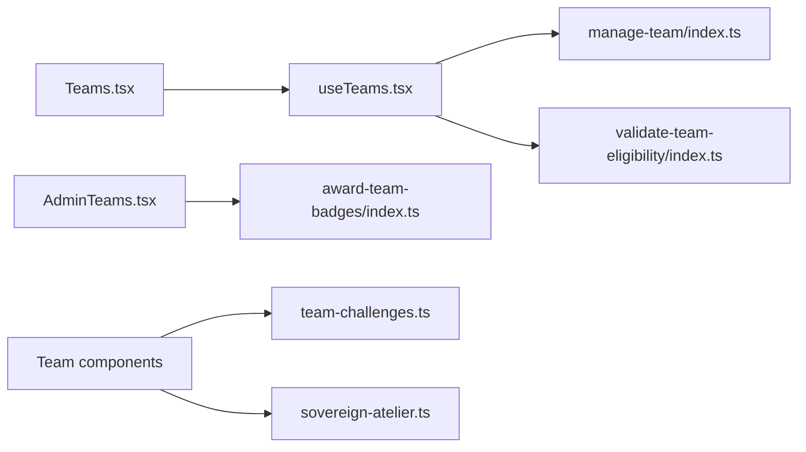

# Team Collaboration System

<cite>
**Referenced Files in This Document**
- [Teams.tsx](file://src/pages/Teams.tsx)
- [useTeams.tsx](file://src/hooks/useTeams.tsx)
- [useTeamData.tsx](file://src/hooks/useTeamData.tsx)
- [TeamChallengeProgress.tsx](file://src/components/teams/TeamChallengeProgress.tsx)
- [TeamRoleAssignment.tsx](file://src/components/teams/TeamRoleAssignment.tsx)
- [TeamStyleboxCard.tsx](file://src/components/teams/TeamStyleboxCard.tsx)
- [team-challenges.ts](file://src/lib/team-challenges.ts)
- [sovereign-atelier.ts](file://src/lib/sovereign-atelier.ts)
- [AdminTeams.tsx](file://src/pages/admin/AdminTeams.tsx)
- [manage-team/index.ts](file://supabase/functions/manage-team/index.ts)
- [validate-team-eligibility/index.ts](file://supabase/functions/validate-team-eligibility/index.ts)
- [award-team-badges/index.ts](file://supabase/functions/award-team-badges/index.ts)
</cite>

## Table of Contents
1. [Introduction](#introduction)
2. [Project Structure](#project-structure)
3. [Core Components](#core-components)
4. [Architecture Overview](#architecture-overview)
5. [Detailed Component Analysis](#detailed-component-analysis)
6. [Dependency Analysis](#dependency-analysis)
7. [Performance Considerations](#performance-considerations)
8. [Troubleshooting Guide](#troubleshooting-guide)
9. [Conclusion](#conclusion)

## Introduction
This document describes the team collaboration system that enables designers to form teams, manage memberships, participate in team-based challenges, and track shared progress. It covers team creation and management, role assignment mechanisms, challenge participation workflows, progress tracking, communication features, and administrative oversight. The system integrates frontend React components with Supabase edge functions for backend operations and real-time updates.

## Project Structure
The team collaboration system spans frontend pages, hooks, components, and backend Supabase edge functions. The frontend organizes team-related functionality under the Teams page, supporting team discovery, invitations, join requests, and challenge participation. Backend logic is encapsulated in edge functions that enforce permissions, validate eligibility, and manage team lifecycle operations.

**Diagram sources**
- [Teams.tsx](file://src/pages/Teams.tsx#L1-L633)
- [useTeams.tsx](file://src/hooks/useTeams.tsx#L1-L579)
- [useTeamData.tsx](file://src/hooks/useTeamData.tsx#L1-L129)
- [TeamStyleboxCard.tsx](file://src/components/teams/TeamStyleboxCard.tsx#L1-L159)
- [TeamRoleAssignment.tsx](file://src/components/teams/TeamRoleAssignment.tsx#L1-L201)
- [TeamChallengeProgress.tsx](file://src/components/teams/TeamChallengeProgress.tsx#L1-L215)
- [team-challenges.ts](file://src/lib/team-challenges.ts#L1-L133)
- [sovereign-atelier.ts](file://src/lib/sovereign-atelier.ts#L1-L177)
- [AdminTeams.tsx](file://src/pages/admin/AdminTeams.tsx#L1-L369)
- [manage-team/index.ts](file://supabase/functions/manage-team/index.ts#L1-L548)
- [validate-team-eligibility/index.ts](file://supabase/functions/validate-team-eligibility/index.ts#L1-L145)
- [award-team-badges/index.ts](file://supabase/functions/award-team-badges/index.ts#L1-L182)

**Section sources**
- [Teams.tsx](file://src/pages/Teams.tsx#L1-L633)
- [useTeams.tsx](file://src/hooks/useTeams.tsx#L1-L579)
- [useTeamData.tsx](file://src/hooks/useTeamData.tsx#L1-L129)
- [TeamStyleboxCard.tsx](file://src/components/teams/TeamStyleboxCard.tsx#L1-L159)
- [TeamRoleAssignment.tsx](file://src/components/teams/TeamRoleAssignment.tsx#L1-L201)
- [TeamChallengeProgress.tsx](file://src/components/teams/TeamChallengeProgress.tsx#L1-L215)
- [team-challenges.ts](file://src/lib/team-challenges.ts#L1-L133)
- [sovereign-atelier.ts](file://src/lib/sovereign-atelier.ts#L1-L177)
- [AdminTeams.tsx](file://src/pages/admin/AdminTeams.tsx#L1-L369)
- [manage-team/index.ts](file://supabase/functions/manage-team/index.ts#L1-L548)
- [validate-team-eligibility/index.ts](file://supabase/functions/validate-team-eligibility/index.ts#L1-L145)
- [award-team-badges/index.ts](file://supabase/functions/award-team-badges/index.ts#L1-L182)

## Core Components
- Teams page: Provides team discovery, invitations, join requests, and challenge participation.
- Team hooks: Centralize team data fetching, real-time updates, and backend function invocations.
- Team components: Role assignment dialogs, challenge progress tracking, and challenge cards.
- Libraries: Shared types, helpers, and challenge definitions for team roles and progress calculations.
- Admin teams page: Team and submission management for administrators.

**Section sources**
- [Teams.tsx](file://src/pages/Teams.tsx#L41-L633)
- [useTeams.tsx](file://src/hooks/useTeams.tsx#L56-L579)
- [team-challenges.ts](file://src/lib/team-challenges.ts#L1-L133)
- [sovereign-atelier.ts](file://src/lib/sovereign-atelier.ts#L1-L177)
- [AdminTeams.tsx](file://src/pages/admin/AdminTeams.tsx#L55-L369)

## Architecture Overview
The system follows a reactive architecture:
- Frontend pages and hooks orchestrate user interactions and state.
- Supabase edge functions handle business logic, permission checks, and data mutations.
- Real-time subscriptions keep team state synchronized across clients.
- Administrative views provide oversight of team challenges and submissions.

**Diagram sources**
- [Teams.tsx](file://src/pages/Teams.tsx#L67-L86)
- [useTeams.tsx](file://src/hooks/useTeams.tsx#L306-L351)
- [manage-team/index.ts](file://supabase/functions/manage-team/index.ts#L82-L201)

**Section sources**
- [Teams.tsx](file://src/pages/Teams.tsx#L41-L120)
- [useTeams.tsx](file://src/hooks/useTeams.tsx#L56-L147)
- [manage-team/index.ts](file://supabase/functions/manage-team/index.ts#L82-L201)

## Detailed Component Analysis

### Team Creation and Management
- Creation requirements: Rank threshold and single-team membership constraint enforced server-side.
- Membership lifecycle: Invite, join request, acceptance/decline, and leave with leadership transfer rules.
- Real-time synchronization: Subscriptions to invitations and team members keep UI up to date.

**Diagram sources**
- [manage-team/index.ts](file://supabase/functions/manage-team/index.ts#L82-L201)

**Section sources**
- [Teams.tsx](file://src/pages/Teams.tsx#L67-L86)
- [useTeams.tsx](file://src/hooks/useTeams.tsx#L306-L351)
- [manage-team/index.ts](file://supabase/functions/manage-team/index.ts#L82-L201)

### Role Assignment Mechanisms
- Role assignment dialog enforces one-role-per-member constraints.
- Deliverables preview and badge metadata guide role selection.
- Confirmation triggers challenge initiation with validated assignments.

**Diagram sources**
- [TeamRoleAssignment.tsx](file://src/components/teams/TeamRoleAssignment.tsx#L53-L201)
- [useTeams.tsx](file://src/hooks/useTeams.tsx#L432-L457)

**Section sources**
- [TeamRoleAssignment.tsx](file://src/components/teams/TeamRoleAssignment.tsx#L43-L201)
- [team-challenges.ts](file://src/lib/team-challenges.ts#L47-L53)

### Team Challenge Participation
- Challenge discovery: Cards show eligibility, team size, time limits, and role previews.
- Eligibility validation: Backend checks team size and minimum rank order per challenge.
- Progress tracking: Per-role submission statuses and overall progress percentage.

**Diagram sources**
- [TeamStyleboxCard.tsx](file://src/components/teams/TeamStyleboxCard.tsx#L32-L159)
- [validate-team-eligibility/index.ts](file://supabase/functions/validate-team-eligibility/index.ts#L26-L145)
- [TeamChallengeProgress.tsx](file://src/components/teams/TeamChallengeProgress.tsx#L49-L215)
- [award-team-badges/index.ts](file://supabase/functions/award-team-badges/index.ts#L39-L182)

**Section sources**
- [TeamStyleboxCard.tsx](file://src/components/teams/TeamStyleboxCard.tsx#L32-L159)
- [validate-team-eligibility/index.ts](file://supabase/functions/validate-team-eligibility/index.ts#L26-L145)
- [TeamChallengeProgress.tsx](file://src/components/teams/TeamChallengeProgress.tsx#L49-L215)
- [award-team-badges/index.ts](file://supabase/functions/award-team-badges/index.ts#L39-L182)

### Progress Tracking and Communication
- Progress visualization: Remaining time, completion percentage, and per-role status badges.
- Communication: Notifications for invitations, join requests, and submission outcomes.
- Team activity: Placeholder for chat and messaging features.

**Diagram sources**
- [TeamChallengeProgress.tsx](file://src/components/teams/TeamChallengeProgress.tsx#L29-L47)
- [team-challenges.ts](file://src/lib/team-challenges.ts#L3-L13)

**Section sources**
- [TeamChallengeProgress.tsx](file://src/components/teams/TeamChallengeProgress.tsx#L49-L215)
- [team-challenges.ts](file://src/lib/team-challenges.ts#L66-L77)

### Administrative Oversight
- Admin teams dashboard: Lists teams, filters by name, and manages submissions.
- Submission review: Approve or reject team submissions with feedback.
- Badge certification: Awards individual and team badges upon successful completion.

**Diagram sources**
- [AdminTeams.tsx](file://src/pages/admin/AdminTeams.tsx#L98-L121)
- [award-team-badges/index.ts](file://supabase/functions/award-team-badges/index.ts#L39-L182)

**Section sources**
- [AdminTeams.tsx](file://src/pages/admin/AdminTeams.tsx#L55-L369)
- [award-team-badges/index.ts](file://supabase/functions/award-team-badges/index.ts#L39-L182)

## Dependency Analysis
The system exhibits clear separation of concerns:
- Frontend depends on Supabase client for edge function invocation and real-time subscriptions.
- Edge functions depend on Supabase service role keys and Postgres tables for persistence.
- Components rely on shared libraries for types and helper functions.

**Diagram sources**
- [Teams.tsx](file://src/pages/Teams.tsx#L37-L53)
- [useTeams.tsx](file://src/hooks/useTeams.tsx#L317-L319)
- [manage-team/index.ts](file://supabase/functions/manage-team/index.ts#L1-L548)
- [validate-team-eligibility/index.ts](file://supabase/functions/validate-team-eligibility/index.ts#L1-L145)
- [award-team-badges/index.ts](file://supabase/functions/award-team-badges/index.ts#L1-L182)
- [TeamChallengeProgress.tsx](file://src/components/teams/TeamChallengeProgress.tsx#L15-L21)
- [team-challenges.ts](file://src/lib/team-challenges.ts#L1-L133)
- [sovereign-atelier.ts](file://src/lib/sovereign-atelier.ts#L1-L177)
- [AdminTeams.tsx](file://src/pages/admin/AdminTeams.tsx#L1-L369)

**Section sources**
- [Teams.tsx](file://src/pages/Teams.tsx#L37-L53)
- [useTeams.tsx](file://src/hooks/useTeams.tsx#L317-L319)
- [team-challenges.ts](file://src/lib/team-challenges.ts#L1-L133)
- [sovereign-atelier.ts](file://src/lib/sovereign-atelier.ts#L1-L177)
- [AdminTeams.tsx](file://src/pages/admin/AdminTeams.tsx#L1-L369)

## Performance Considerations
- Minimize redundant queries: Batch data fetching using concurrent promises in hooks.
- Optimize UI rendering: Use virtualized lists for large team member grids.
- Debounce search: Apply debounced filtering for team discovery.
- Edge function caching: Consider caching frequently accessed challenge metadata.
- Real-time subscriptions: Limit subscription scope to reduce bandwidth and CPU usage.

## Troubleshooting Guide
Common issues and resolutions:
- Authentication failures: Ensure Authorization header is present and valid when invoking edge functions.
- Permission errors: Verify team lead privileges for inviting members or responding to join requests.
- Capacity constraints: Enforce team size limits during join request approval and invitation acceptance.
- Eligibility mismatches: Validate team composition against challenge requirements before starting.
- Notification delivery: Confirm notification insertion succeeds and user has proper channels enabled.

**Section sources**
- [manage-team/index.ts](file://supabase/functions/manage-team/index.ts#L16-L55)
- [useTeams.tsx](file://src/hooks/useTeams.tsx#L353-L377)
- [validate-team-eligibility/index.ts](file://supabase/functions/validate-team-eligibility/index.ts#L26-L56)

## Conclusion
The team collaboration system provides a robust foundation for designers to collaborate on team-based challenges. It enforces role-based permissions, validates eligibility, tracks progress, and supports administrative oversight. The modular architecture allows for scalable enhancements, such as integrating chat features, expanding challenge categories, and adding advanced analytics.