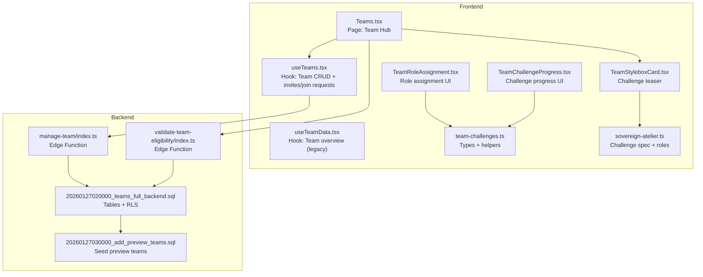
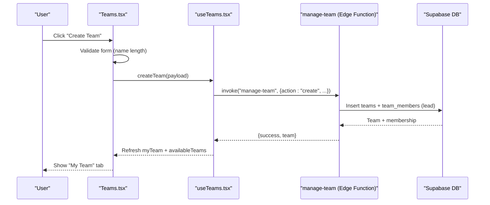
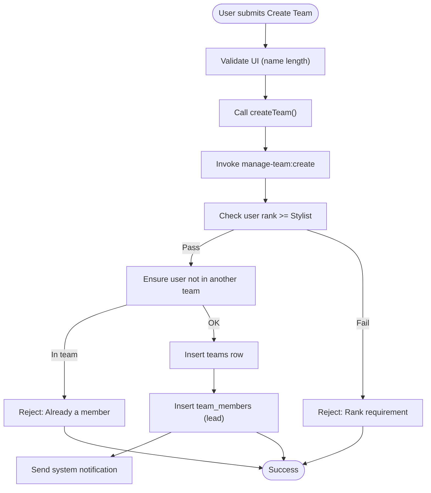
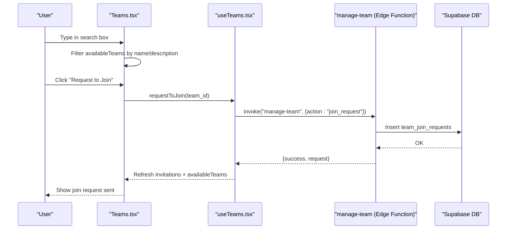
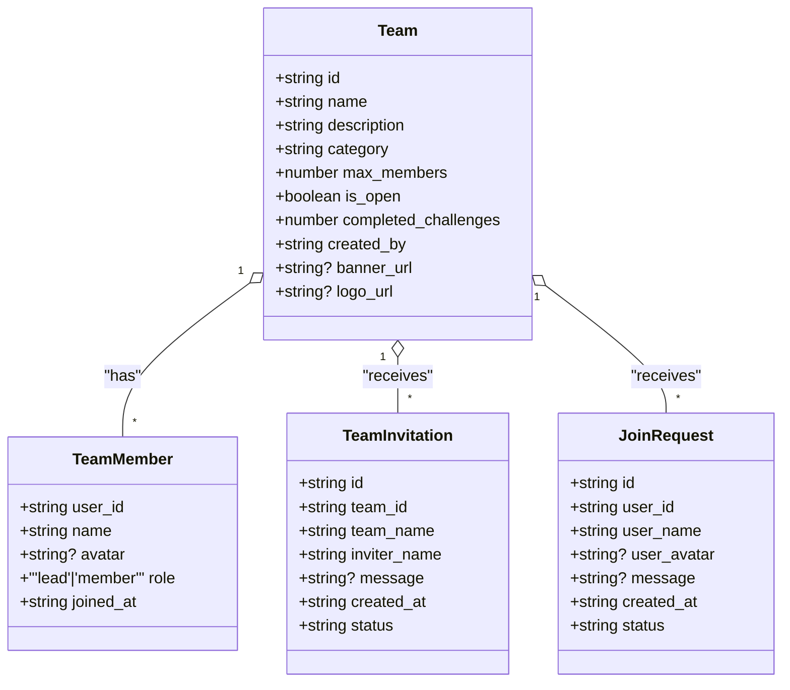
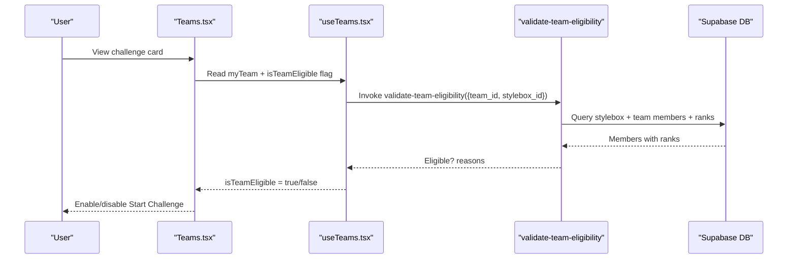
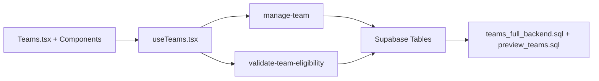

# Team Management

<cite>
**Referenced Files in This Document**
- [Teams.tsx](file://src/pages/Teams.tsx)
- [useTeams.tsx](file://src/hooks/useTeams.tsx)
- [useTeamData.tsx](file://src/hooks/useTeamData.tsx)
- [TeamChallengeProgress.tsx](file://src/components/teams/TeamChallengeProgress.tsx)
- [TeamRoleAssignment.tsx](file://src/components/teams/TeamRoleAssignment.tsx)
- [TeamStyleboxCard.tsx](file://src/components/teams/TeamStyleboxCard.tsx)
- [team-challenges.ts](file://src/lib/team-challenges.ts)
- [sovereign-atelier.ts](file://src/lib/sovereign-atelier.ts)
- [manage-team/index.ts](file://supabase/functions/manage-team/index.ts)
- [validate-team-eligibility/index.ts](file://supabase/functions/validate-team-eligibility/index.ts)
- [20260127020000_teams_full_backend.sql](file://supabase/migrations/20260127020000_teams_full_backend.sql)
- [20260127030000_add_preview_teams.sql](file://supabase/migrations/20260127030000_add_preview_teams.sql)
</cite>

## Table of Contents
1. [Introduction](#introduction)
2. [Project Structure](#project-structure)
3. [Core Components](#core-components)
4. [Architecture Overview](#architecture-overview)
5. [Detailed Component Analysis](#detailed-component-analysis)
6. [Dependency Analysis](#dependency-analysis)
7. [Performance Considerations](#performance-considerations)
8. [Troubleshooting Guide](#troubleshooting-guide)
9. [Conclusion](#conclusion)
10. [Appendices](#appendices)

## Introduction
This document explains the team management functionality across the frontend and backend. It covers team creation (form validation, rank-based restrictions, configuration options), team discovery and browsing (search and filters), member management (leader assignment, roles, statistics), team settings (banner/logo placeholders), and status indicators. It also includes practical examples and best practices for onboarding and configuration.

## Project Structure
The team management feature spans UI pages, React hooks for data orchestration, shared UI components, and backend Supabase Edge Functions and migrations.

**Diagram sources**
- [Teams.tsx](file://src/pages/Teams.tsx#L41-L633)
- [useTeams.tsx](file://src/hooks/useTeams.tsx#L56-L579)
- [useTeamData.tsx](file://src/hooks/useTeamData.tsx#L24-L129)
- [TeamStyleboxCard.tsx](file://src/components/teams/TeamStyleboxCard.tsx#L32-L159)
- [TeamRoleAssignment.tsx](file://src/components/teams/TeamRoleAssignment.tsx#L43-L201)
- [TeamChallengeProgress.tsx](file://src/components/teams/TeamChallengeProgress.tsx#L49-L215)
- [team-challenges.ts](file://src/lib/team-challenges.ts#L1-L133)
- [sovereign-atelier.ts](file://src/lib/sovereign-atelier.ts#L1-L177)
- [manage-team/index.ts](file://supabase/functions/manage-team/index.ts#L1-L548)
- [validate-team-eligibility/index.ts](file://supabase/functions/validate-team-eligibility/index.ts#L1-L145)
- [20260127020000_teams_full_backend.sql](file://supabase/migrations/20260127020000_teams_full_backend.sql#L1-L24)
- [20260127030000_add_preview_teams.sql](file://supabase/migrations/20260127030000_add_preview_teams.sql#L91-L117)

**Section sources**
- [Teams.tsx](file://src/pages/Teams.tsx#L1-L633)
- [useTeams.tsx](file://src/hooks/useTeams.tsx#L1-L579)
- [manage-team/index.ts](file://supabase/functions/manage-team/index.ts#L1-L548)
- [validate-team-eligibility/index.ts](file://supabase/functions/validate-team-eligibility/index.ts#L1-L145)
- [20260127020000_teams_full_backend.sql](file://supabase/migrations/20260127020000_teams_full_backend.sql#L1-L24)

## Core Components
- Team Hub page: Discovery, invitations, and team lifecycle controls.
- Team data hook: Centralized CRUD and state for teams, invitations, and join requests.
- Team challenge UI: Teaser cards, role assignment, and progress tracking.
- Backend functions: Team creation, invitations, join requests, and eligibility validation.
- Shared types and helpers: Team roles, statuses, and progress calculations.

**Section sources**
- [Teams.tsx](file://src/pages/Teams.tsx#L41-L633)
- [useTeams.tsx](file://src/hooks/useTeams.tsx#L56-L579)
- [TeamStyleboxCard.tsx](file://src/components/teams/TeamStyleboxCard.tsx#L32-L159)
- [TeamRoleAssignment.tsx](file://src/components/teams/TeamRoleAssignment.tsx#L43-L201)
- [TeamChallengeProgress.tsx](file://src/components/teams/TeamChallengeProgress.tsx#L49-L215)
- [team-challenges.ts](file://src/lib/team-challenges.ts#L1-L133)
- [manage-team/index.ts](file://supabase/functions/manage-team/index.ts#L82-L538)
- [validate-team-eligibility/index.ts](file://supabase/functions/validate-team-eligibility/index.ts#L16-L145)

## Architecture Overview
End-to-end flow for team creation and challenge participation:

**Diagram sources**
- [Teams.tsx](file://src/pages/Teams.tsx#L67-L86)
- [useTeams.tsx](file://src/hooks/useTeams.tsx#L306-L351)
- [manage-team/index.ts](file://supabase/functions/manage-team/index.ts#L82-L201)

## Detailed Component Analysis

### Team Creation Workflow
- Form fields: name, description, category, max_members, is_open.
- Validation:
  - Name length minimum enforced in UI before invoking backend.
  - Backend enforces rank requirement (minimum Stylist) and prevents duplicate memberships.
- Configuration options:
  - max_members defaults and bounds are handled in UI and enforced by backend defaults.
  - is_open toggles discoverability for join requests.
- Leader assignment:
  - Creator is automatically assigned as team lead upon successful creation.
- Notifications:
  - System notifications are sent on creation and acceptance.

**Diagram sources**
- [Teams.tsx](file://src/pages/Teams.tsx#L67-L86)
- [useTeams.tsx](file://src/hooks/useTeams.tsx#L306-L351)
- [manage-team/index.ts](file://supabase/functions/manage-team/index.ts#L82-L201)

**Section sources**
- [Teams.tsx](file://src/pages/Teams.tsx#L58-L86)
- [useTeams.tsx](file://src/hooks/useTeams.tsx#L306-L351)
- [manage-team/index.ts](file://supabase/functions/manage-team/index.ts#L82-L201)

### Team Discovery and Browsing
- Search:
  - Live filter by name/description across available teams.
- Filters:
  - Preview teams are visually distinguished; private/open teams are gated by UI state.
- Join requests:
  - Users can request to join open teams; team leads receive notifications and can approve/reject.

**Diagram sources**
- [Teams.tsx](file://src/pages/Teams.tsx#L88-L91)
- [useTeams.tsx](file://src/hooks/useTeams.tsx#L408-L429)
- [manage-team/index.ts](file://supabase/functions/manage-team/index.ts#L344-L397)

**Section sources**
- [Teams.tsx](file://src/pages/Teams.tsx#L88-L91)
- [useTeams.tsx](file://src/hooks/useTeams.tsx#L149-L224)
- [useTeams.tsx](file://src/hooks/useTeams.tsx#L408-L429)
- [manage-team/index.ts](file://supabase/functions/manage-team/index.ts#L344-L397)

### Member Management
- Roles:
  - Lead (creator) and Member.
  - TeamRole types define roles, deliverables, and badges for challenges.
- Leader assignment:
  - Automatic on creation; removal policies enforced by backend (lead must transfer or team deletes if sole member).
- Statistics:
  - Member counts, completed challenges, and active project visibility are shown in the team overview.
- Onboarding:
  - Team leads can invite users; join requests require approval; capacity checks enforce max_members.

**Diagram sources**
- [useTeams.tsx](file://src/hooks/useTeams.tsx#L14-L54)

**Section sources**
- [useTeams.tsx](file://src/hooks/useTeams.tsx#L6-L54)
- [useTeams.tsx](file://src/hooks/useTeams.tsx#L66-L147)
- [useTeams.tsx](file://src/hooks/useTeams.tsx#L226-L304)
- [manage-team/index.ts](file://supabase/functions/manage-team/index.ts#L203-L342)

### Team Settings and Status Indicators
- Settings:
  - Banner and logo fields exist in the schema; UI displays them when present.
  - Open/closed toggle controls discoverability.
- Status:
  - Active badge on team cards.
  - Preview teams are visually marked.
  - Team eligibility for challenges is indicated by rank and size.

**Section sources**
- [Teams.tsx](file://src/pages/Teams.tsx#L254-L256)
- [Teams.tsx](file://src/pages/Teams.tsx#L471-L508)
- [20260127020000_teams_full_backend.sql](file://supabase/migrations/20260127020000_teams_full_backend.sql#L5-L9)

### Team Challenges: Roles, Progress, and Eligibility
- Roles and deliverables:
  - Defined per challenge (e.g., Sovereign Atelier) with badges and icons.
- Progress tracking:
  - Calculates completion percentage across roles and shows status badges.
- Eligibility:
  - Validates team size and rank thresholds for a given challenge.
- Role assignment:
  - Prevents overlapping assignments and ensures all roles filled before starting.

**Diagram sources**
- [Teams.tsx](file://src/pages/Teams.tsx#L396-L413)
- [sovereign-atelier.ts](file://src/lib/sovereign-atelier.ts#L132-L177)
- [validate-team-eligibility/index.ts](file://supabase/functions/validate-team-eligibility/index.ts#L16-L145)

**Section sources**
- [TeamStyleboxCard.tsx](file://src/components/teams/TeamStyleboxCard.tsx#L32-L159)
- [TeamRoleAssignment.tsx](file://src/components/teams/TeamRoleAssignment.tsx#L43-L201)
- [TeamChallengeProgress.tsx](file://src/components/teams/TeamChallengeProgress.tsx#L49-L215)
- [team-challenges.ts](file://src/lib/team-challenges.ts#L1-L133)
- [sovereign-atelier.ts](file://src/lib/sovereign-atelier.ts#L1-L177)
- [validate-team-eligibility/index.ts](file://supabase/functions/validate-team-eligibility/index.ts#L16-L145)

## Dependency Analysis
- Frontend depends on Supabase Edge Functions for all team operations.
- Backend relies on teams, team_members, team_invitations, team_join_requests tables with Row Level Security.
- Preview teams are seeded and visually differentiated.

**Diagram sources**
- [useTeams.tsx](file://src/hooks/useTeams.tsx#L56-L579)
- [manage-team/index.ts](file://supabase/functions/manage-team/index.ts#L1-L548)
- [validate-team-eligibility/index.ts](file://supabase/functions/validate-team-eligibility/index.ts#L1-L145)
- [20260127020000_teams_full_backend.sql](file://supabase/migrations/20260127020000_teams_full_backend.sql#L1-L24)
- [20260127030000_add_preview_teams.sql](file://supabase/migrations/20260127030000_add_preview_teams.sql#L91-L117)

**Section sources**
- [useTeams.tsx](file://src/hooks/useTeams.tsx#L56-L579)
- [manage-team/index.ts](file://supabase/functions/manage-team/index.ts#L1-L548)
- [20260127020000_teams_full_backend.sql](file://supabase/migrations/20260127020000_teams_full_backend.sql#L1-L24)
- [20260127030000_add_preview_teams.sql](file://supabase/migrations/20260127030000_add_preview_teams.sql#L91-L117)

## Performance Considerations
- UI-level filtering avoids unnecessary backend calls during discovery.
- Batch refresh of data after mutations reduces redundant queries.
- Edge Functions handle capacity checks server-side to prevent race conditions.
- Consider paginating available teams if the list grows large.

## Troubleshooting Guide
- Team creation fails with rank requirement:
  - Ensure the user meets the minimum rank threshold before creation.
- Cannot join a team:
  - The team may be full or the user may already belong to another team.
- Invitation not received:
  - Verify notifications and that the invitee is not already in a team.
- Challenge not starting:
  - Confirm team size and rank eligibility; ensure all roles are assigned.

**Section sources**
- [manage-team/index.ts](file://supabase/functions/manage-team/index.ts#L111-L121)
- [manage-team/index.ts](file://supabase/functions/manage-team/index.ts#L314-L319)
- [validate-team-eligibility/index.ts](file://supabase/functions/validate-team-eligibility/index.ts#L86-L97)
- [validate-team-eligibility/index.ts](file://supabase/functions/validate-team-eligibility/index.ts#L109-L120)

## Conclusion
The team management system integrates a robust frontend UI with secure backend operations. It enforces rank-based eligibility, supports open/closed team configurations, and provides clear pathways for discovery, onboarding, and challenge participation. The modular components and shared types enable maintainable extensions for future enhancements.

## Appendices

### Practical Examples and Best Practices
- Team creation scenarios:
  - Solo founding team: Create with max_members set to 1; later expand.
  - Multi-disciplinary collective: Choose category and set max_members to accommodate roles.
- Member onboarding:
  - Use invitations for trusted collaborators; rely on join requests for open teams.
  - Clearly communicate expectations and deadlines for challenges.
- Team configuration best practices:
  - Keep is_open enabled initially to grow quickly; lock down later as needed.
  - Use descriptive names and optional banners/logos to build identity.
  - Regularly review and update roles to match evolving challenge needs.