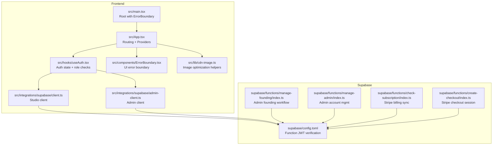
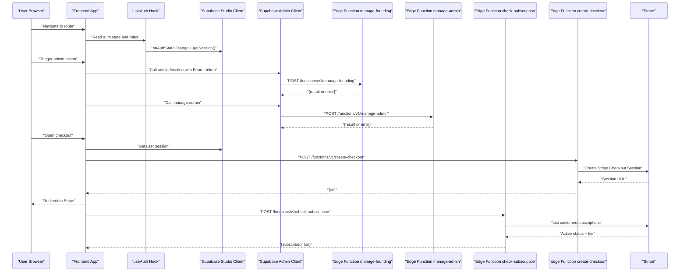
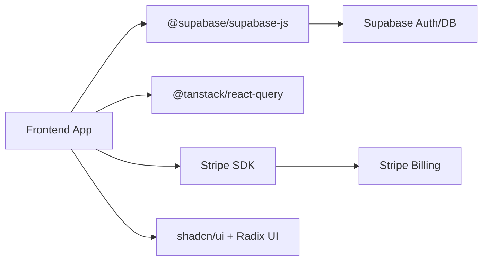

# Troubleshooting & FAQ

<cite>
**Referenced Files in This Document**
- [README.md](file://README.md)
- [package.json](file://package.json)
- [src/main.tsx](file://src/main.tsx)
- [src/App.tsx](file://src/App.tsx)
- [src/components/ErrorBoundary.tsx](file://src/components/ErrorBoundary.tsx)
- [src/hooks/useAuth.tsx](file://src/hooks/useAuth.tsx)
- [src/integrations/supabase/client.ts](file://src/integrations/supabase/client.ts)
- [src/integrations/supabase/admin-client.ts](file://src/integrations/supabase/admin-client.ts)
- [supabase/config.toml](file://supabase/config.toml)
- [supabase/functions/manage-founding/index.ts](file://supabase/functions/manage-founding/index.ts)
- [supabase/functions/manage-admin/index.ts](file://supabase/functions/manage-admin/index.ts)
- [supabase/functions/check-subscription/index.ts](file://supabase/functions/check-subscription/index.ts)
- [supabase/functions/create-checkout/index.ts](file://supabase/functions/create-checkout/index.ts)
- [DEPLOYMENT_COMMANDS.sh](file://DEPLOYMENT_COMMANDS.sh)
- [src/lib/cdn-image.ts](file://src/lib/cdn-image.ts)
</cite>

## Table of Contents
1. [Introduction](#introduction)
2. [Project Structure](#project-structure)
3. [Core Components](#core-components)
4. [Architecture Overview](#architecture-overview)
5. [Detailed Component Analysis](#detailed-component-analysis)
6. [Dependency Analysis](#dependency-analysis)
7. [Performance Considerations](#performance-considerations)
8. [Troubleshooting Guide](#troubleshooting-guide)
9. [Conclusion](#conclusion)
10. [Appendices](#appendices)

## Introduction
This document provides a comprehensive troubleshooting and FAQ guide for the Adorzia platform. It focuses on diagnosing common issues, debugging approaches, performance optimization tips, and frequently asked questions. It covers development environment issues, production problems, user-reported bugs, performance bottlenecks, memory leaks, and scaling challenges. It also outlines community resources, support channels, and escalation procedures.

## Project Structure
The Adorzia platform is a React application built with Vite and TypeScript. It integrates Supabase for authentication, real-time updates, and backend functions, and uses Stripe for subscription checkout. The frontend is organized by feature areas (pages, components, hooks, integrations, lib), while Supabase manages edge functions and database migrations.

**Diagram sources**
- [src/main.tsx](file://src/main.tsx#L1-L20)
- [src/App.tsx](file://src/App.tsx#L1-L350)
- [src/hooks/useAuth.tsx](file://src/hooks/useAuth.tsx#L1-L252)
- [src/integrations/supabase/client.ts](file://src/integrations/supabase/client.ts#L1-L17)
- [src/integrations/supabase/admin-client.ts](file://src/integrations/supabase/admin-client.ts#L1-L28)
- [src/components/ErrorBoundary.tsx](file://src/components/ErrorBoundary.tsx#L1-L71)
- [src/lib/cdn-image.ts](file://src/lib/cdn-image.ts#L94-L194)
- [supabase/config.toml](file://supabase/config.toml#L1-L71)
- [supabase/functions/manage-founding/index.ts](file://supabase/functions/manage-founding/index.ts#L1-L191)
- [supabase/functions/manage-admin/index.ts](file://supabase/functions/manage-admin/index.ts#L1-L148)
- [supabase/functions/check-subscription/index.ts](file://supabase/functions/check-subscription/index.ts#L1-L140)
- [supabase/functions/create-checkout/index.ts](file://supabase/functions/create-checkout/index.ts#L1-L85)

**Section sources**
- [README.md](file://README.md#L1-L74)
- [package.json](file://package.json#L1-L88)
- [src/main.tsx](file://src/main.tsx#L1-L20)
- [src/App.tsx](file://src/App.tsx#L1-L350)

## Core Components
- Root initialization and global error handling: The application initializes the React root and wraps the app with an ErrorBoundary. Global window error and unhandled promise rejection listeners are registered for early detection of runtime issues.
- Routing and providers: The routing layer sets up public, marketplace, studio, and admin routes with appropriate providers and protected routes. Providers include theme, authentication, subscription, and cart contexts.
- Authentication and role management: The Auth provider listens to Supabase auth state changes, synchronizes sessions across tabs, determines user roles, and exposes sign-in/sign-up/sign-out functions with audit logging.
- Supabase clients: Two separate Supabase clients are used—one for studio users with localStorage persistence and one for admin with isolated storage keys to prevent session collisions.
- Error boundary: A React Error Boundary captures rendering errors, logs them, and offers a retry mechanism.

**Section sources**
- [src/main.tsx](file://src/main.tsx#L1-L20)
- [src/App.tsx](file://src/App.tsx#L1-L350)
- [src/hooks/useAuth.tsx](file://src/hooks/useAuth.tsx#L1-L252)
- [src/integrations/supabase/client.ts](file://src/integrations/supabase/client.ts#L1-L17)
- [src/integrations/supabase/admin-client.ts](file://src/integrations/supabase/admin-client.ts#L1-L28)
- [src/components/ErrorBoundary.tsx](file://src/components/ErrorBoundary.tsx#L1-L71)

## Architecture Overview
The platform follows a frontend-first architecture with Supabase Edge Functions handling privileged operations and Stripe managing subscription lifecycles. Authentication is centralized via Supabase Auth, with role-based access controlled through Supabase Row-Level Security and function-level checks.

**Diagram sources**
- [src/App.tsx](file://src/App.tsx#L1-L350)
- [src/hooks/useAuth.tsx](file://src/hooks/useAuth.tsx#L1-L252)
- [src/integrations/supabase/client.ts](file://src/integrations/supabase/client.ts#L1-L17)
- [src/integrations/supabase/admin-client.ts](file://src/integrations/supabase/admin-client.ts#L1-L28)
- [supabase/functions/manage-founding/index.ts](file://supabase/functions/manage-founding/index.ts#L1-L191)
- [supabase/functions/manage-admin/index.ts](file://supabase/functions/manage-admin/index.ts#L1-L148)
- [supabase/functions/check-subscription/index.ts](file://supabase/functions/check-subscription/index.ts#L1-L140)
- [supabase/functions/create-checkout/index.ts](file://supabase/functions/create-checkout/index.ts#L1-L85)

## Detailed Component Analysis

### Authentication and Session Management
Common issues:
- Auth state not persisting across tabs or refreshing unexpectedly.
- Role checks failing or returning null.
- Sign-in/sign-up failures due to network or invalid credentials.

Debugging steps:
- Confirm Supabase URL and publishable key environment variables are present.
- Verify localStorage availability and that the admin client uses isolated storage.
- Inspect auth state change events and role queries in the Auth provider.
- Review console logs for role lookup errors and ensure the user_roles table exists.

Resolution strategies:
- Ensure only explicit sign-out clears tokens; avoid accidental token removal.
- Use the admin client for admin-only operations to prevent cross-session interference.
- Add fallbacks for role lookup and gracefully handle missing roles.

**Section sources**
- [src/hooks/useAuth.tsx](file://src/hooks/useAuth.tsx#L1-L252)
- [src/integrations/supabase/client.ts](file://src/integrations/supabase/client.ts#L1-L17)
- [src/integrations/supabase/admin-client.ts](file://src/integrations/supabase/admin-client.ts#L1-L28)

### Edge Functions: Admin Workflows
Common issues:
- Missing Authorization header or invalid/expired tokens.
- Missing SUPABASE_SERVICE_ROLE_KEY in function secrets.
- Admin-only actions executed by non-admin users.
- Missing required parameters for actions.

Debugging steps:
- Check function logs in the Supabase Dashboard for detailed error messages.
- Validate JWT verification settings in config.toml for the relevant functions.
- Confirm the requester’s role is retrieved using the admin client bypassing RLS.

Resolution strategies:
- Ensure Authorization header is passed with Bearer token.
- Set SUPABASE_SERVICE_ROLE_KEY in function secrets.
- Enforce role checks before processing sensitive actions.
- Validate payload parameters and return clear error messages.

**Section sources**
- [supabase/functions/manage-founding/index.ts](file://supabase/functions/manage-founding/index.ts#L1-L191)
- [supabase/functions/manage-admin/index.ts](file://supabase/functions/manage-admin/index.ts#L1-L148)
- [supabase/config.toml](file://supabase/config.toml#L1-L71)

### Subscription and Billing Integration
Common issues:
- Stripe secret key not configured.
- Authentication errors when calling subscription functions.
- Parsing errors for subscription end dates or product IDs.

Debugging steps:
- Verify STRIPE_SECRET_KEY is set in function secrets.
- Confirm Authorization header is present and valid.
- Inspect parsed subscription data and handle malformed timestamps safely.

Resolution strategies:
- Map product IDs to tiers and update user profiles accordingly.
- Gracefully fall back to basic tier when no active subscription is found.
- Log detailed steps in function logs for easier diagnosis.

**Section sources**
- [supabase/functions/check-subscription/index.ts](file://supabase/functions/check-subscription/index.ts#L1-L140)
- [supabase/functions/create-checkout/index.ts](file://supabase/functions/create-checkout/index.ts#L1-L85)

### Frontend Error Handling and Recovery
Common issues:
- Uncaught exceptions causing UI crashes.
- Global unhandled promise rejections.

Debugging steps:
- Use the ErrorBoundary to capture component-level errors and display a retry option.
- Leverage global window error and unhandledrejection listeners for early detection.

Resolution strategies:
- Encourage users to retry after resolving transient issues.
- Log error stacks and component stacks for deeper investigation.

**Section sources**
- [src/main.tsx](file://src/main.tsx#L1-L20)
- [src/components/ErrorBoundary.tsx](file://src/components/ErrorBoundary.tsx#L1-L71)

### Image Performance and Optimization
Common issues:
- Slow image loads impacting Largest Contentful Paint (LCP).
- Unsupported image formats leading to degraded visuals.

Debugging steps:
- Measure LCP and observe image loading behavior.
- Check browser support for modern formats (WebP/AVIF).

Resolution strategies:
- Use lazy loading with native loading=lazy or Intersection Observer fallback.
- Preload critical images for LCP.
- Choose optimal presets and formats based on browser support.

**Section sources**
- [src/lib/cdn-image.ts](file://src/lib/cdn-image.ts#L94-L194)

## Dependency Analysis
External dependencies and their roles:
- Supabase JS client for authentication, real-time, and database operations.
- TanStack React Query for caching and data synchronization.
- Stripe SDK for checkout and subscription management.
- UI libraries (Radix UI, shadcn/ui, Tailwind) for components and styling.

Potential coupling and risks:
- Tight coupling between frontend providers and Supabase clients.
- Reliance on environment variables for Supabase and Stripe secrets.
- Cross-tab auth synchronization depends on localStorage and storage events.

**Diagram sources**
- [package.json](file://package.json#L1-L88)

**Section sources**
- [package.json](file://package.json#L1-L88)

## Performance Considerations
- Image optimization: Use lazy loading, preload critical images, and detect browser support for modern formats to improve LCP and reduce bandwidth.
- Network requests: Minimize redundant queries and leverage caching via React Query.
- Auth state: Avoid unnecessary role checks and ensure efficient session synchronization.
- Bundle size: Keep dependencies minimal and consider code splitting for large routes.
- Edge functions: Ensure secrets are configured and avoid heavy synchronous work in functions.

[No sources needed since this section provides general guidance]

## Troubleshooting Guide

### Development Environment Issues
Symptoms:
- Dev server fails to start or hot reload does not work.
- Missing environment variables cause runtime errors.

Diagnosis:
- Confirm Node.js and npm versions and install dependencies.
- Verify VITE_SUPABASE_URL and VITE_SUPABASE_PUBLISHABLE_KEY are set.
- Check for lint errors and TypeScript compilation issues.

Resolution:
- Reinstall dependencies and restart the dev server.
- Add missing environment variables to the .env file.
- Fix lint and TypeScript errors before proceeding.

**Section sources**
- [README.md](file://README.md#L23-L37)
- [package.json](file://package.json#L1-L12)

### Authentication and Session Problems
Symptoms:
- Users cannot sign in or session does not persist.
- Role checks fail intermittently.

Diagnosis:
- Check Supabase client initialization and environment variables.
- Inspect auth state change logs and role lookup errors.
- Verify admin and studio clients use separate storage keys.

Resolution:
- Ensure service role key is configured for admin functions.
- Isolate admin sessions using the dedicated admin client.
- Handle role lookup failures gracefully and avoid blocking UI.

**Section sources**
- [src/integrations/supabase/client.ts](file://src/integrations/supabase/client.ts#L1-L17)
- [src/integrations/supabase/admin-client.ts](file://src/integrations/supabase/admin-client.ts#L1-L28)
- [src/hooks/useAuth.tsx](file://src/hooks/useAuth.tsx#L102-L133)

### Admin Function Failures
Symptoms:
- Admin actions return unauthorized or forbidden errors.
- Function logs show missing service role key or invalid parameters.

Diagnosis:
- Review function logs for Authorization header and service role key errors.
- Validate action payloads and required parameters.
- Confirm requester’s role via the admin client.

Resolution:
- Set SUPABASE_SERVICE_ROLE_KEY in function secrets.
- Pass a valid Bearer token in the Authorization header.
- Enforce strict parameter validation and return actionable error messages.

**Section sources**
- [supabase/functions/manage-founding/index.ts](file://supabase/functions/manage-founding/index.ts#L28-L62)
- [supabase/functions/manage-admin/index.ts](file://supabase/functions/manage-admin/index.ts#L26-L73)

### Subscription and Checkout Issues
Symptoms:
- Checkout sessions fail to create or redirect.
- Subscription status not updating.

Diagnosis:
- Verify STRIPE_SECRET_KEY is configured.
- Confirm Authorization header presence and validity.
- Inspect parsed subscription data and product ID mapping.

Resolution:
- Ensure Stripe customer exists or allow creation during checkout.
- Map product IDs to tiers and update user profiles.
- Log detailed steps in function logs for quick identification.

**Section sources**
- [supabase/functions/create-checkout/index.ts](file://supabase/functions/create-checkout/index.ts#L24-L49)
- [supabase/functions/check-subscription/index.ts](file://supabase/functions/check-subscription/index.ts#L28-L41)

### UI Crashes and Rendering Errors
Symptoms:
- Entire page becomes blank after an error.
- Specific components fail to render.

Diagnosis:
- Use the ErrorBoundary to capture and display errors.
- Check global error and unhandled rejection listeners.

Resolution:
- Encourage users to retry after fixing underlying issues.
- Investigate error stacks and component stacks for root causes.

**Section sources**
- [src/main.tsx](file://src/main.tsx#L6-L13)
- [src/components/ErrorBoundary.tsx](file://src/components/ErrorBoundary.tsx#L22-L30)

### Performance Bottlenecks and Scaling Challenges
Symptoms:
- Slow image loads, long page loads, or high memory usage.

Diagnosis:
- Measure LCP and observe image loading behavior.
- Audit network requests and cache usage.
- Monitor bundle size and dependency bloat.

Resolution:
- Optimize images with lazy loading, preloading, and modern formats.
- Reduce redundant queries and leverage caching.
- Split large routes and defer non-critical code.

**Section sources**
- [src/lib/cdn-image.ts](file://src/lib/cdn-image.ts#L126-L165)

### Deployment and Production Problems
Symptoms:
- Edge functions not deployed or migrations failing.

Diagnosis:
- Review deployment script steps and confirm project reference.
- Check function logs and storage policies in the Supabase Dashboard.

Resolution:
- Run the deployment script in order and verify each step.
- Manually test functions after deployment and inspect logs.

**Section sources**
- [DEPLOYMENT_COMMANDS.sh](file://DEPLOYMENT_COMMANDS.sh#L1-L37)

### Community Resources, Support Channels, and Escalation
- Community: Engage with the platform’s community through the official channels.
- Support: Use the support page for user-reported issues.
- Escalation: For critical production incidents, contact the platform’s support team with logs and reproduction steps.

**Section sources**
- [src/App.tsx](file://src/App.tsx#L25-L25)

## Conclusion
This guide consolidates practical troubleshooting steps, debugging techniques, and optimization strategies for the Adorzia platform. By leveraging the ErrorBoundary, global error listeners, Supabase auth state management, and function logs, most issues can be diagnosed and resolved efficiently. Adopt the recommended performance practices to maintain responsiveness and scalability.

[No sources needed since this section summarizes without analyzing specific files]

## Appendices

### Quick Reference: Common Error Scenarios and Fixes
- Missing Supabase keys: Ensure VITE_SUPABASE_URL and VITE_SUPABASE_PUBLISHABLE_KEY are set.
- Missing Stripe key: Set STRIPE_SECRET_KEY in function secrets.
- Admin function unauthorized: Confirm Authorization header and SUPABASE_SERVICE_ROLE_KEY.
- Role lookup failures: Validate user_roles table and handle null gracefully.
- Image performance: Use lazy loading, preload critical assets, and detect format support.

[No sources needed since this section provides general guidance]