# Core Components

<cite>
**Referenced Files in This Document**
- [button.tsx](file://src/components/ui/button.tsx)
- [input.tsx](file://src/components/ui/input.tsx)
- [card.tsx](file://src/components/ui/card.tsx)
- [badge.tsx](file://src/components/ui/badge.tsx)
- [avatar.tsx](file://src/components/ui/avatar.tsx)
- [dialog.tsx](file://src/components/ui/dialog.tsx)
- [table.tsx](file://src/components/ui/table.tsx)
- [tabs.tsx](file://src/components/ui/tabs.tsx)
- [form.tsx](file://src/components/ui/form.tsx)
- [label.tsx](file://src/components/ui/label.tsx)
- [textarea.tsx](file://src/components/ui/textarea.tsx)
- [select.tsx](file://src/components/ui/select.tsx)
- [switch.tsx](file://src/components/ui/switch.tsx)
- [checkbox.tsx](file://src/components/ui/checkbox.tsx)
- [utils.ts](file://src/lib/utils.ts)
</cite>

## Table of Contents
1. [Introduction](#introduction)
2. [Project Structure](#project-structure)
3. [Core Components](#core-components)
4. [Architecture Overview](#architecture-overview)
5. [Detailed Component Analysis](#detailed-component-analysis)
6. [Dependency Analysis](#dependency-analysis)
7. [Performance Considerations](#performance-considerations)
8. [Troubleshooting Guide](#troubleshooting-guide)
9. [Conclusion](#conclusion)
10. [Appendices](#appendices)

## Introduction
This document describes the core UI components used throughout the application, focusing on Button, Input, Card, Badge, and Avatar. It explains component props, variants, sizes, states, styling options, composition patterns, accessibility features, keyboard navigation, usage examples, best practices, customization, theming, and responsive behavior. Additional related components (Dialog, Table, Tabs, Form, Label, Textarea, Select, Switch, Checkbox) are included to provide a complete picture of the component ecosystem and how these pieces work together.

## Project Structure
The UI components are organized under a single directory and built with:
- Radix UI primitives for accessible base behavior
- Class Variance Authority (CVA) for variant and size systems
- Tailwind CSS with a shared utility function for merging classes

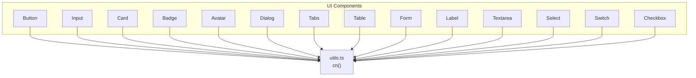

**Diagram sources**
- [button.tsx](file://src/components/ui/button.tsx#L1-L53)
- [input.tsx](file://src/components/ui/input.tsx#L1-L38)
- [card.tsx](file://src/components/ui/card.tsx#L1-L62)
- [badge.tsx](file://src/components/ui/badge.tsx#L1-L77)
- [avatar.tsx](file://src/components/ui/avatar.tsx#L1-L39)
- [dialog.tsx](file://src/components/ui/dialog.tsx#L1-L103)
- [table.tsx](file://src/components/ui/table.tsx#L1-L73)
- [tabs.tsx](file://src/components/ui/tabs.tsx#L1-L54)
- [form.tsx](file://src/components/ui/form.tsx#L1-L130)
- [label.tsx](file://src/components/ui/label.tsx#L1-L18)
- [textarea.tsx](file://src/components/ui/textarea.tsx#L1-L22)
- [select.tsx](file://src/components/ui/select.tsx#L1-L144)
- [switch.tsx](file://src/components/ui/switch.tsx#L1-L28)
- [checkbox.tsx](file://src/components/ui/checkbox.tsx#L1-L27)
- [utils.ts](file://src/lib/utils.ts#L1-L7)

**Section sources**
- [button.tsx](file://src/components/ui/button.tsx#L1-L53)
- [input.tsx](file://src/components/ui/input.tsx#L1-L38)
- [card.tsx](file://src/components/ui/card.tsx#L1-L62)
- [badge.tsx](file://src/components/ui/badge.tsx#L1-L77)
- [avatar.tsx](file://src/components/ui/avatar.tsx#L1-L39)
- [utils.ts](file://src/lib/utils.ts#L1-L7)

## Core Components
This section summarizes the primary building blocks and their capabilities.

- Button
  - Props: variant, size, asChild, plus native button attributes
  - Variants: default, destructive, outline, secondary, ghost, link, accent, success
  - Sizes: default, sm, lg, xl, icon, icon-sm, icon-lg
  - States: hover, active, focus-visible, disabled
  - Composition: supports rendering as a child element via asChild
  - Accessibility: inherits focus-visible ring and keyboard operability from base styles
  - Responsive: consistent sizing scales across breakpoints

- Input
  - Props: error, success, plus native input attributes
  - States: focus-visible ring, disabled, hover effects
  - Validation indicators: error and success modes apply theme-aware borders and rings
  - Responsive: font sizing increases on larger screens

- Card
  - Props: variant (default, elevated, ghost), hover, plus HTML div attributes
  - Variants: default (border + subtle shadow), elevated (stronger shadow), ghost (transparent)
  - Hover: optional elevation and subtle lift effect
  - Composition: CardHeader, CardTitle, CardDescription, CardContent, CardFooter helpers

- Badge
  - Props: variant, size, plus HTML div attributes
  - Variants: default, secondary, destructive, outline, success, warning, accent, muted, difficulty (free–insane), rank tiers (bronze–diamond), access (paid, locked), statuses (pending, active, completed, in-progress, submitted, under-review, approved, rejected), level badges (level-1–level-4), urgency (urgent, deadline-near, deadline-passed), season
  - Sizes: default, sm, lg
  - Composition: intended as a standalone indicator with focus ring support

- Avatar
  - Props: Root, Image, Fallback accept standard element props
  - Composition: Root wraps the avatar container, Image renders the avatar image, Fallback renders when the image is not available
  - Accessibility: relies on semantic primitives for screen reader compatibility

**Section sources**
- [button.tsx](file://src/components/ui/button.tsx#L38-L50)
- [input.tsx](file://src/components/ui/input.tsx#L5-L9)
- [card.tsx](file://src/components/ui/card.tsx#L5-L25)
- [badge.tsx](file://src/components/ui/badge.tsx#L6-L66)
- [avatar.tsx](file://src/components/ui/avatar.tsx#L6-L38)

## Architecture Overview
The component architecture follows a consistent pattern:
- Base primitives from Radix UI for accessible semantics
- CVA-based variant and size systems for consistent styling
- Shared cn() utility for safe class merging
- Composition helpers for complex containers (Card, Dialog, Tabs, Table, Form)

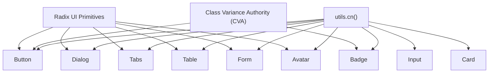

**Diagram sources**
- [button.tsx](file://src/components/ui/button.tsx#L7-L36)
- [badge.tsx](file://src/components/ui/badge.tsx#L6-L66)
- [utils.ts](file://src/lib/utils.ts#L4-L6)
- [dialog.tsx](file://src/components/ui/dialog.tsx#L1-L103)
- [tabs.tsx](file://src/components/ui/tabs.tsx#L1-L54)
- [table.tsx](file://src/components/ui/table.tsx#L1-L73)
- [form.tsx](file://src/components/ui/form.tsx#L1-L130)
- [avatar.tsx](file://src/components/ui/avatar.tsx#L1-L39)

## Detailed Component Analysis

### Button
- Purpose: Primary action element with consistent spacing, transitions, and focus behavior
- Props
  - variant: selects background, foreground, and shadow palette
  - size: controls height, padding, and typography
  - asChild: renders the underlying primitive element (e.g., Link) instead of a button
  - Native button attributes: disabled, type, onClick, etc.
- States and Interactions
  - Focus-visible ring with theme-aware color
  - Hover and active transforms (scale, shadow)
  - Disabled state reduces pointer events and opacity
- Accessibility
  - Inherits focus-visible ring and keyboard operability
  - Supports rendering as a child element for semantic wrappers
- Composition Patterns
  - Icon buttons via icon/icon-sm/icon-lg sizes
  - Link-like buttons via variant "link"
- Best Practices
  - Prefer explicit variants for destructive actions
  - Use icon variants for compact actions
  - Combine with Tooltip for contextual help

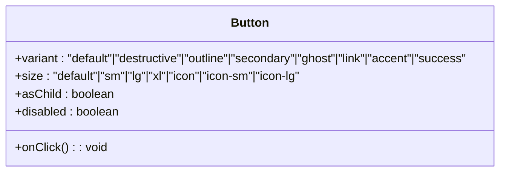

**Diagram sources**
- [button.tsx](file://src/components/ui/button.tsx#L38-L50)

**Section sources**
- [button.tsx](file://src/components/ui/button.tsx#L7-L36)
- [button.tsx](file://src/components/ui/button.tsx#L38-L50)

### Input
- Purpose: Text input with validation states and focus behavior
- Props
  - error: applies destructive border/ring
  - success: applies success border/ring
  - Native input attributes: type, value, onChange, placeholder, etc.
- States and Interactions
  - Focus-visible ring with theme-aware color
  - Hover border enhancement
  - Disabled state applies reduced opacity and non-editable cursor
- Accessibility
  - Focus-visible ring ensures keyboard operability
- Best Practices
  - Pair with FormLabel and FormMessage for accessible forms
  - Use success/error to reflect validation feedback

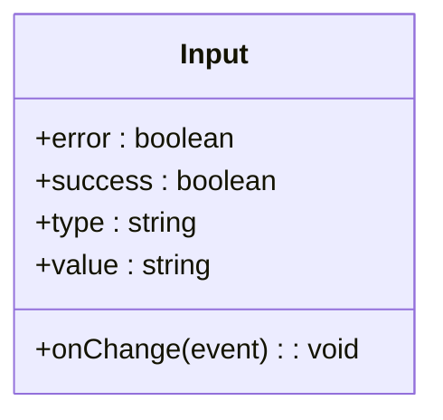

**Diagram sources**
- [input.tsx](file://src/components/ui/input.tsx#L5-L9)

**Section sources**
- [input.tsx](file://src/components/ui/input.tsx#L11-L34)

### Card
- Purpose: Container with optional elevation and hover effects
- Props
  - variant: default, elevated, ghost
  - hover: enables shadow and lift on hover
  - Native div attributes: className, children, etc.
- Composition Helpers
  - CardHeader, CardTitle, CardDescription, CardContent, CardFooter
- Accessibility
  - No special ARIA roles; rely on semantic structure
- Best Practices
  - Use elevated for modal-like containers
  - Use ghost for subtle backgrounds

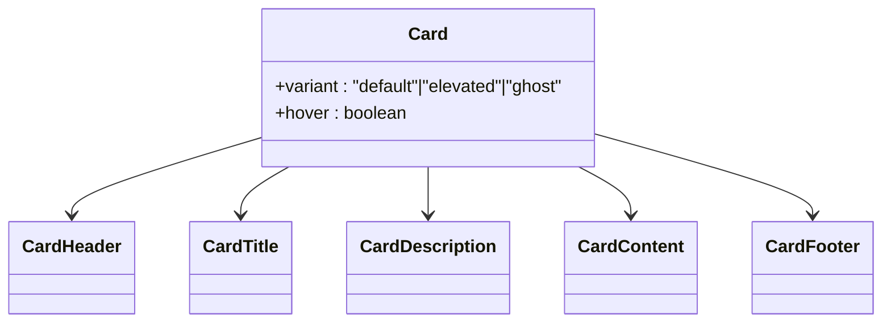

**Diagram sources**
- [card.tsx](file://src/components/ui/card.tsx#L10-L25)
- [card.tsx](file://src/components/ui/card.tsx#L28-L59)

**Section sources**
- [card.tsx](file://src/components/ui/card.tsx#L5-L25)
- [card.tsx](file://src/components/ui/card.tsx#L28-L59)

### Badge
- Purpose: Lightweight indicator for status, difficulty, tier, urgency, and more
- Props
  - variant: extensive palette including defaults, secondary, destructive, outline, success, warning, accent, muted, difficulty levels, rank tiers, access levels, statuses, level badges, urgency, and season
  - size: default, sm, lg
  - Native div attributes
- Accessibility
  - Focus ring support via base styles
- Best Practices
  - Choose variants aligned with system semantics (e.g., success for completion)
  - Keep text concise and meaningful

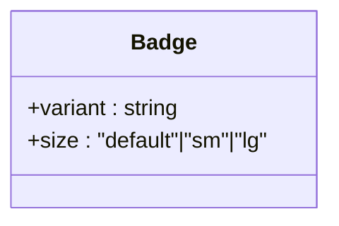

**Diagram sources**
- [badge.tsx](file://src/components/ui/badge.tsx#L68-L70)

**Section sources**
- [badge.tsx](file://src/components/ui/badge.tsx#L6-L66)
- [badge.tsx](file://src/components/ui/badge.tsx#L68-L74)

### Avatar
- Purpose: User or entity representation with fallback handling
- Props
  - Root: container props
  - Image: image props
  - Fallback: fallback content props
- Accessibility
  - Uses Radix UI primitives for compatible semantics
- Best Practices
  - Provide alt text on Image when appropriate
  - Ensure fallback conveys identity or placeholder meaning

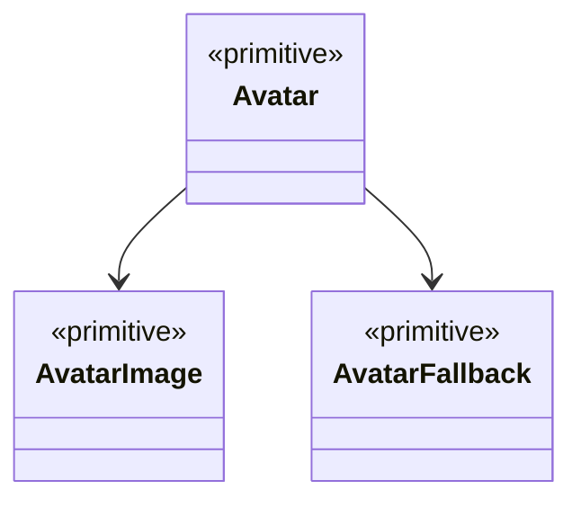

**Diagram sources**
- [avatar.tsx](file://src/components/ui/avatar.tsx#L6-L38)

**Section sources**
- [avatar.tsx](file://src/components/ui/avatar.tsx#L6-L38)

### Related Components

#### Dialog
- Purpose: Overlay-based modal with portal rendering and focus trapping
- Key parts: Dialog, DialogTrigger, DialogPortal, DialogOverlay, DialogContent, DialogHeader, DialogFooter, DialogTitle, DialogDescription, DialogClose
- Accessibility: Focus management, Escape key handling, backdrop click dismissal
- Best Practices: Include DialogClose affordance; pair with Card for content structure

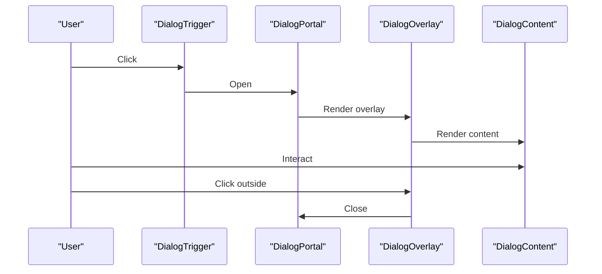

**Diagram sources**
- [dialog.tsx](file://src/components/ui/dialog.tsx#L7-L58)

**Section sources**
- [dialog.tsx](file://src/components/ui/dialog.tsx#L1-L103)

#### Table
- Purpose: Scrollable table container with accessible row/column semantics
- Key parts: Table, TableHeader, TableBody, TableFooter, TableRow, TableHead, TableCell, TableCaption
- Accessibility: Semantic table structure; hover and selection states
- Best Practices: Use TableCaption for summary; pair with Dialog or Card for overlays

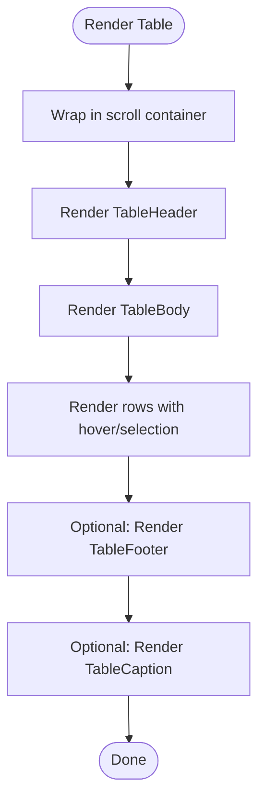

**Diagram sources**
- [table.tsx](file://src/components/ui/table.tsx#L5-L71)

**Section sources**
- [table.tsx](file://src/components/ui/table.tsx#L1-L73)

#### Tabs
- Purpose: Organize content into selectable sections
- Key parts: Tabs, TabsList, TabsTrigger, TabsContent
- Accessibility: Keyboard navigation, active state indication
- Best Practices: Use descriptive labels; keep trigger text concise

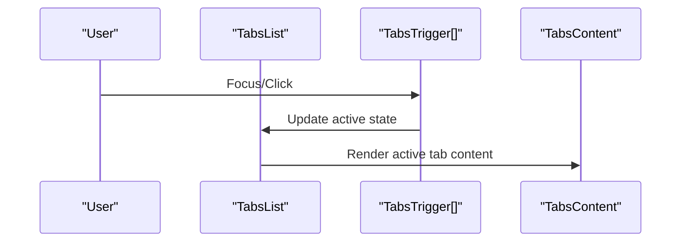

**Diagram sources**
- [tabs.tsx](file://src/components/ui/tabs.tsx#L8-L51)

**Section sources**
- [tabs.tsx](file://src/components/ui/tabs.tsx#L1-L54)

#### Form
- Purpose: Integration with react-hook-form for accessible form controls
- Key parts: Form, FormField, FormItem, FormLabel, FormControl, FormDescription, FormMessage; useFormField hook
- Accessibility: Automatic aria-describedby and aria-invalid wiring; labeledby IDs
- Best Practices: Wrap fields in FormItem; pair labels with controls; display messages via FormMessage

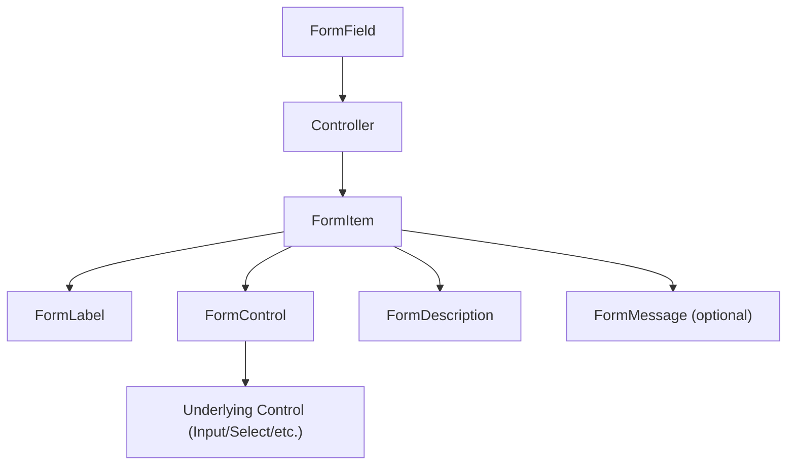

**Diagram sources**
- [form.tsx](file://src/components/ui/form.tsx#L20-L127)

**Section sources**
- [form.tsx](file://src/components/ui/form.tsx#L1-L130)

#### Label, Textarea, Select, Switch, Checkbox
- Label: Small, focused label component with CVA variants
- Textarea: Multi-line text input with focus-visible ring
- Select: Dropdown with scroll buttons, viewport, and item indicators
- Switch: Toggle with checked/unchecked states and focus ring
- Checkbox: Two-state selection with indicator and focus ring
- Accessibility: All components leverage Radix UI primitives and focus-visible rings

**Section sources**
- [label.tsx](file://src/components/ui/label.tsx#L1-L18)
- [textarea.tsx](file://src/components/ui/textarea.tsx#L1-L22)
- [select.tsx](file://src/components/ui/select.tsx#L1-L144)
- [switch.tsx](file://src/components/ui/switch.tsx#L1-L28)
- [checkbox.tsx](file://src/components/ui/checkbox.tsx#L1-L27)

## Dependency Analysis
- Shared utilities
  - cn() merges Tailwind classes safely, ensuring overrides work predictably
- Variant systems
  - CVA powers Button and Badge variants; consistent across components
- Primitive dependencies
  - Radix UI primitives underpin Dialog, Tabs, Select, Switch, Checkbox, Avatar, and Label
- Composition
  - Card composes multiple sub-components; Form composes multiple field helpers

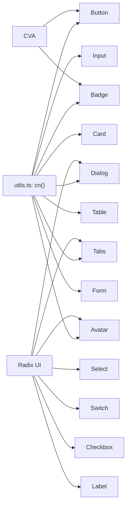

**Diagram sources**
- [utils.ts](file://src/lib/utils.ts#L4-L6)
- [button.tsx](file://src/components/ui/button.tsx#L7-L36)
- [badge.tsx](file://src/components/ui/badge.tsx#L6-L66)
- [dialog.tsx](file://src/components/ui/dialog.tsx#L1-L103)
- [tabs.tsx](file://src/components/ui/tabs.tsx#L1-L54)
- [select.tsx](file://src/components/ui/select.tsx#L1-L144)
- [switch.tsx](file://src/components/ui/switch.tsx#L1-L28)
- [checkbox.tsx](file://src/components/ui/checkbox.tsx#L1-L27)
- [avatar.tsx](file://src/components/ui/avatar.tsx#L1-L39)
- [label.tsx](file://src/components/ui/label.tsx#L1-L18)

**Section sources**
- [utils.ts](file://src/lib/utils.ts#L1-L7)
- [button.tsx](file://src/components/ui/button.tsx#L1-L53)
- [badge.tsx](file://src/components/ui/badge.tsx#L1-L77)
- [dialog.tsx](file://src/components/ui/dialog.tsx#L1-L103)
- [tabs.tsx](file://src/components/ui/tabs.tsx#L1-L54)
- [select.tsx](file://src/components/ui/select.tsx#L1-L144)
- [switch.tsx](file://src/components/ui/switch.tsx#L1-L28)
- [checkbox.tsx](file://src/components/ui/checkbox.tsx#L1-L27)
- [avatar.tsx](file://src/components/ui/avatar.tsx#L1-L39)
- [label.tsx](file://src/components/ui/label.tsx#L1-L18)

## Performance Considerations
- Prefer variant and size props over ad-hoc class overrides to maintain atomic styles and reduce bundle size
- Use asChild sparingly to avoid unnecessary DOM nodes
- Keep Badge text short to minimize reflows
- Avoid excessive nesting in Card and Dialog to limit paint costs
- Reuse shared cn() to prevent redundant class concatenations

## Troubleshooting Guide
- Button does not respond to keyboard
  - Ensure focus-visible ring is visible and component is not disabled
  - Verify event handlers are attached
- Input validation visuals not appearing
  - Confirm error or success props are passed and theme tokens are defined
- Badge variant looks incorrect
  - Check variant string matches supported values
  - Ensure theme tokens for that variant are present
- Avatar fallback not visible
  - Confirm image src is missing or failing; fallback appears when image fails to load
- Dialog not closing on outside click
  - Ensure DialogOverlay and DialogClose are present and configured correctly
- Tabs not switching content
  - Verify TabsTrigger and TabsContent keys match active state
- Form fields not accessible
  - Ensure FormItem wraps fields and FormLabel is associated with the control

**Section sources**
- [button.tsx](file://src/components/ui/button.tsx#L44-L50)
- [input.tsx](file://src/components/ui/input.tsx#L11-L34)
- [badge.tsx](file://src/components/ui/badge.tsx#L68-L74)
- [avatar.tsx](file://src/components/ui/avatar.tsx#L18-L35)
- [dialog.tsx](file://src/components/ui/dialog.tsx#L15-L58)
- [tabs.tsx](file://src/components/ui/tabs.tsx#L23-L51)
- [form.tsx](file://src/components/ui/form.tsx#L62-L99)

## Conclusion
These core components provide a cohesive, accessible, and theme-friendly foundation. They emphasize consistent variants and sizes, strong focus management, and composability. By following the documented patterns and best practices, teams can build predictable UIs that scale across the application.

## Appendices

### Props and Options Reference

- Button
  - Props: variant, size, asChild, plus button attributes
  - Variants: default, destructive, outline, secondary, ghost, link, accent, success
  - Sizes: default, sm, lg, xl, icon, icon-sm, icon-lg

- Input
  - Props: error, success, plus input attributes

- Card
  - Props: variant, hover, plus div attributes
  - Variants: default, elevated, ghost

- Badge
  - Props: variant, size, plus div attributes
  - Variants include defaults, secondary, destructive, outline, success, warning, accent, muted, difficulty levels, rank tiers, access levels, statuses, level badges, urgency, season
  - Sizes: default, sm, lg

- Avatar
  - Props: Root, Image, Fallback

- Dialog
  - Parts: Dialog, DialogTrigger, DialogPortal, DialogOverlay, DialogContent, DialogHeader, DialogFooter, DialogTitle, DialogDescription, DialogClose

- Table
  - Parts: Table, TableHeader, TableBody, TableFooter, TableRow, TableHead, TableCell, TableCaption

- Tabs
  - Parts: Tabs, TabsList, TabsTrigger, TabsContent

- Form
  - Parts: Form, FormField, FormItem, FormLabel, FormControl, FormDescription, FormMessage; hook: useFormField

- Label, Textarea, Select, Switch, Checkbox
  - Standard element props plus component-specific enhancements

**Section sources**
- [button.tsx](file://src/components/ui/button.tsx#L38-L50)
- [input.tsx](file://src/components/ui/input.tsx#L5-L9)
- [card.tsx](file://src/components/ui/card.tsx#L5-L25)
- [badge.tsx](file://src/components/ui/badge.tsx#L6-L66)
- [avatar.tsx](file://src/components/ui/avatar.tsx#L6-L38)
- [dialog.tsx](file://src/components/ui/dialog.tsx#L71-L102)
- [table.tsx](file://src/components/ui/table.tsx#L5-L71)
- [tabs.tsx](file://src/components/ui/tabs.tsx#L6-L51)
- [form.tsx](file://src/components/ui/form.tsx#L9-L129)
- [label.tsx](file://src/components/ui/label.tsx#L7-L14)
- [textarea.tsx](file://src/components/ui/textarea.tsx#L5-L18)
- [select.tsx](file://src/components/ui/select.tsx#L13-L143)
- [switch.tsx](file://src/components/ui/switch.tsx#L6-L24)
- [checkbox.tsx](file://src/components/ui/checkbox.tsx#L7-L23)