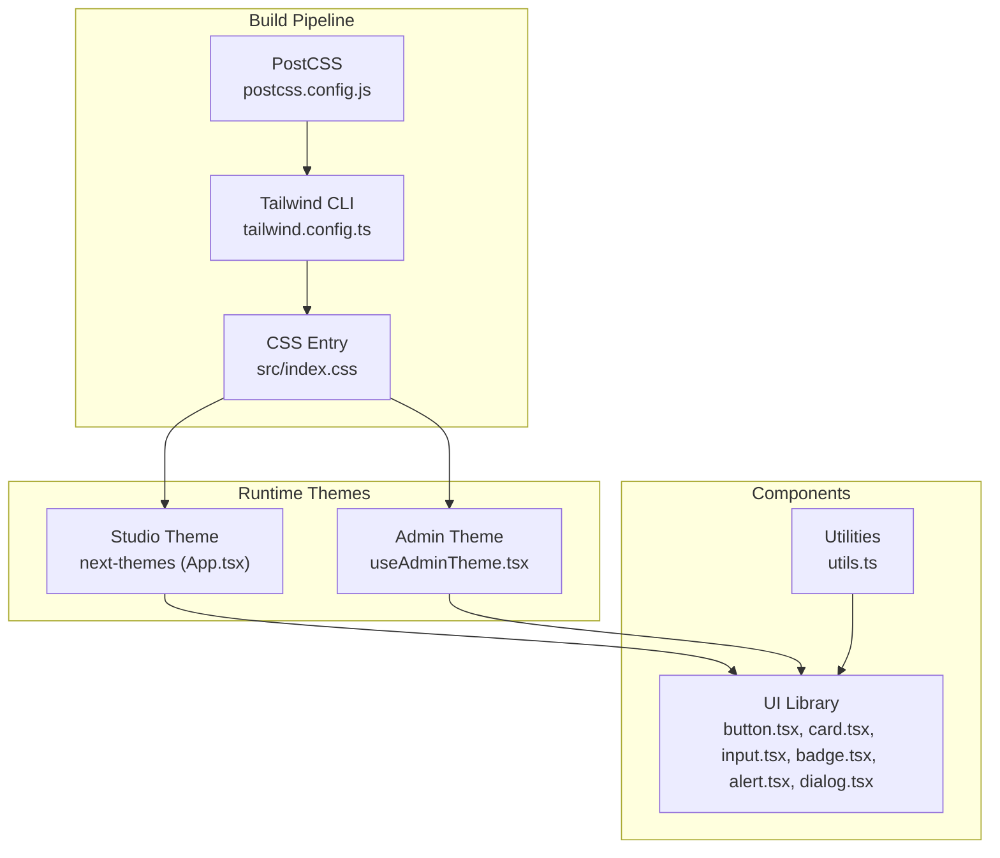
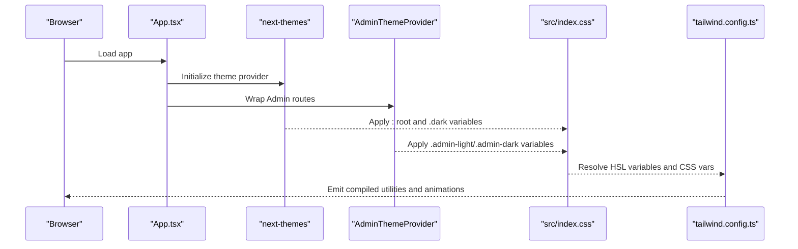
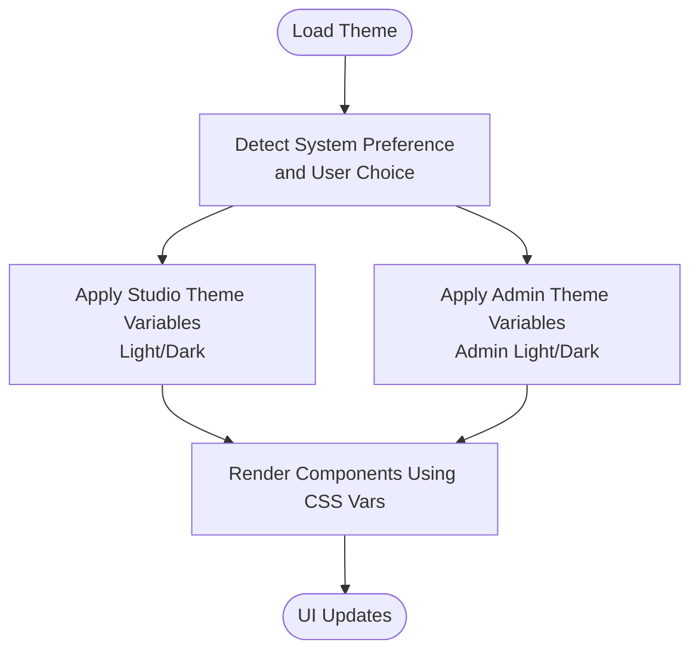
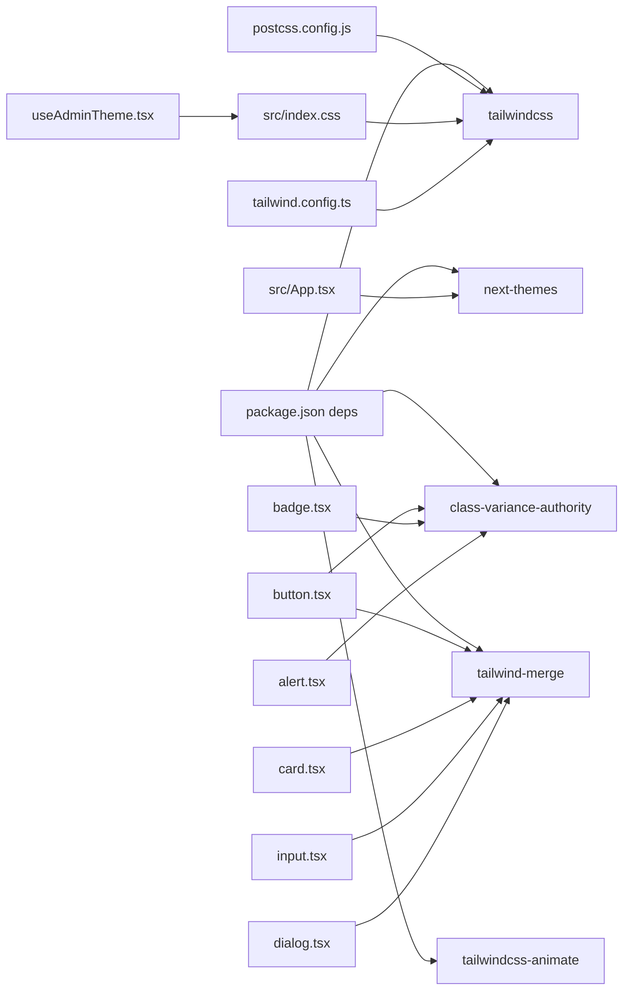

# Design System Foundation

<cite>
**Referenced Files in This Document**
- [tailwind.config.ts](file://tailwind.config.ts)
- [components.json](file://components.json)
- [src/index.css](file://src/index.css)
- [postcss.config.js](file://postcss.config.js)
- [package.json](file://package.json)
- [src/lib/utils.ts](file://src/lib/utils.ts)
- [src/hooks/useAdminTheme.tsx](file://src/hooks/useAdminTheme.tsx)
- [src/hooks/use-mobile.tsx](file://src/hooks/use-mobile.tsx)
- [src/components/ui/button.tsx](file://src/components/ui/button.tsx)
- [src/components/ui/card.tsx](file://src/components/ui/card.tsx)
- [src/components/ui/input.tsx](file://src/components/ui/input.tsx)
- [src/components/ui/badge.tsx](file://src/components/ui/badge.tsx)
- [src/components/ui/alert.tsx](file://src/components/ui/alert.tsx)
- [src/components/ui/dialog.tsx](file://src/components/ui/dialog.tsx)
- [src/App.tsx](file://src/App.tsx)
</cite>

## Table of Contents
1. [Introduction](#introduction)
2. [Project Structure](#project-structure)
3. [Core Components](#core-components)
4. [Architecture Overview](#architecture-overview)
5. [Detailed Component Analysis](#detailed-component-analysis)
6. [Dependency Analysis](#dependency-analysis)
7. [Performance Considerations](#performance-considerations)
8. [Troubleshooting Guide](#troubleshooting-guide)
9. [Conclusion](#conclusion)
10. [Appendices](#appendices)

## Introduction
This document describes the design system foundation of the project, focusing on how shadcn/ui integrates with Tailwind CSS, how design tokens and themes are structured, and how utility functions and component variants maintain consistency across Studio and Admin experiences. It also documents color systems, typography scales, spacing units, component variants, theme customization, dark mode, responsive breakpoints, and guidelines for extending the design system while preserving design integrity.

## Project Structure
The design system is built around:
- Tailwind CSS configuration and PostCSS pipeline
- CSS custom properties for design tokens and theme switching
- shadcn/ui-styled components using class variance authority and Tailwind utilities
- Utility functions for composing class names
- Theme providers for Studio (next-themes) and Admin (custom provider)

**Diagram sources**
- [postcss.config.js](file://postcss.config.js#L1-L7)
- [tailwind.config.ts](file://tailwind.config.ts#L1-L476)
- [src/index.css](file://src/index.css#L1-L1018)
- [src/App.tsx](file://src/App.tsx#L112-L347)
- [src/hooks/useAdminTheme.tsx](file://src/hooks/useAdminTheme.tsx#L1-L57)
- [src/lib/utils.ts](file://src/lib/utils.ts#L1-L7)
- [src/components/ui/button.tsx](file://src/components/ui/button.tsx#L1-L53)
- [src/components/ui/card.tsx](file://src/components/ui/card.tsx#L1-L62)
- [src/components/ui/input.tsx](file://src/components/ui/input.tsx#L1-L38)
- [src/components/ui/badge.tsx](file://src/components/ui/badge.tsx#L1-L77)
- [src/components/ui/alert.tsx](file://src/components/ui/alert.tsx#L1-L44)
- [src/components/ui/dialog.tsx](file://src/components/ui/dialog.tsx#L1-L103)

**Section sources**
- [postcss.config.js](file://postcss.config.js#L1-L7)
- [tailwind.config.ts](file://tailwind.config.ts#L1-L476)
- [src/index.css](file://src/index.css#L1-L1018)
- [src/App.tsx](file://src/App.tsx#L112-L347)
- [src/hooks/useAdminTheme.tsx](file://src/hooks/useAdminTheme.tsx#L1-L57)

## Core Components
- Tailwind configuration defines design tokens, color palettes, typography, shadows, animations, and radius variables.
- CSS custom properties define light/dark and admin-specific themes with fallbacks for Studio and Admin contexts.
- shadcn/ui components use class variance authority (CVA) to define variants and sizes consistently.
- Utilities compose Tailwind classes safely using a merge function.

Key implementation references:
- Tailwind theme extension and tokens: [tailwind.config.ts](file://tailwind.config.ts#L7-L472)
- CSS variables for Studio and Admin themes: [src/index.css](file://src/index.css#L8-L340)
- Component variants and sizes: [src/components/ui/button.tsx](file://src/components/ui/button.tsx#L7-L36), [src/components/ui/card.tsx](file://src/components/ui/card.tsx#L10-L25), [src/components/ui/badge.tsx](file://src/components/ui/badge.tsx#L6-L66)
- Utility class composition: [src/lib/utils.ts](file://src/lib/utils.ts#L4-L6)

**Section sources**
- [tailwind.config.ts](file://tailwind.config.ts#L7-L472)
- [src/index.css](file://src/index.css#L8-L340)
- [src/components/ui/button.tsx](file://src/components/ui/button.tsx#L7-L36)
- [src/components/ui/card.tsx](file://src/components/ui/card.tsx#L10-L25)
- [src/components/ui/badge.tsx](file://src/components/ui/badge.tsx#L6-L66)
- [src/lib/utils.ts](file://src/lib/utils.ts#L4-L6)

## Architecture Overview
The design system architecture separates concerns between:
- Build-time styling via Tailwind and PostCSS
- Runtime theme switching via next-themes and a custom Admin theme provider
- Component-level styling via shadcn/ui with CVA and consistent utilities

**Diagram sources**
- [src/App.tsx](file://src/App.tsx#L112-L347)
- [src/hooks/useAdminTheme.tsx](file://src/hooks/useAdminTheme.tsx#L15-L42)
- [src/index.css](file://src/index.css#L8-L340)
- [tailwind.config.ts](file://tailwind.config.ts#L1-L476)

## Detailed Component Analysis

### Design Tokens and Theme System
- CSS custom properties define HSL-based tokens for foreground/background, borders, inputs, rings, cards, popovers, accents, and sidebar states.
- Two theme modes are supported:
  - Studio theme: light and dark via next-themes
  - Admin theme: isolated light and dark via custom provider with dedicated variables
- Brand grayscale palette and rank colors are defined as HSL variables for consistent scaling.

**Diagram sources**
- [src/App.tsx](file://src/App.tsx#L112-L113)
- [src/hooks/useAdminTheme.tsx](file://src/hooks/useAdminTheme.tsx#L15-L42)
- [src/index.css](file://src/index.css#L8-L340)

**Section sources**
- [src/index.css](file://src/index.css#L8-L340)
- [src/hooks/useAdminTheme.tsx](file://src/hooks/useAdminTheme.tsx#L1-L57)
- [src/App.tsx](file://src/App.tsx#L112-L113)

### Color System
- Semantic colors: background, foreground, primary, secondary, muted, accent, destructive, success, warning, border, input, ring.
- Sidebar and Admin-specific palettes with dedicated tokens for backgrounds, foregrounds, borders, and accents.
- Rank color tokens for tiered visual semantics.
- Brand grayscale palette with 100–900 steps for consistent tonal hierarchy.

Implementation references:
- Semantic and brand colors: [tailwind.config.ts](file://tailwind.config.ts#L59-L252)
- Rank colors: [tailwind.config.ts](file://tailwind.config.ts#L236-L252)
- Admin brand palette: [tailwind.config.ts](file://tailwind.config.ts#L112-L137)
- CSS variable definitions: [src/index.css](file://src/index.css#L22-L165), [src/index.css](file://src/index.css#L167-L263), [src/index.css](file://src/index.css#L265-L339)

**Section sources**
- [tailwind.config.ts](file://tailwind.config.ts#L59-L252)
- [src/index.css](file://src/index.css#L22-L165)
- [src/index.css](file://src/index.css#L167-L263)
- [src/index.css](file://src/index.css#L265-L339)

### Typography Scale
- Font families: display, body, sans, serif, mono.
- Base font family applied globally; display used for headings.
- Layered typography utilities for display sizes and labels/captions.

Implementation references:
- Font families: [tailwind.config.ts](file://tailwind.config.ts#L16-L58)
- Global fonts and headings: [src/index.css](file://src/index.css#L347-L356)
- Typography utilities: [src/index.css](file://src/index.css#L358-L404)

**Section sources**
- [tailwind.config.ts](file://tailwind.config.ts#L16-L58)
- [src/index.css](file://src/index.css#L347-L356)
- [src/index.css](file://src/index.css#L358-L404)

### Spacing Units and Radius
- Spacing unit derived from a base rem value.
- Border radius tokens mapped to CSS variables for consistent corner radii across components.

Implementation references:
- Spacing and radius tokens: [src/index.css](file://src/index.css#L164-L165)
- Radius mapping in theme: [tailwind.config.ts](file://tailwind.config.ts#L254-L258)

**Section sources**
- [src/index.css](file://src/index.css#L164-L165)
- [tailwind.config.ts](file://tailwind.config.ts#L254-L258)

### Component Variants and Sizes
- Buttons: variants (default, destructive, outline, secondary, ghost, link, accent, success) and sizes (default, sm, lg, xl, icon, icon-sm, icon-lg).
- Cards: variants (default, elevated, ghost) and optional hover elevation.
- Badges: extensive semantic variants (status, difficulty, rank, access, urgency, level, season).
- Inputs: base styles with error/success states.
- Alerts: default and destructive variants.
- Dialogs: overlay, content, header/footer, title, description with animations.

Implementation references:
- Button variants and sizes: [src/components/ui/button.tsx](file://src/components/ui/button.tsx#L7-L36)
- Card variants and hover: [src/components/ui/card.tsx](file://src/components/ui/card.tsx#L10-L25)
- Badge variants and sizes: [src/components/ui/badge.tsx](file://src/components/ui/badge.tsx#L6-L66)
- Input states: [src/components/ui/input.tsx](file://src/components/ui/input.tsx#L11-L34)
- Alert variants: [src/components/ui/alert.tsx](file://src/components/ui/alert.tsx#L6-L19)
- Dialog primitives and styles: [src/components/ui/dialog.tsx](file://src/components/ui/dialog.tsx#L15-L90)

**Section sources**
- [src/components/ui/button.tsx](file://src/components/ui/button.tsx#L7-L36)
- [src/components/ui/card.tsx](file://src/components/ui/card.tsx#L10-L25)
- [src/components/ui/badge.tsx](file://src/components/ui/badge.tsx#L6-L66)
- [src/components/ui/input.tsx](file://src/components/ui/input.tsx#L11-L34)
- [src/components/ui/alert.tsx](file://src/components/ui/alert.tsx#L6-L19)
- [src/components/ui/dialog.tsx](file://src/components/ui/dialog.tsx#L15-L90)

### Theme Customization Options
- Studio theme: controlled by next-themes with system preference support.
- Admin theme: isolated provider with persistent light/dark selection stored in local storage.
- CSS variables enable runtime switching without recompiling styles.

Implementation references:
- Studio theme provider: [src/App.tsx](file://src/App.tsx#L112-L113)
- Admin theme provider and persistence: [src/hooks/useAdminTheme.tsx](file://src/hooks/useAdminTheme.tsx#L15-L42)

**Section sources**
- [src/App.tsx](file://src/App.tsx#L112-L113)
- [src/hooks/useAdminTheme.tsx](file://src/hooks/useAdminTheme.tsx#L15-L42)

### Dark Mode Implementation
- Tailwind dark mode uses class strategy.
- CSS variables flip values for dark mode under the .dark selector.
- Admin portal supports .admin-light and .admin-dark classes for isolation.

Implementation references:
- Dark mode declaration: [tailwind.config.ts](file://tailwind.config.ts#L4)
- Dark variables: [src/index.css](file://src/index.css#L167-L263)
- Admin theme classes: [src/index.css](file://src/index.css#L265-L339)

**Section sources**
- [tailwind.config.ts](file://tailwind.config.ts#L4)
- [src/index.css](file://src/index.css#L167-L263)
- [src/index.css](file://src/index.css#L265-L339)

### Responsive Breakpoints and Mobile Behavior
- Mobile breakpoint is defined in a shared hook for consistent responsive logic across components.
- Tailwind’s default breakpoints apply to utilities; custom responsive utilities are layered in CSS.

Implementation references:
- Mobile hook: [src/hooks/use-mobile.tsx](file://src/hooks/use-mobile.tsx#L3-L19)
- Tailwind content scanning: [tailwind.config.ts](file://tailwind.config.ts#L5)

**Section sources**
- [src/hooks/use-mobile.tsx](file://src/hooks/use-mobile.tsx#L3-L19)
- [tailwind.config.ts](file://tailwind.config.ts#L5)

### Utility Functions
- cn composes Tailwind classes safely using clsx and tailwind-merge to avoid conflicts.

Implementation references:
- Utility function: [src/lib/utils.ts](file://src/lib/utils.ts#L4-L6)

**Section sources**
- [src/lib/utils.ts](file://src/lib/utils.ts#L4-L6)

### shadcn/ui Integration
- Components.json configures shadcn/ui with Tailwind config, CSS file, base color, and aliases.
- Components use CVA for variants and sizes, and rely on CSS variables for theme-aware rendering.

Implementation references:
- shadcn/ui config: [components.json](file://components.json#L1-L21)
- Button component: [src/components/ui/button.tsx](file://src/components/ui/button.tsx#L7-L36)
- Card component: [src/components/ui/card.tsx](file://src/components/ui/card.tsx#L10-L25)
- Input component: [src/components/ui/input.tsx](file://src/components/ui/input.tsx#L11-L34)
- Badge component: [src/components/ui/badge.tsx](file://src/components/ui/badge.tsx#L6-L66)
- Alert component: [src/components/ui/alert.tsx](file://src/components/ui/alert.tsx#L6-L19)
- Dialog component: [src/components/ui/dialog.tsx](file://src/components/ui/dialog.tsx#L15-L90)

**Section sources**
- [components.json](file://components.json#L1-L21)
- [src/components/ui/button.tsx](file://src/components/ui/button.tsx#L7-L36)
- [src/components/ui/card.tsx](file://src/components/ui/card.tsx#L10-L25)
- [src/components/ui/input.tsx](file://src/components/ui/input.tsx#L11-L34)
- [src/components/ui/badge.tsx](file://src/components/ui/badge.tsx#L6-L66)
- [src/components/ui/alert.tsx](file://src/components/ui/alert.tsx#L6-L19)
- [src/components/ui/dialog.tsx](file://src/components/ui/dialog.tsx#L15-L90)

## Dependency Analysis
The design system relies on:
- Tailwind CSS for utility generation and animations
- PostCSS for processing Tailwind output
- next-themes for Studio theme management
- A custom Admin theme provider for Admin portal isolation
- class-variance-authority and tailwind-merge for component styling and class composition

**Diagram sources**
- [package.json](file://package.json#L13-L66)
- [postcss.config.js](file://postcss.config.js#L1-L7)
- [tailwind.config.ts](file://tailwind.config.ts#L1-L476)
- [src/index.css](file://src/index.css#L1-L1018)
- [src/App.tsx](file://src/App.tsx#L112-L113)
- [src/hooks/useAdminTheme.tsx](file://src/hooks/useAdminTheme.tsx#L1-L57)
- [src/components/ui/button.tsx](file://src/components/ui/button.tsx#L1-L53)
- [src/components/ui/card.tsx](file://src/components/ui/card.tsx#L1-L62)
- [src/components/ui/input.tsx](file://src/components/ui/input.tsx#L1-L38)
- [src/components/ui/badge.tsx](file://src/components/ui/badge.tsx#L1-L77)
- [src/components/ui/alert.tsx](file://src/components/ui/alert.tsx#L1-L44)
- [src/components/ui/dialog.tsx](file://src/components/ui/dialog.tsx#L1-L103)

**Section sources**
- [package.json](file://package.json#L13-L66)
- [postcss.config.js](file://postcss.config.js#L1-L7)
- [tailwind.config.ts](file://tailwind.config.ts#L1-L476)
- [src/index.css](file://src/index.css#L1-L1018)
- [src/App.tsx](file://src/App.tsx#L112-L113)
- [src/hooks/useAdminTheme.tsx](file://src/hooks/useAdminTheme.tsx#L1-L57)
- [src/components/ui/button.tsx](file://src/components/ui/button.tsx#L1-L53)
- [src/components/ui/card.tsx](file://src/components/ui/card.tsx#L1-L62)
- [src/components/ui/input.tsx](file://src/components/ui/input.tsx#L1-L38)
- [src/components/ui/badge.tsx](file://src/components/ui/badge.tsx#L1-L77)
- [src/components/ui/alert.tsx](file://src/components/ui/alert.tsx#L1-L44)
- [src/components/ui/dialog.tsx](file://src/components/ui/dialog.tsx#L1-L103)

## Performance Considerations
- Prefer CSS variables for theme tokens to minimize repaints during theme switches.
- Use Tailwind utilities and CVA to keep component styles declarative and scoped.
- Avoid excessive nesting in CSS layers; keep base and component layers focused.
- Keep animations lightweight and scoped to interactive elements.

## Troubleshooting Guide
Common issues and resolutions:
- Theme not switching: verify next-themes provider wraps the app and that .dark class is toggled on the root element.
- Admin theme not applying: ensure AdminThemeProvider is wrapping Admin routes and that .admin-light/.admin-dark classes are present.
- Conflicting classes: use the cn utility to merge classes and avoid duplicates.
- Missing animations: confirm tailwindcss-animate plugin is enabled and keyframes/animations are defined in Tailwind config.

**Section sources**
- [src/App.tsx](file://src/App.tsx#L112-L113)
- [src/hooks/useAdminTheme.tsx](file://src/hooks/useAdminTheme.tsx#L15-L42)
- [src/lib/utils.ts](file://src/lib/utils.ts#L4-L6)
- [tailwind.config.ts](file://tailwind.config.ts#L474-L476)

## Conclusion
The design system combines Tailwind CSS with CSS custom properties and shadcn/ui components to deliver a consistent, themeable, and extensible UI foundation. Studio and Admin themes are cleanly separated, with robust tokens for color, typography, spacing, and motion. By adhering to the established patterns—CVA-based variants, CSS variables for themes, and the cn utility—you can extend components and introduce new ones while preserving design integrity.

## Appendices

### Design Tokens Reference
- Semantic tokens: background, foreground, primary, secondary, muted, accent, destructive, success, warning, border, input, ring
- Sidebar tokens: background, foreground, primary, primary-foreground, accent, accent-foreground, border, ring
- Admin tokens: background, foreground, card, card-foreground, muted, muted-foreground, border, accent, accent-foreground, sidebar variants, login variants, status colors
- Rank tokens: f1, f1-glow, f2, f2-glow, novice, apprentice, designer, senior, lead, elite, and tiered medals
- Brand grayscale palette: bright-snow, platinum, alabaster, slate, grey, iron, carbon

**Section sources**
- [tailwind.config.ts](file://tailwind.config.ts#L59-L252)
- [src/index.css](file://src/index.css#L22-L165)
- [src/index.css](file://src/index.css#L167-L263)
- [src/index.css](file://src/index.css#L265-L339)

### Typography Utilities
- Display utilities: 2xl, xl, lg, md
- Labels and captions
- Global font families applied via CSS variables

**Section sources**
- [src/index.css](file://src/index.css#L358-L404)
- [tailwind.config.ts](file://tailwind.config.ts#L16-L58)

### Component Variants Index
- Button: default, destructive, outline, secondary, ghost, link, accent, success
- Card: default, elevated, ghost (with hover)
- Badge: default, secondary, destructive, outline, success, warning, accent, muted, difficulty, rank, access, status, level, urgency, season
- Alert: default, destructive
- Dialog: overlay, content, header, footer, title, description

**Section sources**
- [src/components/ui/button.tsx](file://src/components/ui/button.tsx#L7-L36)
- [src/components/ui/card.tsx](file://src/components/ui/card.tsx#L10-L25)
- [src/components/ui/badge.tsx](file://src/components/ui/badge.tsx#L6-L66)
- [src/components/ui/alert.tsx](file://src/components/ui/alert.tsx#L6-L19)
- [src/components/ui/dialog.tsx](file://src/components/ui/dialog.tsx#L15-L90)