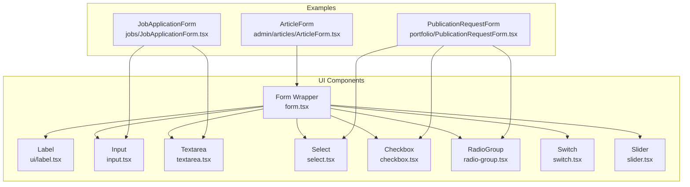
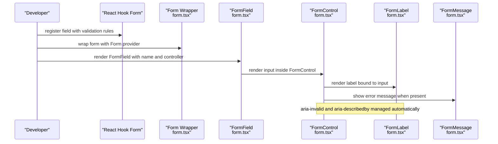
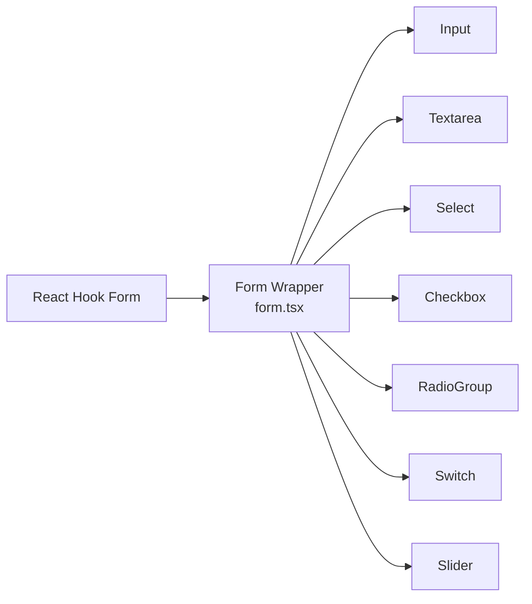

# Form Components

<cite>
**Referenced Files in This Document**
- [form.tsx](file://src/components/ui/form.tsx)
- [input.tsx](file://src/components/ui/input.tsx)
- [textarea.tsx](file://src/components/ui/textarea.tsx)
- [select.tsx](file://src/components/ui/select.tsx)
- [checkbox.tsx](file://src/components/ui/checkbox.tsx)
- [radio-group.tsx](file://src/components/ui/radio-group.tsx)
- [switch.tsx](file://src/components/ui/switch.tsx)
- [slider.tsx](file://src/components/ui/slider.tsx)
- [ArticleForm.tsx](file://src/components/admin/articles/ArticleForm.tsx)
- [JobApplicationForm.tsx](file://src/components/jobs/JobApplicationForm.tsx)
- [PublicationRequestForm.tsx](file://src/components/portfolio/PublicationRequestForm.tsx)
</cite>

## Table of Contents
1. [Introduction](#introduction)
2. [Project Structure](#project-structure)
3. [Core Components](#core-components)
4. [Architecture Overview](#architecture-overview)
5. [Detailed Component Analysis](#detailed-component-analysis)
6. [Dependency Analysis](#dependency-analysis)
7. [Performance Considerations](#performance-considerations)
8. [Troubleshooting Guide](#troubleshooting-guide)
9. [Conclusion](#conclusion)
10. [Appendices](#appendices)

## Introduction
This document explains the form-related components and patterns used across the project. It covers built-in form controls (Input, Textarea, Select, Checkbox, Radio Group, Switch, Slider), the custom form wrapper infrastructure for React Hook Form, validation and error handling patterns, controlled vs uncontrolled behavior, accessibility and keyboard navigation, and practical integration examples with backend APIs via Supabase.

## Project Structure
The form ecosystem is organized around:
- A reusable form wrapper and helpers for React Hook Form
- Primitive UI components for inputs and controls
- Example forms demonstrating validation, submission, and backend integration

**Diagram sources**
- [form.tsx](file://src/components/ui/form.tsx#L1-L130)
- [input.tsx](file://src/components/ui/input.tsx#L1-L38)
- [textarea.tsx](file://src/components/ui/textarea.tsx#L1-L22)
- [select.tsx](file://src/components/ui/select.tsx#L1-L144)
- [checkbox.tsx](file://src/components/ui/checkbox.tsx#L1-L27)
- [radio-group.tsx](file://src/components/ui/radio-group.tsx#L1-L37)
- [switch.tsx](file://src/components/ui/switch.tsx#L1-L28)
- [slider.tsx](file://src/components/ui/slider.tsx#L1-L24)
- [ArticleForm.tsx](file://src/components/admin/articles/ArticleForm.tsx#L1-L354)
- [JobApplicationForm.tsx](file://src/components/jobs/JobApplicationForm.tsx#L1-L133)
- [PublicationRequestForm.tsx](file://src/components/portfolio/PublicationRequestForm.tsx#L1-L634)

**Section sources**
- [form.tsx](file://src/components/ui/form.tsx#L1-L130)
- [input.tsx](file://src/components/ui/input.tsx#L1-L38)
- [textarea.tsx](file://src/components/ui/textarea.tsx#L1-L22)
- [select.tsx](file://src/components/ui/select.tsx#L1-L144)
- [checkbox.tsx](file://src/components/ui/checkbox.tsx#L1-L27)
- [radio-group.tsx](file://src/components/ui/radio-group.tsx#L1-L37)
- [switch.tsx](file://src/components/ui/switch.tsx#L1-L28)
- [slider.tsx](file://src/components/ui/slider.tsx#L1-L24)
- [ArticleForm.tsx](file://src/components/admin/articles/ArticleForm.tsx#L1-L354)
- [JobApplicationForm.tsx](file://src/components/jobs/JobApplicationForm.tsx#L1-L133)
- [PublicationRequestForm.tsx](file://src/components/portfolio/PublicationRequestForm.tsx#L1-L634)

## Core Components
- Form wrapper and helpers: Provides Form, FormField, FormItem, FormLabel, FormControl, FormDescription, FormMessage, and useFormField. These integrate with React Hook Form to standardize labeling, error propagation, and accessibility attributes.
- Primitive inputs: Input, Textarea, Select, Checkbox, RadioGroup, Switch, Slider. Each component exposes consistent styling and accessibility props.

Key capabilities:
- Controlled components: Inputs receive value and onChange handlers, enabling predictable state updates.
- Accessibility: FormControl sets aria-invalid and aria-describedby to link errors to inputs; FormLabel associates labels with inputs via htmlFor.
- Validation feedback: Error state is propagated from React Hook Form to FormLabel/FormMessage for visual and assistive feedback.

**Section sources**
- [form.tsx](file://src/components/ui/form.tsx#L1-L130)
- [input.tsx](file://src/components/ui/input.tsx#L1-L38)
- [textarea.tsx](file://src/components/ui/textarea.tsx#L1-L22)
- [select.tsx](file://src/components/ui/select.tsx#L1-L144)
- [checkbox.tsx](file://src/components/ui/checkbox.tsx#L1-L27)
- [radio-group.tsx](file://src/components/ui/radio-group.tsx#L1-L37)
- [switch.tsx](file://src/components/ui/switch.tsx#L1-L28)
- [slider.tsx](file://src/components/ui/slider.tsx#L1-L24)

## Architecture Overview
The form architecture centers on a thin wrapper around React Hook Form that:
- Exposes a Form provider to wrap forms
- Provides FormField to bind controller logic to a field name
- Provides FormItem/FormLabel/FormControl/FormDescription/FormMessage to standardize markup and accessibility
- Uses useFormField to derive ids, aria attributes, and error state

**Diagram sources**
- [form.tsx](file://src/components/ui/form.tsx#L1-L130)

**Section sources**
- [form.tsx](file://src/components/ui/form.tsx#L1-L130)

## Detailed Component Analysis

### Form Wrapper and Helpers
- Form: Thin re-export of FormProvider to wrap forms.
- FormField: Wraps Controller with a context that exposes the field name.
- FormItem: Provides a unique id for the group and manages spacing.
- FormLabel: Receives error state and applies destructive color when invalid; binds to input via htmlFor.
- FormControl: Injects aria-invalid and aria-describedby to connect inputs with descriptions and messages.
- FormDescription: Renders optional help text with a unique id.
- FormMessage: Displays validation messages; falls back to children when no error message is present.

Accessibility and keyboard behavior:
- FormControl sets aria-invalid based on field error state.
- FormControl sets aria-describedby to include the description id and, when applicable, the message id.
- FormLabel uses htmlFor to associate labels with inputs.

Validation patterns:
- Use FormField to bind a field to a Controller.
- Use FormMessage to surface errors; it reads from the field’s error object.
- Combine FormLabel/FormDescription for clear guidance.

**Section sources**
- [form.tsx](file://src/components/ui/form.tsx#L1-L130)

### Input
- Props include standard HTML input attributes plus optional error and success flags.
- Styles adapt based on error/success flags to provide visual feedback.
- Focus and disabled states are handled consistently.

Controlled usage:
- Pass value and onChange to keep state externalized.

Accessibility:
- When used within FormControl/FormLabel, aria attributes are applied by the wrapper.

**Section sources**
- [input.tsx](file://src/components/ui/input.tsx#L1-L38)

### Textarea
- Standard textarea with consistent styling and focus behavior.
- Useful for multi-line content; supports rows prop for sizing.

Controlled usage:
- Pass value and onChange to maintain controlled behavior.

**Section sources**
- [textarea.tsx](file://src/components/ui/textarea.tsx#L1-L22)

### Select
- Built on @radix-ui/react-select with Trigger, Content, Item, and Scroll buttons.
- Supports groups, labels, separators, and keyboard navigation.
- Provides accessible selection with indicators and viewport sizing.

Keyboard navigation:
- Up/down arrows to move selection; Enter to confirm; Escape to cancel.
- Scroll buttons enable navigating long lists.

Accessibility:
- Uses portals and proper ARIA roles; supports focus trapping and scrolling.

**Section sources**
- [select.tsx](file://src/components/ui/select.tsx#L1-L144)

### Checkbox
- Uses @radix-ui/react-checkbox with a visible indicator.
- Supports focus-visible ring and disabled state.

Accessibility:
- Proper focus management and keyboard activation.

**Section sources**
- [checkbox.tsx](file://src/components/ui/checkbox.tsx#L1-L27)

### Radio Group
- Grid-based layout for radio items with consistent styling.
- Uses @radix-ui/react-radio-group with indicator for selected state.

Accessibility:
- Radiogroup semantics ensure single selection; keyboard navigation supported.

**Section sources**
- [radio-group.tsx](file://src/components/ui/radio-group.tsx#L1-L37)

### Switch
- Toggle component using @radix-ui/react-switch with thumb animation.
- Supports focus-visible ring and disabled state.

Accessibility:
- Toggle semantics and keyboard activation.

**Section sources**
- [switch.tsx](file://src/components/ui/switch.tsx#L1-L28)

### Slider
- Range slider using @radix-ui/react-slider with track and thumb.
- Supports disabled state and focus-visible ring.

Accessibility:
- Slider semantics; keyboard navigation supported by the library.

**Section sources**
- [slider.tsx](file://src/components/ui/slider.tsx#L1-L24)

### Example Forms and Patterns

#### ArticleForm (Admin)
- Demonstrates composite form with tabs, multiple inputs, and a mix of controlled components.
- Uses Input, Textarea, Select, Switch, and Dialog.
- Shows manual controlled state management for title-to-slug generation and tag handling.
- Submits via mutation hooks; disables submit while loading.

Validation and UX:
- Title and slug required before enabling submit.
- Real-time SEO preview and content preview tabs.

Integration:
- Uses mutation hooks to create/update articles; resets form after successful submission.

**Section sources**
- [ArticleForm.tsx](file://src/components/admin/articles/ArticleForm.tsx#L1-L354)

#### JobApplicationForm
- Minimal form with controlled state for cover letter and portfolio URL.
- Uses Input and Textarea with required attributes.
- Submits via a passed onSubmit callback; disables submit while submitting.

Validation and UX:
- Disables submit until required fields are filled.
- Shows loading state with spinner.

**Section sources**
- [JobApplicationForm.tsx](file://src/components/jobs/JobApplicationForm.tsx#L1-L133)

#### PublicationRequestForm
- Multi-step wizard using RadioGroup, Checkbox, Select, and Card components.
- Integrates with Supabase to fetch user profile, stylebox submissions, walkthrough progress, and portfolio items.
- Validates eligibility (subscription tier and rank) and completeness before allowing submission.
- Submits a publication request and shows success/error notifications.

Validation and UX:
- Step progression gated by selections and completeness checks.
- Eligibility warnings and progress indicators improve clarity.

Backend integration:
- Queries profiles and related collections; inserts portfolio publication requests.

**Section sources**
- [PublicationRequestForm.tsx](file://src/components/portfolio/PublicationRequestForm.tsx#L1-L634)

## Dependency Analysis
- React Hook Form integration is centralized in the form wrapper. Components depend on:
  - Form, FormField, FormItem, FormLabel, FormControl, FormDescription, FormMessage for structured validation and accessibility.
  - Individual input primitives for rendering and interaction.
- Example forms demonstrate:
  - Controlled components with local state and external validation.
  - Backend integration via Supabase queries and mutations.

**Diagram sources**
- [form.tsx](file://src/components/ui/form.tsx#L1-L130)
- [input.tsx](file://src/components/ui/input.tsx#L1-L38)
- [textarea.tsx](file://src/components/ui/textarea.tsx#L1-L22)
- [select.tsx](file://src/components/ui/select.tsx#L1-L144)
- [checkbox.tsx](file://src/components/ui/checkbox.tsx#L1-L27)
- [radio-group.tsx](file://src/components/ui/radio-group.tsx#L1-L37)
- [switch.tsx](file://src/components/ui/switch.tsx#L1-L28)
- [slider.tsx](file://src/components/ui/slider.tsx#L1-L24)

**Section sources**
- [form.tsx](file://src/components/ui/form.tsx#L1-L130)
- [input.tsx](file://src/components/ui/input.tsx#L1-L38)
- [textarea.tsx](file://src/components/ui/textarea.tsx#L1-L22)
- [select.tsx](file://src/components/ui/select.tsx#L1-L144)
- [checkbox.tsx](file://src/components/ui/checkbox.tsx#L1-L27)
- [radio-group.tsx](file://src/components/ui/radio-group.tsx#L1-L37)
- [switch.tsx](file://src/components/ui/switch.tsx#L1-L28)
- [slider.tsx](file://src/components/ui/slider.tsx#L1-L24)

## Performance Considerations
- Prefer controlled components for complex validations to avoid unnecessary re-renders.
- Memoize expensive computations in forms (e.g., derived SEO previews) to reduce recomputation.
- Use field-level validation strategies (e.g., on blur) to minimize real-time validation overhead.
- Keep FormItem/FormLabel/FormControl boundaries intact to avoid redundant DOM traversal.

## Troubleshooting Guide
Common issues and resolutions:
- useFormField outside FormField: Ensure useFormField is called within a FormField context; otherwise, an error is thrown.
- Missing aria attributes: FormControl automatically sets aria-invalid and aria-describedby; verify that FormLabel and FormMessage are rendered alongside the input.
- Select keyboard navigation not working: Confirm that SelectTrigger, SelectContent, and SelectItem are used together and that the portal is not blocked.
- Checkbox/Radio focus styles: Ensure focus-visible rings are visible; adjust theme tokens if necessary.
- Slider accessibility: Verify that the slider is labeled and that range values are announced by assistive technologies.

**Section sources**
- [form.tsx](file://src/components/ui/form.tsx#L33-L54)
- [select.tsx](file://src/components/ui/select.tsx#L1-L144)

## Conclusion
The form system combines a robust React Hook Form wrapper with accessible, styled primitives to deliver consistent, validated, and user-friendly forms. Examples across admin, job application, and publication workflows illustrate controlled patterns, validation strategies, and backend integration. Following the outlined patterns ensures accessibility, maintainability, and scalability across future forms.

## Appendices

### Accessibility Checklist for Forms
- Every input has an associated label (FormLabel) with htmlFor linking to the input id.
- Error messages are connected via aria-describedby and marked with aria-invalid when present.
- Keyboard navigation works for selects, radios, checkboxes, switches, and sliders.
- Focus management is clear; focus-visible rings are visible.
- Sufficient color contrast for error/success states.

### Validation Patterns Summary
- Use FormField + Controller for controlled fields with validation.
- Use FormMessage to display errors; ensure error.message exists or provide fallback content.
- Use FormDescription for contextual hints.
- Gate submit actions based on form readiness and validation status.