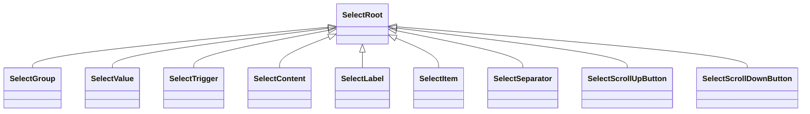

# UI Component System

<cite>
**Referenced Files in This Document**
- [button.tsx](file://src/components/ui/button.tsx)
- [card.tsx](file://src/components/ui/card.tsx)
- [dialog.tsx](file://src/components/ui/dialog.tsx)
- [input.tsx](file://src/components/ui/input.tsx)
- [table.tsx](file://src/components/ui/table.tsx)
- [select.tsx](file://src/components/ui/select.tsx)
- [badge.tsx](file://src/components/ui/badge.tsx)
- [checkbox.tsx](file://src/components/ui/checkbox.tsx)
- [switch.tsx](file://src/components/ui/switch.tsx)
- [tabs.tsx](file://src/components/ui/tabs.tsx)
- [toast.tsx](file://src/components/ui/toast.tsx)
- [form.tsx](file://src/components/ui/form.tsx)
- [utils.ts](file://src/lib/utils.ts)
- [tailwind.config.ts](file://tailwind.config.ts)
- [use-mobile.tsx](file://src/hooks/use-mobile.tsx)
</cite>

## Table of Contents
1. [Introduction](#introduction)
2. [Project Structure](#project-structure)
3. [Core Components](#core-components)
4. [Architecture Overview](#architecture-overview)
5. [Detailed Component Analysis](#detailed-component-analysis)
6. [Dependency Analysis](#dependency-analysis)
7. [Performance Considerations](#performance-considerations)
8. [Troubleshooting Guide](#troubleshooting-guide)
9. [Conclusion](#conclusion)
10. [Appendices](#appendices)

## Introduction
This document describes the UI component system used across the application. It explains how the design system integrates with shadcn/ui-inspired primitives, how components are composed using Radix UI and Tailwind CSS, and how styling, variants, and responsiveness are implemented. It also covers accessibility, theming via CSS variables, cross-browser compatibility considerations, and performance optimization techniques. Finally, it provides usage guidelines, prop documentation, and integration examples.

## Project Structure
The UI system is organized under a dedicated components library with a clear separation of concerns:
- Primitive components: foundational building blocks (buttons, inputs, selects, dialogs, etc.)
- Composite components: higher-level constructs built from primitives (cards, forms, tables, badges)
- Utilities: shared styling helpers and responsive hooks
- Theming: centralized Tailwind configuration with CSS variable-backed tokens

**Diagram sources**
- [button.tsx](file://src/components/ui/button.tsx#L1-L53)
- [input.tsx](file://src/components/ui/input.tsx#L1-L38)
- [select.tsx](file://src/components/ui/select.tsx#L1-L144)
- [dialog.tsx](file://src/components/ui/dialog.tsx#L1-L103)
- [card.tsx](file://src/components/ui/card.tsx#L1-L62)
- [tabs.tsx](file://src/components/ui/tabs.tsx#L1-L54)
- [badge.tsx](file://src/components/ui/badge.tsx#L1-L77)
- [checkbox.tsx](file://src/components/ui/checkbox.tsx#L1-L27)
- [switch.tsx](file://src/components/ui/switch.tsx#L1-L28)
- [table.tsx](file://src/components/ui/table.tsx#L1-L73)
- [form.tsx](file://src/components/ui/form.tsx#L1-L130)
- [toast.tsx](file://src/components/ui/toast.tsx#L1-L112)
- [utils.ts](file://src/lib/utils.ts#L1-L7)
- [tailwind.config.ts](file://tailwind.config.ts#L1-L476)
- [use-mobile.tsx](file://src/hooks/use-mobile.tsx#L1-L20)

**Section sources**
- [button.tsx](file://src/components/ui/button.tsx#L1-L53)
- [input.tsx](file://src/components/ui/input.tsx#L1-L38)
- [select.tsx](file://src/components/ui/select.tsx#L1-L144)
- [dialog.tsx](file://src/components/ui/dialog.tsx#L1-L103)
- [card.tsx](file://src/components/ui/card.tsx#L1-L62)
- [tabs.tsx](file://src/components/ui/tabs.tsx#L1-L54)
- [badge.tsx](file://src/components/ui/badge.tsx#L1-L77)
- [checkbox.tsx](file://src/components/ui/checkbox.tsx#L1-L27)
- [switch.tsx](file://src/components/ui/switch.tsx#L1-L28)
- [table.tsx](file://src/components/ui/table.tsx#L1-L73)
- [form.tsx](file://src/components/ui/form.tsx#L1-L130)
- [toast.tsx](file://src/components/ui/toast.tsx#L1-L112)
- [utils.ts](file://src/lib/utils.ts#L1-L7)
- [tailwind.config.ts](file://tailwind.config.ts#L1-L476)
- [use-mobile.tsx](file://src/hooks/use-mobile.tsx#L1-L20)

## Core Components
This section outlines the primary UI components and their roles in the system.

- Button: A versatile action element with variant and size variants, keyboard focus support, and optional child rendering via a slot.
- Input: A styled text input with optional error and success states and responsive typography.
- Select: A composite control for choosing from a list of options, with scrolling support and accessible interactions.
- Dialog: A modal overlay system with portal rendering, backdrop blur, and smooth entrance/exit animations.
- Card: A flexible container with hover effects, elevation variants, and semantic subcomponents (header, title, description, content, footer).
- Tabs: A tabbed interface with accessible triggers and content areas.
- Badge: A multi-purpose indicator with extensive variant sets for difficulty, rank, access, status, level, urgency, and edition.
- Checkbox and Switch: Primitive controls for binary selections with accessible semantics and focus styles.
- Table: A responsive table wrapper with proper hover, selection, and caption handling.
- Form: A form integration layer using react-hook-form with accessible labeling, descriptions, and error messaging.
- Toast: A notification system with swipe gestures, destructive variants, and viewport positioning.

**Section sources**
- [button.tsx](file://src/components/ui/button.tsx#L1-L53)
- [input.tsx](file://src/components/ui/input.tsx#L1-L38)
- [select.tsx](file://src/components/ui/select.tsx#L1-L144)
- [dialog.tsx](file://src/components/ui/dialog.tsx#L1-L103)
- [card.tsx](file://src/components/ui/card.tsx#L1-L62)
- [tabs.tsx](file://src/components/ui/tabs.tsx#L1-L54)
- [badge.tsx](file://src/components/ui/badge.tsx#L1-L77)
- [checkbox.tsx](file://src/components/ui/checkbox.tsx#L1-L27)
- [switch.tsx](file://src/components/ui/switch.tsx#L1-L28)
- [table.tsx](file://src/components/ui/table.tsx#L1-L73)
- [form.tsx](file://src/components/ui/form.tsx#L1-L130)
- [toast.tsx](file://src/components/ui/toast.tsx#L1-L112)

## Architecture Overview
The UI architecture follows a layered pattern:
- Primitives: Low-level components built on Radix UI (e.g., Dialog, Select, Tabs, Checkbox, Switch, Toast).
- Composites: Higher-level components composed from primitives (e.g., Button, Input, Card, Table, Badge, Form).
- Styling: Tailwind CSS with a centralized configuration and a shared cn() utility for merging classes.
- Theming: CSS variables for colors, shadows, radii, and keyframes; extended palettes for brand, rank, and admin themes.
- Responsiveness: Breakpoint-aware utilities and mobile detection hook.

**Diagram sources**
- [button.tsx](file://src/components/ui/button.tsx#L1-L53)
- [input.tsx](file://src/components/ui/input.tsx#L1-L38)
- [select.tsx](file://src/components/ui/select.tsx#L1-L144)
- [dialog.tsx](file://src/components/ui/dialog.tsx#L1-L103)
- [card.tsx](file://src/components/ui/card.tsx#L1-L62)
- [tabs.tsx](file://src/components/ui/tabs.tsx#L1-L54)
- [badge.tsx](file://src/components/ui/badge.tsx#L1-L77)
- [checkbox.tsx](file://src/components/ui/checkbox.tsx#L1-L27)
- [switch.tsx](file://src/components/ui/switch.tsx#L1-L28)
- [table.tsx](file://src/components/ui/table.tsx#L1-L73)
- [form.tsx](file://src/components/ui/form.tsx#L1-L130)
- [toast.tsx](file://src/components/ui/toast.tsx#L1-L112)
- [utils.ts](file://src/lib/utils.ts#L1-L7)
- [tailwind.config.ts](file://tailwind.config.ts#L1-L476)

## Detailed Component Analysis

### Button
- Purpose: Primary action element with consistent spacing, transitions, and focus states.
- Variants: default, destructive, outline, secondary, ghost, link, accent, success.
- Sizes: default, sm, lg, xl, icon, icon-sm, icon-lg.
- Composition: Uses a slot to render either a button or a child component; merges variant classes via a variant factory.
- Accessibility: Inherits native button semantics; focus ring and disabled state handled.
- Responsive: Typography scales with screen size; icon sizing adapts proportionally.

**Diagram sources**
- [button.tsx](file://src/components/ui/button.tsx#L7-L36)

**Section sources**
- [button.tsx](file://src/components/ui/button.tsx#L1-L53)

### Input
- Purpose: Styled text input with optional error/success states and responsive text sizing.
- Accessibility: Inherits native input semantics; focus ring and disabled state handled.
- Styling: Merges base styles with optional error/success overrides.

**Diagram sources**
- [input.tsx](file://src/components/ui/input.tsx#L5-L9)

**Section sources**
- [input.tsx](file://src/components/ui/input.tsx#L1-L38)

### Select
- Purpose: Dropdown selector with scrollable viewport, labels, separators, and accessible interactions.
- Composition: Root, Group, Value, Trigger, Content, Label, Item, Separator, ScrollUp/Down buttons.
- Styling: Trigger inherits focus ring and disabled states; Content animates with directional slide-in.

**Diagram sources**
- [select.tsx](file://src/components/ui/select.tsx#L7-L143)

**Section sources**
- [select.tsx](file://src/components/ui/select.tsx#L1-L144)

### Dialog
- Purpose: Modal overlay with portal rendering, backdrop blur, and animated entrance/exit.
- Composition: Root, Trigger, Portal, Close, Overlay, Content, Header/Footer, Title, Description.
- Accessibility: Focus trapping, close button with assistive label, overlay click-to-close.

**Diagram sources**
- [dialog.tsx](file://src/components/ui/dialog.tsx#L7-L58)

**Section sources**
- [dialog.tsx](file://src/components/ui/dialog.tsx#L1-L103)

### Card
- Purpose: Container with hover, elevation, and ghost variants; semantic subcomponents for header/title/description/content/footer.
- Composition: Card, CardHeader, CardTitle, CardDescription, CardContent, CardFooter.

**Diagram sources**
- [card.tsx](file://src/components/ui/card.tsx#L10-L59)

**Section sources**
- [card.tsx](file://src/components/ui/card.tsx#L1-L62)

### Tabs
- Purpose: Tabbed interface with accessible triggers and content areas.
- Composition: Tabs, TabsList, TabsTrigger, TabsContent.

**Diagram sources**
- [tabs.tsx](file://src/components/ui/tabs.tsx#L6-L51)

**Section sources**
- [tabs.tsx](file://src/components/ui/tabs.tsx#L1-L54)

### Badge
- Purpose: Indicator with extensive variant sets for difficulty, rank, access, status, level, urgency, and edition.
- Variants: default, secondary, destructive, outline, success, warning, accent, muted, plus many domain-specific variants.
- Sizes: default, sm, lg.

**Diagram sources**
- [badge.tsx](file://src/components/ui/badge.tsx#L6-L66)

**Section sources**
- [badge.tsx](file://src/components/ui/badge.tsx#L1-L77)

### Checkbox and Switch
- Purpose: Primitive controls for binary selections with accessible semantics and focus styles.
- Styling: Inherits focus ring and disabled states; checked state updates background and text color.

**Diagram sources**
- [checkbox.tsx](file://src/components/ui/checkbox.tsx#L7-L23)
- [switch.tsx](file://src/components/ui/switch.tsx#L6-L24)

**Section sources**
- [checkbox.tsx](file://src/components/ui/checkbox.tsx#L1-L27)
- [switch.tsx](file://src/components/ui/switch.tsx#L1-L28)

### Table
- Purpose: Responsive table wrapper with hover, selection, and caption handling.
- Composition: Table, TableHeader, TableBody, TableFooter, TableHead, TableRow, TableCell, TableCaption.

**Diagram sources**
- [table.tsx](file://src/components/ui/table.tsx#L5-L70)

**Section sources**
- [table.tsx](file://src/components/ui/table.tsx#L1-L73)

### Form
- Purpose: Integration with react-hook-form providing accessible labels, descriptions, and error messages.
- Composition: Form, FormItem, FormLabel, FormControl, FormDescription, FormMessage, FormField, useFormField.

**Diagram sources**
- [form.tsx](file://src/components/ui/form.tsx#L9-L127)

**Section sources**
- [form.tsx](file://src/components/ui/form.tsx#L1-L130)

### Toast
- Purpose: Notification system with swipe gestures, destructive variants, and viewport positioning.
- Composition: ToastProvider, ToastViewport, Toast, ToastTitle, ToastDescription, ToastClose, ToastAction.

**Diagram sources**
- [toast.tsx](file://src/components/ui/toast.tsx#L8-L111)

**Section sources**
- [toast.tsx](file://src/components/ui/toast.tsx#L1-L112)

## Dependency Analysis
The UI components share a small set of dependencies:
- Radix UI primitives for accessible interactions.
- Lucide icons for visual indicators.
- class-variance-authority for variant factories.
- react-hook-form for form integration.
- Tailwind CSS for styling with a centralized configuration.

**Diagram sources**
- [button.tsx](file://src/components/ui/button.tsx#L1-L53)
- [input.tsx](file://src/components/ui/input.tsx#L1-L38)
- [select.tsx](file://src/components/ui/select.tsx#L1-L144)
- [dialog.tsx](file://src/components/ui/dialog.tsx#L1-L103)
- [card.tsx](file://src/components/ui/card.tsx#L1-L62)
- [tabs.tsx](file://src/components/ui/tabs.tsx#L1-L54)
- [badge.tsx](file://src/components/ui/badge.tsx#L1-L77)
- [checkbox.tsx](file://src/components/ui/checkbox.tsx#L1-L27)
- [switch.tsx](file://src/components/ui/switch.tsx#L1-L28)
- [table.tsx](file://src/components/ui/table.tsx#L1-L73)
- [form.tsx](file://src/components/ui/form.tsx#L1-L130)
- [toast.tsx](file://src/components/ui/toast.tsx#L1-L112)
- [utils.ts](file://src/lib/utils.ts#L1-L7)
- [tailwind.config.ts](file://tailwind.config.ts#L1-L476)

**Section sources**
- [button.tsx](file://src/components/ui/button.tsx#L1-L53)
- [input.tsx](file://src/components/ui/input.tsx#L1-L38)
- [select.tsx](file://src/components/ui/select.tsx#L1-L144)
- [dialog.tsx](file://src/components/ui/dialog.tsx#L1-L103)
- [card.tsx](file://src/components/ui/card.tsx#L1-L62)
- [tabs.tsx](file://src/components/ui/tabs.tsx#L1-L54)
- [badge.tsx](file://src/components/ui/badge.tsx#L1-L77)
- [checkbox.tsx](file://src/components/ui/checkbox.tsx#L1-L27)
- [switch.tsx](file://src/components/ui/switch.tsx#L1-L28)
- [table.tsx](file://src/components/ui/table.tsx#L1-L73)
- [form.tsx](file://src/components/ui/form.tsx#L1-L130)
- [toast.tsx](file://src/components/ui/toast.tsx#L1-L112)
- [utils.ts](file://src/lib/utils.ts#L1-L7)
- [tailwind.config.ts](file://tailwind.config.ts#L1-L476)

## Performance Considerations
- Minimize reflows: Prefer CSS transforms and opacity for animations; avoid layout-affecting properties.
- Conditional rendering: Use portals for overlays (Dialog) to reduce DOM depth and improve paint locality.
- Variant factories: Use class variance authority to compute minimal class lists per component variant.
- Utility merging: Use the cn() utility to merge classes efficiently and avoid conflicts.
- Responsive breakpoints: Use Tailwind’s breakpoint utilities to prevent unnecessary media queries in JavaScript.
- Iconography: Use Lucide icons for consistent sizing and crisp rendering across devices.
- Form integration: Defer expensive validations to onBlur or after submission to keep typing smooth.

[No sources needed since this section provides general guidance]

## Troubleshooting Guide
- Focus rings and accessibility:
  - Ensure focus-visible rings are visible and properly scoped to interactive elements.
  - Verify aria attributes (aria-describedby, aria-invalid) are applied in form components.
- Disabled states:
  - Confirm disabled pointer-events and opacity are applied consistently across inputs, buttons, and controls.
- Hover and transitions:
  - Validate hover states do not cause unexpected layout shifts; prefer transform-based animations.
- Mobile responsiveness:
  - Use the mobile detection hook to adapt layouts and interactions for narrow screens.
- Theming issues:
  - Verify CSS variables are defined in the Tailwind configuration and match component expectations.

**Section sources**
- [form.tsx](file://src/components/ui/form.tsx#L75-L127)
- [button.tsx](file://src/components/ui/button.tsx#L7-L36)
- [input.tsx](file://src/components/ui/input.tsx#L11-L37)
- [use-mobile.tsx](file://src/hooks/use-mobile.tsx#L1-L20)
- [tailwind.config.ts](file://tailwind.config.ts#L59-L253)

## Conclusion
The UI component system combines Radix UI primitives with Tailwind CSS and a centralized variant factory to deliver a cohesive, accessible, and performant design system. Components are modular, customizable, and responsive, with strong support for theming and form integration. Following the usage guidelines and best practices outlined here ensures consistent behavior across browsers and devices.

[No sources needed since this section summarizes without analyzing specific files]

## Appendices

### Styling Approach and Theming
- Tailwind configuration:
  - Dark mode via class strategy.
  - CSS variables for colors, shadows, border radii, and keyframes.
  - Extended color families for brand, rank, and admin themes.
- Shared utility:
  - cn() merges classes safely using clsx and tailwind-merge.

**Section sources**
- [tailwind.config.ts](file://tailwind.config.ts#L1-L476)
- [utils.ts](file://src/lib/utils.ts#L1-L7)

### Responsive Design Implementation
- Breakpoints: Tailwind’s default breakpoints apply consistently across components.
- Mobile detection: A lightweight hook detects mobile widths and supports adaptive rendering.

**Section sources**
- [tailwind.config.ts](file://tailwind.config.ts#L1-L476)
- [use-mobile.tsx](file://src/hooks/use-mobile.tsx#L1-L20)

### Accessibility Features
- Focus management: Components expose focus-visible rings and preserve focus order.
- ARIA attributes: Form components set aria-describedby and aria-invalid appropriately.
- Semantic HTML: Inputs, buttons, and controls retain native semantics.

**Section sources**
- [form.tsx](file://src/components/ui/form.tsx#L75-L127)
- [button.tsx](file://src/components/ui/button.tsx#L44-L50)
- [input.tsx](file://src/components/ui/input.tsx#L11-L37)

### Cross-Browser Compatibility
- Use Tailwind’s default browser support and avoid experimental CSS features.
- Prefer transform and opacity for animations to minimize repaint costs.
- Validate focus rings and outline styles across browsers.

[No sources needed since this section provides general guidance]

### Component Usage Guidelines and Prop Documentation
- Button
  - Props: variant, size, asChild, className, plus native button attributes.
  - Variants: default, destructive, outline, secondary, ghost, link, accent, success.
  - Sizes: default, sm, lg, xl, icon, icon-sm, icon-lg.
- Input
  - Props: error, success, plus native input attributes.
- Select
  - Props: trigger and content inherit focus/disabled states; supports groups, labels, separators, and scroll buttons.
- Dialog
  - Props: overlay and content inherit animations; supports portal rendering and close button.
- Card
  - Props: hover, variant, className; subcomponents for structured content.
- Tabs
  - Props: accessible triggers and content areas.
- Badge
  - Props: variant, size, className; extensive variant sets for domain-specific states.
- Checkbox/Switch
  - Props: inherit focus/disabled states; checked state updates visuals.
- Table
  - Props: responsive wrapper with hover and selection states.
- Form
  - Props: integrates with react-hook-form; accessible labels, descriptions, and error messages.
- Toast
  - Props: viewport positioning, swipe gestures, destructive variant.

**Section sources**
- [button.tsx](file://src/components/ui/button.tsx#L38-L50)
- [input.tsx](file://src/components/ui/input.tsx#L5-L9)
- [select.tsx](file://src/components/ui/select.tsx#L13-L91)
- [dialog.tsx](file://src/components/ui/dialog.tsx#L15-L58)
- [card.tsx](file://src/components/ui/card.tsx#L5-L26)
- [tabs.tsx](file://src/components/ui/tabs.tsx#L8-L51)
- [badge.tsx](file://src/components/ui/badge.tsx#L68-L74)
- [checkbox.tsx](file://src/components/ui/checkbox.tsx#L7-L23)
- [switch.tsx](file://src/components/ui/switch.tsx#L6-L24)
- [table.tsx](file://src/components/ui/table.tsx#L5-L70)
- [form.tsx](file://src/components/ui/form.tsx#L11-L127)
- [toast.tsx](file://src/components/ui/toast.tsx#L10-L111)

### Integration Examples
- Button with variant and size:
  - Apply variant and size props to achieve desired appearance and density.
- Input with error state:
  - Pass error prop to highlight invalid states with appropriate colors and focus ring.
- Select with controlled value:
  - Use SelectValue and SelectTrigger to present current selection; populate items via SelectItem.
- Dialog for modals:
  - Wrap content in DialogContent; use DialogTrigger to open and DialogClose to close.
- Card for content blocks:
  - Use Card with CardHeader, CardTitle, CardDescription, and CardContent to structure content.
- Tabs for navigation:
  - Pair Tabs with TabsList, TabsTrigger, and TabsContent for accessible tabbed interfaces.
- Badge for status indicators:
  - Choose variant and size to reflect status, difficulty, rank, or access level.
- Checkbox/Switch for preferences:
  - Bind to form state; ensure focus and checked states are styled consistently.
- Table for data display:
  - Wrap long tables in the Table component for horizontal scrolling on small screens.
- Form with react-hook-form:
  - Wrap fields with FormItem; pair FormLabel with FormControl; show FormMessage for errors.
- Toast notifications:
  - Use ToastProvider and ToastViewport; dispatch toasts with Toast, ToastTitle, and ToastDescription.

**Section sources**
- [button.tsx](file://src/components/ui/button.tsx#L44-L50)
- [input.tsx](file://src/components/ui/input.tsx#L11-L37)
- [select.tsx](file://src/components/ui/select.tsx#L13-L91)
- [dialog.tsx](file://src/components/ui/dialog.tsx#L30-L58)
- [card.tsx](file://src/components/ui/card.tsx#L10-L59)
- [tabs.tsx](file://src/components/ui/tabs.tsx#L8-L51)
- [badge.tsx](file://src/components/ui/badge.tsx#L68-L74)
- [checkbox.tsx](file://src/components/ui/checkbox.tsx#L7-L23)
- [switch.tsx](file://src/components/ui/switch.tsx#L6-L24)
- [table.tsx](file://src/components/ui/table.tsx#L5-L70)
- [form.tsx](file://src/components/ui/form.tsx#L62-L127)
- [toast.tsx](file://src/components/ui/toast.tsx#L8-L111)